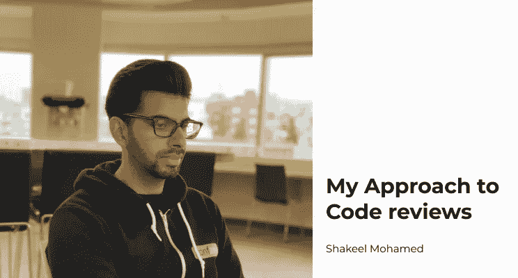

# 我的代码评审方法

> 原文：<https://medium.com/codex/my-approach-to-code-reviews-7c1310987c2?source=collection_archive---------8----------------------->

我的第一次代码审查是当我在贝尔维尤学院的 web 开发办公室做学生工作的时候。毫不夸张地说，我把一堆 PHP 代码拼凑成了一个 WordPress“插件”,带有可怕的变量名，比如`$sillyMe`。

这些年来，我学到了很多关于软件设计的知识，我不再做那些愚蠢的 T2 了。事实上，在我的代码被审查了几十次之后，我开始知道…