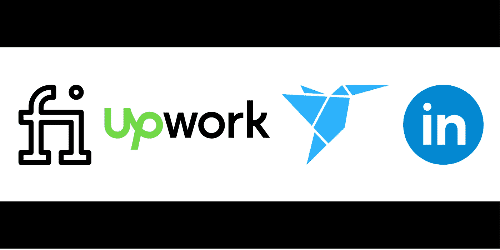

# 2021 年开始做自由开发者

> 原文：<https://medium.com/codex/my-best-advice-on-starting-as-a-freelance-developer-373434a19fa1?source=collection_archive---------4----------------------->

## 来自我个人经验的最佳建议。

[安德鲁·尼尔](https://unsplash.com/@andrewtneel?utm_source=medium&utm_medium=referral)在 [Unsplash](https://unsplash.com?utm_source=medium&utm_medium=referral) 上拍照

作为一名软件开发人员，你有很多途径可以获得额外收入。最常见的方法之一是成为一名自由开发人员，可以是兼职的，也可以是全职的。

它不仅提供了一种赚外快的方法，还能让你多工作。你不会被固定的时间或特定的地点所束缚，而这正是一些人所寻求的。

然而，通过提供自由职业者服务来维持可持续的生活是相当具有挑战性的。尤其是首先，此外，它并不适合每个人。许多人更喜欢固定职位的财务稳定性。或者他们更喜欢与其他人一起在团队中工作。

然而，如果你正在考虑提供自由职业服务作为额外的收入或取代你目前的收入。或者如果你已经开始并想学习如何增加获得更多客户的机会。下面你会发现我能提供的最好的建议，来自我作为自由开发者的背景。

我们将会关注我以前已经采用或仍在使用的自由职业的两个领域，以及如何开始使用它们。

# LinkedIn 是你最好的朋友

虽然受欢迎的服务非常有助于找到永久工作职位，LinkedIn 也是一个寻找自由职业者的好地方。

确保每个区域都是完整的。参考资料和最新的简历上传。在你的个人资料中添加引人注目的标题，而不仅仅是你的名字或公司名称。以幻灯片或视频的形式提供你的作品样本。这样，人们就有了你工作的证据，他们可能会留下深刻的印象来联系你。

LinkedIn 的核心就是人脉。目标是尽可能多地与人建立联系，以最大限度地提高你在这项服务中的就业能力。还有，不要把这些人脉当成销售，而是当成实际的人。这意味着不要只是向他们推销你的服务，首先要提供信息和帮助。

很多时候，公司都在寻找承包商来提供特定的服务，直到他们需要完成的任务结束。这使你通常可以在固定的时间内获得工作，而且这个时间可以延长。给予比追逐下一个客户更大的财务稳定性。在许多情况下，它还使人们有机会在团队环境中工作，这对于那些喜欢团队项目的社交方面的人来说是理想的。

LinkedIn 也非常适合那些寻找非合同工作或客户的人，让你向潜在客户展示你的经验和专业知识。这样做可以建立对你所提供服务的更大信任，意味着你的转换率会更高。

# 在线自由职业网站

探索自由职业工作最常见的领域是通过特定的自由职业网站。网站包括 Fiverr、UpWork、Freelancer、PeoplePerHour 或 Toptal，但还有其他选择。虽然这些网站上的客户和工作竞争激烈，但它们仍然是将你的服务提供给潜在客户的绝佳选择。

首先，你需要决定你要专注于哪个网站。对每一项都做一些研究，搜索你计划提供的服务。看看这些服务的需求有多大，或者该领域的竞争有多激烈。如果你一开始就只专注于其中一项，并试图全部使用，那么你将很难获得可持续的收入。这可能会导致因缺少工作而变得非常没有动力。一旦你在一个自由职业者网站上有了固定客户，你就可以探索增加另一个网站来提高你的知名度。

其次，为了最大化你找到工作或让人们购买你的作品的机会，你首先需要付出很多努力。这不是创建一个帐户，然后看着工作涌入那么简单。你需要确保你的个人资料是完整和专业的。添加一张自己的照片，与潜在客户建立更好的信任。提供足够多的细节，包括你提供的工作、你的经历以及买家能从你的工作中得到什么。

接下来是研究。搜索与您提供的服务相似的服务。其中哪些是受欢迎的持续工作，他们的描述是什么样的，他们的价格是多少。你的价格必须有竞争力，这意味着降低成本，以吸引买家选择你。一旦你有了几份工作，并获得了一些好评，那么你就可以开始随着时间的推移提高你的价格。

一旦你找到了合适的价格，接下来就是积极找工作的时候了。人们不仅会寻找特定的服务或工作，还会发布招聘信息。在这里，所有的一切都是为了向买家提供一个简短但详细的解释，说明你能提供什么，为什么你是这份工作的完美人选，以及一个有竞争力的价格。这都是为了获得最初的销售。

在最初的销售中，你必须为买家提供卓越的服务。这意味着通过快速的响应时间进行清晰的沟通。你可能需要比正常情况下工作更长的时间，以确保成品对买家来说是完美的。然后，是时候通过向买家免费提供一小笔奖金来超越这一点了。这可能是给客户的应用程序增加一个额外的屏幕或功能，为他们未来的工作提供折扣，或者可能是修复他们代码中不属于商定任务的其他部分。买家会被惊艳的服务惊艳到，高高兴兴给你五星好评。

最后，请求审查。通常情况下，当人们对某项服务满意时，他们会很乐意留下评论，然而，他们经常会忘记或可能是新加入该平台的人，不习惯留下评论。这是你要求他们留下评论的地方。你提供成品，以上和超出额外的，加上一个感谢你的消息给买家，并要求他们留下一个评论，如果他们高兴，有时间。这些平台都是评论。你拥有的五星评论越多，你在搜索中的排名就越靠前。加上更多的潜在买家会信任你购买你的服务。

# 摘要

正如你所看到的，自由职业绝不是一件容易的事情，也就是说，如果你不愿意投入时间和精力来获得结果。尽管如此，如果你这样做了，这可能是一个非常有益和有利可图的领域。

如果自由开发人员的工作听起来不像你想从事的事情，作为软件开发人员，还有许多其他赚钱的方法，你可以在这里了解更多关于这些方法的信息。

**不隶属于提及的任何服务或平台**