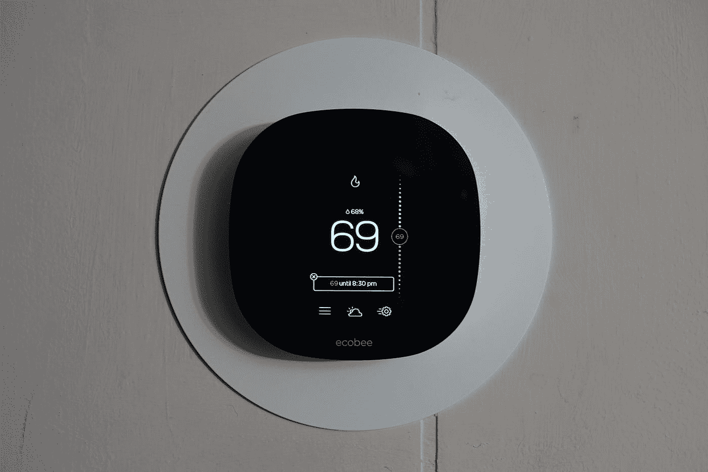

# 我对“智能家居”的持续探索

> 原文：<https://medium.com/codex/my-continued-quest-towards-a-smart-home-550ab3c74022?source=collection_archive---------12----------------------->

## 我继续添加技术，看不到尽头

照片由[肖恩 D](https://unsplash.com/@sqsd?utm_source=medium&utm_medium=referral) 在 [Unsplash](https://unsplash.com?utm_source=medium&utm_medium=referral) 上拍摄

我早就应该写下这次收购了。当谈到让你的家更智能时，智能恒温器是显而易见的。公用事业公司力劝你在家里安装一个，并奖励你把它添加到你家的生态系统中。这可能是一张礼品卡或一些信贷，但它…