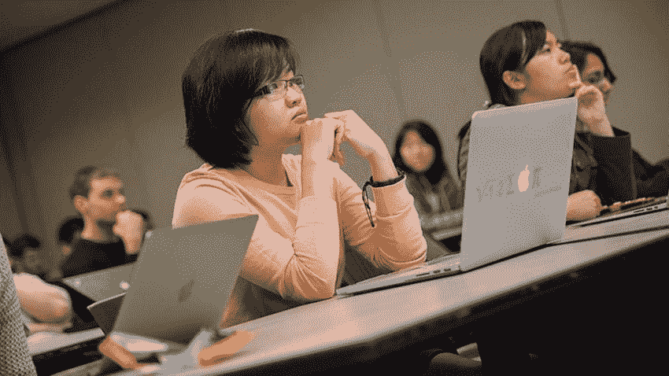

# 我的计算机科学本科学位是一种浪费——原因如下

> 原文：<https://medium.com/codex/my-cs-undergrad-degree-was-a-waste-heres-why-94f34a640407?source=collection_archive---------4----------------------->

## 3 个让人大开眼界的理由。

来源:gatech.edu

为什么我在计算机科学学位什么也没学到？

计算机和科学，这 15 个角色，以最真实的意义结合在一起，形成了一个自己的世界。

虽然听起来很奇怪，但当我在 2016 年报名参加计算机科学时，我对它很感兴趣。没有任何关于什么的研究…