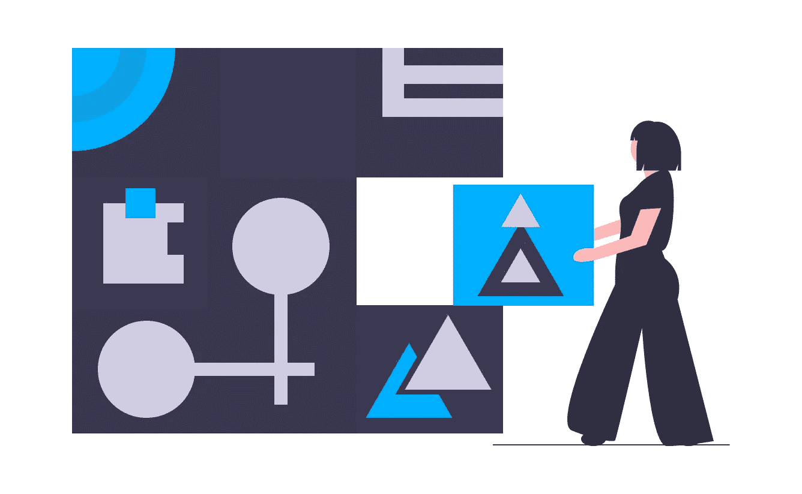

# 我使用无代码开发平台建立网站的经验

> 原文：<https://medium.com/codex/my-experience-in-using-a-no-code-development-platform-to-build-a-website-fa9bd8c495ea?source=collection_archive---------4----------------------->

## 药典

## 我如何利用新兴技术的力量

## 免责声明:本文中列出的产品不应被视为促销活动

# 编码的噩梦

我喜欢做梦，我总是梦想着用很酷的设计建立一个很棒的网站。当我梦想建立一个我的幻想网站时，它总是让我做噩梦，因为完成它需要大量的编码。这让我很担心！想到自学建网站，掌握技能所需的时间让我心梗。我同意这样一个事实，即我们应该有耐心，在开发网站时表现出非凡的灵活性，但我不想在学习上投入太多时间，而我的竞争对手却把我甩在后面。在那个阶段，我唯一的意图是走出编码的噩梦，但与我的竞争对手竞争。但是怎么做呢？

# 无代码平台

unDraw 插图

在那之后，我在网上寻找解决问题的方法。就在这个时候，我向自己介绍了开发产品的无代码平台的概念。什么是无代码平台？按照我的理解，无代码平台是对遭受编码之苦的人的一种拯救。从技术上来说，无代码平台允许人们通过一种叫做“拖放”的技术来开发他们梦想中的网站，在那里他们可以挑选自己感兴趣的元素并将其添加到网页上。就这么简单！

# 学习使用

unDraw 插图

我没有把我的加速器推到 youtube 上看教程，而是决定直接跳到这个平台上来获得一些实践经验。在这一步之前，我必须认真决定我应该使用哪个无代码平台。我最后上了 [Wix](http://wix.com) ！你也可以选择其他平台，如 [Webflow](https://webflow.com/) 或 [Squarespace](https://www.squarespace.com/) ，但我的选择永远是 Wix。起初，我挣扎了很久，但后来这变成了我的优势。它是如何成为优势的？面对问题，我自己提出了解决方案，这让我对平台的使用有了更多的了解。

为什么我发现自我探索法是最好的方法？如果我最终有了教程，我会学到在给定情况下我想要的东西。当我选择自我探索的方法时，我浏览了所有的元素，并为特定的情况选择了最好的一个。这就是我如何学会使用无代码平台的，你也可以喜欢我的方法。

# 感觉独立

unDraw 插图

这是促使我使用无代码平台的一个重要方面。在无代码平台的帮助下，我能够实现我脑海中的想法。我既不需要依赖任何人来编写网站代码，也不需要在学习上投入太多时间。我只需要一台电脑和上网，然后瞧！我能够在几个小时内设计出一个漂亮的响应网站，而学习编写一个基本的不太好看的网站需要几个月的时间。

# 构建产品

unDraw 插图

当我遇到开发一个产品的过程时，我对其中涉及的步骤数量之多感到震惊，比如网站线框、UI/UX 研究、开发、设计、部署等等。但是据我所知，在一个无代码平台上建立一个网站，所有这些步骤都是不需要的。

你可能会说这些步骤对于建立任何网站都是必不可少的，但是，我是从初学者的角度来说的。开发人员按照我上面提到的步骤来减少修改或修改的次数，以防出现错误，而修改本身会花费很长时间。另一方面，在无代码平台上，通过简单地拖放新元素或任何我们想要改变的东西，可以很容易地进行修改。

我说这些是因为我有改造网站的经验。举个例子，最近，我修改了我网站的整个设计和功能，只花了几个小时就完成了。产品现在看起来是这样的( [InsightBig School](http://insightbigschool.com) ):

【insightbigschool.com 号

产品视频

# Web 元素和模板

当我使用无代码平台时，我有一种可以访问大量 web 元素和组件的感觉，这些元素和组件可以高度定制，以与网站的主题相融合。我没有必要重复定制一个元素，因为我可以将它保存到我的设计中并重复使用。无代码平台的圣杯是预先设计好的模板，用户可以访问许多具有高度可定制特性的模板。

# 工作假说

最近，一个假设变得非常流行，提出无代码平台将会消失软件开发人员和程序员的工作空间。我相信这不是真的。工作空间不会消失，但会转移到一个新的领域。即使人们可以使用无代码平台成为自己的开发者，程序员也有必要构建和开发那些所谓的“无代码”平台。

根据我的经验，我可以看到编码者和非编码平台之间的许多集成，即我们可以通过非编码平台雇佣开发人员，并在我们网站的进一步开发中寻求他们的帮助。所以我认为开发人员和程序员没有什么好担心的。

# 最后的想法！

在无代码平台的帮助下，每个有想法的人都可以成为他们自己的开发者，并且可以独立可行地实现他们的梦想。在这一代人中，拥有在线存在是必须的，那些无法应对这一政策的人可以很容易地选择无代码平台。我坚信无代码平台一定会成为下一个大事件，并且会帮助梦想成真！