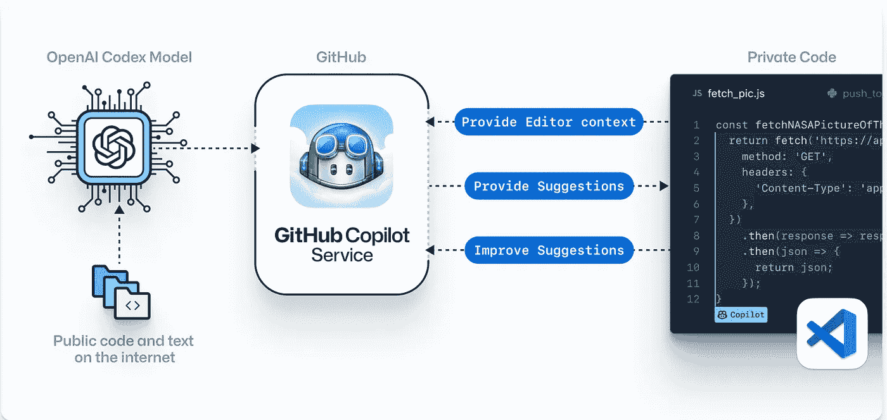

# 我在 Python 中使用 GitHub Copilot 的体验

> 原文：<https://medium.com/codex/my-experience-with-github-copilot-in-python-fb316ea33aaf?source=collection_archive---------10----------------------->

## 让它为你写真正的代码

摘自[https://copilot.github.com/](https://copilot.github.com/)

我不打算在这里解释 GitHub Copilot 的细节，而是分享我在使用 Python 语言编写代码时，在 Visual Studio 代码编辑器中将它用作扩展的经验和反馈。下面是几个展示 GitHub Copilot 性能的案例。

# **案例一:**