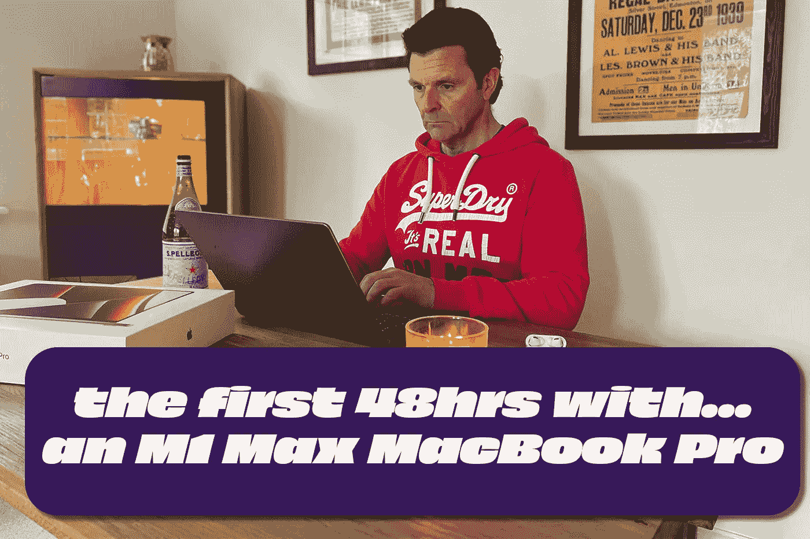
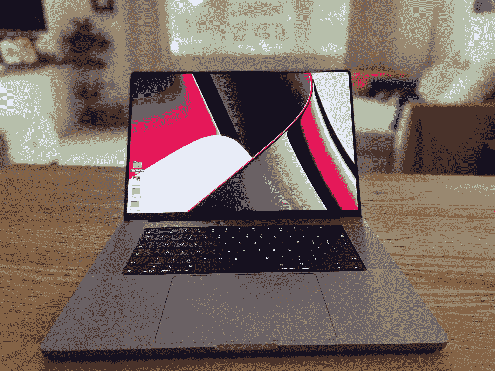
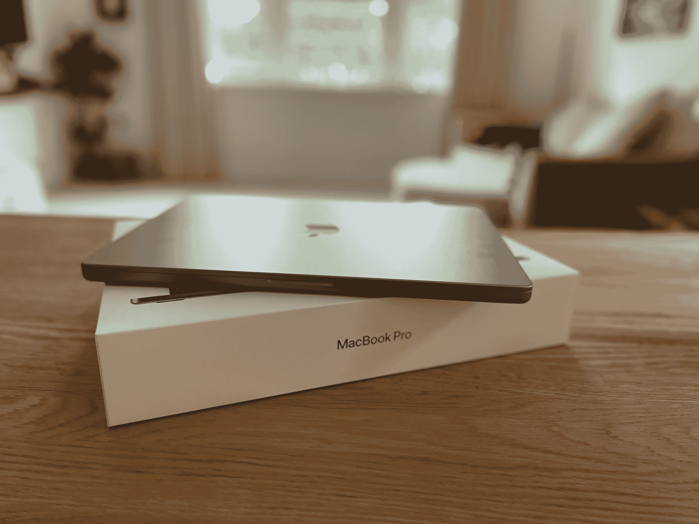
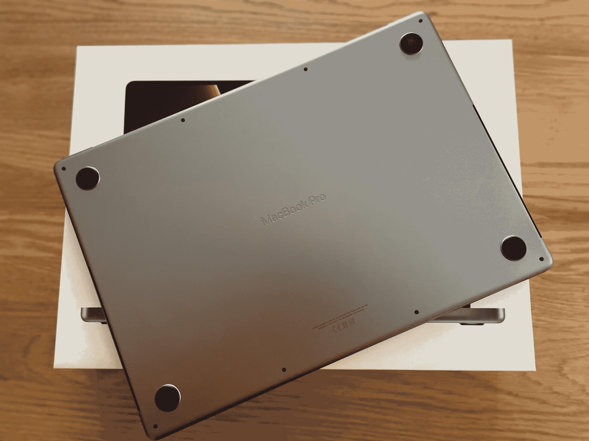
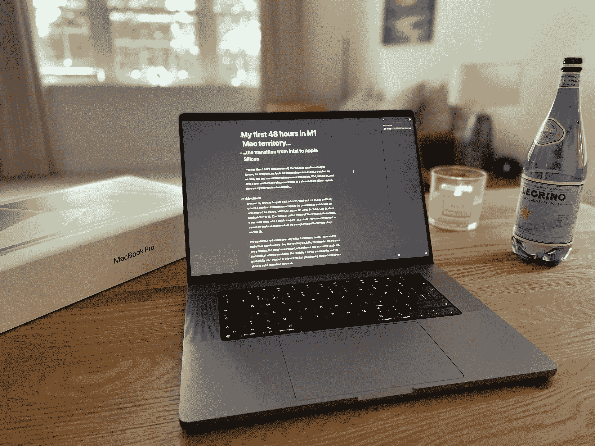

# 我在 M1 麦克领地的第一个 48 小时…

> 原文：<https://medium.com/codex/my-first-48-hours-in-m1-mac-territory-9e88b093a961?source=collection_archive---------2----------------------->

## …从英特尔到苹果芯片的过渡

我似乎记得，那是 2021 年 3 月，随着苹果芯片被介绍给我们，在 Mac 上工作对每个人来说都永远改变了。我和许多人一样在一旁观看，对我们所目睹的一切感到惊讶。好吧，上发条，仅仅一年多，我现在已经自豪地拥有了一片苹果硅片。这是我两天来的印象。

习惯我的新 MacBook

## 我的选择

今年 3 月，在我生日那天，我决定冒险订购一台新的 Mac 电脑。我已经花了几个月的时间反复考虑这些排列和选择。M1 专业，M1 马克斯或 M1 超？24 寸 iMac，Mac Studio 还是 MacBook Pro？8、16、32 或 64GB 的统一内存？要考虑的事情很多。这永远不会是在公园散步*或*便宜！这是对我和我的企业的投资，它将帮助我度过未来 5 到 6 年的职业生涯。

在疫情之前，我一直非常专注于办公室，以办公室为基础。我的办公室离我住的地方很近，在我的整个成年生活中，我每天早上都会出门。但是时代变了，我也变了。洛克道斯教会了我在家工作的许多好处。它带来的灵活性、创造性和生产力。我提到这一切，是因为它对我即将做出的购买 Mac 电脑的选择有很大的影响。

 [## Apple TV…值得吗？

### 我大胆尝试，以下是我的想法。

medium.com](/codex/apple-tv-is-it-worth-it-1f3c01f142) 

我的新 MacBook 轻松地完成了我对它的所有要求

## 关注未来

是时候面对现实了，我认为未来可能会怎样，我将如何工作。我一直忽略了笔记本电脑是一个严肃的工作站，它必须是台式机，而且是大的台式机。27 英寸 iMacs 是给我的。我甚至有一个 21.5 英寸的 iMac *只是*作为电子邮件屏幕！它总是尺寸第一。由于目前没有 27 英寸的 iMac 可供选择，我第一次把 MacBook Pro 当成了我的日常工作。就在我准备做出选择的时候，随着 Mac Studio 的推出，事情变得有点棘手。考虑过后，我知道这对我来说太难了。它太强大了，会把我绑在桌子上，而且更贵。不，我已经决定了，我要去买 MacBook。我最终选择了一台 16 英寸的 M1 Max，配有 32GB 的统一内存和 4TB 的存储空间。

我说，事实证明，和最初一样，我订购了 2TB 的 MBP。上周，苹果发邮件给我说，由于芯片短缺，我的订单被推迟到 7 月份，这一切都改变了。打了几天电话后，我很幸运地在英国找到了一台*机器，唯一的不同是这台机器的存储量是*的两倍。我咬紧牙关，付出了代价，现在我正在开发我的 MacBook Pro。**

 [## 古董 iPads，热传感器，没有芯片！

### 苹果视图综述 2022 年 5 月 2 日至 5 月 6 日

medium.com](/codex/antique-ipads-heat-sensors-and-no-chips-bd34a98a23c2) 

在任何地方工作的好处…

## 该设置

我已经有几年没有安装新的 Mac 了，每次我这样做，都会变得更容易。我周日一整天都坐在沙发上，慢慢地给 Mac 添加东西，让它不仅是我的，也是一台可以工作的机器。它需要尽快开始为我赚钱。在我的 [YouTube](https://www.youtube.com/c/DavidLewistalkingtechandaudio) 频道上，我的观众一直很棒，因为我曾和他们谈论过安装 Mac 的事情。根据他们的建议，我决定不从我的其他 MAC 电脑上安装，而是慢慢来，进行一次全新的安装。我已经很高兴我做到了。同样，我现在内心平静，这里的一切都是有原因的。首先是 Creative Cloud 桌面应用程序，然后是 InDesign、Illustrator、Photoshop、Audition、Premiere Pro 和 Acrobat。我写这些博客的应用程序是 next，Ulysses，之后是我的 Waves 插件。慢慢地，但肯定地，它感觉像我的。我花了一些时间登录各种网站等，很高兴这些年来我一直使用 Keychain 进行密码管理！这让事情变得轻而易举。

负 16 播客——值得一听！

一如既往的设计精美

## 第一个工作日

昨天是我在新钻机上的第一天。我听说了很多关于电池寿命的事情，但我还不确定我对它的看法。我*认为*它和我听说的一样好，但是我不得不在下午晚些时候给它充电。也就是说，我整个早上都在用 InDesign & Photoshop，然后还有一些 Premier Pro 作品。请记住，当我说*“必须充电”*时，它还远没有走到生命的尽头…我猜是旧习惯吧！我有一台用了两年的英特尔 MacBook，我知道如果那样的话，几个小时后它就没电了。风扇也会一直呼呼转动。这东西很安静，很酷。即使在视频出口上，粉丝也只是短暂地、非常温和地参与进来。即便如此，风扇的声音几乎听不到，Mac 本身摸起来也不怎么热。

除了 Premiere Pro 有一点小问题，第一天是我所希望的。我还没有完全体会到屏幕有多好。所有的苹果电脑都有很棒的显示屏。色彩准确度似乎有所提高，但我还没有机会充分欣赏 Pro Motion、迷你 LED 的好处以及 120Hz 的刷新率。

我不是打字的！我很熟练，但仍然用两根相当快的手指敲起来！但是，连我都注意到这个键盘真的有多好。它非常平衡，反应灵敏。

对于一个音响师来说，在我还没有试扬声器的时候，实际上已经很晚了。好吧，我来自一个有显示器的工作室，但即使如此，这台笔记本电脑里的这些小扬声器还是很强大的。我会想在上面编辑播客吗？不，但对于一个像样的音频消费质量，你真的不需要桌上扬声器。合理的低音和相当清晰的中音。你不会觉得整天听这些很痛苦。

尤利西斯——我的新 MacBook Pro 上的一个重要工具

## 尺寸重要吗？

这是我第一次在笔记本电脑上创造性地工作一整天。屏幕感觉不小。不知何故，这还不是一个问题。今天晚些时候，或者明天，我会在这里完全编辑我的第一个视频，这样我就可以感受一下 Premiere Pro 中的时间线是如何流动的。我把一个旧项目放在新的 Mac 上，它在播放时没有口吃，即使在上面运行颜色分级、音频插件和效果，并且是全分辨率的。我还有一个工具包到期，这是一个工作室展示。全球面板短缺让我措手不及，我还有大约一个月的时间来等待。在某种程度上，这是一件好事。如果我很高兴在 MacBook 上纯粹用*工作，我会知道我现在是真正的移动了，可以在任何地方全力工作。凭借 4TB 的存储空间和强大的 M1 Max，我可以在任何办公桌、办公室或地点处理任何项目。没有加密狗，没有外部存储，现在电源砖，甚至没有鼠标！我将向前迈进，向我人生的下一个时代迈进一步。博客和来自任何地方的块茎。*然后*，如果那天我碰巧在工作室，我可以把我的 MacBook 连接到工作室的显示器上，用双显示器工作。我认为我拥有两个世界的精华。*

从各个角度看都很漂亮

## 结束的

感觉有一定的反高潮感，也不知道为什么？事实上，擦那个，我确实知道为什么…这一切都是如此简单、无缝和快捷。以前，更换 Mac 电脑是一件痛苦的事情。安装我工作所需要的一切，看起来就像是一座要攀登的可怕的山！这一次，它花了一个安静的星期天，我几乎在那里！回想起来，它在第一天做得如此之好的事实令人惊讶。它没有压力。奇怪的是，这款 Mac 的强大功能并没有给我留下深刻印象！我的意思是，它毫不费力地完成了我要求它做的一切，而且没有外伤。所以，我从来没有充分意识到它的工作有多努力，或者有多有效。它只是在做自己的事。

我以前写过关于从现在开始任何事情都是随着权力的增长而递减的。这台 MacBook 正在尽我所能，并乞求更多。是的，很贵，但是如果这是未来，那就来吧…

最后一点需要注意的是…我一天用了三个小时，电池还没动…只是想提一下…

## 在你走之前

## 你订阅媒体了吗？

我只是高端博客网站 Medium 的众多作者之一。它是如此物有所值，你可以在这里加入[https://medium.com/membership](https://medium.com/membership)

[**加入我的幕后邮件列表**](https://www.talkingtechandaudio.com)

**原载于 2022 年 5 月 10 日 https://www.talkingtechandaudio.com/blog****[**。**](https://www.talkingtechandaudio.com/blog)**