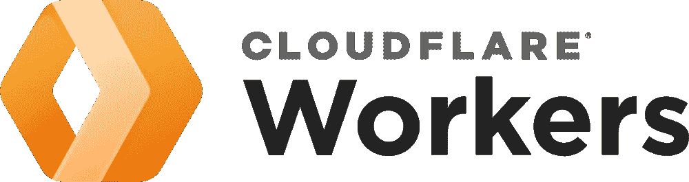
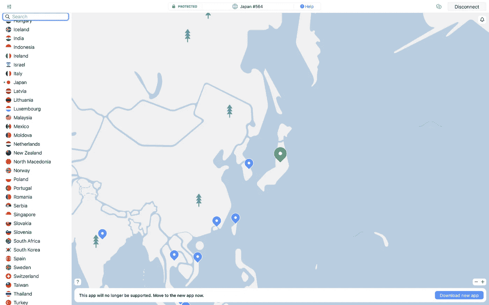
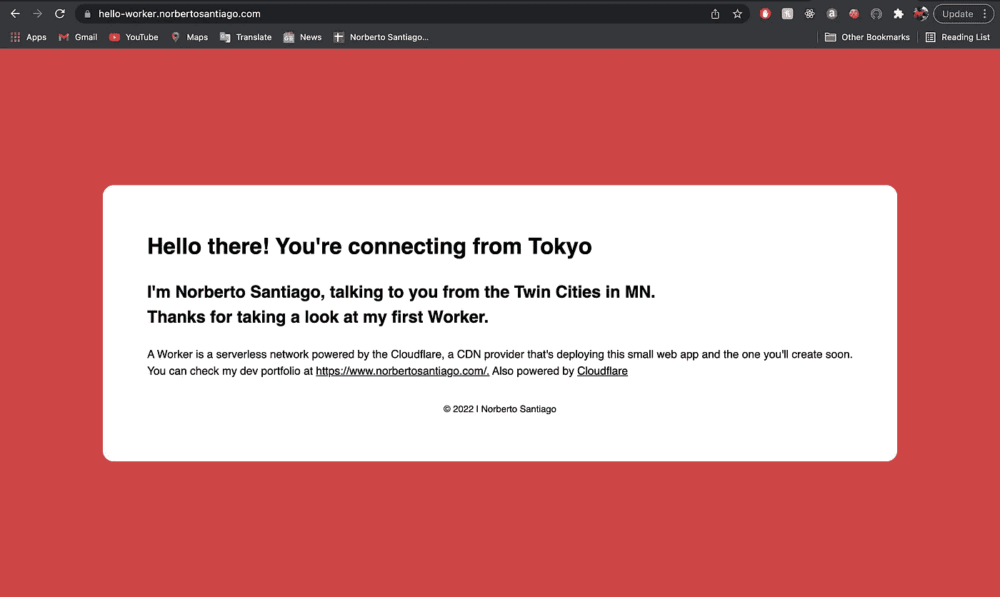
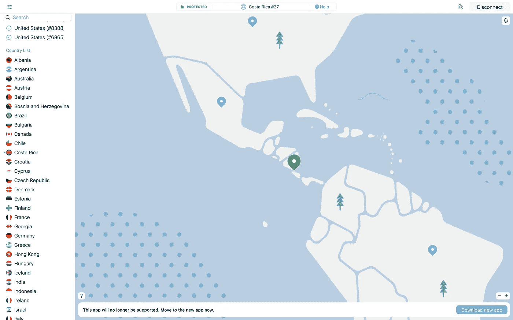
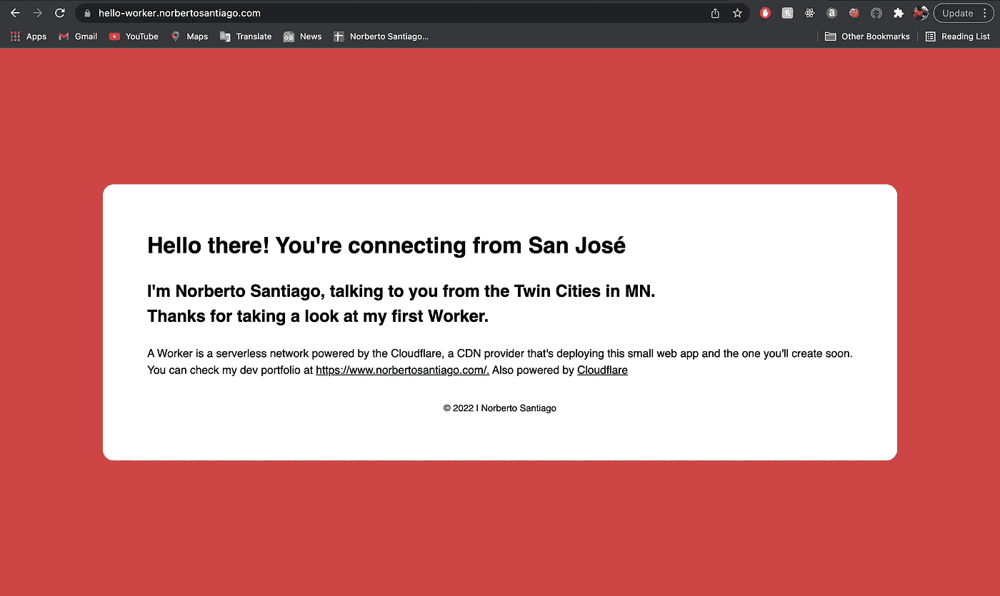

# 我的第一个 Cloudflare 工人

> 原文：<https://medium.com/codex/my-first-cloudflare-worker-5cdb453725fe?source=collection_archive---------7----------------------->



在科技界，有一群创新者正在创造下一个创新。其中一家公司是 Cloudflare，CDN 提供商做了很多很酷的事情，包括今天的主题，他们的工人。 [Cloudflare Workers](https://workers.cloudflare.com/) 是通过本地网络部署的无服务器应用。无论您在哪里，它都会在发布后几秒钟内启动并运行。

这些工人的例子从简单的 HTML 页面到为用户提供授权，创建缓存 API，以及使用 PostgreSQL 的数据驱动应用[发挥创造力，这对我是个好消息，因为我是 PostgreSQL 的粉丝](https://developers.cloudflare.com/workers/tutorials/postgres)。我的第一个 worker(我保留了名字 first-worker，并承诺自己要做得更多)是一个简单的 HTML 页面，它将猜测您要访问的城市。

# 安装牧马人

要创建一个 worker，您需要首先安装 Wrangler CLI。首先，创建一个 [Cloudflare Worker 帐户](https://dash.cloudflare.com/sign-up/workers)。

```
npm install -g @cloudflare/wrangler
```

创建帐户后，您可以继续安装牧马人。

```
wrangler login
```

使用上面的命令登录到您的帐户。

```
wrangler generate first-worker
```

现在我们有了牧马人 CLI，是时候创建第一个项目了。

# 编码 JavaScript

现在，到了有趣的部分了！最简单的开始方式是使用[快速入门](https://developers.cloudflare.com/workers/get-started/quickstarts)。然而，如果你想接受挑战，从你的代码开始，输入`wrangler init`。

```
wrangler generate my-app [https://github.com/cloudflare/worker-template](https://github.com/cloudflare/worker-template)
```

因为我是用 JavaScript 编写我的 Worker 的，所以我输入命令来获取一个模板。所以我用一些代码来启动这个工人，我需要这些代码来实现我想要的。

首先，我们得到了`index.js`文件，它从第一行的模板文件中导入模板变量。

```
addEventListener('fetch', event => {          event.respondWith(handleRequest(event.request))
})
```

工人支持两种事件，`fetch`和`schedule`。对于这个项目，我们需要打电话给`fetch`。

```
async function handleRequest(request) {  
  return new Response(template(request.cf), { headers: { 'content-type': 'text/html' },  
  })
}
```

上面的代码是事件处理函数。这是非常简单的 JavaScript 事件处理。但是，有一个细节我想关注一下，那就是`Response(template(request.cf)`。Workers 有一个特性，只需在代码中调用`[request.cf](https://developers.cloudflare.com/workers/runtime-apis/request#incomingrequestcfproperties)`就可以为您提供迭代的信息。

所以让我们来看看模板文件。在提供该文件的完整代码之前，我想分享这一行代码:

```
<h1>Hello there! You’re connecting from ${cf.city}</h1></br>
```

我们使用了一个反勾定界符从你访问的 IP 地址开始迭代城市。

下面是完整的模板代码:

# 发布工作者

首先，让我们确保我们在`wrangler.toml`文件上得到我们需要的一切。

```
name = “first-worker”
type = “webpack”
account_id = “account_id”
workers_dev = true[env.production]
workers_dev = false
route = “https://hello-worker.norbertosantiago.com/"
zone_id = “zone_id”
compatibility_date = “2022–01–15”
```

首先，我们可以在开发环境中看到页面。你可以继续玩你创造的工人。并不断作出改变，并分享开发页面，当你作出改变，让其他开发人员看到。然而，Cloudflare 有一个问题。你需要从他们那里购买一个域名来发布你的工人。好的一面是，它的价格比大多数提供商都低，而且你会以如此低的价格获得额外的安全性、性能和额外的好处。

如果您决定获取域，请添加 zone_id，该路由是您要提供给带有您的域的 worker 的 URL，以及以下代码行:

```
[env.production]
workers_dev = false
```

一旦在`wrangler.toml`文件中设置好一切，输入下面的命令行进行发布:

`wrangler publish --env production`

**非常重要:**确保将 CNAME 添加到您的域名中。在我的例子中，增加的 CNAME 是一个好工人。

现在，让我们继续使用 VPN 测试工作人员。



日本的 VPN 连接。



Kon'nichiwa，tūkyni imasu。


让我们搬到另一个大陆。



在哥斯达黎加连接了 VPN。



你好，圣荷西。


这就是了，我的第一个无服务器应用在[https://hello-worker.norbertosantiago.com/](https://hello-worker.norbertosantiago.com/)上线。希望你学到了一些新东西，并让我知道当你进入该网站时，Cloudflare 识别了哪个城市。

快乐的无服务器编码！

# 总结:

1.  Cloudflare Workers 简介。
2.  安装牧马人 CLI
3.  JavaScript 中的代码
4.  发布工作者

# 参考:

1.  Cloudflare Workers [文档](https://developers.cloudflare.com/workers/)