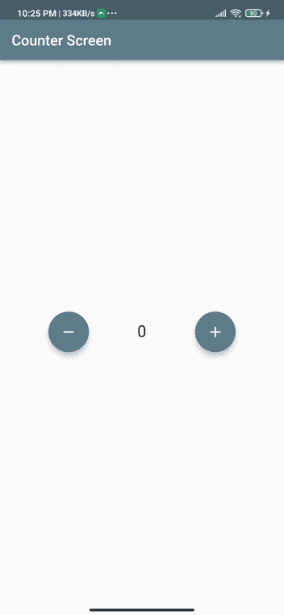
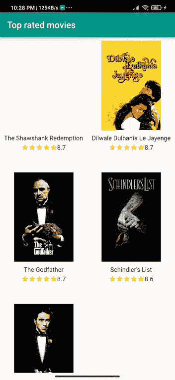
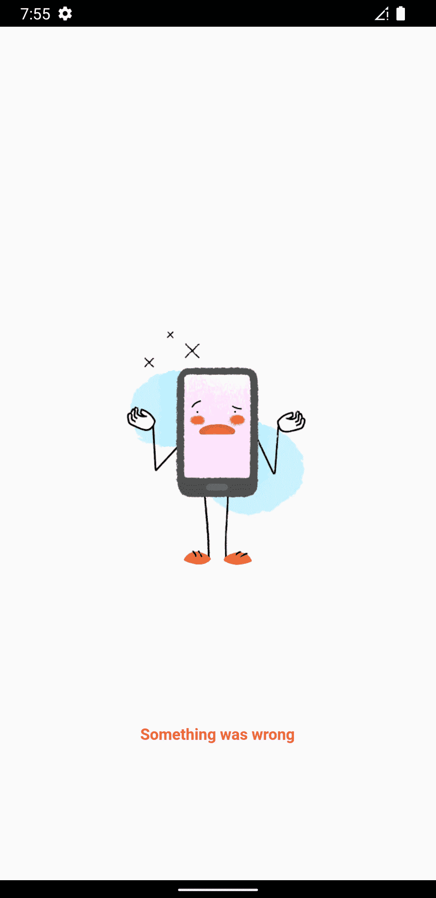
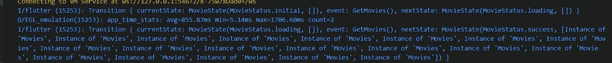
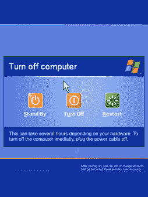

# 我的第一次集团星球之旅

> 原文：<https://medium.com/codex/my-first-journey-to-bloc-planet-bloc-for-beginners-f0bba1f3578e?source=collection_archive---------16----------------------->

随着你的项目越来越大，S et state 将不再为你服务，所以我启动了飞船的引擎，准备前往 State Management Galaxy，我们将在一个叫做 **BLoC** 的星球着陆，之前我去过他的卫星 **Cubit。**


当我们在这个星球上着陆时，我们发现那里的居民以某种流动方式工作。


这就是 bloc 的工作方式，我们创建事件来触发与应用程序的交互，然后 BLoC 通过发出状态发送重播。我们将在两个使用 Bloc 编码的项目中更好地讨论这个问题

# 柜台申请

从第一个应用程序开始，我们将重构默认的 flutter 应用程序，以简单和容易的方式理解 BLoC。



反申请最终结果

**项目结构**

```
├── lib│   ├── utils│   │   ├── app_observer.dart│   ├── counter_bloc│   │   ├── counter_bloc.dart│   │   ├── counter_event.dart│   │   ├── counter_state.dart│   │   └── view│   │       ├── counter_page.dart│   │       └── counter_screen.dart│   └── counter.dart│   └── main.dart├── pubspec.lock├── pubspec.yaml
```

它需要为我们的宇宙飞船放油，并在我们的包里放一些在旅途中帮助我们的用品，我将告诉你你需要的一切，也就是所谓的 ***包。***

> [**集团**](https://pub.dev/packages/bloc)
> 
> [**颤振 _ 阻塞**](https://pub.dev/packages/flutter_bloc)
> 
> [**等同于**](https://pub.dev/packages/equatable)
> 
> [**http**](https://pub.dev/packages/http)
> 
> [**【颤振 _ 评级 _ 酒吧】**](https://pub.dev/packages/flutter_rating_bar)


从**主镖**开始

然后创建 view/**counter _ view . dart**

我们的屏幕包含两个浮动操作按钮和一个文本窗口小部件，但是当我们点击这两个按钮中的任何一个时，什么都不会发生，我们的窗口小部件是无状态的，所以我们不能做任何事情来改变状态，所以我们需要向 BLoC 寻求帮助。

**首先**，我们需要创建**counter _ bloc**/counter _ event . dart****

**块需要事件来触发视图类上的交互，所以我们有两种类型的交互，第一种是当用户按下按钮来增加计数器值，第二种是减少值。**

**事件通知 bloc 用户需要增加或减少计数器值，然后 bloc 需要在事件发生时发出状态**

**下一步是创建 counter _ bloc**/counter _ state . dart****

**我们需要用所有可能发生的状态来扩展 counterState 类。**

****反初始**初始状态，我们用它的初始值启动计数器**

****计数器值递增或递减成功时，返回状态****

****反错误状态**处理可能发生的错误**

***最后*，我们可以到达让 BLoC 做它的工作的最后一步，我们需要创建 counter _ BLoC**/counter _ BLoC . dart****

**我将 count 初始化为初始值= 0，然后我们需要一起使用事件和状态来完成我们的配方。**

**我们将从将事件映射到状态开始，根据结果获取事件并阻塞发出状态，如果用户试图将计数器值减少到负数，阻塞将发出错误状态。**

*****最后*，**我们将开始用 view 来链接 bloc 与 view 做一些魔术。**

****

**创建视图/ **counter_page.dart****

**我们将使用它为我们使用 **BlocProvider 的视图提供阻塞。****

**然后我们需要回到 **counter_view.dart****

**我们将用 **BlocConsumer 包装我们的视图小部件。****

> **我们用它来构建基于当前状态的小部件。**
> 
> **我们用它来保持监听状态的新变化。**
> 
> **有了它，我们既可以用来听，也可以用来建立。**
> 
> ****context.read <锪孔>()。数数；****

**读取块内的计数器**

> ****context.read <对刀>()。add(incrementoffvalue())；****

**通知**计数器块**一个新的**增量事件****

**这是我们的反应用程序冒险的最后一步，我们将开始另一个冒险，使电影应用程序保持调谐。**

# ****IMDb 顶级电影申请****

**在我们的编码空间之旅中，我们遇到了新的东西，它叫做 ***API* ，**他知道一些我们需要的信息**。****

**因此，在电影应用程序中，我们将使用它，我们将从中获取数据。**

****

**顶级电影应用程序['最终结果']**

> **用户界面不是我们的大问题，所以我没有给它太多的关注**

**我们已经从上一个应用程序中了解了如何使用 bloc，所以我们可以跳过一些解释，但是在这个应用程序中，我们的 BLoC 将不得不做更多的工作。**

****

**从旧的工作流程中有了新的东西， ***Bloc*** 有了新朋友叫 ***data*** 向他打招呼， ***请求*** data 事件通知 Bloc，然后我们的新朋友会 ***回复*** 数据或者道歉说他拿不到。**

**首先，我们必须确定为了开发我们的电影模型，我们需要从 API 获得什么类型的数据。**

**之后，我们可以从 API 服务中获取数据**

> **你需要从 [**TMDB**](https://www.themoviedb.org/) 那里拿到你的钥匙**

**在完成数据阶段并通过 API 服务获取存储库的电影列表后，我们将开始与我们的 BloC 一起工作。**

> **从 BLoC 开始**

> **我只需要一个事件来通知 BloC 开始获取电影操作。**

**我们的状态类不同于计数器状态类；我发现如果有大量的变化，这种风格的编码会更容易；我简单地使用 *copyWith* 来根据阻塞响应将状态发送到新状态。**

**我们有一个事件将它映射到状态；如果我们**成功**获得电影列表，我们将把状态状态从*加载改为成功*；**否则**，我们会发出错误状态。**

> **从视图开始**

**当我们启动应用程序时，我们需要做的第一件事是收集数据并将其提供给 bloc，因此我们返回***repository provider***来告诉存储库开始工作。**

**因为有三种可能的状态，所以 Bloc builder 将根据状态创建一个小部件。**

> ****状态为成功:**块构建器 reutrn **MovieSuccessWidget()。****
> 
> ****状态为正在加载:**在等待获取数据时，应用程序将显示**循环进度指示器。****
> 
> ****状态为错误:**返回 **CustomErrorWidget()。****

**我们将从最简单的任务开始，处理**errorgettingmoviesgwidget**。**

**如果有数据捕捉错误，这就是我们的小部件的样子。**

****

**如果没有错误，并且状态状态为*成功*，我们就有了电影列表，并且将数据表示为 GridView。**

****movie card**允许我们定制如何显示每部电影及其属性。**

*****最后*** *我们需要跟踪我们的集团，知道他当前的状态，以便我们处理错误和跟踪我们的代码，所以我们将创建一些东西作为我们的眼睛，它被称为* ***集团观察者。*****

**它希望在*主*函数中，以便执行它的职责。**

****

**我们必须把我们的主镖变成那个样子**

**我们可以很容易地跟踪我们的集团运动，如下图所示。**

****

> **在上图中，bloc 从初始状态开始，然后进入加载状态，直到我们成功地从存储库中检索到数据，此时 bloc 发出成功状态。**

**我们在这个星球上的旅程已经结束；下次冒险再见。**

****

> **我们的整个旅程都记录在这里。**
> 
> **https://github.com/NehruJr/Flutter_BLoC**
> 
> **我希望我的文章对你有帮助，谢谢你的时间。**