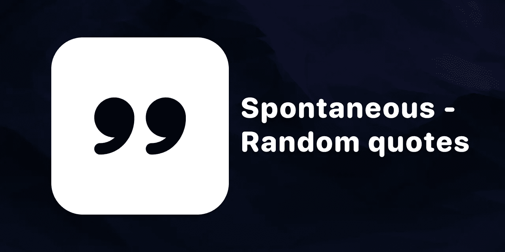

# 我的第一个开源 iOS 应用

> 原文：<https://medium.com/codex/my-first-open-source-ios-app-fdbf21991ce5?source=collection_archive---------5----------------------->

## [法典](http://medium.com/codex)

在这篇文章中，我想谈谈 [**我的 iOS 应用**](https://github.com/FranicevicNikola/DiscoverRandomQuotes) 。这个应用程序既是我在应用商店的第一个应用程序，也是第一个开源项目。

## 我为什么这么做？

作为一名自学成才的 iOS 开发者，我想走出教程的地狱。我决定给自己一个期限，把一个应用发布到 App Store。但是为什么要开源呢？因为我是…