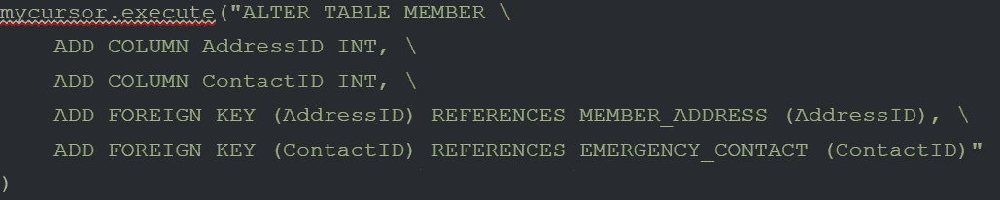

# 我的第一个 Python 和 MySQL 数据库

> 原文：<https://medium.com/codex/my-first-python-and-mysql-database-2df48487dde6?source=collection_archive---------9----------------------->

通过为 Saratoga PLAN(我是其成员之一的一个环境组织)创建以前的 MS Access/SQL 数据库，我发现它极大地提高了查找和访问该组织数据的效率。然而，虽然这使得数据库中已经存在的信息更容易访问，但是每当有新成员加入，或者如果我需要更改现有的数据，我每次都必须手动执行这些操作。这意味着，虽然我最初认为这个系统会更有效，但它实际上只是在某些情况下。在研究了 MS Access 的功能后，我发现它只为非常小规模的数据库而设计，在业务或组织级别，还有许多其他选项具有更大的功能。

弄清楚这一点后，我决定研究最流行和最受欢迎的数据库管理系统。引起我注意的是 MySQL。我看到它是开源的，非常安全，可伸缩，具有非常高的性能，甚至还有免费的社区版本(所有其他流行的数据库只有付费版本)。除此之外，我看到 MySQL 和 Python 可以很好地互补，MySQL 是软件工程师使用最多的数据库之一。

关于如何将 Python 与 MySQL 配对，以及数据库系统本身，有很多很棒的资源，这使得为 Saratoga PLAN 构建一个新的和改进的数据库成为一个非常容易的选择。总的来说，同时使用 Python 和 MySQL 将极大地增强数据的自动化、可访问性、分析和可视化，从而显示组织随时间的增长。

**表格&属性:**

对于这个数据库，我想涵盖各种各样的信息。这包括成员姓名、地址、电话号码、电子邮件、弃权书(当他们完成时，这是参与组织活动和志愿服务的要求)、紧急联系信息和医疗状况(填写弃权书时包含的信息)、志愿服务数据(活动类型和完成的时间)。

**属性的附加细节:**

*   必须只有一个名字和地址
*   可以有多个电话号码和电子邮件
*   每个成员只有一个紧急联系人姓名和电话号码
*   成员可以有任何数量的医疗条件
*   成员只能有一个地址，但是可以有多个成员住在同一个地址
*   任何成员都可以在一年中的任何一天完成志愿者小时，但是其他成员可能根本不做志愿者
*   对于志愿服务时间结束的每个日期，成员可以在同一天或其他日期进行多种类型的志愿服务

**呃图:**

**关系表模拟设计:**

**MySQL 命令行中的表和表中的属性示例:**

**MySQL EER 图:**

**MySQL 志愿者工时表数据导出到 Excel:**

**MySQL 志愿类型表数据导出到 Excel:**

**面临的挑战和我发现/学到的趣事:**

*   花了一段时间才弄明白如何向只有一个属性的表添加数据(除了它们的外键)。当使用 MySQL 查询 INSERT INTO 时，我认为我只需要插入到表(属性)值(%s)，(值))中，但这无法工作，我认为这很奇怪。在浏览了 MySQL 文档之后，我发现第二个参数，也就是值所在的地方，必须是一个元组，但是因为我在括号中只有一个值，Python 没有把它变成元组。为了解决这个问题，我需要在值后添加一个逗号来创建一个只有一个值的元组。这意味着(value)不起作用，但是(value，)会起作用，因为这是一个元组。
*   我发现构建数据库的最佳方式是首先创建所有的表，并为每个表输入一组数据进行测试，然后添加所有的外键，之后我想出了如何一次输入多组数据，构建报告，甚至想出了如何实现自动化！
*   基于我正在做的这个项目，当涉及到网络安全时，我学到了一些我不打算学习的有趣的东西。这是关于 SQL 注入(用于破坏/滥用数据库的常见网络黑客技术)，以及如何防止它们发生。在 MySQL 中构建和管理数据库时，最好养成对所使用的任何查询的值进行转义的习惯，以及与 update 语句相关的查询。为了有效地做到这一点，应该使用占位符%s，它用于对 delete 语句中的值进行转义。对字符串进行转义仅仅意味着告诉 MySQL 查询不是以单引号结束的字符串，而是实际字符串本身的一部分，应该以这种方式处理。转义序列在 SQL 语句中用来告诉数据库 SQL 字符串的转义部分应该以不同的方式处理。总而言之，确保总是对每个数据库提供的用户输入使用字符转义函数。这样做是为了不让数据库将其与开发人员提供的 SQL 语句混淆。
*   弄清楚如何向已经存在的表中添加外键比预期的更具挑战性。经过研究，我发现 ALTER TABLE 是我需要使用的，但是我不能直接添加外键。经过反复试验，我发现我需要添加我想要的外键列，并在同一个查询中声明这些新列的外键。这就是它在成员表中添加我想要的外键的样子:

*   我发现能够在 Python MySQL connector、MySQL 命令行和 MySQL workbench 之间运行查询和连接真是太酷了。为了连接 Python 和 MySQL，我需要用 Python 创建这个脚本。如果你在本地运行 MySQL，主机和用户应该和我的一样。密码和数据库是唯一需要填写的值。

*   我遇到的一个麻烦是将数据库导入 MySQL 模型。我无法“照原样”做到这一点，但是我发现如果我将我在 Python 中创建的每个查询修改成纯 SQL，我就能够做到这一点。我设法做到这一点的唯一方法是，我必须逐个创建我之前已经创建的每个表，保存它们，然后将它们导入到 MySQL 模型中。在未来，我意识到我完全可以将我所有的表查询，甚至是我在 Python MySQL 中所做的所有查询放入一个 SQL 文件中，但是直到我一个接一个地保存并放入大多数 SQL 查询文件后，我才意识到这一点。在我一个接一个地把所有的查询都放进去之后，我决定测试一下这个想法，果然它能够把所有的查询都放在一个 SQL 文件中，并且一次全部导入！
*   从数据库导出数据非常简单，没有遇到任何问题。唯一需要注意的是确保文件路径可以导出。在大多数情况下，您会得到一个错误，说“MySQL 服务器正在使用–secure-file-priv 选项运行，因此它无法执行该语句。”为了查看可以将文件导出到哪里，进入 MySQL 命令行并运行以下查询:

这意味着如果您将文件导出到这个目录位置，那么您将能够这样做而不会收到错误。这是我为了测试它而创建的查询，它能够将数据导出到 test.csv 文件，没有任何问题。

*   我无法弄清楚如何完全自动化数据输入，这是我创建这个项目的预期目标之一。我确实想出了如何一次运行多个查询来加速数据输入的过程。此外，虽然我发现导出数据非常简单，但对于导入数据，我遇到了更多的问题，但最终还是解决了这个问题。即使我将文件放在正确的目录路径中，允许我导入。txt 文件放入 MySQL 数据库，我发现我需要修改 my.ini 文件，该文件位于:

打开此文件后，您需要使用查找工具搜索以下内容:

最初，secure_file_priv 等于一个特定的目录路径，即使我的文件在这个位置，它也不允许我访问。所以我需要把它改成空字符串。这样做之后，我重启了数据库，然后就可以导入了。txt 文件数据正确，只要我有。txt 文件格式正确，允许数据库理解它的数据意味着什么。下面是一个正确格式化的。txt 文件。需要注意的关键是，我在每行输入的内容之间没有空格，字符串属性需要用括号括起来。

*   虽然我不知道如何完全自动地向 MySQL 数据库中添加数据，但我知道如何导入。txt 文件与数据导入数据库。这确实有助于自动化过程，但是需要注意的关键是我需要在。以便正确导入它。下面是我如何使用命令行实现这一点的示例:

*   我还创建了各种 SQL 查询，使数据的可访问性变得更加容易。这包括按地区查找成员、完成表格的成员和今年加入的成员。

**未来数据库项目需要改进的地方:**

对于今年秋天的实习，我将通过 SCRI(锡耶纳学院研究所)成为一名数据分析师实习生。我将与 Python 和 MySQL 一起工作，并将努力从这个项目中建立我的技能。

秋季实习期间，我打算改进的主要领域包括:

*   创建更多的数据可视化
*   提高数据输入的效率，并继续努力提高自动化程度。我还会研究是否可以将数据转换为. txt 文件的过程自动化，因为这可能是将原始数据转换为数据库可读信息的过程中最长的部分
*   学习如何创建 MySQL 表单和报表
*   提高查询技能以更好地分析数据