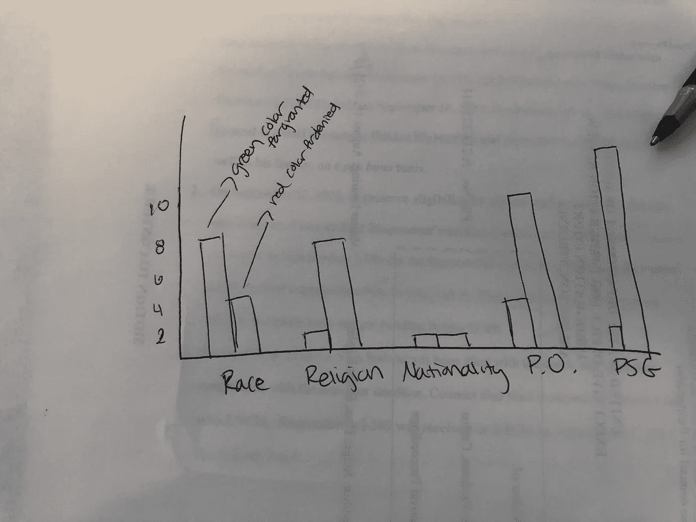
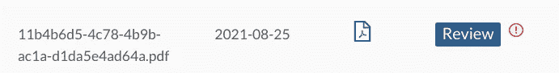
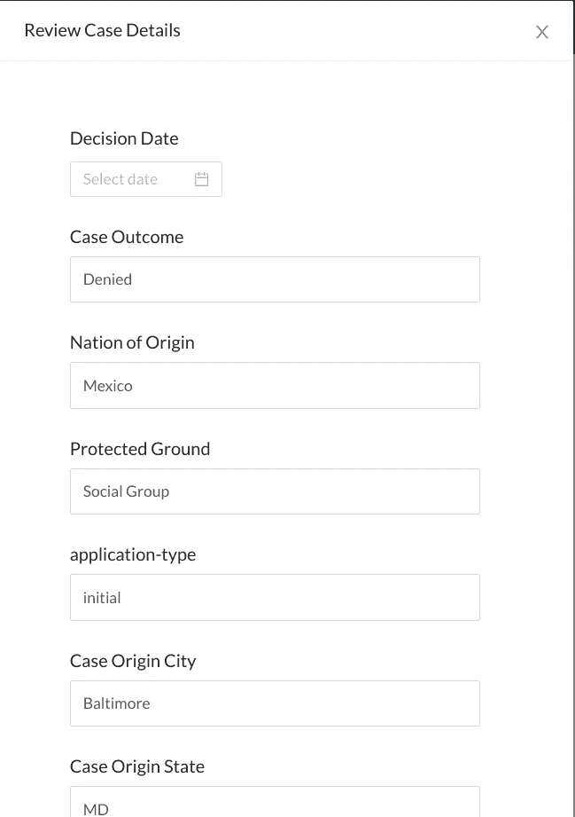

# 我第一次作为数据科学家在跨职能团队中工作

> 原文：<https://medium.com/codex/my-first-time-working-in-a-cross-functional-team-as-data-scientist-e0b0d700abf1?source=collection_archive---------13----------------------->

由 [Unsplash](https://unsplash.com?utm_source=medium&utm_medium=referral) 上[车头](https://unsplash.com/@headwayio?utm_source=medium&utm_medium=referral)拍摄

# 开始

在 Lambda school(一个编码训练营)的最后一个月，我有机会加入数据科学家团队，与一个全栈团队合作，为一项伟大的事业构建一个项目。我们的利益相关者是[人权第一](https://www.humanrightsfirst.org/asylum#asylumseek)，一个无党派、非营利的国际人权组织。人权第一的重要服务之一是帮助寻求庇护的人。世界各地的人们来到美国寻求保护，因为他们在自己的国家因为宗教、政治观点、性取向或种族而面临伤害的风险。在美国寻求庇护的过程很复杂，寻求庇护者不太可能负担得起高质量的法律代理。“人权第一”组织帮助优秀的律师和寻求庇护者配对。

我们的利益相关者希望创造一种产品，通过发现移民法官如何根据申请人的宗教、出身和社会团体成员身份对庇护案件做出有利或不利的裁决，来帮助这些庇护律师。HRF-庇护是一个产品，律师可以跳上去，看看可视化，趋势法官的决定基于上述类别。这个应用程序在构建时考虑到了双方的利益。人权第一组织有一个庇护案例库，但仍然没有足够的案例让每个移民法官都有深刻的见解，而且这些案例也没有公开。从网站提供的知识中受益的用户将上传他们以前处理过的案例，以丰富数据库。应用程序拥有的案例越多，网站能够提供的法官见解就越好、越准确。这一产品是一个有希望的工具，将使世界各地成千上万的寻求庇护者成功地在美国获得庇护地位。

## 涉及

我们的数据科学团队是为该产品做出贡献的第 7 个数据科学团队。我们这个应用程序的最小可行产品目标(MVP)是为移民法官创建可视化的见解，并构建一个刮刀，从利益相关者的数据库和上传的文档中提取庇护案件的重要信息。从以前的团队继承了一个存储库，我们被大量的代码、许多目录和随机的 Jupyter 笔记本淹没了。此外，我们必须与一个全栈团队合作，他们说的不是同一种语言，Python vs JavaScript。我们参与这个项目的另一个关注点是找到利益相关者希望我们从庇护案例中收集的准确信息所需的领域知识。我也有自己的担忧。除了是一名数据科学家，我还是我的数据科学团队的技术项目经理。我是一个安静的人，但我走出了自己的舒适区，成为了一名经理。作为团队的经理，我必须安排与全栈团队的协作。我必须与我的团队沟通，根据我们的 MVP 为他们分配任务。然而，我很害羞与全栈团队联系，我不太好的沟通技巧减慢了我们的进度，但多亏了我有才华的队友，这个过程变得更容易。下面我会告诉你更多。

# 麻烦

我先讲一个关于我们数据科学团队的故事。我们团队的 MVP 正在为法官提供可视化，并为庇护案件构建一个刮刀。我们使用 Plotly 创建了 plots，并以 json 格式发送到后端处理和抓取评委的数据。前端将使用这些数据和 json 在网站上呈现可视化效果。对于 scraper，我们使用光学字符阅读器将 PDF 文件转换为图像，然后返回这些图像中的所有文本。之后，我们将文本传递到我们的自然语言处理模型中，从庇护案例中挑选出最重要的信息。我们花了很长时间来理解上述事情是如何运作的，甚至因为我们缺乏交流而花了更多的时间来做出贡献。

我们的团队成员 ***J*** 针对他在一个与庇护案例相关的新数据集上的发现提出了一个拉取请求，但是在我们批准之前，他的拉取请求需要一些更改。然而，在提交对拉请求的更改后，**T5【J】T6**忘记告诉我们他的提交。我们完全忘记了这件事，直到他大声说出来。我也遇到了和 ***J*** 一样的问题。我等待着，想知道为什么没有人审查我的代码。注意到群聊后，我终于让我的团队审核了我的拉请求。我的建议是始终向您的团队报告您所做的工作，以及您是否需要对拉请求进行代码审查，以便每个人都在同一页上，并且一致地推进项目。

## 乏味的部分

深入了解我们如何从庇护案件中收集信息。

当我们的刮刀寻找信息时，它会在文本中找到能给我们答案的模式。以前的团队创建了一个函数来查找庇护案件的听证日期，这不是我们的利益相关者想要的。我不得不修改一个函数来查找庇护案件的判决日期。

上图是整个庇护案件中的一部分。在我们的代码中，我们找到了确切的模式“本通知的日期”，并返回 2013 年 4 月 30 日

上面的代码是我们如何实现查找决策日期函数的一个例子。我们有一个叫做查找相似的主函数。我们输入一个模式到这个函数中，它会吐出任何有相似模式的句子。我们只需要选择正确的句子，并以正确的格式返回日期。第 33 行的格式是将 xx/xx/xxxx 格式的日期转换为 YYYY-MM-DD 格式。当我们尝试连接后端数据库时，这是一个问题。我发现了这一点，并在我们的第一次跨职能团队会议上通知了整个团队。

我们，数据科学团队，独自工作，解决了我们自己的问题。我们让一些人处理上面的刮刀。“get_date()”只是我们需要从庇护案例中收集的十三个字段之一。我们团队中的其他人负责可视化。问题的出现是因为我们没有和全栈团队很好的沟通。前端团队等待来自后端的数据。后端等待我们的数据科学的终点，我们等待可视化的出现。我们团队的发起人 A 与后端团队会面，建议我们与所有团队中的每个人进行对等编程。这些会议极大地提高了所有团队的开发速度。我很高兴我有一个像 ***A.*** 这样的队友在第一次会议中，当后端人员无法与我们的数据科学 API 端点连接时，我们意识到后端代码库中的端点 URL 不是正确的。我发现了我上面提到的 bug，并建议对数据采用统一的格式。此外，我们有一个非常不必要的复杂的应用程序架构，这是由以前的团队决定的，但我们不能改变它。该系统中的数据科学数据库存储了我们的利益相关者的庇护案例以及所有上传的案例。我们的 scraper 从这些案例中提取数据，并将其加载到后端数据库中的一个 **ds_case** 表中。后端和前端在后端数据库中使用了一个不同的名为 **case** 的表。格式问题是一个错误，它影响了将数据从 **ds_case** 表移动到 **case** 表的能力。另一个不正常的代码是端点。前端的端点 URL 都是占位符，这解释了为什么前端和后端之间没有交互。仅仅通过一次跨职能会议，我们就能够找出以前没人见过的漏洞和解决方案。在这里，沟通是王道。我们不断地与 crossing 团队进行讨论，不再仅仅局限于我们的数据科学团队。我们解释了我们的代码如何为后端人员工作，我们的表中的列如何以这种方式命名。我们不仅使后端工作更容易，而且减轻了我们自己不知道为什么网站没有收到我们的 API 的压力。

# 进展和未来特征

我们的数据科学团队固定了一些函数来获取判决日期、最初审理案件的城市和州，以及申请人的可信度。我们成功地根据利益相关者的精彩绘图创建了一个图表。

最重要的是，应用程序现在显示图表。这是前端、后端和数据科学团队共同努力的结果。通过相互合作，我们可以更快地调试。

关于该项目的 scraper 部分，该应用程序有一个上传按钮，律师可以用来上传他们自己的庇护案件。

收到上传的案例后，我们的用户现在有了一个新功能来查看上传的案例。当点击“查看”按钮时，上面的表单将会弹出。

该表单有预填充的字段，这些字段是使用我们的 scraper 提取的。用户可以节省填写表格的时间和上传案例时的麻烦。我们为这个项目贡献了很多新的特性和对应用程序的改进。然而，对于继续这个项目的未来团队来说，还有很多事情要做。刮刀的准确性需要进一步提高，特别是在受保护的地面上，这是从庇护案例中刮除的最重要的领域。数据如何在前端、后端和数据科学之间移动是一个大问题。我们应该有一个案例表，而不是现在的两个。否则，当未来的数据科学团队决定更改字段名称甚至数据格式时，事情就会变得复杂。后端团队必须创建一种机制来适应这些变化。

## 外卖食品

成为一名技术项目经理是一次很好的学习经历。我认识到，通过采取主动和更多地发言，不仅可以帮助队友清楚地理解我的想法，还可以推动项目更快、更顺利地向前发展。最重要的是，我学会了在跨职能团队环境中工作。一开始我一直在挣扎，起步很慢。在我们与全栈团队交流和合作之前，我们的数据科学团队进展不大。展示我们的工作并要求澄清，我们和谐地在我们的开发旅程中前进。在这些会议之后，我们都说同样的语言。我非常感谢这次经历，感谢 Lambda 学校和人权第一组织给我一个机会去做一个有意义的项目，帮助成千上万的寻求庇护者。除此之外，我非常感谢我有机会将我在 Lambda 旅程中获得的知识和技能投入使用。我能够高效地使用 FastAPI 来创建端点。我获得了更多关于如何使用 Spacy 为我们的自然语言处理模型构建模式匹配器的知识。我能够理解旧的查询并创建新的查询来从 Amazon Web Services 上的数据科学数据库中抓取文件，并将数据加载到 Heroku 上的 Postgresql 数据库中。最后但同样重要的是，我能够阅读并贡献给一个已经在工作的存储库。