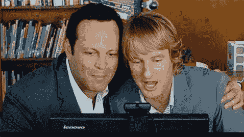

# 我的谷歌编码面试问题

> 原文：<https://medium.com/codex/my-google-coding-interview-question-166f2922b548?source=collection_archive---------0----------------------->

在谷歌，我参加了 200 多次面试，评估了 50 多份招聘资料。有一点很清楚，面试很难。信号到处都是。面试官和被面试者都只有不到一个小时的时间来尽力。有时，出于各种原因，我们会得到错误或不准确的信号。这是人类的天性。