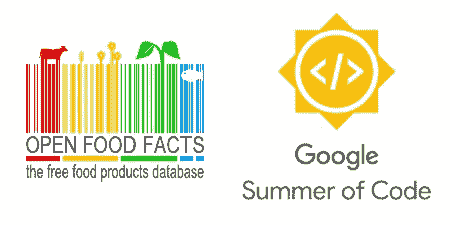
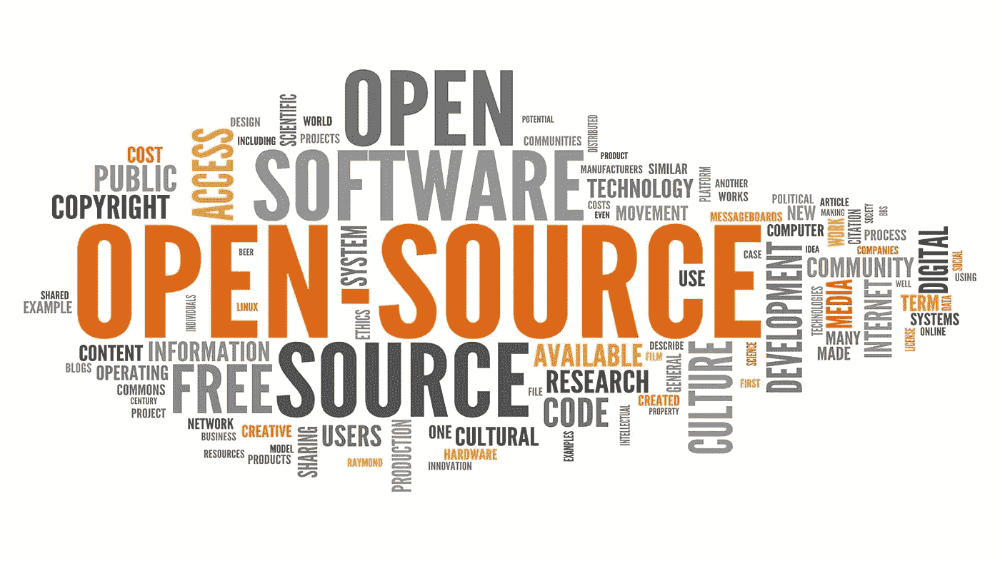
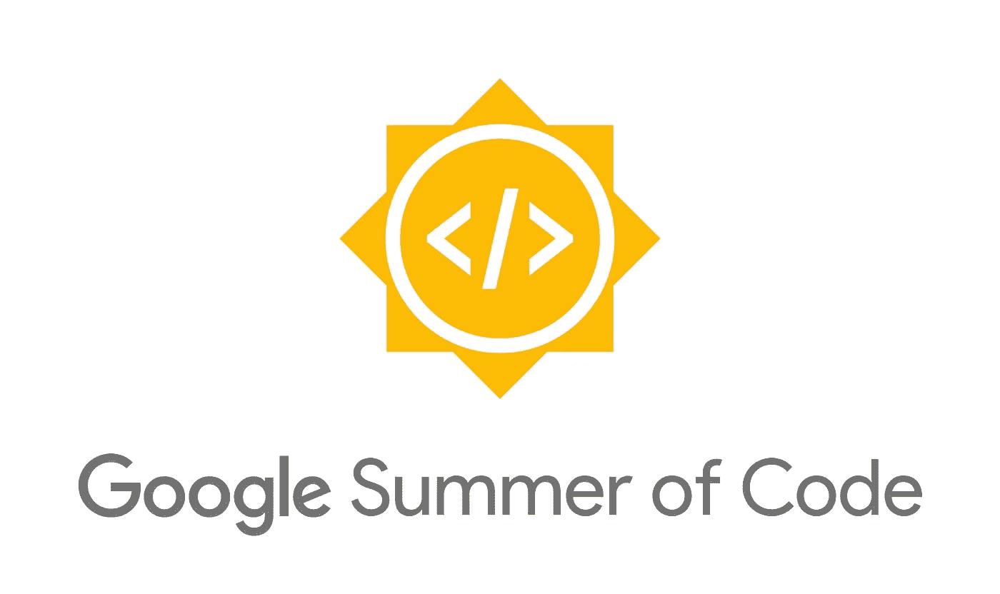

# 我的 GSOC 之旅

> 原文：<https://medium.com/codex/my-gsoc-journey-feb18ac2d56e?source=collection_archive---------9----------------------->

首先，是庆祝的时候了，我刚刚被选为“开放食品事实”组织的谷歌代码之夏。我仍然记得在 2020 年的 Hacktoctober 期间，我想也许有一天我会被选中参加更大部分的开源活动，也许是通过 GSoC。现在是 2022 年，我在这里开始我的 GSoC 之旅，从开放食品事实开始。

在博客的开头，我会试着详细解释每一件事，因为它将向 Gsoc 开放源代码，以及我是如何被选中的。

# 什么是开源？

所以用简单蹩脚的术语来说，开源意味着，一个特定事物的工作是公开的，所有人都可以阅读和分析。在软件领域，开源通常被定义为其代码在 GitHub、GitLab 等平台上公开托管的软件，任何人都可以阅读甚至贡献自己的代码。大多数情况下，最好使用开源软件，原因首先是代码是公开的，所以很多人会查阅代码库，涉及的人越多，出现漏洞的机会就越少。第二，它基本上是免费的，也就是说你不必为软件付费，尽管捐款总是受欢迎的。一个流行的开源例子包括 VLC 媒体播放器、chromium 项目、GNU Linux 项目、flutter、openfoodfacts 等。

# 什么是谷歌代码之夏？

现在来谈一谈到底什么是谷歌代码之夏，简单来说，GSoC 是试图促进开源热情的众多活动之一。GSoC 最初始于谷歌的使命，即授权大学生参与开源(从 2022 年开始，现在 18 岁以上的任何人都可以参与，不仅仅是大学生)。

在这个过程中，学生与他们在接下来的三个月中工作的组织相匹配，学习了许多关于开源工作的知识，并充满热情地继续为开源做出贡献。

# 选拔过程

谷歌首先宣布了组织的暑期项目，组织自己在那里注册 GSoC。在对被选中的组织进行评估后，学生的角色就出现了。与此同时，学生可以找到一些反映他们兴趣的项目，并开始帮助他们更好地了解他们。选定的组织宣布后，学生们讨论组织已经决定的项目，或者他们可以提出自己的想法。关于整个过程和时间表的更多细节可以在这个[链接](https://developers.google.com/open-source/gsoc/timeline)上找到。

# 我的旅程

今年我开始参加 GSoC 晚了，作为一个终身拖延者，我只是想找一个借口不要开始这么认真地做贡献。差不多在三月左右，我的一个密友建议至少试着做点贡献，而浏览 GSoC 组织时发现了两个令我着迷的组织。第一个是开放式食品事实，第二个是 cextractor。甚至在开始懈怠之前，我就试图在他们两个身上寻找好的第一期。

帕特里克·托马索在 [Unsplash](https://unsplash.com?utm_source=medium&utm_medium=referral) 上的照片

幸运的是，因为我擅长 flutter，所以我尝试为开放食品事实 dart 包做贡献，因为它已经在 WIP 中了，导师们回答说，当他们找到一个让我工作的好问题时，他们会提到我。

**我的第一次公关**
幸运的是，他们在两天后提到了我，我很惊讶，至少他们记得我在他们的 GitHub 问题上留下的一个小评论，第一次公关总是充满紧张，尽管如此，还是在导师的帮助下找到了准确的文件进行编辑，并合并了我的第一次公关。唷，终于😮‍💨。

这就是我的旅程是如何从公开食品事实开始的，这几天我解决了更多的问题和更多的公关。虽然 slack 上的社区对我来说很活跃，但是关于这个项目的大部分讨论都是在 GitHub 问题和 PRs 上进行的。

**与社区互动**

就我而言，slack 上的社区非常活跃，他们非常欢迎我。任何人，无论他们的技术水平如何，都会受到热烈的欢迎，他们的疑问也会得到解决。大多数时候，我与社区成员的对话是通过对 PRs 和 GitHub 问题的评论进行的。我花了一些时间才在 slack 频道上得到我的第一条消息，因为我害怕被评判。了解工作的最好方法是去他们的懈怠或不和谐中闲逛。

提案期现在是提交提案的时候了，因为我对今年没有信心，期末考试也在进行，我几乎没有时间提出一份很好的提案，但因为我在这个项目上做了大量的贡献，所以我想我是幸运的。即使在提交了提案之后，我仍然为这个项目做出了贡献，这不仅仅是因为 GSoC，而是因为总的来说，我对这个项目有一点感觉，这让我继续为它做出贡献，即使我今年没有被 GSoC 选中，我也决心继续做出贡献。

## 结果日

我有点紧张，对这个选择不抱太大希望，因为其他贡献者合并的 PRs 比我仍然半心半意地等待结果公布的要多得多。

我晚上查看了我的电子邮件，哇，我的提议被选中了。喜悦是无止境的，那天我在我的村庄，叫醒我的妈妈和爸爸告诉我被 GSoC 选中的消息，他们不明白我到底有多高兴(是的，我的父母没有太多的技术背景)，但他们知道这对我一定是件大事。那天晚上睡不着。

**发布结果** 我花了一段时间才意识到，现在是时候融入社区并开始工作了。开始了解我的社区，并意识到即使在 GSoC 之后，还有更多东西摆在桌面上，据说在我即将到来的时间里，我会继续关注这个项目。同时，我将我的组织[开放食品事实](https://github.com/openfoodfacts)链接到这里，所以如果有人想开始他们的开源之旅，这可能是一个做一些开源贡献的好组织。

来自一所不太好的大学，并且不断遭到拒绝，这种心理创伤确实阻碍了我寻找另一个机会的能力。很高兴我听了朋友的话，为 GSoC 准备好了我的提案。在整个 4 月份，我面临了太多的困难，首先是我的考试，其次是我的笔记本电脑出了故障，有时我不得不使用我朋友的笔记本电脑来研究和写提案。结果事情变得很好，所有的努力都得到了回报。

为这个夏天感到兴奋，并希望它成为 2022 年最好的学习和最棒的经历。我已经放弃了继续 GSoC 的希望，直到我在 youtube 上发现了一个视频，让我再次受到激励。在这里粘贴链接，这样有人可以再次得到共鸣[链接](https://youtu.be/QXGierzS76Y)。在这期间，我遇到了一些非常优秀的开源贡献者，感受到了人们如此热爱开源的原因。

**关于我**

我目前在比哈尔邦巴特那的 Bakhtiyarpur 工程学院攻读计算机科学的 BTech。热爱音乐、小说，对物理和技术感兴趣。

链接我的社交网站，如果你想联系的话，可能只是聊天或者一些问题:

*   [在 LinkedIn 上联系我](https://www.linkedin.com/in/aman-raj-871b5a1aa/)
*   [Github 简介](https://github.com/AshAman999)
*   [老好人推特](https://twitter.com/ashaman999)

我听过电影《涡轮增压》中的一句台词，并打算把它粘贴到这里，所以下一次这可能会成为他们脑海中挥之不去的东西。

> 没有太大的梦想，也没有太小的梦想。
> (Turbo 2013)

如果你觉得这篇文章有帮助，甚至有点激励，请随意在文章上留下掌声，看到掌声感觉很好。
和平✌️