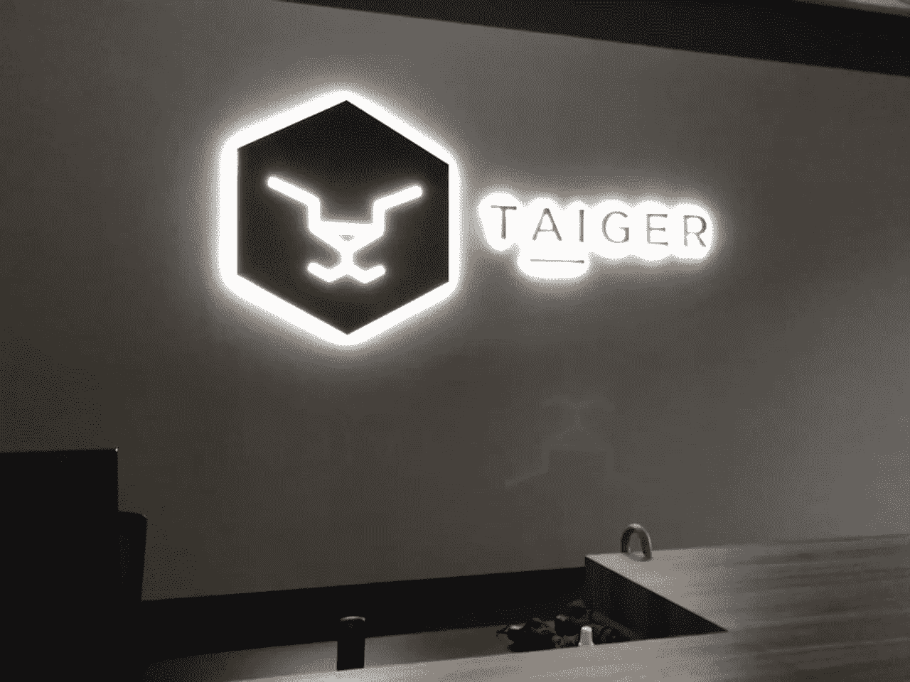
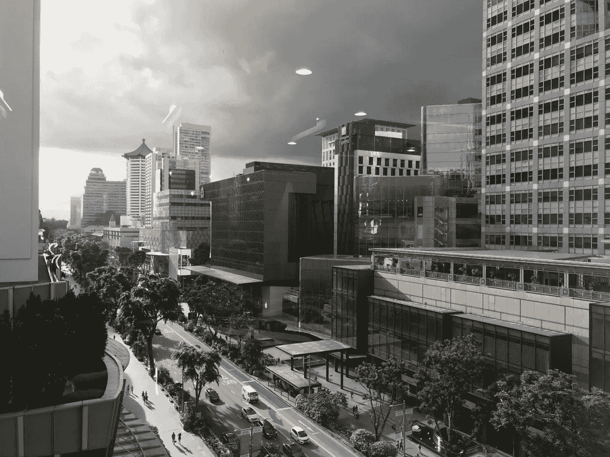

# 我作为后端实习生的实习经历

> 原文：<https://medium.com/codex/my-internship-experience-as-a-backend-intern-715a6f9c4794?source=collection_archive---------11----------------------->

去年五月，在我的暑假里，我一头扎进了后端工程师的实习中，这是一次新鲜的经历，我希望能反思和记录下来，并与你分享。为了与你分享更多关于我的角色，我作为后台实习生在泰格的一个核心产品中帮忙， [Search](https://taiger.com/products/omnitive-search/) ，这是一个面向组织的语义搜索引擎。

在实习之前，我的主要目标之一是了解 B2B 公司的运营方式，碰巧我有机会支持一个面向客户的项目。这让我对如何管理与客户的关系以及每个人如何在维护这种关系中发挥关键作用大开眼界，包括我们开发人员，不管我们是直接还是间接与客户沟通。我也意识到了整个团队的重要性，包括开发人员、测试人员和销售经理，以确保项目成功交付给客户。参与这整个过程让我想起了我们每个人年轻时都会遇到的一句话。

> *团队合作让梦想成真*

像大多数其他实习生一样，我在实习期间学到了更多关于构建产品的各种技术。我仍然清楚地记得我实习的第一天，试图在本地建立开发环境。老实说，我还没碰到过一半以上使用的工具，并且被我一天内学到的大量新术语所淹没。在第一个月的实习后，我认为我已经熟悉了代码库和产品，因此能够更好地做出贡献。然而，就在那时，我意识到每项任务都是一个新的挑战，甚至可能涉及到新的工具。就在那时，我发现适应能力强和快速学习新事物是软件工程师的关键素质。新的任务可能不总是建立在我们现有的技术之上，可能需要我们使用新的工具来完成任务。例如，甚至在我实习的最后一周，我被要求了解更多关于[开放网络应用安全项目(OWASP)](https://owasp.org/) 对我们产品的需求，而在这个任务之前我对此一无所知。学习从未停止。

从更技术性的角度来说，我在实习期间观察到的一个关键现象是维护不同环境的必要性，比如开发、测试和生产环境。在做副业项目时，为了节省时间，我们很少注意建立一个以上的环境，也因为这是更短期的。然而，如果我们计划做一些更稳定和长期的事情，为软件开发生命周期的不同阶段提供不同的环境是很重要的。确保所有这些环境尽可能相似也很重要。我在浏览任务时遇到了一些问题，这些问题可以追溯到我的本地设置和开发环境之间的差异。因此，我认识到确保这些环境以相似的方式构建是非常重要的。

当然，把所有严肃的事情放在一边，整个实习期间有许多愉快的时刻。就在当地政府允许更多人重返工作岗位后，我开始了实习。怀着激动的心情，我开始了实习，接下来的一周，由于环境的变化，默认情况下，工作模式又变回了远程模式。一开始，我对这种变化感到失望，因为我会想念在办公室与同事互动的时光，以及可以盯着办公室看几个小时的迷人景色。

这只是其中一个观点…

然而，我意识到，如果我们选择这样做，我们仍然可以保持这种乐趣。我很高兴认识了一群支持我的实习生，并和他们一起工作，他们每周都会聚在一起吃(虚拟)午餐和玩游戏。这无疑让这段遥远的旅程不那么孤独了。

总之，这绝对是一个收获颇丰的夏天，学到了很多新东西，也交到了新朋友。我很感激有这个机会深入了解一个产品，理解它，并实现改进以及对实际用户产生影响的功能。毫无疑问，如果没有我鼓励的导师和团队中的全职员工，这次实习不会如此丰富和难忘。

感谢你的阅读，希望你喜欢看我的夏天。你的怎么样？