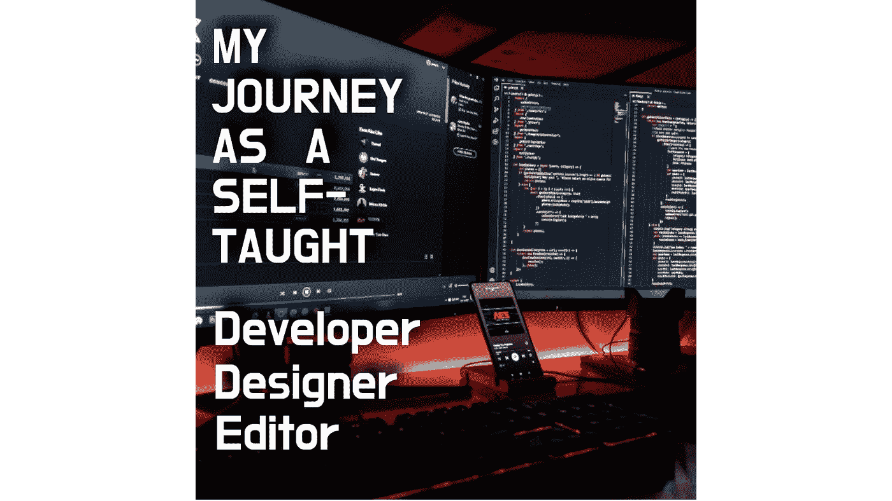

# 我作为自学成才的开发人员的旅程和我学到的…

> 原文：<https://medium.com/codex/my-journey-as-a-self-taught-developer-and-what-i-learnt-97113c49c8ba?source=collection_archive---------3----------------------->

## 澄清一下，为了考上计算机科学大学，我的大学仍然教我化学

我们的粉丝数量刚刚达到 1000 人(在大约 3-4 个月内！)…这对我来说是一个巨大的里程碑。为了表示感谢，我决定分享一些没人知道的事情。我学习开发、设计和编辑的“非正常”旅程。

背景图片由 [Unsplash](https://unsplash.com?utm_source=medium&utm_medium=referral) 上的 [Fotis Fotopoulos](https://unsplash.com/@ffstop?utm_source=medium&utm_medium=referral) 拍摄。当然，我的设置更蠢。

我的意思是…即使是现在，当我写这篇文章的时候，我才 17 岁，可能是和所有读这篇文章的人相比最没有经验的人。这就是为什么我从来没有写一篇关于这次经历的文章或类似的东西。我认为自己是一个有 5 年工作经验的中级人员。哦…是的…只是一个小小的忏悔。

*这篇文章既不会有吸引人的图片，也不会有 YouTube 视频。只有我写，文章和你读…*

这一切都始于我六年级的时候。我 9 岁的时候有了一台电脑。没什么特别的，2 GB 内存和 Windows 7。就像其他人一样，我开始玩游戏。不…我没有玩 CS: GO 或者 Valorant。我玩过更愚蠢的游戏，比如……嗯……微软国际象棋、地雷等等，当然，我都输了。

如果你看看 10 年版的我，你会发现最内向，“不敢说话”的那种人。我还在努力，但是…不管怎样，我讨厌计算机科学。第一个原因是，我在 10 岁之前从来没有真正操作过电脑，第二个原因是，教育系统太过苛刻和理论化，让电脑远离了所有的乐趣。

没有任何知识(或兴趣),我只是谷歌“最好的软件”或类似的东西…是的…我当时很奇怪。

我这样做的唯一原因是…嗯…只是为了“玩”我的新二手电脑。在浏览了一些网站后，我得到的是无畏。就是这个。从这里开始了旅程，它从未结束，也可能永远不会结束。

# 10

那时我安装了 audacity，对于那些不知道的人来说，它是一个“用于创建、修改和编辑音频的开源音频编辑器”。

> 你知道你写的程序有一个意想不到的错误……修改程序并看到它在屏幕上工作，这就是快乐(至少对我来说)。不要一步一步写在考卷上，记住考卷上不必要的语句。更不用说，你不能在考试中创建 3d 模型，开发应用程序或创建数字艺术。

我从计算机的一些实际应用开始，而学校的教科书有一个计算机历史的上下文，要求我们记住(旧计算机的)日期，反正我们会忘记。

我只是喜欢它。就在这个时候，我意识到我犯了一个错误，那就是依赖教育系统来了解这门学科是如何运作的。一两个月后，我开始挑战极限。我开始使用 Blender，一个用于创建任何与 3d 图形相关的软件。在前 6 个月结束时，我已经能够使用 GIMP、Blender 和 Audacity 了。

# 11

在暑假期间，是时候让每个人都意识到，计算机将是我的未来(我当时还没有开发)。这是我得到新电脑的时候。更好的 4 GB ram(我知道)惠普电脑，Windows 8.1。这…是我开始做一些视频剪辑的时候。不使用达芬奇解决或任何“专业流行”的，但使用 Kdenlive，因为这是我唯一能负担得起的考虑到我没有达芬奇的 Nvidia 显卡或 Premiere Pro 的钱。

这是我开始编辑本地博客、为 TurboSquid/Free3d 制作动画、创建 NFT 等等的时候。你认为之后发生了什么？我没有删除所有的东西……我有吗？

# 12–13

我删除网上所有东西的时候是 12 岁。我完全不在网上了。从脸书到我的 NFTs 到我的谷歌账户本身。你可能会问为什么…

如果你来自印度，你可能知道这一点。“兼职”这个词在这里的意思完全不同。在这里，我们完成了所有的教育/硕士/博士/无论什么，然后才迈出“工作”的第一步。或者至少，对我来说是这样。我的 photoshop 技能只得了差不多 0.5 以太币，却没有被接受。这是有争议的。也许在 12 岁发布 NFT 真的有点太多了。也许真的是我的错。我将把它留给你。

我唯一的社交媒体平台是 Whatsapp(当然还有像 YouTube 这样的东西)。我在网上的形象逐渐消失了。如果你想知道，这是否和我现在的用户名有关，是的…有关系。别担心。我不会改变的。

不管怎么说，这是我想把更多的注意力放在学习上，忽略正在发生的事情，继续学习的时候。

这是当我被介绍给……等等……编程。我在 blender 中遇到了这个错误，它说 pip 需要继续，因此引发了 python 的好奇心。

到 12 年末，我已经能够掌握一些 python 及其基础知识。一旦做到这一点，就很容易去学习其他语言，如 JavaScript、HTML、CSS 和 C#，到 13 年结束时，我已经熟悉了 Angular、QT、ElectronJS 等框架和 Unity 和 Godot 等游戏引擎。

# 14

这是当人们开始认识到我的工作。我被任命为学校的编辑，这进一步给了我编辑、管理和写博客的良好经验。是的…当我写这篇文章的时候，写博客的部分甚至在今天还在帮助我。但随之而来的一个警告是关注，这…我不是一个大风扇。

有了这一切，我终于能够展示我的技能真的奏效了。那时我创建了另一个谷歌账户，这一次是一个商业账户，名为 FadinGeek，当你用谷歌搜索时，它会引导你看到一切。

也是在这段时间，我学习了 flutter，一个基于 dart 的框架。并开始学习汇编(还在学习汇编)。这是我变得更专业的时候，但事情很小，比如为我的学费学院设计和开发一个网站，并且开始构建我的第一个商业游戏，这是一个彻底的失败，老实说，它是用一个叫 coppercube 的游戏引擎制作的，它是一个不太受欢迎的 JavaScript 引擎。

考虑到我几乎没有投资，我试着在 Reddit 和 quora 上做自我广告，但老实说，这是我唯一能做的…即使是现在。

也是在这个时候，我开始学习 Figma，和 XD 的 UI/UX 设计。这也让我在 Envato 中创建了一些模板。

# 15–16

这是我继续学习和开发更多产品的时候，我开始了我的 unity 资产，[我的 YouTube 频道](https://www.youtube.com/channel/UCAEEOplNQDzc1bmrGqDPnyw)

(虽然我直到 17 岁才上传视频)，最后是 Medium(16 年底开始 Medium，快 17 了)。

我发表了我的第一个 unity 资产，它做得很好，令人惊讶的好，获得了 5 星评价，考虑到最终投资实际上是 0 美元。同样的还有 [YouTube](https://www.youtube.com/channel/UCAEEOplNQDzc1bmrGqDPnyw) ，Medium，就在最近甚至还有 [OpenSea](https://opensea.io/fadingeek) 。

顺便说一句，如果你只是好奇，我也终于得到了一台 pc(legion)，它肯定不是 4GB ram(它是 16 ),对我所做的工作来说相当强大。

# 17 岁至今

如果你一直读到这里，谢谢你…这对我真的很重要。我的目标是写更多的文章，制作更多的 YouTube 视频，与新的人交流，免费提供东西，也希望得到一个好成绩。如果你想问我什么，你可以通过 [Twitter](https://twitter.com/fadingeek) 或 [insta](https://www.instagram.com/fadingeek/) 联系我，我会尽力回答所有问题。我真的想建立一个由非常棒的人组成的社区

现在，我正在读大学预科，在那里，我…当然选择了计算机科学，它结合了其他学科，如化学、物理、数学、英语和一种地方语言。为了进入我想要的下一所大学，我需要参加几场考试，都是化学、数学和物理(没有计算机！)即使你的主流是计算机科学…

> 所以…我现在在这里，学习化学以便进入计算机领域。这是我作为开发人员、设计师和编辑的漫长而不寻常的旅程。

***你……太牛了！***

> 法丁吉克