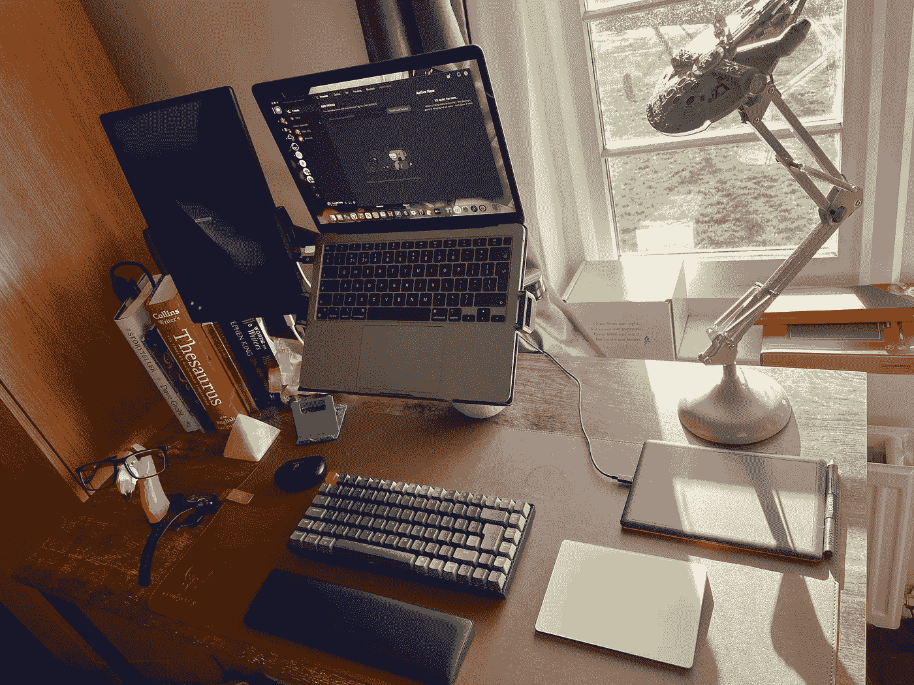

# 我最新的在家工作更新

> 原文：<https://medium.com/codex/my-latest-work-from-home-update-6969e1e42663?source=collection_archive---------19----------------------->

## 为什么我放弃了鼠标，选择了触控板

我最近决定我需要升级我的 WFH(在家工作)游戏。我一直在办公桌前/沙发上工作，我的背部和工作效率都受到了打击。

我添加了一些可以在这里看到的项目。