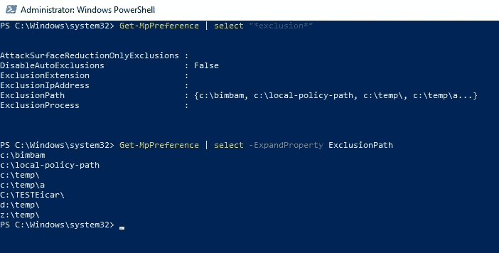
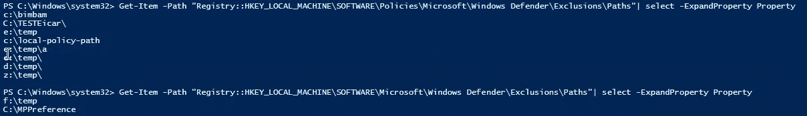
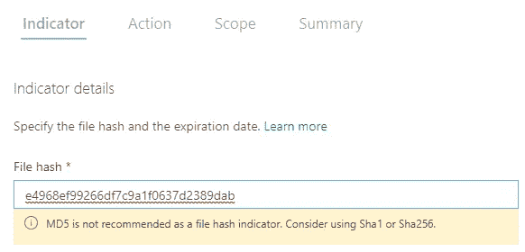
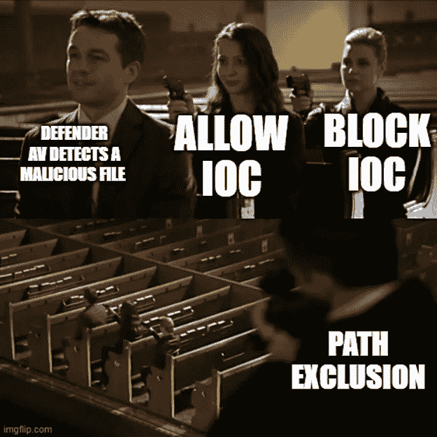
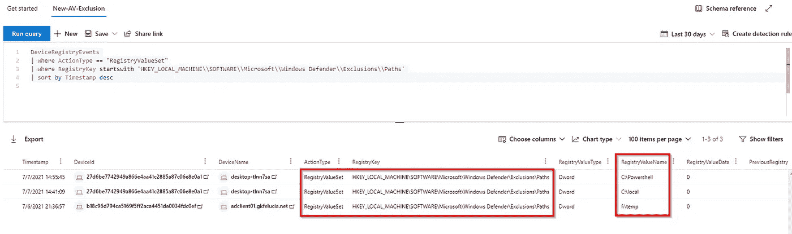
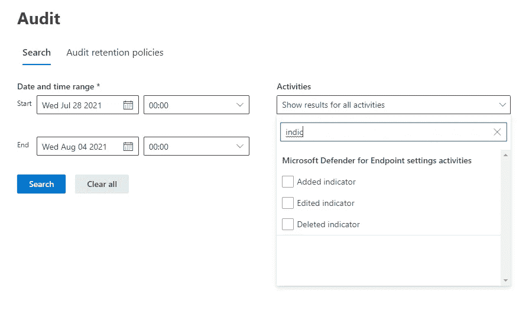
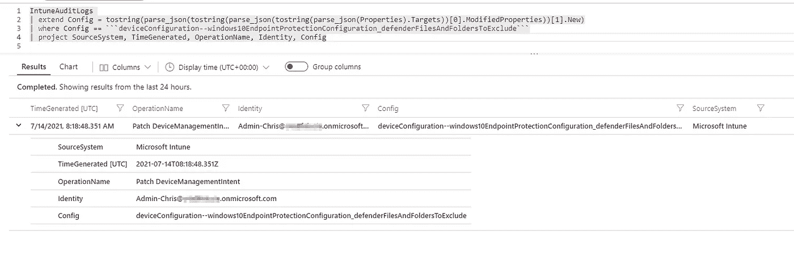
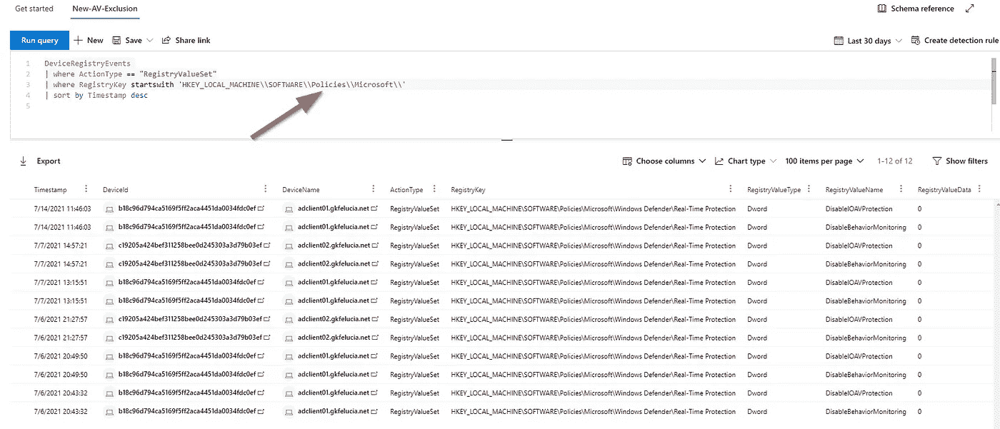

# 我对 Microsoft Defender for Endpoint 和 Exclusions 的了解

> 原文：<https://medium.com/codex/my-learnings-on-microsoft-defender-for-endpoint-and-exclusions-ddacf2fdd047?source=collection_archive---------0----------------------->

Ashkan Forouzani 在 [Unsplash](https://unsplash.com?utm_source=medium&utm_medium=referral) 上的照片

近年来，每当我不得不处理反病毒解决方案时，排除的话题总会在某个时候出现。通常，人们总是很快达成一致，即处理排除条款的最佳方式是不使用它们😉。尽管如此，我只遇到过少数没有排除的公司，并且当切换到新的解决方案时，不迁移它们总是被认为是项目风险。

> 明确地说，我的建议是利用一切机会消除(旧的)异常，不要迁移任何尚未被证明会给新解决方案带来问题的东西。

然而，了解你的敌人并有一个计划以防你被迫使用排除法总是好的。因此，在这篇博客中，我将尝试展示哪些除外责任，它们会带来哪些风险，以及如何以一种实用的方式实施它们。

# 什么是排除，为什么我应该关心？

诸如微软 Defender AV (MDAV)之类的病毒扫描器的工作就是检测恶意软件并使其失效。由于 Windows 的普及，这个问题自 90 年代以来一直存在。虽然在开始时，人们非常关注已知恶意软件的特征/模式，但这个主题最近变得越来越不重要，因为这些病毒已经变异了一段时间(就像真正的病毒一样)，并且比供应商更新其特征的速度快得多。现代解决方案，如 Microsoft Defender for Endpoint(Defender AV 是其中的一部分)，除了签名检测之外，还具有广泛的检测方法，并依赖机器学习和行为监控方法进行检测。

MDAV 的恶意软件检测可以通过各种机制来执行。除了各种预设或按需扫描(快速、完全、自定义)之外，实时防护也处于活动状态。实时保护[在打开和关闭文件时，以及每当用户导航到一个文件夹](https://docs.microsoft.com/en-us/microsoft-365/security/defender-endpoint/run-scan-microsoft-defender-antivirus?view=o365-worldwide)时，都会检查文件。

像任何其他反病毒解决方案一样，当然可以在 MDAV 中为文件、文件夹、进程和进程打开的文件创建(经典)排除。这些信息存储在端点上的注册表中，GPO 的排除信息可以通过 Powershell 轻松显示。

排除可防止 Defender 在扫描期间和实时防护中将相应的文件或进程检测为恶意软件，并防止启动对策(如隔离)。

## 既然这种行为一开始就相当糟糕，那么问题就来了:为什么排斥会存在？

不幸的是，许多制造商都有一个排除列表，这些列表是软件工作所必需的或 T2 推荐的。由于每个管理员都记得反病毒代理有点过于雄心勃勃的情况，这是一个非常困难的讨论。这里有几个必需排除的例子: [SCCM](https://docs.microsoft.com/en-us/troubleshoot/mem/configmgr/recommended-antivirus-exclusions) ， [VEEAM](https://www.veeam.com/kb1999) ， [Exchange](https://docs.microsoft.com/en-us/exchange/antispam-and-antimalware/windows-antivirus-software?view=exchserver-2019) ， [Kaseya](https://helpdesk.kaseya.com/hc/en-gb/articles/229014948-Anti-Virus-and-Firewall-Exclusions-and-Trusted-Apps) ，[MS SQL](https://support.microsoft.com/en-us/topic/how-to-choose-antivirus-software-to-run-on-computers-that-are-running-sql-server-feda079b-3e24-186b-945a-3051f6f3a95b)——微软甚至有一个[的排除列表](https://social.technet.microsoft.com/wiki/contents/articles/953.microsoft-anti-virus-exclusion-list.aspx)😂

## 好吧，这似乎是有原因的——排斥的具体问题是什么？

每一个排除都会削弱我们的防御，攻击者知道、能猜到或读到的每一个弱点都会给他提供一个好机会。例如，如果我知道软件分发路径在所有系统上都被排除了，那么这是一个放置我攻击的下一步工具并从那里运行它们的好地方。

> 我们的任务是挑战任何系统上任何排除的必要性，从而减少它。

# Microsoft Defender for Endpoint 中提供了哪些类型的排除？

在我们开始了解不同类型的排除之前，有必要了解 MDAV 是 Microsoft Defender for Endpoint(MDE)的一部分，但也可以单独使用。就排除而言，这意味着存在局限于 MDAV 的方法和覆盖整个套件的方法。

> 我强烈推荐使用 MDE，因为这极大地增强了保护并支持这里描述的各种特性。不幸的是，仅仅一个病毒扫描程序——即使它非常好——在今天已经不够了。

## Defender Antivirus 中的排除

在 MDAV 中，有以下类型的排除:

*   [基于文件名、扩展名和文件夹位置的排除](https://docs.microsoft.com/en-us/microsoft-365/security/defender-endpoint/configure-extension-file-exclusions-microsoft-defender-antivirus?view=o365-worldwide)
*   [排除进程打开的文件](https://docs.microsoft.com/en-us/microsoft-365/security/defender-endpoint/configure-process-opened-file-exclusions-microsoft-defender-antivirus?view=o365-worldwide)

这些排除可以通过几种方式进行管理。除了后面描述的工具(如 Intune)之外，还有以下本地选项:

*   创建本地策略
*   使用 Windows 安全 GUI
*   带有 CMDlet Add-MpPreference 的 Powershell

显示所有排除项的最简单方法是 CMDlet Get-MpPreference(但是要阅读排除项，您需要是本地管理员)。

由于这些排除项也存储在端点上的注册表中，因此也可以通过 Powershell 读取相应的密钥来显示它们:

> 有趣的是，本地 hive 中的密钥在 Windows 11 系统上已经无法读取。我认为这是微软的一项强化措施。

如果你在使用**流程排除**，在我看来，这几点非常值得注意:

*   [当您将进程添加到进程排除列表时，Microsoft Defender Antivirus 不会扫描由该进程打开的文件，无论这些文件位于何处。但是，进程本身将被扫描，除非它也被添加到文件例外列表中。](https://docs.microsoft.com/en-us/microsoft-365/security/defender-endpoint/configure-process-opened-file-exclusions-microsoft-defender-antivirus?view=o365-worldwide#:~:text=When%20you%20add%20a%20process,to%20the%20file%20exclusion%20list)
*   排除仅适用于[始终在线实时保护和监控](https://docs.microsoft.com/en-us/microsoft-365/security/defender-endpoint/configure-real-time-protection-microsoft-defender-antivirus?view=o365-worldwide)。它们不适用于计划扫描或按需扫描。

## Defender Antivirus 中的自动排除

除了管理员配置的例外情况之外，自动排除仍然适用于(2016/2019)服务器 ***，具体取决于服务器*** 的角色(如果未禁用)。例如，对于域控制器，NTDS 数据库、事务日志文件、NTDS 工作文件夹和支持文件的例外是活动的。

这方面的一些注意事项(有用的功能):

*   这些排除未显示在上述列表中
*   它们仅适用于实时保护，不适用于计划扫描或按需扫描
*   自动排除功能仅适用于服务器角色的默认安装位置
*   更多信息请点击:
    [在 Windows 服务器上配置 Microsoft Defender 防病毒排除| Microsoft Docs](https://docs.microsoft.com/en-us/microsoft-365/security/defender-endpoint/configure-server-exclusions-microsoft-defender-antivirus?view=o365-worldwide)

## MDE 其他部分的除外条款

除了反病毒还有其他几个组件可以阻止文件和文件中的功能的执行。它们都有一个共同点，即可以通过自定义指示器加入白名单。

*   [端点检测和响应(EDR)](https://docs.microsoft.com/en-us/microsoft-365/security/defender-endpoint/overview-endpoint-detection-response)
*   [攻击面减少(ASR)规则](https://docs.microsoft.com/en-us/microsoft-365/security/defender-endpoint/attack-surface-reduction) —参见 t [他关于 ASR 的伟大博客](https://docs.microsoft.com/en-us/microsoft-365/security/defender-endpoint/enable-attack-surface-reduction?view=o365-worldwide#exclude-files-and-folders-from-asr-rules https://techcommunity.microsoft.com/t5/microsoft-defender-for-endpoint/demystifying-attack-surface-reduction-rules-part-2/ba-p/1326565)。
*   [受控文件夹访问](https://docs.microsoft.com/en-us/microsoft-365/security/defender-endpoint/controlled-folders)

## 自定义指示器

Microsoft Defender for Endpoint 在[自定义指示器](https://docs.microsoft.com/en-us/microsoft-365/security/defender-endpoint/manage-indicators?view=o365-worldwide)部分提供了对[危害指示器(IoCs)](https://www.sans.org/reading-room/whitepapers/forensics/ioc-indicators-compromise-malware-forensics-34200) 的集中管理。IOC 实际上旨在检测已知的恶意模式，并阻止它们，例如通过 MDE 之类的安全产品。

除了警报和警报+阻止操作，自定义指示器部分还包括允许操作，可用于白名单。文件的白名单不是通过路径或文件名而是通过散列来完成的。除了文件，还可以为 IPs & URLs 和证书创建条目。

文件哈希可以在 MD5、SHA-1 或 SHA-256 中创建。尽管这些算法中的每一个都比文件名或文件夹名安全得多，但还是应该使用 SHA-256 散列，因为由于散列的长度(32 位)的缘故[发生冲突的可能性大大降低](https://www.avira.com/en/blog/md5-the-broken-algorithm)。如果您使用 GUI，在输入 MD5 哈希时也会收到警告:

到目前为止，我还没有能够读出在系统上有效的自定义指示器——这将故意碰撞的可能性降低到几乎为零。

自定义指示器的创建可以通过 GUI 或通过 [API](https://docs.microsoft.com/en-us/microsoft-365/security/defender-endpoint/post-ti-indicator?view=o365-worldwide) 使用*主动补救动作许可*来完成。通过使用 API，该流程还可以很好地嵌入到票证、文档和发布等流程中。

# 管理排除的最佳工具是什么？

选择合适的工具在很大程度上取决于具体情况，并且具有战略性。
的意思是:如果我现在有一个工具来管理我的客户的配置，我一方面会试着用它来管理排除。另一方面，我不能用所有的工具(同样好地)管理所有的排除，这可能是改变策略的原因(也许已经过期了)。

*   在 **MDE 门户**中，只有定制的指示器，即散列，可以被排除——并且只有在那里。因为自定义指示器是(几乎总是)首选的白名单变体，所以这个门户在任何情况下都是固定的。
*   **Intune** 可以设置除哈希/自定义指标以外的所有排除项。不幸的是， [Intune 似乎不能组合排除列表](https://microsoftintune.uservoice.com/forums/291681-ideas/suggestions/40594768-merge-windows-defender-antivirus-exclusions-from-m)，这在大型异构环境中可能是一个挑战。
*   **GPO**还可以用于配置除哈希/自定义指示器之外的所有排除项——GPO 甚至可以在这里组合多个列表。然而，对于客户来说，应该记住通过 VPN 分发计算机策略并不理想——但是今天大多数这样做的人可能已经知道了这一点；-)
*   有了 **SCCM** ，可以很好地管理 AV 排除。然而，对于 ASR 排除，目前仍然存在不支持通配符的限制，这严重限制了可用性。
*   最后但同样重要的是，所有能够操作注册表值的**工具和脚本**也可以用来管理除定制指示器之外的一切。

# 处理排除的最好方法是什么？

如您所见，有几种方法可以将文件列入白名单和阻止文件，这带来了一些挑战，尤其是在较大的环境中。处理文件排除的一种策略可能如下所示:

## #1:避免排除

这意味着我们不希望排除。我们不想迁移新的排除，也不想迁移现有的排除。每一项排除都必须有充分的理由。

## #2:尽可能使用自定义指示器(散列)!

如上所述，配置项有几个优点:

*   它们要安全得多，因为碰撞的可能性很小。
*   创作可以很容易地通过操作手册整合到流程中。
*   管理是在安全中心完成的，而不是在配置管理中。

## #3:使用正确的(经典的)排除类型，避免常见错误

如果哈希不可行，请按照以下顺序进行传统排除:

*   处理
*   (完整)路径
*   扩展ˌ扩张

> 使用这种排除是你要避免的，因为它们可能会被滥用。不难猜出哪些文件夹被排除在外，并且很容易检查。

**在创建排除项**之前，您应该查看以下两个来源:

*   [定义除外责任的建议](https://docs.microsoft.com/en-us/microsoft-365/security/defender-endpoint/configure-exclusions-microsoft-defender-antivirus?view=o365-worldwide#recommendations-for-defining-exclusions)
*   [定义除外责任时要避免的常见错误](https://docs.microsoft.com/en-us/microsoft-365/security/defender-endpoint/common-exclusion-mistakes-microsoft-defender-antivirus?view=o365-worldwide)

除了不得排除的位置列表之外，其他典型错误也包括在内，例如在排除中使用没有文件夹的文件名或正确使用环境变量。

## #4:让自己熟悉排除的范围

我认为自定义指标不需要进行范围界定，因为风险非常容易管理，而且付出的努力不成比例。(实现这一点的方法是 MDE 中的设备组)。

对于典型的排除，建议稍微区分一下，找到一个好的折衷方案。这看起来服务器通常明显不同于客户端，因为客户端明显更加同质。尽管服务器通常在 GPO 中对每种服务器类型进行处理，但是客户端通常会尝试使用非常统一的策略。

但是，根据结构的不同，维护多个列表并根据需要组合它们以减少管理工作仍然是有意义的。实际的例子是，如果只有某个用户组使用某个软件，然后您为这些客户端使用两个列表的组合(GPO 和 SCCM 可以做到这一点)。为了找到一个好的折中方案，稍微计划一下是值得的。

## #5:监控和检查你的 Exlusions

在任何环境中，排除都会随着时间的推移而累积，处理这两个问题非常重要:

1.  我如何防止和检查排除条款是否有(非法)变更？
2.  如何以及何时检查库存，如何减少库存？

对于问题 1，请查看下面的监控部分。对于问题 2，你需要一个过程。

# 不同的机制是如何相互作用的？

## 如果我使用多种配置方法会怎么样？

默认情况下，本地更改将按照组策略、配置管理器或 Intune 与列表合并。当存在冲突时，组策略列表优先。您可以[配置如何合并本地和全局定义的排除列表](https://docs.microsoft.com/en-us/microsoft-365/security/defender-endpoint/configure-local-policy-overrides-microsoft-defender-antivirus?view=o365-worldwide#merge-lists)，以允许本地更改覆盖托管部署设置。([来源](https://docs.microsoft.com/en-us/microsoft-365/security/defender-endpoint/configure-extension-file-exclusions-microsoft-defender-antivirus?view=o365-worldwide)

我认为禁用合并通常是一件非常有用的事情。相应的设置可以通过 [GPO](https://docs.microsoft.com/en-us/microsoft-365/security/defender-endpoint/configure-local-policy-overrides-microsoft-defender-antivirus?view=o365-worldwide#configure-how-locally-and-globally-defined-threat-remediation-and-exclusions-lists-are-merged) 或通过 Intune 中带有[自定义策略](https://www.jeffgilb.com/custom-microsoft-intune-oma-uri-policy-ins-and-outs/)的 [Defender CSP](https://docs.microsoft.com/en-us/windows/client-management/mdm/defender-csp) 来启用。以这种方式设置的 [RegKey](https://admx.help/?Category=Windows_10_2016&Policy=Microsoft.Policies.WindowsDefender::DisableLocalAdminMerge) 现在可以确保本地添加的排除项被覆盖。

## 冲突中会发生什么？

[MS 文档](https://docs.microsoft.com/en-us/microsoft-365/security/defender-endpoint/indicator-file?view=o365-worldwide#policy-conflict-handling)是这样回答这个问题的:

*证书和文件 IoC 政策处理冲突将遵循以下顺序:*

*如果文件不被 Windows Defender 应用程序控制和 AppLocker 强制模式策略允许，则* ***阻止*** *否则如果文件被 Microsoft Defender 防病毒程序允许排除，则* ***允许*** *否则如果文件被阻止或警告文件 IoC， 然后* ***阻止/警告*** *否则如果文件被允许文件 IoC 策略允许，则* ***允许*** *否则如果文件被 ASR 规则、CFA、AV、SmartScreen 阻止，则* ***阻止*** *否则* ***允许***

简单来说，我的朋友法比安创造了这个奇妙的迷因！😍

# 我如何防止和检查排除条款是否有(非法)变更？

## 一般操作预防

在我们查看 AV 排除用例之前，我建议每个人查看一下这个博客以了解在 Defender AV 中一般可以操纵什么，以及如何最好地处理它。尝试防止对配置的操纵是合理的，尽管篡改保护对 AV 排除没有影响，但它的使用非常有用，因为它可以防止防御者的许多基本操纵。

最后，[为 Microsoft Defender AV 设置配置本地覆盖](https://docs.microsoft.com/en-us/microsoft-365/security/defender-endpoint/configure-local-policy-overrides-microsoft-defender-antivirus?view=o365-worldwide#configure-how-locally-and-globally-defined-threat-remediation-and-exclusions-lists-are-merged)可用于通过简单地禁用列表合并来防止本地排除的生成。这意味着只有 GPO 中的例外适用。

## 检测和防止本地排除

上述用于组合排除列表的行为对于确定范围非常有用。但是，这种行为也可能被攻击者利用。默认情况下，可以使用本地管理权限创建自己的本地排除，根据我的经验，许多公司中也有一些帐户有权编辑影响客户的 GPO。有足够的理由看看我们如何被告知变化。

第一种方法是通过自定义检测来查看 MDE 客户机。Alex [Verboon 已经发表了一些关于这个的好东西。](https://gist.github.com/alexverboon/f2f52279a8a38583bca0589fdf88f9d9)

因此，根据我的测试，可以确定以下场景:

*   创建本地策略
*   使用 Windows 安全 GUI
*   带有 CMDlet Add-MpPreference 的 Powershell

然而，除了为此提供的方法之外，我还可以尝试将我的排除项**作为键**直接放入注册表:

从理论上讲，这可以在配置单元*HKLM \软件\微软\Windows Defender\…* 和*HKLM \软件\政策\微软\Windows Defender\…* 中用不同的权限(管理员或系统)以几种方式完成

在我的测试中，我不能以 admin 或 SYSTEM 的身份更改非策略路径中的键，尽管 SYSTEM 是配置单元的所有者。我怀疑这是因为 Defender AV 阻止内核模式驱动程序更改注册表的这一部分。

在策略下的配置单元中，可以作为本地管理员创建进一步的排除(在一段时间或一次 gpupdate 后)将被应用。遗憾的是，对于通过这种方式或 GPO 所做的任何更改，都不会生成日志。

> 如果您在策略下创建配置单元并添加密钥，即使在未加入域的 Windows 10 设备上也能工作(重启后)。从我的角度来看，这是一个非常严重的问题，应该由 MS 来解决。如果你对这个漏洞究竟是如何被利用的感兴趣，请查看 Fabian Bader 的博客！

## 检测并防止从配置系统中排除

由于如上所述有许多配置方法，这不是一个完整的列表，但我将自己限制在我可以使用的工具上。

***在 MDE 中添加自定义指标***

如上所述，您需要*主动补救措施权限*来操作配置项。每个配置项都可以直接识别其创建时间和创建者。

不幸的是，在审计日志中还没有用于创建配置项的事件，但是因为已经有了过滤器，所以我乐观地认为很快就可以专门搜索它们或者对它们发出警报。

***在 Intune*** 中添加排除项

当然，也可以用 Intune 添加更多的排除项。这些可以由(至少)以下角色创建:

*   **在 Intune:** *端点安全管理器和自定义角色*
*   **在 AAD 中:** *全局管理员、Intune 管理员、安全管理员*

这些更改包含在 Intune 审计日志中，如果需要，可以[查询](https://github.com/crmhh/stuff/blob/main/NewMDAVExclusionbyInune.kql)相应地发出警报。

***通过 GPO* 添加排除项**

最后，有可能通过 GPO 添加排除。通过上述用于合并列表的行为，可以为作用于系统的每个现有或新的 GPO 添加额外的排除。

不幸的是，无论是 GPO 的修改还是配置的系统都没有指示已经添加了排除的事件。您只会看到 GPO 已被修改或应用。要确定这种变化，目前只有定期的导出和比较会有所帮助。

再深入一点，看看高级狩猎:

在来自*HKLM \软件\策略\微软\* 策略配置单元的 DeviceRegistry 事件表中有一些条目甚至包含对 *Windows Defender* 项的更改，但是不包含来自排除配置单元的任何内容。

# 结论

在这篇博客中，我尝试总结了我在 Defender for Endpoint 中关于排除的知识。我们首先看了有哪些类型的排除以及如何管理它们，包括使用哪些排除的策略。然后，我们更深入地探讨了排除机制，冲突发生时会发生什么，以及有哪些范围选择。最后一部分讨论了风险、强化和监控。

我担心这个主题将继续相关，并希望我忽略了一些东西，特别是在硬化和监控方面。很明显，拥有管理员权限的攻击者很难被阻止，但是他可以创建不可见的排除，从而创建一个空间来重新加载所有必要的工具，这使得情况变得更加困难。

对我来说，关键的部分是制定一个现实的策略来处理排斥:

> #1:避免排除
> 
> #2:尽可能使用自定义指示器(散列)!
> 
> #3:使用正确的(经典的)排除类型，避免常见错误
> 
> #4:让自己熟悉排除的范围
> 
> #5:监控和检查你的 Exlusions

你处理 exlusions 的策略是什么？联系我:[https://twitter.com/cbrhh](https://twitter.com/cbrhh)

# 承认

感谢[法比安·巴德](https://twitter.com/fabian_bader?s=20)和[纳丁·克恩](https://twitter.com/nadineausRT?s=20)对所有材料的审查和检查。💖别忘了阅读[法比安的博客](https://cloudbrothers.info/)！

## 更多来源:

 [## 如何用 MDATP、微软 Defender Antivirus、System…

### 免责声明:我在这个网站上发表的观点是我的&仅仅是我的&不一定反映…

yongrhee.wordpress.com](https://yongrhee.wordpress.com/2020/07/29/how-to-take-care-of-false-positives-fps-with-mdatp-microsoft-defender-antivirus-system-center-endpoint-protection/)  [## 微软后卫 ATP 妥协指标国际奥委会解释

### 国际奥委会大多数组织没有意识到他们受到了攻击，直到…

www.linkedin.com](https://www.linkedin.com/pulse/microsoft-defender-atp-indicators-compromise-ioc-ahmed/)