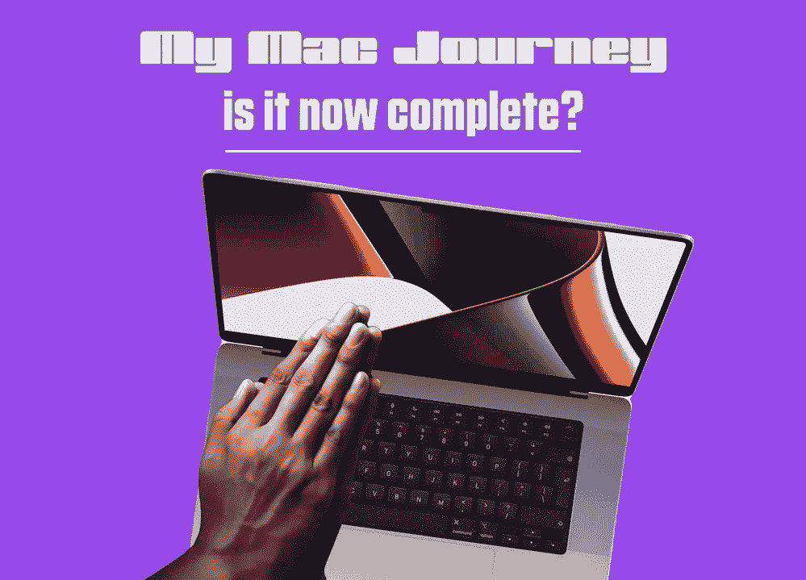
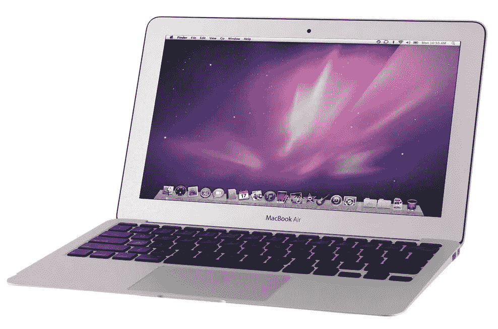
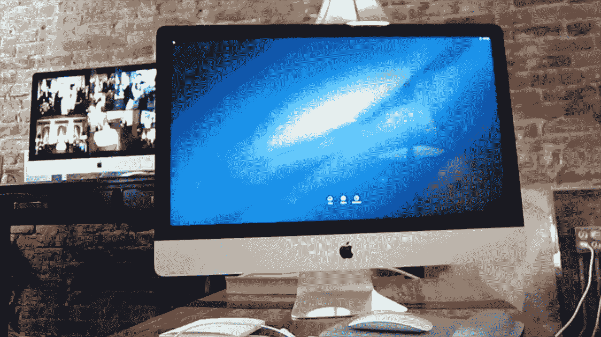
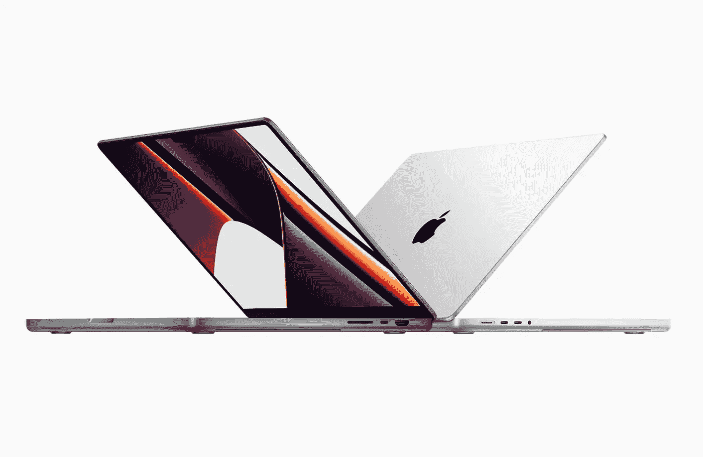
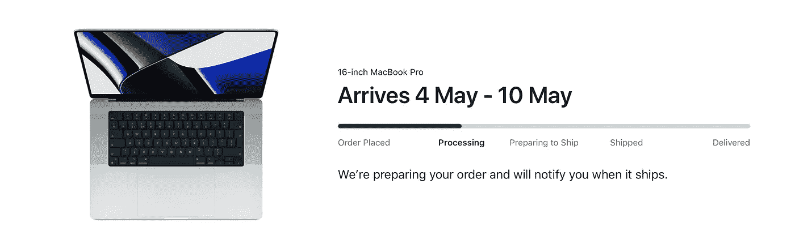

# 我的 Mac 奥德赛

> 原文：<https://medium.com/codex/my-mac-odyssey-79c344139c11?source=collection_archive---------9----------------------->

## 从 PC 到 Mac 的旅程

***在接下来的七天内，我的 Mac 世界和设置都会发生变化。我会认为自己很幸运，因为我的新 16 英寸 Max MacBook Pro 将在未来几天内与我一起登陆。我确信，将来某个时候我会再买一台 Mac，但现在，12 年的旅程已经结束。这似乎是一个很好的点来回顾我为什么改变摆在首位，我已经拥有的苹果电脑，以及我对这个即将到来的希望，苹果硅 MBP。***

负十六播客

## 那些遥远的个人电脑时代

苹果电脑桌面

有趣的是，我从来都不是一个电脑迷！我被迫在学校学习计算机科学，但我讨厌它，考试不及格！我直到 35 岁左右才拥有一台电脑，我似乎记得那是一台索尼笔记本电脑，因为我家门口就有一家索尼商店。一瘸一拐地走了一段时间，然后我进入了台式电脑的世界。那时，我拥有一家印刷设计公司。那时我已经离开了出版社，开始经营公司。所以，我的日常工作仅仅是在办公室完成的。即便如此，我仍记得 Windows 电脑的更新慢得令人痛苦。我还记得一种叫做“去碎片化”的东西。这是我的想象还是真的？我有一台配有双显示器的塔式电脑，大约就在那时，我开始注意到 MAC 电脑。

当我在印刷*和*设计世界的时候，这意味着我经常在创意工作室，被这些华丽的机器包围着。他们似乎更有创造力，更安静，也更敏捷。以及他们在上面做的工作吸引了我。内心的书呆子已经诞生了。苹果机即将进入我的生活。

 [## 所以，我想我终于明白了！

### 那就是苹果电视，这也是我为什么要加入的原因

medium.com](/codex/so-i-think-ive-finally-got-it-616359b03673) 

## **开始**

我的第一台台式 iMac

我提到的那个内在书呆子，很快就突出来了，我做的第一件事就是下载 Mac 屏保，并把它们放在我的电脑显示器上。我知道，我知道…我自己现在也在笑，但不知何故，这让我*认为*我在 Mac 电脑上工作！仍然在办公室工作，我的需求真的不需要 Mac，但我内心有一个声音，只想成为那个世界的一部分。所以，我的第一台*实际的* Mac 是 2010 年的 21.5 英寸 iMac。哦，天啊，我恋爱了。不知何故，我立刻明白了一切。操作系统，手势，鼠标。我实际上很期待使用它，直到今天仍然如此。我不得不在上面运行一台虚拟 PC，因为我用来运行业务的两个程序都是纯 PC，这是在一切都变成基于云或网络之前的日子。Mac 奥德赛开始了。

## 周末的小礼物，先生

我的 MacBook Air

所以，现在我认为自己是一个 Mac 用户，我最好像一个 Mac 用户一样开始创作！因此，Adobe 的 Creative Cloud suite 成了我最好的朋友，我开始使用 InDesign、Photoshop 和一些 Illustrator。所有这些都是在最初 21.5 英寸 iMac 上拍摄的。但我想在周末买点东西。所以，2012 年的 MacBook Air 是我的第一台笔记本电脑。它的锥形设计和视网膜屏幕让人感觉很棒，看起来也很惊艳。然而，这种喜悦很快就破灭了。回家后，我意识到内部固态硬盘对我的音乐库来说太小了。幸运的是，店里的人都很棒。他们给我整理了一个外部驱动器，我的图书馆就在那里。我又成了一只快乐的兔子。那就是两台苹果机了！事实证明，这仅仅是开始。

 [## 维修权利成为现实，iOS 16 新闻&更多关于 iPhone 14

### 苹果视图回合-2022 年 4 月 25 日至 4 月 29 日

medium.com](/codex/right-to-repair-gets-real-ios-16-news-more-on-iphone-14-6fee2039d7bc) 

## 对速度的需求

令人惊叹的 27 英寸 iMac

那台 21.5 英寸的 iMac 对我很有用(实际上，我现在还在收藏)。它让我习惯了 macOS 和创造性的云应用程序。我现在定期进行艺术工作，随着文件变得越来越大，图层越来越密集，我的 Mac 开始挣扎。下一个目标是 iMac，我现在还在跑。如果你看过我的[视频，](https://www.youtube.com/c/DavidLewistalkingtechandaudio)你会看到我的骄傲&喜悦。自 2015 年以来一直伴随我的 27 英寸 iMac。它已经竭尽全力了，真的。我太喜欢那台机器了。在这 7 年里，它见证了我创建设计公司，开始广播生涯，播客，博客，最后，在 YouTube 上建立了自己的形象。它一直是我的日常司机，*从未让我失望。老实说，只是因为我现在编辑视频，这意味着它的日子屈指可数。虽然这台机器的规格很好，但它从来没有打算成为一个视频钻机，所以它在诚实方面做得非常好。*

在同样的 7 年里，其他几台 MAC 也进入了我的生活。电台工作意味着我可能经常需要在异地录制采访或即时制作节目，所以我买了我的第一台 MacBook Pro。2018 年的 15 英寸。一天晚上，我在伦敦犯了个错误，把它留在了我的车里，所以某个可爱的家伙过早地解除了我的所有权。我需要尽快更换它，所以买了另一台 iMac，你会在我的视频中看到它。这是一台 2019 年的 21.5 英寸 iMac，毫无疑问，是我买过的最差的 Mac。除了可爱的屏幕，除了发邮件和数字，它几乎没有任何用处。但是，在 MBP 被偷的那个周末，我必须在我的工作室里有一台机器。2019 年，我买了我写这篇博客的机器，这是一台 2019 年 15 英寸的 MBP(带触摸栏的那台！).它很不错，并且再次转移了相当多的工作，包括图形和音频/视频。最糟糕的方面是无用的电池寿命和不断运转的风扇。但它至少又给了我远程工作的选择。

## 在《走向未来》中…

等待我新买的 M1 MacBook Pro 到货

去年苹果推出新款硅 MacBooks 时，我就知道它们会吸引我，而且 Mac 赢了！正如我在博客开头所说的，我的最新 M1 Max Mac 还有几天就要上市了。我希望从中获得什么？在安静的工作环境和可用的电池寿命之外，最重要的是速度。我的视频导出时间太长了。我希望每个视频的渲染和导出时间能减少 30 分钟，这是很大的一笔开销。在播客上，我使用了一些插件，这些插件再次降低了我的工作流程。对于设计来说，Photoshop 是我希望看到最大收益的地方，因为这些文件越来越大。

在我的渠道上得到一些很好的反馈后，我决定在这台最新的 Mac 上进行全新的安装和设置。我将纯粹添加我需要的东西，仅此而已。我可能会迟到几个月，但我觉得，我的工作流程终于到了该去的地方。

## 为什么不是 Mac 工作室？

等待我的命令到达

当我买这台 Mac 的时候，Mac Studio 刚刚发布。我仔细考虑了一下，但第一次决定笔记本电脑的灵活性最适合。这是第一次我的主工作站将是一台笔记本电脑，但我很高兴这个选择。据所有人说，屏幕感觉很大，它是一个 120 赫兹的刷新率，Pro Motion，迷你 led 面板。它将让我可以选择在异地与客户一起工作，就像我在办公桌前一样高效。那对我来说将是一个启示。作为一个大屏幕的爱好者，我也订购了一台录音室显示器，但大约还要一个月才能收到。那些该死的供应链问题！

 [## iPad 真的坏了吗？

### 还是我们只是用错误的方式看待它？

medium.com](/codex/is-the-ipad-really-broken-18968b593073) 

## 祝我好运

我等不及了。我觉得这款新 Mac 电脑来得正是时候。从 COVID 出来后，我的生活和工作流程发生了巨大的变化，这意味着我的需求也增加了。毫无疑问，这是一笔令人眼红的钱，但它将一周工作 5 到 6 天，每天工作 10 个小时以上。

现在，如果我能找到一种方法将这些博客和我的 YouTube 频道货币化来帮助支付它！

你对苹果硅胶有什么体验？你有 M1 iMac、Mac mini、MacBook Air 或 MacBook Pro 吗？我很乐意收到你的来信。

## 在你走之前

我只是高端博客网站 Medium 的众多作者之一。它是如此物有所值，你可以在这里加入[https://medium.com/membership](https://medium.com/membership)

加入我的幕后邮件[列表](https://www.talkingtechandaudio.com)

最初发表于 2022 年 5 月 3 日 https://www.talkingtechandaudio.com/blog。