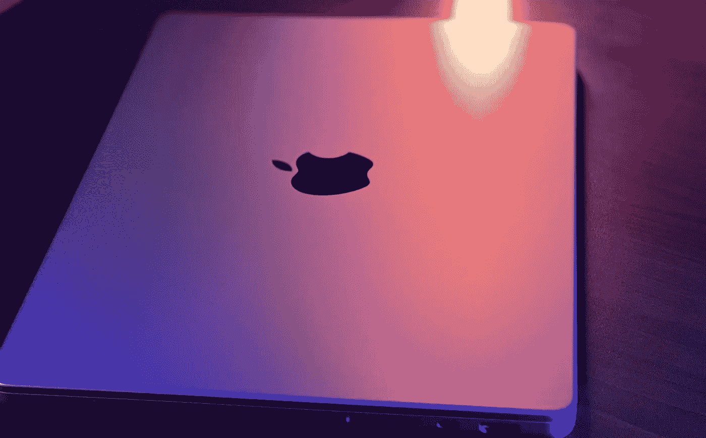

# 我的 MacBook Pro 有我用过的最好的屏幕。我很生气。

> 原文：<https://medium.com/codex/my-macbook-pro-has-the-best-screen-ive-ever-used-and-i-m-annoyed-6f9262134716?source=collection_archive---------2----------------------->

## 说真的，这不应该让我如此沮丧。

图片由作者提供

几周前，我买了一台 14 英寸的 MacBook Pro，配有 M1 Pro 芯片、1TB 固态硬盘和 16GB 内存。虽然它并不完美，但它拥有我在 T2 用过的最好的笔记本电脑屏幕。