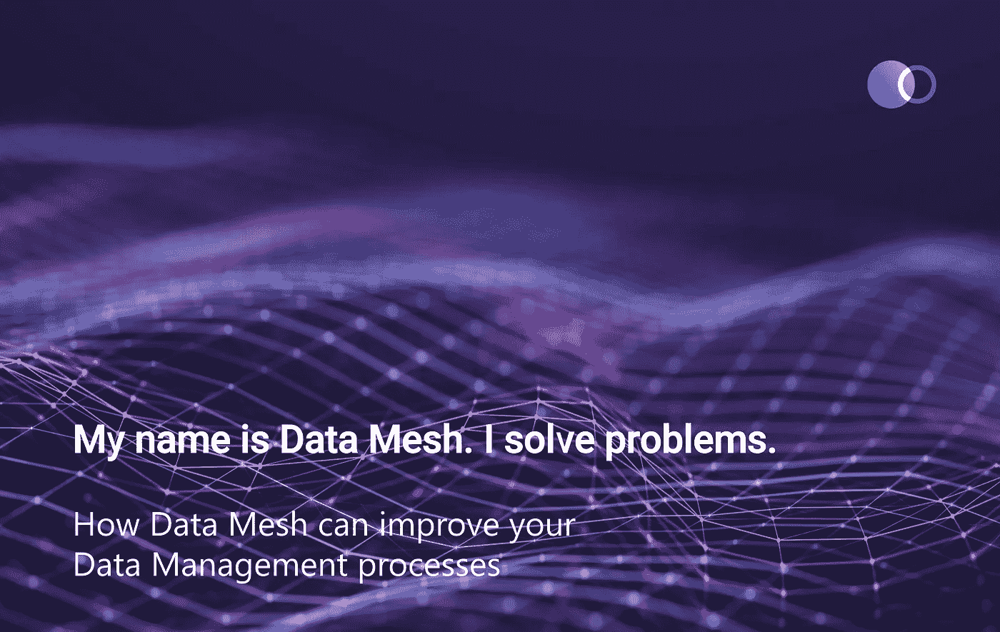

# 我叫数据网格。我解决问题。

> 原文：<https://medium.com/codex/my-name-is-data-mesh-i-solve-problems-264b08362bf?source=collection_archive---------8----------------------->

尽管科技提供了无数的优势，我们还是经常觉得科技让我们的工作变得更加困难和繁琐，而不是帮助我们提高生产力。当技术没有得到很好的实施，规则过于僵化，或者逻辑与现实世界的需求相去甚远，或者甚至在我们不需要它的时候试图帮助我们(是的，自动更正，我在跟你说话:它从来都不是“鸭子”！).但是，我们再也不会回到“前 GPS”时代，开车时腿上放着一张纸质地图，或者浏览黄页寻找酒店、餐馆或商业电话号码。我们需要可行的技术，并且我们乐于与之合作。数据网格，就像昆汀·塔伦蒂诺《低俗小说》中的沃尔夫先生一样，可以快速、有效、毫不费力地解决问题。让我们来看看它在实践中意味着什么。

# **想象一下…**

有什么比需要你知道拥有的东西，却不记得它在哪里，或者它是否还能用更让人沮丧的呢？想象一下，这个周末你想去你的湖边小屋，那里你已经很久没去了。毫无疑问，你有房子的钥匙:你记得出去的时候把门锁上，然后长时间努力思考一个安全的地方存放它。可能在家里，甚至更有可能在银行的保险柜里。首先在那里检查，虽然成功的可能性很高，但这意味着必须在营业时间开车去银行，并冒着白白浪费半天工作日的风险。你可以晚上在家里找钥匙，这样应该会快一些，但是如果你找不到，继续找，也可能要花很长时间，如果钥匙不在家里，你还是得去银行。你甚至有一个后备计划:你给了你叔叔鲍勃一把钥匙的副本。问题是，你不记得在 2018 年你不得不更换螺栓后，你是否也给他一个新的…如果你做了，鲍勃是你的叔叔，也是比喻，但你愿意抓住这个机会，一路开车到湖边，也许会发现旧钥匙不再工作？你想去放松一下，但是看起来你越来越紧张，现在你在想这是否值得…

# 那是一个真正的问题

上述情景似乎只与我们的私生活有关。在现实中，这也是企业环境中最大的障碍之一，唯一的区别是在家里我们寻找物理的，“有形的”物体，而在现代公司中的挑战是找到可靠的数据。这不仅仅是知道数据在哪里的问题，也是我们是否真的可以信任它的问题。在业余时间，这很烦人，但我们能承受这种不确定性。比我们愿意承认的更频繁的是，我们要么花费过多的时间寻找我们错放的东西，确保它仍然有效或修复它，要么我们干脆放弃做一些令人愉快和有益的事情，因为我们懒得去寻找我们需要的东西，不知道要花多长时间。在竞争越来越激烈的商业世界中(无论你的生意是什么，竞争总是很激烈！)，避免额外开支，绝不放过一个机会，是绝对必须的。而你不能“仅仅”因为找不到或不信任你的数据而承受这些失策。

如今，一家公司不具备生成报告所需的数据、不同的 KPI、新的业务智能或业务分析计划，以进行分析来验证新的业务主张等等的可能性极小。**相反，我们似乎被数据淹没，总是在努力管理数据**。新的问题出现了。因此，我们面临的真正问题是关于数据质量的 T4。靠谱吗？谁创建了这些数据？它是来自公司内部，还是被收购、在收购后被合并、来自不同的原始数据集？是否一直保持最新？它是否在一个地方包含了我需要的所有信息？它的格式符合我的要求吗？从这些数据中提取我需要的信息的复杂性(以及成本)是多少？那条信息的意思和我想的一样吗？公司中是否还有其他人已经利用了该数据集，如果有，他们的体验如何？

好的，所以在使用某个数据资产之前，可能需要解决一些问题。这本身是意料之中的事。你知道**每一项新的业务分析、每一项新的商业智能计划都有其自身的障碍**。真正的挑战在于预先估计这些挑战的能力，以便不导致预算超支或其他代价高昂的延误。似乎每次您试图分析情况时，您都无法从数据工程师那里得到关于数据质量甚至是确定数据是否足够所需时间的明确答案。当您无法提前知道数据可能存在或不存在哪些问题，甚至无法得到关于找出这些问题需要多长时间以及成本有多高的答案时，您就无法从时间和资源方面制定预算来解决这些问题。如果你不知道你将面临什么样的挑战，或者你什么时候会意识到这些挑战，那么估计上市时间是完全不可能的。因此，当无法知道一个产品或服务需要多长时间推出时，你如何确定它在市场上是否相关？你应该冒这个险，还是应该放弃整个项目？**这是一个难题，糟糕的数据可观察性和可重用性，加上无效的数据治理策略，让您陷入了**。那是一个你真的不想发现自己的地方。

公司最近才意识到，一般来说，T4 的“数据整合”问题更有可能作为一个社会问题来解决，而不是技术问题。业务部门负责(或者至少应该负责)数据资产，从技术和功能的角度来说都是数据资产的所有者。相反，在过去的十年中，数据仓库和数据湖架构(及其所有的倾斜)从数据所有者那里拿走了技术负担，同时将关于这些数据的知识保留在原始业务单元的手中。不幸的是，一个直接的后果是，**中央 IT(或数据工程团队)一旦实施了第一个接收过程，就“获得”了这些数据的所有权，从而迫使所有权集中化**。在这里，集成被打破了:能够从数据中创造价值的潜在消费者现在必须通过**数据工程团队，他们对他们作为 ETL 结果提供的数据没有任何真正的业务知识**。这最终导致潜在消费者不信任或无法真正利用数据资产，从而无法在链中产生价值。

# 全新的解决方案

所有这些都意味着，现在不仅仅是作为另一种架构或技术，而是作为数据世界中的一种全新范式来处理和解决所有这些数据集成(和组织)问题的时候到了。这正是**数据网格的含义**，也是它发挥作用的地方。首先，**是一种基于领域驱动设计原则**的新的组织和架构模式，该原则在微服务领域被证明是非常成功的，现在**被应用于数据资产，以便根据面向业务的策略和领域来管理它们，而不仅仅是面向应用程序/技术。**

通俗地说，这意味着数据为你工作，而不是你解决技术复杂性(或围绕它们)。此外，**它既是革命性的，因为它提供了革命性的结果，也是革命性的，因为它利用了现有的技术，并且不局限于特定的底层技术。让我们试着从解决问题的角度来理解它是如何工作的。**

数据网格现在由 4 个原则定义:

*   面向领域的分散数据所有权和架构
*   数据作为一种产品
*   作为平台的自助式数据基础架构
*   联合计算治理。

我们已经提到，数据策略失败的最常见原因之一是集中所有权模型，因为它固有的“瓶颈形状”和无法纵向扩展。**首先，数据网格的采用打破了这种模式，将其转变为一种去中心化(领域驱动)的模式。域名必须是他们所知道的数据的所有者，并且是他们提供给公司的。**这种所有权必须从业务职能和技术/工艺的角度来看，以便允许域以自己的速度移动，使用他们更熟悉的技术，同时为任何潜在的数据消费者提供有价值和可访问的结果。

# 信任和预算

“数据作为一种产品”显然是一个简单的、几乎微不足道的概念。数据像产品一样呈现，**易于发现，详细描述**(它是什么，它包含什么，等等)，**具有公共质量指标和可用性保证**(代替产品担保)。如果可以与潜在消费者建立信任关系，产品更有可能被销售(重用，如果我们谈论数据的话)，例如允许用户写评论/FAQ，以便帮助社区共享他们对该资产的体验。**数据资产的成功取决于其可访问性**，因此数据产品必须提供多种多样的访问机会来满足消费者的需求(技术和功能)，因为消费者发现的灵活性越大，他们就越有可能利用这些数据。在当前时代，数据必须具有时间旅行能力，并且必须可以通过不同的动态方式(如事件流)进行访问(如果考虑到数据特征是合理的)，而不仅仅是作为数据库的表。但是我们不要太关注技术面。真正革命性的方面是，现在**数据作为一种产品，有一个预先确定的价格。这对于项目的预算和报告能力有着巨大的影响。在传统系统中，即使是像数据湖这样的现代系统，所有的数据操作(从摄取，如果数据还不可用，到检索和准备，以便您可以用您需要的格式获得它)都需要数据工程师。如果他们有时间，可以马上满足你的要求，这对你来说很好，但对公司来说就不那么好了，因为这意味着产能过剩。这样效率不高，而且非常非常贵。如果他们满负荷处理日常运营需求和已经在进行的项目，任何新活动都必须无限期等待(也是因为我们之前讨论过的不确定性)，在这种情况下，公司的成本是固定的，因此不能按需扩展能力。即使它可以扩展，也很难确定增加的容量中有多少与您的单个新项目直接相关，有多少工作可以或可以在未来重用，有多少最终必须完成等等。当多个新项目同时开始时，整个 IT 开销很容易变成间接成本，并且在每个公司都有失控的趋势。**另一方面，使用数据网格**，**您可以立即看到哪些数据可用，使用了多少(和使用情况如何)以及花费了多少。**时间和金钱不再是未知的(或者更糟，是事先不可知的)。**

# 改变游戏规则的人

为了理解接下来两点的含义，“作为平台的自助式数据基础设施”和“联邦计算治理”，让我们与过去“改变了游戏”的平台类型进行比较。这是一个过于简化的问题，但是请原谅我们。假设您在物流部门工作，您需要为公司的销售会议预订酒店。你有一些要求(足够的房间、价格在预算之内、内部会议室、容易停车)和一系列“值得拥有的东西”(半食宿或餐厅，这样你就不必为午餐预订餐饮、为那些坐飞机来的人提供往返机场的班车、离机场不太远或离市中心不太远)。您的公司数据湖包含了您需要的所有数据:它包含了会议召开地点所在城市的所有酒店。但过去的“黄页”也是如此。使用这样的目录找到一个合适的酒店需要多长时间？基本上是不可知的:如果 Abbey 酒店满足所有要求，不会太久，但祝你好运到达接近列表末尾的 Zephir 酒店。它们不仅以预先确定的方式(按字母顺序)排序，而且如果你想知道可用性、价格等等，你必须通过打电话按顺序检查每一个。此外，直接在黄页上可以找到的每家酒店的信息数量也非常不一致。如果能排除其中一些就好了，这样你就不用打电话了，但是一些酒店买了很大的空间，如果他们有会议室或餐厅，他们就在那里写，其他的只是列出一个电话号码。如果你还需要检查一个机构的质量，以避免把销售总监送到一个肮脏的垃圾场，复杂性会成倍增长，就像不确定要花多长时间才能弄清楚一样。也许你很幸运，找到了一个已经去过那里的同事，他可以为你作证，或者你不得不自己开车去那个地方。当你为公司的销售会议做预算时，你如何计算出仅仅是找一家合适的酒店就要花费多少时间和金钱？如果没有答案还不够糟糕的话，为会议买单的销售总监会非常生气，因为这个问题每年都会重复出现，而且你永远无法给出一个估计值，因为上次你找到一家酒店所花的时间根本不代表下次会花多长时间。

如果你现在把上面例子中的单词“hotel”换成“data ”,你会发现这可能有点极端，但也不是那么牵强。从这个意义上来说，数据网格就像一个预订平台(想想 hotels.com 或 booking.com)，在那里**每个数据生产者都成为数据所有者** **和**，就像一个酒店老板一样，**希望被使用平台的人找到**。为了被列出，联邦治理强加了一些规则。酒店所有者必须列出价格(成本)和可用性(正常运行时间)，以及酒店的结构化描述(数据集)，包括地址、类别等，以及所有必需的元数据(有停车场吗？一家餐馆？一个游泳池？包括早餐吗？以此类推)。这些特征中的每一个都变得容易看见(它总是出现并显示在相同的位置)，可搜索并且可以充当过滤器。住在酒店的人(使用数据集)也会留下评论，这有助于其他顾客进行选择，也有助于酒店老板提高产品质量，或者至少提高描述的准确性。

“自助”方面是双重的。从用户的角度来看，这意味着销售部门可以通过这样的平台直接选择和预订酒店，而不需要(并支付)物流(数据湖工程师)的帮助。从所有者(酒店或数据所有者)的角度来看，这意味着他们可以独立选择和宣传要提供的服务(带空调的房间、按摩浴缸、管家服务等)，以满足甚至超过客户的愿望和需求。在数据世界中，这第二个方面与数据生产者按照联邦治理批准的标准自主选择技术路线的**自由有关**。

最后，但绝对不是最不重要的一点，**数据网格架构带来了可伸缩性**(一旦一个城市中有了所有的酒店/数据集，系统也可以扩展以适应其他城市的酒店/数据集)**和重用**。重用意味着您在创建一个解决方案时所付出的努力，至少可以部分地用于创建另一个解决方案。让我们坚持酒店类比。如果你去年创建了它，现在想为 B & Bs 做类似的事情，有很多事情你不必从头再做。当然，“元数据”会有所不同(床和早餐没有会议室)，但你仍然可以使用相同的用户反馈系统，相同的技术来收集价格和可用性信息，这再次将由 B 的所有者来保持更新，等等。

# 没脑子？

这样看来,“跟随数据网格”似乎是显而易见的。对于大公司来说，这可能是真的，但是请记住，构建数据网格是一项艰巨的任务。如果你只有三四家酒店，不用说，搭建预订平台是没有意义的。然而，重要的是要记住，**一个数据网格架构，要发挥其全部潜力，需要公司进行深刻的组织变革**。举一个最明显的例子，数据工程师需要从中心(数据湖)“迁移”到数据生产者，在正确准备数据的过程中指导他们，遵守联邦治理规则，并正确地公开数据，以便可以找到和利用数据(因此也通过内部销售为数据所有者创造收入)。**这还需要改变心态，以便整个公司可以开始将数据视为一种产品，将数据生产者视为数据所有者，并摆脱数据湖的限制和瓶颈，收获真正分布式架构和新范式的好处。**

苹果首席财务官卢卡·马埃斯特里(Luca Maestri)有一句名言，人们倾向于将苹果、亚马逊、谷歌或脸书等大公司的成功归因于它们是创意实验室，在这里可以出现大量创新想法，但他的经验告诉他，事实并非如此。这些公司之所以成功，是因为它们是“执行机器”。换句话说，如果你不能在预算内及时有效地执行，一个伟大的想法就没有价值。但是，首先，您需要合适的工具来确定时间和预算限制。**创建数据网格是一项艰巨的任务，但这意味着要构建坚实的基础，支持数据驱动型业务的发展。**您可以将世界上所有的数据放入您的数据湖，但如果您不能有效、可持续地利用这些数据，您将无法前进。因为在当今世界，停滞不前意味着倒退，保持竞争力的唯一方法是为您的客户创造新产品、服务和解决方案。为了成为“执行机器”，你需要能够花时间寻找机会，而不是搜索你的数据，分析市场，追逐新客户和颠覆命题，而不是翻遍你的数据湖。如果你能做到所有这些，你绝对值得拥有一个放松、有益的周末，从你的房子里看着平静的湖面，回忆起你的数据湖同样静止不动、难以在水面下看到的时光。到了周一，将会是一个有效、高效、数据驱动的新业务的新一周。

如果您感兴趣并想了解更多，请联系我们，我们将很乐意回答您的所有问题。

[www.agilelab.it](http://www.agilelab.it)