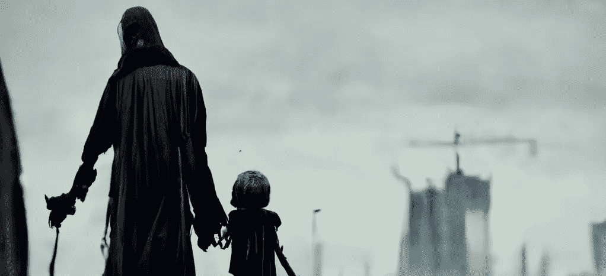

# 我的周六下午与中途人工智能——计算机生成的图像

> 原文：<https://medium.com/codex/my-saturday-afternoon-with-midjourney-c48998e87c03?source=collection_archive---------6----------------------->

## 用 Midjourney 制作人工智能生成的艺术，这是一个希望与开放人工智能的达尔 E-2 竞争的工具

作者中途创建的图像

对 AI 艺术感兴趣有一段时间了。作为一个有艺术天赋但没有明显天赋的人，我认为这是一种创作艺术的方式。