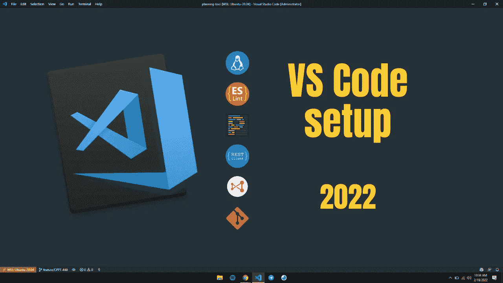
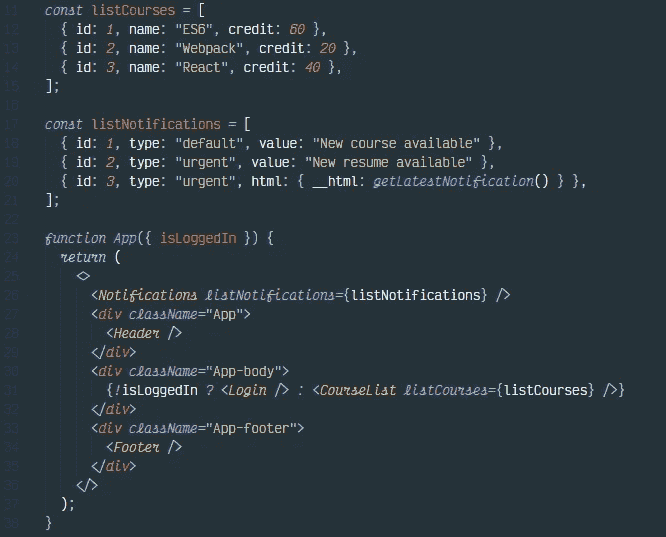
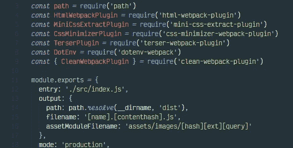
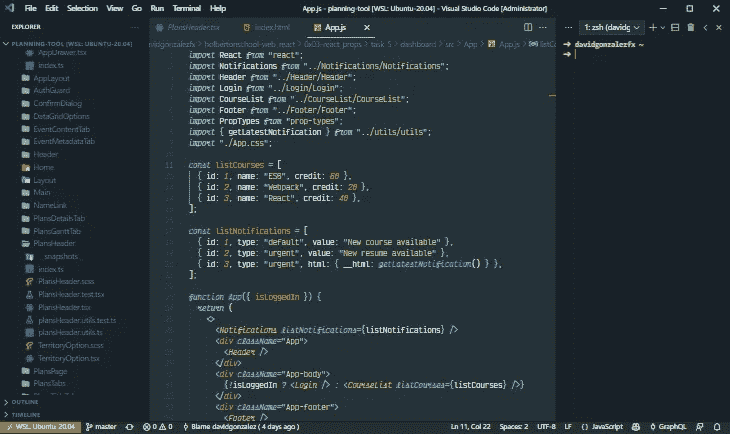
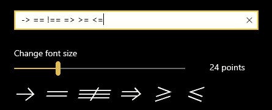
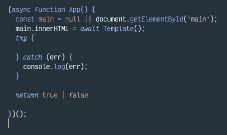
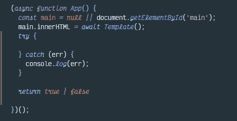

# 我的 Visual Studio 代码设置(VS 代码)

> 原文：<https://medium.com/codex/my-setup-for-visual-studio-code-vs-code-a6749300e558?source=collection_archive---------19----------------------->

不管你编码的原因是什么，是为了工作、学习还是仅仅是爱好，你都会经常遇到代码编辑器。每个人都有自己的优点和缺点。

我个人选择每天使用 Visual Studio 代码，因为它有很多好处，特别是对于 web 开发。如果你最常用的编辑器之一也是 VS Code，这个博客可能对你有用。事实是，我喜欢定制和使用我使用的几乎所有东西的设置，在一些场合，我被同事要求分享我的代码编辑器设置。今天是🚀

事实是，在我的记忆中，我不记得曾经使用过一个明确的主题。自从我开始编程(那时用崇高的文本)以来，我记得我使用了黑暗的主题。我使用社区材质主题高对比度主题已经有几年了。但是我必须承认我修改了主题文件中的几行，改变了一些颜色。也许有一天我会教你如何定制主题，或者为什么不，创建你自己的主题

我使用的字体打开了连字。连字只是某些字体的一个功能，可以让某些符号看起来更好看。例如

也许最流行的字体是[维克多莫诺](https://rubjo.github.io/victor-mono/)和[菲拉科德](https://github.com/tonsky/FiraCode)。但是还有很多。这里我也必须承认，我修改了 VS 代码中的其他设置，为某些关键字修改了 ***fontStyle*** 。你可以看到关键字为 ***async，function，null，await，true，false*** 它们看起来不一样。

像任何其他 VS 代码编辑器一样，它为我们提供了安装扩展来扩展编辑器默认带来的特性的可能性。每个开发人员都有自己喜欢的扩展，根据他们使用的语言或项目，其中一个会更有用。我在这里分享一些我已经用了很长时间的产品，我个人很喜欢它们，它们对我来说效果很好。这可能对你来说是一个很短的列表，因为我更喜欢运行尽可能少的进程的 VS 代码，并且拥有我需要和使用的东西。但是如果你用的数字比我要展示给你的数字高，那没什么问题，那就完美了。

*   [**社区素材主题**](https://material-theme.site/) & [**素材图标主题**](https://marketplace.visualstudio.com/items?itemName=PKief.material-icon-theme)
*   [**ENLint**](https://marketplace.visualstudio.com/items?itemName=dbaeumer.vscode-eslint)&[**beauty**](https://marketplace.visualstudio.com/items?itemName=esbenp.prettier-vscode)**:**ESLint&beauty 如果你经常在团队之间用 Javascript 工作的话会派上用场。这些扩展有助于保持代码整洁，并遵循某些已定义的标准。
*   [**Git 责备**](https://marketplace.visualstudio.com/items?itemName=waderyan.gitblame) **:** 查看对特定代码行的最新更改的提交和作者
*   [**Remote—WSL**](https://marketplace.visualstudio.com/items?itemName=ms-vscode-remote.remote-wsl)**:**使用 WSL 环境中的 VS 代码
*   [**rest client**](https://marketplace.visualstudio.com/items?itemName=humao.rest-client)**:**我的最爱之一。它允许您在不离开编辑器的情况下发出 HTTP 请求，并且像 Postman 或失眠症患者一样，它允许您配置变量和环境。
*   [**graph QL**](https://marketplace.visualstudio.com/items?itemName=GraphQL.vscode-graphql)**:**执行查询、突变或不同的操作，以及加载模式、文档和支持类型文件`**.gql .graphql**`

为了继续分享扩展和设置以及所有这些，在即将到来的博客中，我将写一些我在 Chrome 中的扩展和一些设置。我希望这篇博客给了你一些东西，无论是通过扩展提高你的生产力，还是改进你的代码编辑器的风格，或者仅仅是因为知道你可以定制主题和字体而引起了你的好奇心。