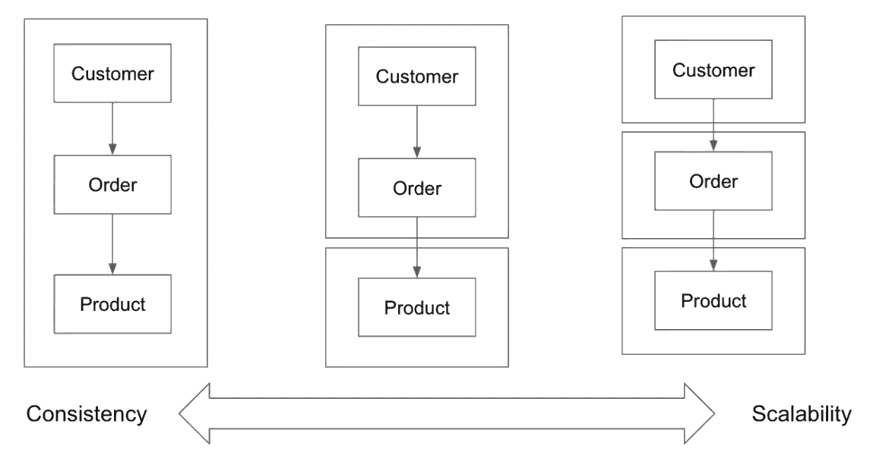

# 我的软件架构之旅

> 原文：<https://medium.com/codex/my-software-architecture-journey-2b3bb6c5ce1e?source=collection_archive---------5----------------------->

有些故事是从头开始的。我的故事始于葡萄牙的一家电信公司。

当时，大多数 web 软件都使用单一架构。你有一个后端，一个数据库…就是这样！如您所见，开发、部署和扩展非常简单。

嗯，它开始很简单，然后我们开始添加一个又一个功能，一个简单的应用程序变成了一个非常复杂的应用程序。(换句话说，庞大的代码库很难维护，对新开发人员来说是一种威胁)。IDE 过载了。持续集成需要几个小时。我们对技术堆栈有长期承诺；改变这一点意味着重新构建大部分应用程序，这是不经济的原因之一。可用性也是一个问题，因为有时一个小问题会危及整个应用程序。

但是你不能有多个实例吗？

可以，但请记住，这是在云出现之前。当时，“自动缩放”更像是“手动缩放”，这些应用程序的启动时间很容易就能达到几分钟。进入云端。云解决了基础架构即服务的一个问题，允许您的应用程序自动扩展，并且您的公司将只支付您消费的部分，您不必花钱提前购买裸机并让员工来支持该基础架构。

在接下来的几年里，我专注于解决上述一些单一问题，大多数公司在一种新的架构设计中看到了答案:微服务。如果设计得当，您将拥有业务逻辑解耦的微服务，这将允许您轻松扩展它们。

**那么你如何设计微服务呢？**

说实话，我还不知道。但从那以后就是我的奥德赛了，这篇文章讲的就是那段冒险的旅程。

我第一次尝试构建微服务架构是一次非常有趣的经历。作为一个年少无知的软件开发人员，我以为我可以看几篇文章和微服务架构的定义，实现一个功能齐全的软件，就这样！事实证明我不能。这完全是一场灾难！

我在某处读到过，每个微服务都应该有自己的数据库，或者至少有自己的模式，但我决定忽略这一点，并使用我认为是我聪明的想法(事实证明这只是一个愚蠢的想法)，对所有微服务使用相同的数据库…如果你也这样做了，你就会知道这是一场多么壮观的灾难，但如果没有，请允许我告诉你:我们部署和测试了应用程序，没有任何问题，一切都像预期的那样工作。听到这个惊人的消息，我们开始直播。最初几天风平浪静，然后第一个周末到来了，混乱袭来，所有微服务都停止了响应，我们花了几个小时才明白数据库连接是有限制的，随着应用流量开始增加，每个服务的实例数和数据库连接数也在增加。

那一天，我学到了两个非常宝贵的经验:

**1。不要在没有压力测试来识别应用程序的瓶颈和限制的情况下使用软件。**

**2。永远不要忽视那些比你更有经验的人的建议，不管你认为自己有多聪明，经验比那更重要。**

后来，我们遇到了更多关于微服务间共享数据库的问题，很难维护和部署。**我可以就此再写几段，但我唯一的建议是:不要这么做！:)**

一年后，我正在使用微服务构建新软件，每个微服务都有单独的数据库。这一次，在设计任何东西之前，我决定阅读罗伯特·c·马丁(又名鲍勃大叔)、迈克尔·阿蒙森、克里斯·理查森、埃里克·埃文斯等作家的书籍、文章和演讲。我读了这么多，开始明白一个简单的事情:设计微服务没有完美的配方。至少，还没有人找到。但我确实找到了一些模式，至少可以帮助我们找到正确的方向。

我现在意识到让服务完全分离是多么重要，但并没有意识到要实现这一点将会面临的所有挑战——这是我的下一个项目允许我探索的。

这个项目是一个在线商店。像任何在线商店一样，它向客户销售产品(显然),所以这意味着你需要:订单、产品和客户，对吗？所以，我问的第一个问题是:我是否应该为每个业务能力提供一个微服务？某种领域驱动的设计(DDD)？或者我可以在同一个微服务中拥有两种或两种以上的业务能力吗？简短的回答是:两者都可以接受！没有规定说每个业务能力或领域必须拥有自己的微服务，这是您需要根据应用需求做出的决定。两者都有优点和缺点，实际上更多的是一致性和可扩展性之间的权衡。

让我给你更详细的解释。

你有一个**订单微服务**和一个**客户微服务**，每一个都有自己的数据库(或者至少有一个独立的模式)。您收到一个创建订单的请求，您需要验证客户是否有该订单的余额，如果有，您需要从余额中扣除订单金额。传统上，我使用一个事务来创建订单，更新余额，如果没有错误，我将提交该事务。如果出现错误，我将回滚事务中的所有内容。对于这种情况，这不是一个选项，因为我们在两个不同的数据库中有数据。此外，传统上订单表将有一个外键(FK)到客户表，对不对？在两个数据库之间不能有 FK(有一种方法可以做到这一点，但是非常具体，不推荐)。

解决方案是使用聚合并使用聚合 ID 作为引用，在本例中是一个客户 ID。这就是我们在一致性和可伸缩性之间进行权衡的地方:因为您使用对其他聚合的引用，所以您将更难保持数据的一致性，并且这将需要额外的复杂性。另一方面，您将拥有一个完全解耦的域，非常容易扩展和维护。

因此，我们有需要在它们之间通信的带有单独数据库的微服务。我们当时的解决方案是直接调用微服务 API。它起作用了…某种程度上，但是压力测试的结果不是我们所期望的(而且不是好的方面)。考虑到这一点，我们决定使用 RabbitMQ 实现基于事件的通信，这解决了大多数问题(仍有一些小问题，但主要是由于缺乏经验)。
随着这个问题的解决，我们有了新的目标:让系统具有弹性。

有多种方法可以做到这一点，但我们的方法是使用压力测试来识别瓶颈和系统故障，甚至系统限制。有了这些信息，我们能够添加容错、监控和警报功能，以防止系统故障。

最后想分享的痛苦是 CI/CD。对于这些项目，我们只是重用了现有的 CI/CD(大部分时间与 Jenkins 在一起),并认为这样会很好。这并不是说它没有，管道正在工作和部署，但与微服务合作涉及到思维模式的改变，我们花了一些时间来接受。我们花了很多时间试图改造和维护管道。请注意，管道的数量将呈指数级增长，随着时间的推移，您将希望使用蓝绿色或淡黄色部署来控制部署，或者拥有一个服务的多个版本。

在我最近的项目中，我取得了更多的成功，但总有一些事情不能像预期的那样工作，正如我之前提到的，我不知道(还)如何设计和构建微服务，但我绝对有经验知道什么不该做！

你可能想知道，在所有这些问题之后，我是否还会推荐微服务？
我的回答:这取决于你需要建造什么。

如果你正在为一个拥有少量用户和低复杂度的组织内部使用而构建软件，那么一个整体架构应该工作得很好。另一方面，如果您正在构建必须扩展的软件，并且您对未来或复杂性没有清晰的认识，我会建议您使用微服务，因为最终，如果您构建正确，您将拥有更灵活的解决方案，易于扩展和维护。

想象一下，我需要雇用一名新的开发人员加入团队，而不是面对一个巨大的应用程序，他可以从一个微服务开始。作为一名不得不学习非常复杂的单片应用程序的开发人员，我知道学习这样的应用程序是多么困难和令人生畏。如果这个新开发人员只在一个微服务上工作，编译和测试会更快，对吗？他只是改变了一个微服务的代码，这就是你需要测试的。此外，您不需要在每次更改代码时运行成百上千个测试，您只需要运行特定微服务的测试。如果您更改了一个微服务，而该更改影响了应用程序的其他部分，那么您就做错了。部署也是如此，如果您要更改客户服务以添加一些新功能，您只需部署这些更改。扩展开发团队也很容易，因为您可以有多个团队在同一个应用程序上工作，而没有任何熵。每个团队将负责一个或多个微服务，他们唯一需要同意的是用于通信的接口。您的应用程序将具有更强的容错能力，如果一个微服务发生了意外，也不会破坏整个应用程序。

您可以在不同的微服务器中使用不同的技术堆栈。最后但同样重要的是，您可以使用不同的规则轻松扩展每个微服务。

**我的微服务之旅现在已将我带到了无服务器架构，就像微服务之路一样，这是一个艰难的开始，但让我们看看我会在哪里结束。我想和你分享的重要一课是，软件架构就像技术一样；在使用它们之前，你需要了解它们的优缺点以及它们的工作原理。**