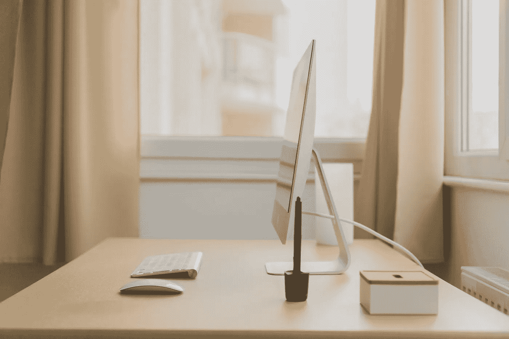
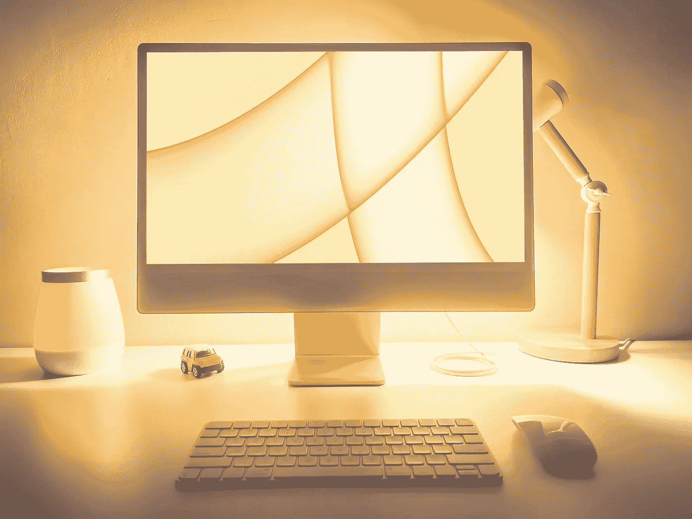
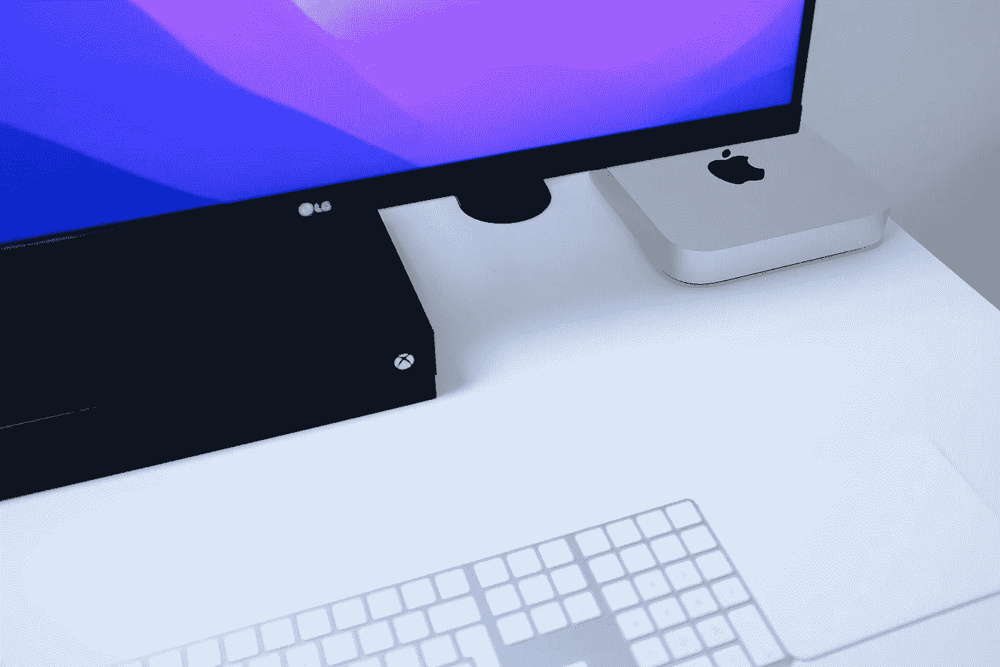

# 我认为 iMac 实际上是完美 Mac 的五大理由

> 原文：<https://medium.com/codex/my-top-5-reasons-why-the-imac-is-actually-the-perfect-mac-1a26225c45f5?source=collection_archive---------10----------------------->

## 新款 iMac 24”发布于一年半前，但似乎没有人注意到这一点。

Norbert Levajsics 在 Unsplash 上拍摄的照片

# 什么是 iMac

iMac 是“完美”Mac 的缩影。它拥有您对一体式计算机的所有要求:出色的设计、顶级的性能、广泛的功能和软件，以及随着您个人的成长而增长的能力。难怪近 20 年来它一直是家用电脑的旗手。然而，像大多数完美的东西一样，一些小问题使它无法成为你能得到的最好的电脑。

如果你有一间办公室，想要一台每个人都可以使用的电脑，那么这可能是你的答案。

> 以下是我认为 iMac 是完美 Mac 的五大理由。

首先，我仍然拥有一台英特尔 iMac (Retina 5K，27 英寸，2019)。我认为没有必要升级到新的 24 英寸 iMac，因为所有的东西都可以在我目前的机器上运行。但是有时候我会阅读关于新款 iMac 的东西，看评论，去商店试用(反复试用)，告诉自己我不需要它，尽管我想拥有它，等等。我想你们很多人都理解这种心态。

下面，我将写下我对新的 24 英寸 iMac 的看法，它与以前的型号基本上没有什么不同。其实有很多共同点。

# 它是负担得起的

总的来说，新的 24 英寸 iMac 是一台非常便宜的电脑。在盒子里，你会看到一台一体化的 Mac 电脑，配有 M1 处理器、漂亮的屏幕、键盘和鼠标。所有这些都是基础型号的 1299 美元(在苹果官方网站上)。但是我不推荐基础款。多花 200 美元，你就可以得到一个 8 核 GPU(而不是 7 核)，2 个额外的 USB 3 端口，千兆以太网(相信我，你会想要的，不要只依赖 wi-fi)，以及苹果的触控 ID 魔法键盘。

考虑到所有这些，让我们面对现实吧，新款 24 英寸 iMac 售价 1499 美元。**你不想要只有两个接口的基本款**(为什么，苹果，为什么？)也没有以太网。再者，在我看来，基础款中应该有一个带 touch ID 的魔法键盘。我不清楚为什么苹果选择走这条路，但事实就是如此。避开基本款就好。

尽管如此，24 英寸的 iMac 仍然是一款非常实惠的电脑。但这还不是全部。

# 看起来很棒

就设计而言，它是市场上最漂亮的电脑之一，即使与以前的 iMac 型号相比也是如此。iMac 24 寸非常简约，看起来很干净。机箱本身非常薄，所以你想知道它们是如何将所有这些组件安装在其中的。

它有七种不同的颜色，但基本款只有四种。因此，如果你喜欢基本款，但想要黄色、橙色或紫色的 iMac，你只需为这种颜色多付 200 美元。还是那句话，不要问自己为什么。对此我没有合理的解释。那三种颜色更贵吗？我认为，这是他们近乎完美的营销策略。

但是 24 英寸 iMac 最大和最吸引人的视觉特征是它的 **4.5K 视网膜显示屏**。如果你曾经拥有过一台配备 Retina 显示屏的 iMac，你就会明白我的意思。水晶般清晰、锐利、无像素的显示器是如此之好，如果显示器不够好，你会有麻烦。而且市场上只有少数价格很高的。

记住 iMac 带给你的一切。至少一半的价格是显示器本身，但你得到的远不止这些。

Ishtiaq Khan Parag 在 Unsplash 上拍摄的照片

# 这是一台专业台式电脑

如前所述，iMac 是一款 24 英寸一体式电脑，采用超薄机箱。但这并不能使 iMac 成为专业的台式电脑。除了出色的显示屏，这款纤薄的机箱还包括一个带**六个扬声器**的音响系统。它提供了令人难以置信的声音体验，所以大多数人不需要外部扬声器。我将它与我目前的 27 英寸 iMac 进行比较，这个六扬声器系统只是增加了它。环绕系统要好得多，但考虑到扬声器的数量，这是意料之中的。

对于今天的许多视频会议服务或 FaceTime，iMac 有一个 **1080p 高清**摄像头，与 M1 芯片配合工作，为任何潜在的视频呼叫者提供足够好的视频质量和额外的功能。

对于视频通话、播客或录音，iMac 24”还配有**三个录音室品质的麦克风**。

如果你不选择基本型号，你会在 iMac 的背面得到 4 个端口。对一些人来说，这还不够。我的 27 英寸 iMac 有足够多的端口，我相信 24 英寸的也会有足够多的端口。如果没有，我可以使用 USB 适配器。

盒子里还有一个**键盘**和**鼠标**。我喜欢苹果的键盘，但我永远无法习惯他们的鼠标。对我来说太不舒服了，所以我仍然使用罗技的一个，它在 MAC 上非常好用。

# 它运行大多数应用程序

像以前的 iMac 型号一样，24 英寸 iMac 在最新的 **M1 芯片**上运行大多数应用程序(已经有传言说 iMac 将采用 M3 芯片)。此外，M1 芯片可以用更少的功率，尤其是更少的内存做更多的事情。我目前的 iMac 仍然是 24 GB 内存的英特尔版本，它仍然适合我，但我确信 M 架构的时代将会到来。

我有机会测试了 8 GB 内存的基本型号，我可以告诉你，你可以毫无问题地打开许多应用程序、Safari 标签、视频通话和照片编辑。我没有尝试过视频编辑，但我确信它能够进行简单的家庭视频编辑，没有任何问题。

最新的 iMac 已经使用了 M 芯片，所以我认为它暂时不会过时。无论如何，比我现在的英特尔 iMac 还要多。我预计有一天一些应用程序会与英特尔 MAC 甚至 macOS 不兼容。最新 macOS 中的一些功能已经无法在英特尔 MAC 上运行，比如 FaceTime 中的肖像模式，我相信未来还会有更多功能。

# 它有更长的寿命

我相信 iMacs 的设计是为了经久耐用。内置的硬件和软件更新可以持续 7 年以上(还有安全更新，所以我预计 Mac 至少可以使用 10 年左右)，可以肯定地说，我们所得到的价格是物有所值的。举例来说，有了这种质量的显示器，几年内你都不需要更好的显示器。你还将在未来很长一段时间内使用最新的 macOS，它将与所有其他苹果设备无缝协作。

查尔斯·帕特森在 Unsplash 上拍摄的照片

# iMac 的其他 Mac 替代品

但它是一台一体机。我不是一个要求很高的用户，所以我用我的 iMac 来完成我所有的日常任务和我额外工作需要的任何东西。我不只是用它来进行专业的照片或视频编辑、音频制作或诸如此类的工作，这些工作需要电脑提供额外的能量。

在这种情况下，我会选择一台不同的 Mac，作为台式机的 Mac Mini **，并可能结合工作室显示器、外部扬声器以及键盘和鼠标来满足您的需求。如果你需要一台**便携式电脑**，我会选择 14 或 16 英寸的 MacBook Pro (M2 芯片预计很快上市)。**

我认为 Mac Studio 或 Mac Pro 确实是为一些需要最强大机器的超级用户准备的，但它们肯定不是为大多数人准备的。

# 结论

iMac 非常适合放在桌子上，打开电源，准备与 macOS 一起工作。你以这个价格买到了很多 Mac，只要确保你有足够的存储空间(或者计划将你的文档、照片和视频存储在外部驱动器或 NAS 设备上)。

如果你是一个普通用户，8 GB 的内存足够了。我不会花钱买它，但除非你打算长期使用这台 iMac，否则明智的做法是升级它，增加一些额外的功能，让它更适应未来。

**如果我现在必须买一台新的 Mac 电脑**，我会选择一台不是基本型号的 24 英寸 iMac，尽管它比我现在的要小一点。至于 RAM，我会选择 16 GB(未来)和 256 GB 的存储空间(我使用 NAS 来存储我所有的文件，所以我的 iMac 上仍然有足够的存储空间)。Mac Mini 也很诱人，但我已经习惯了 5k 视网膜显示屏，所以我会想念它，Studio Display 有点贵，尽管它不仅仅是一个显示器。

总而言之，这就是为什么我认为 iMac 是大多数想要一台外观令人印象深刻且易于工作的台式机的完美 Mac。它就在那里，你可以轻松地用它完成所有的日常任务，但不知何故，我觉得 24 英寸的 iMac 对人们来说不够引人注目。也许有些人觉得它太小了(与 27 英寸的 iMac 相比)，正在等待一个更大的，但有许多传言说它不会。我有一台 27 英寸的 iMac，但对于普通用户来说，24 英寸几乎是完美的尺寸。偶尔会觉得 27″几乎太大了，不需要那么大的空间。如果有必要，我宁愿选择第二块屏幕，或者用我的 MacBook Air 使用通用控制。

感谢您的阅读。一直很感激。

*原载于 2022 年 10 月 16 日*[*【https://www.tomathosblog.com】*](https://www.tomathosblog.com/my-top-5-reasons-why-the-imac-is-actually-the-perfect-mac/)*。*