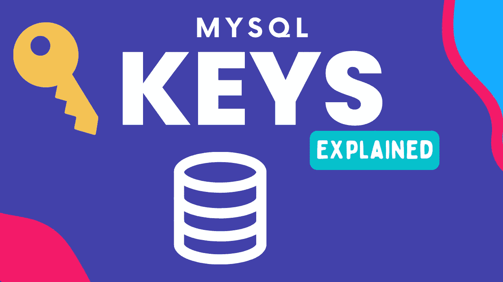
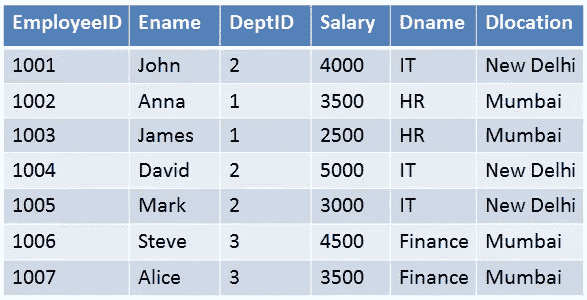
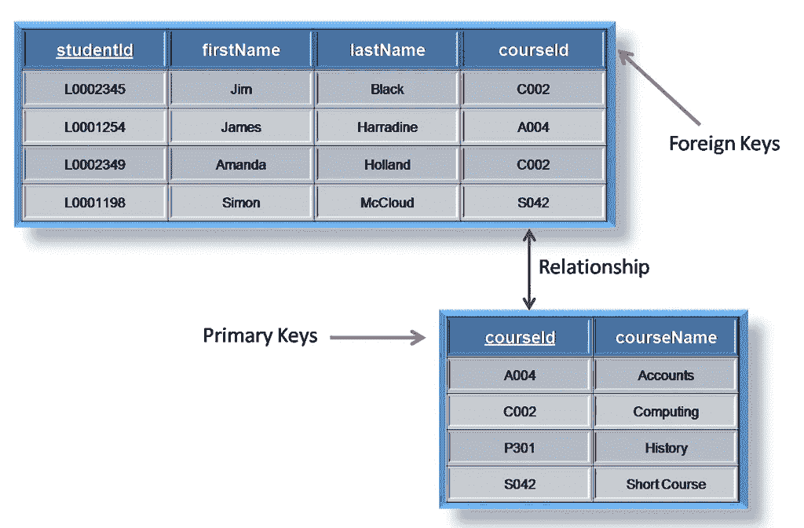
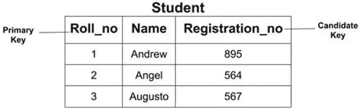
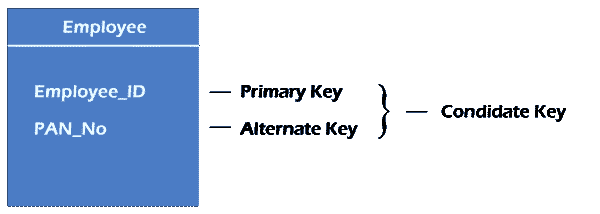
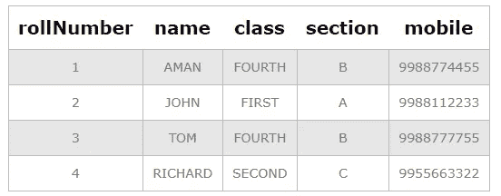

# 你之前不知道的 MySQL 密钥

> 原文：<https://medium.com/codex/mysql-keys-that-you-did-not-know-earlier-ec0026ceb945?source=collection_archive---------15----------------------->



MySQL 中的键用于唯一标识表中的记录，也用于建立和标识表之间的关系。MySQL 中有许多用于此目的的键，每个键都有自己的方式来标识每个记录。在关系数据库管理系统中，行也称为记录，列也称为字段。

# 主关键字

主键是常用的键，它使用唯一的值来标识记录。



对于上面给出的这个表，唯一值将是雇员 ID 字段，因为没有两个雇员可以有相同的 ID，而两个雇员可以有相同的姓名、部门和地点。主键主要是为 ID，数字设置的，常见的例子有你的电话号码，政府 ID 号。

```
syntax:
create table <tablename> (<column 1> <datatype> primary key,<column 2> <datatype>,<column 3> <datatype>);
example:
create table employee_data (emp_id int primary key,name varchar(50),salary int);
```

# 外键

外键是另一个表的主键。有了这些键，我们可以用它们指向另一个表的主键。



```
create table school (studentid int primary key,name varchar(50), courseid varchar(50) FOREIGN KEY REFERENCES Courses(courseid));
```

# 候选关键字

候选关键字是可以唯一标识记录的一组字段/列。除了主键之外，其余的属性都被视为候选键。候选键与主键一样强。这里有一个学生表中候选关键字的例子，roll_no 和 registration_no 都可以用作主键。在这种情况下，我们使用 roll no 作为主键，registration_no 字段成为候选键。



换句话说，我们也可以说，可以成为主键，但不能成为主键的字段称为候选键。

```
alter table yourTableName add unique key anyName(yourColumnName1,yourColumnName2);
```

# 超级键

可以唯一标识记录的字段集，它是候选键的超集，候选键是超级键的一部分。这里，Roll_no 和 name 是超级键，候选键是 Roll_no。


# 备用关键字

备选键的总数是候选键的总数减去主键。备用密钥可能存在，也可能不存在。如果一个关系中只有一个候选键，则它没有备用键。



# 复合键

每当一个主键由多个字段组成时，它就被称为组合键。组合键由表中的两列或更多列组合而成，可用于唯一标识表中的每一行。在这个例子中，rollNumber 和 mobile 可以组成一个组合键。



```
CREATE TABLE student(rollNumber INT, name VARCHAR(30), class VARCHAR(30), section VARCHAR(1), mobile VARCHAR(10),
					 PRIMARY KEY (rollNumber, mobile));
```

> 如果你喜欢这个博客，请别忘了鼓掌。如果你想了解更多关于隐私、安全、技术和 Linux 的知识，可以考虑关注我。另外，任何我觉得有趣和有价值的东西。