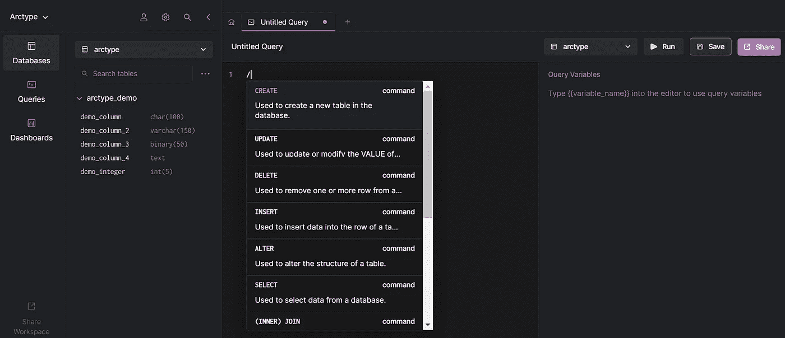
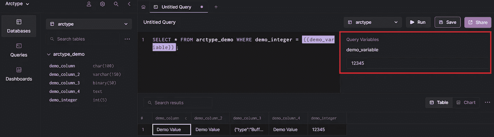

# MySQL 模式设计:回到未来？

> 原文：<https://medium.com/codex/mysql-schema-design-back-to-the-future-962be5a46f07?source=collection_archive---------16----------------------->

一旦开发人员发现自己置身于 MySQL 世界，他们几乎肯定会听到一些关于如何在 MySQL 中设计数据库模式的建议。这篇博文将让你深入了解在 MySQL 中处理数据库模式时应该考虑什么。

# 前言

设计 MySQL 数据库模式是每个 MySQL 数据库管理员甚至是开发人员职业生涯中不可避免的一部分。开发人员和 MySQL 数据库管理员通常求助于 MySQL 的模式设计方面来提高查询性能、规范化他们的数据库、添加或删除某些索引、修改列以及其他事情。

通常，一个数据库管理员认为是“好”的数据库设计对另一个数据库管理员来说可能不那么完美。每个人都有自己的一套偏好——取决于经验和其他事情——但总的来说，尽管 MySQL 确实在快速发展，不断进行改进，但 MySQL 模式设计实践并没有太大变化。

我们将从一些基本的东西开始，这些东西你个人可能已经知道了，但是对其他开发者来说可能不那么显而易见。

# MySQL 模式设计的基础

一些关于 MySQL 模式设计的一般建议听起来像这样:

1.  确保 MySQL 数据库只存储需要的数据。
2.  为特定用例选择最佳数据类型。
3.  如果我们在列中存储可变字符值，我们使用`VARCHAR`。如果我们存储文本，我们应该使用`TINYTEXT`、`TEXT`、`MEDIUMTEXT`或`LONGTEXT`。如果我们发现自己在使用整数，我们可能应该根据具体的用例来研究`TINYINT`、`SMALLINT`、`MEDIUMINT`、`INT`或`BIGINT`。
4.  我们应该给我们的数据类型一个特定的长度——例如，当`VARCHAR(100)`足够时，我们应该避免使用`VARCHAR(255)`,等等。通过这样做，我们使 MySQL 能够减少数据量。
5.  如果我们有很多数据，我们应该使用索引来提高性能，但我们也必须记住，我们应该避免使用冗余和(或)重复的索引。

数据库管理员的普遍共识是 MySQL 模式设计应该基于几个核心点:

1.  定义数据库的要求。
2.  收集、组织和提炼数据。如果需要，可以添加索引来提高性能。
3.  [创建表之间的关系。](https://arctype.com/blog/erd-builder/)
4.  改进和规范数据库设计。

# 定义数据库设计的要求

为了正确定义数据库设计的要求，我们应该回答以下问题:

# 我们存储的是什么样的数据？

这个问题的答案将有助于决定我们的数据库需要什么样的数据类型。每种数据类型消耗的存储空间不同，所以随着数据的增长，这个问题答案的重要性大概会越来越明显。

# 我们处理大数据集吗？

这个问题的答案将决定如何最好地接近 MySQL。它将决定我们应该使用什么样的存储引擎，应该使用什么样的刷新方法等等。如果你想了解更多关于大数据如何与 MySQL 交互的信息，可以考虑看看[早期的博客文章](https://arctype.com/blog/mysql-storage-engine-big-data/)。

# 我们运行什么样的 MySQL 查询？

对这个问题的回答将决定我们是否需要使用索引，我们需要使用什么样的索引，以及何时使用。它将决定我们应该使用什么样的存储引擎，如果我们与 MySQL 一起运行一个 web 应用程序，它甚至可能影响 web 应用程序的开发过程。

# 哪种查询运行最频繁？

这个问题的答案应该决定是否适合在我们的用例中使用索引(记住，索引会降低插入性能，同时加快选择查询)，它将决定我们是否需要规范化(或非规范化)您的数据库模式，它可能决定我们将如何进一步开发您的与 MySQL 交互的应用程序，等等。

# 我们需要索引吗？

这个问题的答案很大程度上取决于我们的数据库正在运行什么样的查询。如果我们处理许多选择查询，但避免插入查询，索引可能是伟大的。在其他情况下，索引可能不可行。

# 我们需要什么样的索引？

在回答这个问题时，我们必须记住，MySQL 有不同种类的索引，可能适合不同的目的:我们可以从 B 树索引、散列索引、空间索引以及全文索引中进行选择。在这种情况下，重要的是要记住，索引主要用于支持数据库服务器快速导航到表中的特定位置。索引减少了我们的服务器必须检查的数据量，它们帮助我们的数据库服务器避免排序和临时表，同时也将随机 I/O 变成顺序 I/O。[你也可以参考这个全面的索引指南。](https://arctype.com/blog/database-index/)

回答这些问题，并时刻牢记 MySQL 模式设计的基本知识——了解这些知识将使您(和您的数据库)走上一条好的道路。然而，如果我们想把我们的 MySQL 实例推进到下一个层次，我们可能也应该考虑如何设计 MySQL 模式来提高性能。

# 设计 MySQL 模式以提高性能

为了设计我们的 MySQL 数据库模式以提高性能，我们应该记住以下几点:

1.  **数据库模式不仅仅是关于列和索引** —简而言之，数据库模式是给定数据库的组织或结构化方式。
2.  **在设计 MySQL 模式时，避免使用保留关键字**——这样做可能会在将来我们选择运行`SELECT`查询时造成问题。虽然我们的查询可能是正确的，但它们仍可能返回语法错误，因为我们用保留的关键字命名了一个列。
3.  **确保关注您的列的数据类型** —即使一列的数据类型设置不当也可能导致我们的 MySQL 实例将来可能会遇到问题。如果我们想在列中存储一些单词(或句子)，我们应该使用`VARCHAR`，如果我们想存储更多的文本，我们使用`TEXT`(在这种情况下，请记住`VARCHAR`数据类型可以是索引的一部分，而`TEXT`数据类型不能(完全)是索引的一部分，您需要指定索引长度)。如果我们的目标是存储非常短的字符串值，我们使用`CHAR`。如果我们正在存储数字，我们可以使用`TINYINT`、`SMALLINT`、`MEDIUMINT`、`INT`或`BIGINT`(如果我们的数字太大，以至于无法放入`BIGINT`中，我们可以使用`DECIMAL`
4.  **保持数据类型简单** —简单的数据类型通常需要较少的 CPU 周期来处理。
5.  **如果不需要存储较长的值，就使用较短的列长度**——我们的列越大，它们使用的内存就越多。
6.  **不要玩弄索引** —如果我们计划使用索引，我们应该只使用我们需要的索引，避免两次索引同一个列，还要了解我们的 MySQL 索引如何影响性能。
7.  避免以纯文本形式存储密码——这应该是显而易见的。我们不应该以纯文本形式存储密码；这样做是一种糟糕的安全做法。我们也应该避免使用弱散列算法(如 MD5)——最好使用 BCrypt 或 Blowfish。
8.  **考虑规范化数据库模式** —在规范化数据库模式中，每个事实只表示一次。规范化 MySQL 模式对于减少数据冗余和提高数据完整性非常重要。如果我们认为我们可能会发现自己在 MySQL 中处理不断增长的数据集，这一步可能是至关重要的——一个设计良好的数据库模式可以让我们的数据集呈指数级增长。
9.  牢记便利性和有用性 —以这样一种方式设计我们的数据库模式可能是明智的，即允许使用它的用户以有用和方便的方式访问数据。
10.  **通过分析用例为性能设计 MySQL 模式** —如果我们想更进一步，我们甚至可以考虑分析用户行为，并以符合用户行为的方式设计数据库模式，同时避免牺牲性能。

# 为性能设计 MySQL 模式:陷阱

一旦我们考虑了上面的建议，我们还应该记住，从广义上讲，数据库模式可以分为两类:物理的和逻辑的。物理数据库模式设计指的是数据库中的数据是如何物理存储的，而逻辑数据库模式设计指的是数据库中所有与数据相关的问题。

此外，请记住这样一个事实，我们的数据库模式设计计划还应该包括使用(或不使用)`NULL`值——一般来说，MySQL 很难优化使用具有这种值的列的查询，因为它们会使值比较和索引更加复杂。

通常，可为空的列也需要更多的存储空间(每个条目需要额外的字节)，但是一切都取决于列的数据类型，列是否被索引，以及存储引擎。

因为没有简单的答案，所以请记住，我们应该只考虑在您的列中使用`NULL`值，如果您想要指示数据缺失、未知或不适用的话。`NULL`如果我们计划运行像`WHERE column_name IS [NOT] NULL`这样的查询，值也可能被证明是有用的。

另外，请记住，MySQL 对表中的列有严格的限制。根据它的文档，MySQL 每个表有 4，096 列的限制。无论我们使用的存储引擎是否支持更大的行，MySQL 表的最大行大小限制都是 65，535 字节。

一个表最多可以包含 64 个二级索引，对于使用`DYNAMIC`或`COMPRESSED`行格式的 InnoDB 表，索引键前缀长度限制为 3072 字节。如果我们的表使用`REDUNDANT`或`COMPACT`行格式。但是，索引键前缀长度限制为 767 个字节。

我们的数据类型应该尽可能简单。一般来说，为了实现高性能，我们需要运行 InnoDB ( [这甚至可以通过大数据来实现，在我之前的博客文章](https://arctype.com/blog/mysql-storage-engine-big-data/)中有所介绍)，但这并不是全部。

为了避免另一个与 MySQL 模式相关的陷阱，我们应该考虑仔细研究一下如何在表中存储数据。您可以在下面找到一些关于 InnoDB 表的数据存储要求的有价值的信息:

*   `INT`和`FLOAT`需要 4 个字节的存储
*   `YEAR`需要 1 字节的存储空间
*   `DATE`需要 3 字节的存储空间
*   `TIME`需要 3 字节+小数秒存储
*   `TINYBLOB`和`TINYTEXT`要求以字节+ 1 字节存储的定义长度
*   `BLOB`和`TEXT`要求以字节+ 2 字节存储的定义长度
*   `MEDIUMBLOB`和`MEDIUMTEXT`要求以字节+ 3 字节存储的定义长度
*   `LONGBLOB`和`LONGTEXT`要求以字节+ 4 字节存储的定义长度

# 测试 MySQL 模式设计

你建造的一切都应该被测试。几乎在每种情况下都是如此，但在技术领域更是如此。一旦你完成了 MySQL 模式的设计，就该开始尝试了。

只需运行特定于您的环境的查询，并观察它们如何响应，就可以测试数据库模式设计。他们和你期望的一样快吗？如果没有，为什么？你能进一步改进(标准化，增加索引等)吗？)你的图式？然而，如果答案是肯定的，那么恭喜你！MySQL 模式的正确设计是 MySQL 实例性能的关键因素之一。

通过运行特定于您的环境的查询，可以轻松测试 MySQL 模式设计。在这种情况下，Arctype 会有很大的帮助。只需登录，定义您的数据源(定义您想要连接的数据库)，然后在客户端内部运行您的 SQL 查询，并查看它们如何响应:

如果您觉得有趣，您甚至可以在查询中定义一个查询变量，如下所示(`{{demo_variable}}`可以有任何名称):

假设您选择在应用程序中使用的查询的响应时间令您满意——祝贺您，您的数据库状态良好！但是，如果查询响应时间不能满足您的要求，那么看看是否可以创建一个更好的模式来提高性能。

# 摘要

总而言之，MySQL 模式设计原则不会随着时间的推移而改变。为了确保数据库实例中的 MySQL 模式为高性能而优化，请遵循这篇博客文章中概述的建议，并且不要忘记测试您对数据库实例所做的所有增强。

Lukas 是一个有道德的黑客，MySQL 数据库管理员，也是一个经常参加会议的演讲者。自 2014 年以来，Lukas 发现并负责任地披露了立陶宛国内外一些访问量最大的网站的安全漏洞，包括广告、礼品购买、游戏、托管网站以及一些政府机构的网站。Lukas 运营着世界上最大和最快的数据泄露搜索引擎之一—[BreachDirectory.com](https://breachdirectory.com/)，并经常在多个地方撰写博客，向人们介绍信息安全和其他主题。他还在 lukasvileikis.com 经营自己的博客