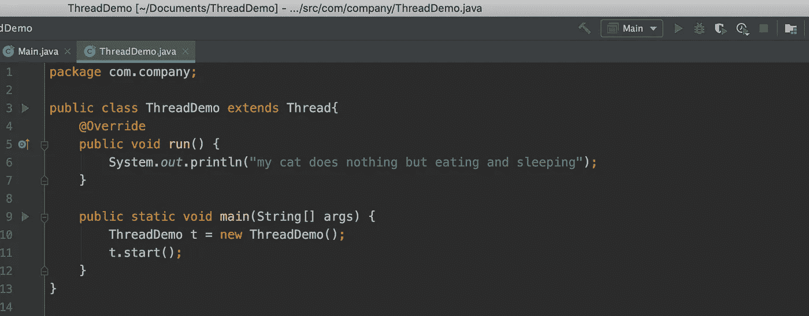
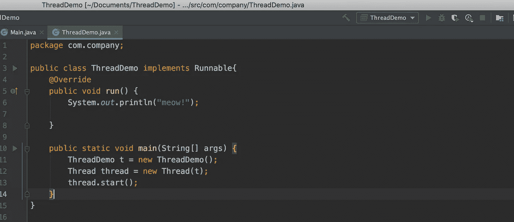
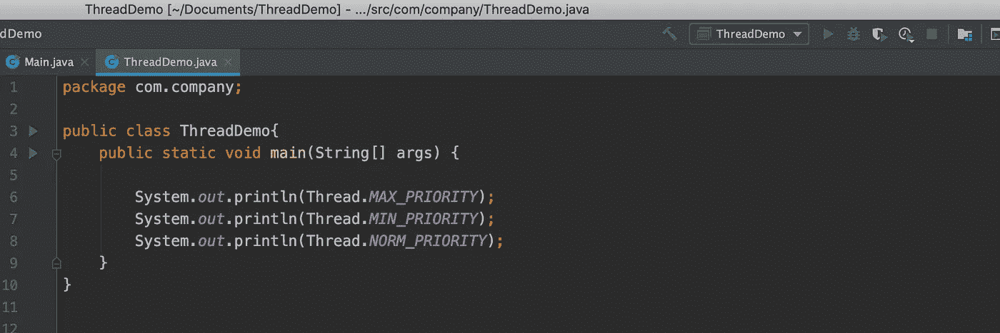
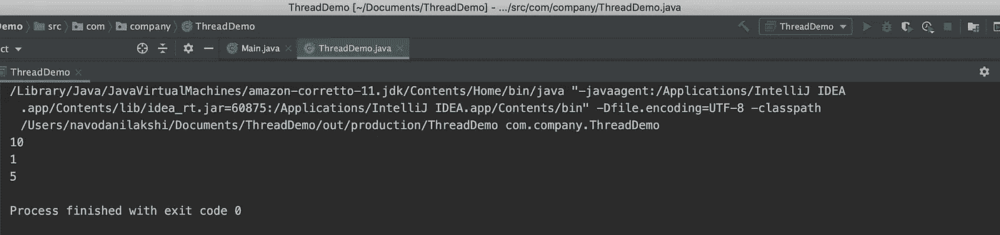
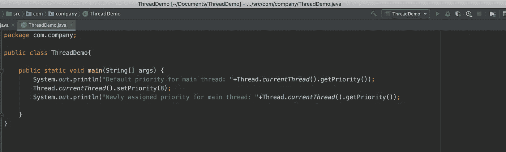
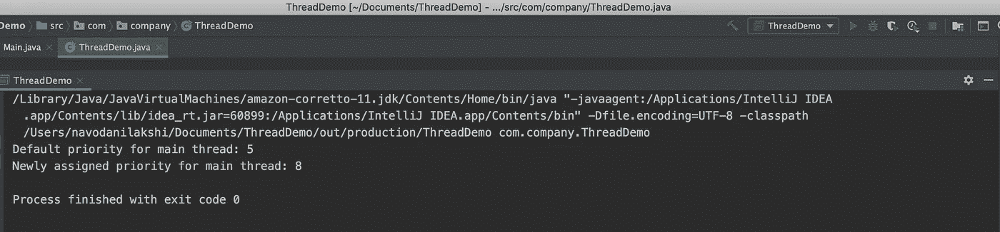
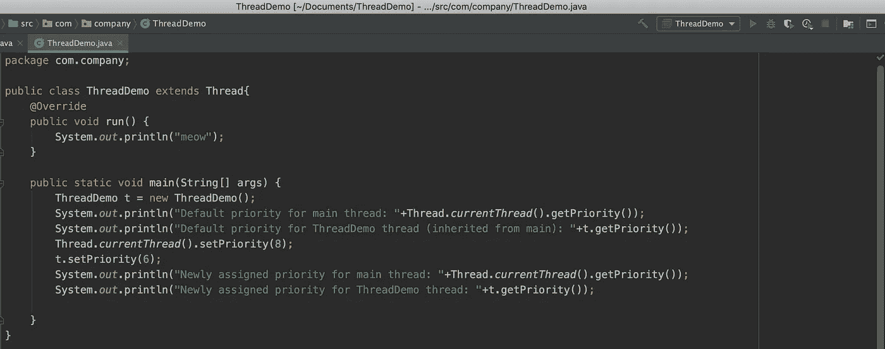
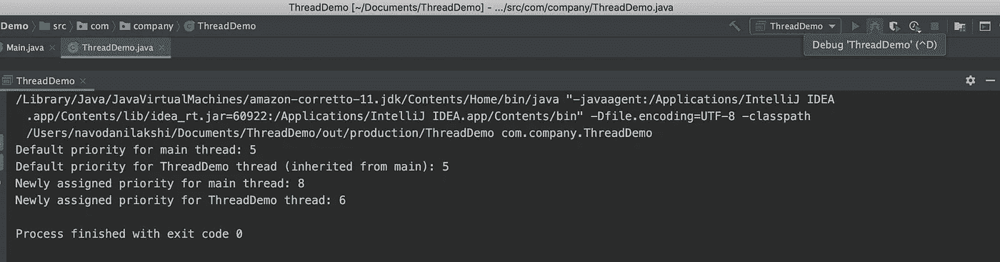

# Java 多线程的神秘世界:先睹为快。

> 原文：<https://medium.com/codex/mysterious-world-of-java-multithreading-a-sneak-peak-b994c19634ce?source=collection_archive---------17----------------------->

你好啊。在这篇文章中，我将带你踏上一段小小的旅程，揭开 Java 中多线程的神秘面纱。如果你对*多线程*有一些基本的了解，那么你很有可能听说过*线程优先级*。但是在我们深入研究之前，首先让我们消除疑虑。让我们从理解什么是*线程*开始。

根据 Oracle 文档，这就是线程的含义，

> “一个*线程*是一个程序中的执行线程”。

至少对我来说，这听起来信息量不大——对不起甲骨文:(。没必要把事情搞得太复杂。所以，我们开始吧！一个**线程**基本上是一个独立的程序执行路径。这意味着可以有几个*线程*同时执行，这取决于程序，但彼此之间没有任何依赖关系。这实际上是将*多线程*带到图片中的原因。

这样想吧。假设你有 5 个不同的任务，(这可能需要相对较长的时间来完成)你需要在一个程序中执行，这些任务彼此独立。在这个快节奏的世界里，我们不能几十年如一日地坐在电脑前等待程序执行完毕。或者出于更好的原因，如以最佳方式利用我们有限的系统资源，如 CPU，我们将热烈欢迎任何可以同时运行我们 5 个独立程序的方法。嗯，这就是*多线程*的全部！

所以，对于你的 5 个任务，你可以叫 5 个“主管”给他们每人一个任务。这些主管的工作是完成交给他们的任务。现在用“线程”代替术语“主管”,这就是全部了。

# 主流中泓线

不管怎样，每个 Java 程序中都有一个线程，而且是主线程。它负责让你的程序开始。即使没有明确定义，默认情况下主线程也是可用的。启动用户定义的任何辅助线程都是由主线程完成的。主线程启动任何其他线程，然后该线程处于可运行状态，直到它从 JVM 获得机会。

**定义螺纹的方法。**

在 Java 中有两种定义线程的方法。

1.  通过扩展线程类。
2.  通过实现 Runnable 接口。

**通过扩展线程类定义线程:**

**通过实现 Runnable 接口定义线程:**

如果你不熟悉*多线程*，你可能想知道这些方法是什么，以及我刚才演示的所有奇怪的东西。但是不要担心，它们并不是很难理解的东西。

**run()** 是让线程完成预期任务的地方。这是定义线程一旦开始执行应该做什么的地方。它可以是像我例子中的一句愚蠢的话，也可以是一项改善人类生活的开创性任务。不管是什么，只要把所有东西都放在 run 方法中，就可以开始了。

**start()** 方法是一切魔法的开始！。由于某种原因，Thread 类的 start 方法被认为是 Java *多线程*的核心。如果没有 start 方法，我们甚至不会在这个例子中使用*多线程*概念。如果您编译这些代码，您会注意到 run 方法甚至没有调用就被执行了。那是因为 start 方法会自己调用 run 方法，而程序员不会自己调用 run 方法。如果程序员显式调用 *ThreadDemo* 对象上的 run 方法，那么 run 方法将被视为任何其他方法，主线程将执行 run 方法中的任何内容，而无需创建*线程*。

# 线程优先级。

现在，如果你定义了多个线程，每个线程都有一个优先级。它可以是*默认线程优先级*或由程序员设置的值，具体取决于任务的重要程度。

在 Java 中，要使*线程优先级*有效，它应该在 **1** 到 **10** 之间，其中 1 是最低优先级，10 是最高优先级。5 被认为是标准优先级，也就是默认优先级。

具有高优先级的可运行线程(意味着 start 方法已经被调用)将会得到 JVM 的特别关注，而具有低优先级的可运行线程*将会被保存到最后。*

在*线程类*中定义了一堆常量，可以用来演示这一点(好的..不是束，只是 3)。

输出:

对于主线程，默认的线程优先级是 5。对于其他用户定义的线程，将有一个默认优先级，该优先级继承自父线程(*主线程*)，也是 5。

但是作为一名程序员，你可以为你梦想中的任何线程设置任何优先级。有两种非常简单的方法来获取和设置线程的优先级。

这将返回以下输出:

您也可以使用线程引用以同样的方式为其他*线程*设置优先级。

输出是:

当使用*线程优先级*时，可能会有这样的情况，你会觉得自己搞砸了，因为你得到了奇怪的输出序列，低优先级线程的输出在前，高优先级线程的输出在后。这是因为一些平台不支持*线程优先级*(如果你还记得你的*集合*，你可能还记得*优先级队列*的情况)。

嗯，这是对多线程世界的简短介绍。希望你对基本的*多线程*概念有了更好的理解。得走了。再见！