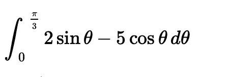
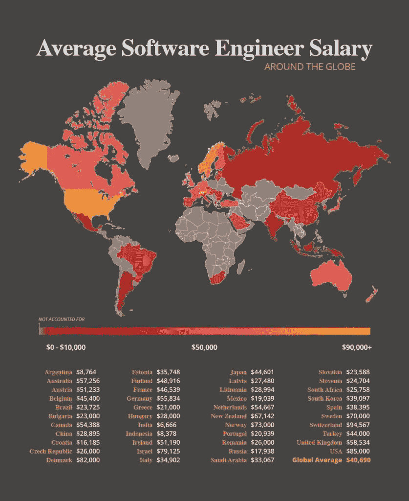

# 关于编程的神话

> 原文：<https://medium.com/codex/myths-about-programming-f28b49036567?source=collection_archive---------12----------------------->

## 我在软件工程领域 10 多年的经验和更多的东西。

我从 8 岁开始开发，用 Basic 作为我用来编码的第一种计算机语言。目前，我是一名游戏开发人员，在算法交易和神经网络方面有经验。今天，我想分享一些与这个职业相关的神话的想法。这份出版物对新手和用编程的老一套思维方式思考的专业人士可能是有用的。

# 大量的数学

程序员的噩梦

你能解决上面的例子吗？我不能。我敢打赌许多伟大的程序员不能。我会说，对于一般的开发人员来说，数学完全没有必要。计算机科学专业的学生学习微积分，并在算法复杂性方面运用他们的知识，但仅此而已。

有人会说数学能提高逻辑思维能力，训练你的思维。也许它对那些在任何地方都使用物理和数学的复杂数学工作的人有用。但我肯定他们有单独的设计良好的现成的数学库，之前已经测试过了。

数学对于一个平常的程序员真的有必要吗？不要！但是..

当然，基本算术是有帮助的，它有助于解决比例问题，测量百分比，评估条件，甚至简单的数学运算都要用到算术。任何其他数学部分(线性代数，微积分，几何等。)都太具体了。但无论如何，即使在游戏开发中，它也不经常使用，许多需要的数学公式可以在网上找到。

# 工资超高

多年来，程序员的高薪一直被认为是相当高的。但即使这被认为是大多数国家的真实情况，你也需要弄清楚你自己选择的是哪个软件工程方向。

软件开发需求正随着市场的需求而变化。如果回到 2014 年，一名. Net 开发人员可以指望大量的职位空缺和 8 万美元以上的平均工资，那么今天这个中位数已经下降到 7 万美元，对这类专家的需求也大大减少了。然而，机器学习和以太坊区块链的开发者的情况要好得多(过去几个月，我看到这些领域有了很大的增长)。

长期做程序员 10 年，会赚很多吗？

有些行业的工资和需求实际上保持不变，这些行业只会变得更好，例如 GameDev，从游戏机开始，然后转向电脑，移动设备，现在进入 AR / VR 游戏时代，不需要大量新的材料进行研究，永恒的标准保持不变，当然，我们可以谈论在开放世界中改进图形和优化，但这不是这个话题。

所以，关于高薪的话在当下依然成立，但由于人员的高度竞争和技术的不断过时，它们已经失去了力量。保持自己作为一个有竞争力的开发人员需要比乍看起来更多的努力。

# 在巴厘岛只工作 3 小时

在大多数初学者和专业人士看来，当他们达到更高的职位或获得更多的知识时，任务数量会减少，或者工作会减少到只由下属控制，拥有必要的技能，就足以去巴厘岛并在那里每天工作 3-4 小时，获得天价收入。

约瑟夫·弗兰克在 [Unsplash](https://unsplash.com/s/photos/freelance) 上的照片

可惜花的时间和你的技能成正比。迄今为止，市场竞争相当激烈，来自亚洲的开发商正试图寻找大型项目并降低成本以获得报价。这样，项目经理可以减少支付成本，增加对项目的要求。

与全球各国相比的软件薪资

这是一个成熟行业的常见标志。
事实上，5-7 年前，开发人员的价值就像金子一样，一个普通的开发人员可以在岛上进行远程工作，而不用考虑竞争。今天，强制性的计划会议上没有一个员工，低交流，工作小时数少，软技能差是裁员的主要原因之一。

开发拖拖拉拉，为了省钱，期限越来越短，程序员经常加班。目前，只通过硬技能来评估真正优秀的开发人员已经变得很困难，因为许多开发人员只为培训投入了大量时间，但与此同时，他们没有足够的自尊来竞争工资。这样的人也开始降低市场上一个程序员的成本。

# 编程很有趣

许多人认为编程中有很多创意、有趣的任务、巨大的成就。然而，在大多数情况下，这是不正确的。如果开发不在你的项目中，那么在大多数情况下，一切都会受到客户需求和/或预算的限制。一切都是以这样一种方式构建的，随着技术和经验的增长，每个开发人员都开始做越来越多的日常工作——遵循需求，构建和调试架构，修复复杂的错误，测试和优化系统，重构代码的旧部分。

编程并不总是有趣和创造性的任务。

当然，这取决于感知，对我来说，例如，一个创造性的任务是一个开发不是基于代码的质量，而是基于结果的效果。

> 正如我过去的一位导师所说，没有什么是不能被编程的。

我同意这种观点，实现任何想法都是可能的，但必须记住，即使是最不寻常的任务有时也取决于使用程序员建立的现有架构标准和规范实现的复杂性。许多技术高超的开发人员无法脱离他们使用的模式和范例，这使得实现变得枯燥、简单，并沦为每个人都必须遵循的普通标准。

有时花时间研究问题的原因或研究以前未知的主题特征也是一种巨大的荣誉。结果，有时，对于一整天艰苦的脑力劳动，只写一行代码，尽管这种疲劳与编写大型功能是相称的。这就导致了心理问题。

# 结论

无论关于编程的神话是什么，无论这个行业是什么，就方便性和安全性而言，它仍然是最好的之一。多亏了 IT 行业，人类获得了大量的知识，而这些知识以前如果没有文献的帮助以及生活中大量的尝试和错误是无法获得的。今天这个问题已经解决，信息领域已经扩大。编程开发思维，解决逻辑问题的能力，以及创造性的人才。

发展，学习和调查新事物，但不要忘记还有一个世界肯定需要探索，不要只从事工作和自我发展！