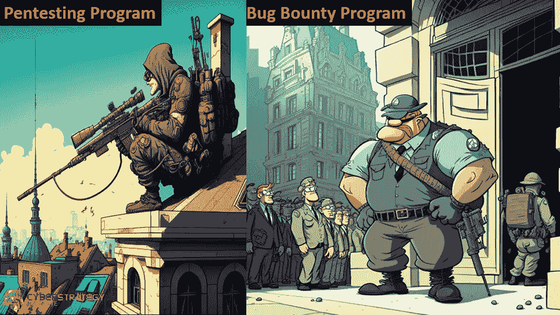
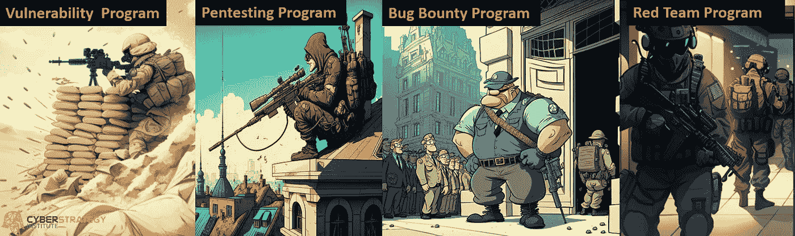

# 围绕 Pentesting 的神话和误解

> 原文：<https://medium.com/codex/myths-and-misperceptions-around-pentesting-3c214ec8a5a3?source=collection_archive---------3----------------------->

渗透测试是最可靠的网络安全工具之一，可确保您的数据和安全基础设施始终安全。

然而，由于互联网的迭代性质，pentesting 可能类似于网络安全领域的许多其他方法。为了避免混淆，我们将探讨 pentest 与其他网络安全方法和工具有何不同。但首先，让我们设定我们的基线理解，并确定什么是圣灵降临测试不是。

# 什么是圣灵降临节？

渗透测试是一种模拟道德黑客对系统进行网络攻击的测试方法。根据蓝队(防御者/网络安全团队)和红队(攻击者/道德黑客/pentesters)提供的信息，它有 3 种不同的类型:

*   白盒 pentesters 和安全响应团队之间的协调测试。每一步行动都被双方打了电报。对于训练和理解攻击是如何进行的非常有用。
*   灰色框-双方信息有限。攻击者只有最基本的信息，通常只是目标组织的名称。辩护人知道将进行笔测试，但他们不知道何时或如何进行。更接近真实世界的场景，同时确保蓝队仍然清楚，以便他们可以准备和分析。
*   黑盒—类似于灰盒，只向攻击者提供目标名称。然而，卫冕队并不知道这次测试。只有组织中请求测试的高层管理人员知道。就像是防守队的期末考试。测试系统和蓝队如何应对攻击。

既然我们已经对什么是笔测试有了基本的了解，现在让我们来确定它不是什么。

# Pentesting 不是漏洞评估。

漏洞测试就像从一个固定的位置开火，你喷射和祈祷寻找那些漏洞。

这个术语也是 pentesting 的另一个语义论据。从技术上讲，pentesting 的目的是评估系统的脆弱性。

然而，术语“漏洞评估”主要是指专门寻找已知的软件、计算机或网络中的漏洞的无监督安全测试。它的程序与 pentest 类似，但 pentest 的目标是通过利用系统来实际证明什么是易受攻击的。

pentest 和漏洞评估之间的主要区别在于使用的工具会产生大量信息、误报，并可能误导您对某些漏洞的认识，而这些漏洞正是您系统的实际特征。大多数系统管理员害怕这个结果，因为在某些方面，他们必须手动仔细检查一切。

系统管理员害怕漏洞扫描结果。

而 pentest 由专业 pentesters 使用已知或未知的漏洞来执行，以证明系统是安全的。

其他 pentesting 服务，如我们的 Mimic 系统，也是自动化和自治的，但仍然受到我们的测试人员的限制和观察。

虽然漏洞测试比传统的渗透测试更快更方便，但它可能会导致误报或不准确的建议。这意味着结果可能不是最符合业务的。因此，它可能比 pentest 效果差得多，而且更耗时。

系统管理员一边喝着咖啡，一边阅读专业 pentester 的结果。

像 pentesting 这样的服务中最关键的因素是专业知识。具有多年经验的 IT 专业人员可能会查看防火墙并得出结论，认为它足够安全，而渗透测试人员可以仔细查看防火墙并真正确定它是否真的可以作为防御机制很好地发挥作用。

但是对于组织需要快速简单的扫描而不是全面的侦察的情况，人们可以选择进行漏洞测试。有时，它已经是防病毒软件包的一部分，所以个人也可以利用它。

# 圣灵测试 vs 虫子奖励

当使用 Bug 赏金时，结果总是不一致的；你永远不知道谁会真的发现什么或报告它。

Bug 奖金也有类似的方法来进行 pentest 然而，测试的交付、测试人员和支付系统是不同的。把传统的圣灵降临节想象成与代理机构合作，而昆虫赏金则是与自由职业者合作。

臭虫赏金的作用正如它所描述的那样。一个组织将联系道德黑客的个人或团体，然后在他们发现系统中的错误、漏洞或漏洞时奖励他们。正如你所看到的，这可能是一个成本有效的方式来实现一个 pentest 的结果，而只支付当你已经有了结果。

然而，它不像普通的 pentest 那样彻底或有组织，因为它更像是一个非正式的任务邀请，而不是一个正式的合同，其中设定了适当的期望。这导致你永远不知道在等待有道德的黑客发现什么的时候，谁在真正地查看你的代码、系统或环境。他们也没有回应，这意味着你现在是在他们的时间线上操作，而不是你的。

通过 bug bounty 获得的报告和建议可能没有 pentest 的质量好。因为 bug 猎人只是被激励去寻找安全控制中的弱点，所以与组织执行的渗透测试相比，他们可能不会采用彻底的测试过程。

Bug 猎人也没有和做官方渗透测试的正式组织一样的审查系统。Bug 猎人可能只是初露头角的白帽黑客，也可能实际上是伪装的黑帽黑客，因此您的信息可能处于危险之中。另一个限制是，他们只为你提供足够的信息，以便为已识别的漏洞获得报酬，而不是导致它的原因。如果被要求，你也不太可能得到额外的信息，因为它们对你没用。

因此，虽然 bug 赏金在短期内听起来很经济，但它有很多缺点，网络安全社区并不真正推荐它，因为随着时间的推移，结果会不一致。它确实有广告价值，但如果您在时间紧迫的情况下需要展示改进、满足法规遵从性要求或从事故中恢复，它将无法帮助您获得您需要的东西。

# Pentesting 不是道德黑客行为。

在这种情况下，这只是一个语义上的争论。所有的 pen 测试都是道德黑客，但不是所有的道德黑客都是 pentest。

简单来说，渗透测试是道德黑客的一种形式。道德黑客不仅仅限于笔测试。道德黑客可以使用多种方法来利用系统并在未经授权的情况下进入应用程序，从而发现易受攻击的系统、应用程序、网络或物理访问，从而发现组织系统中的安全问题，pentest 只是其中一种方法。

# Pentesting 不是红队。

红队有能力穿越你的数字环境，而不受约束。

我们知道红队是模拟高级对手的“攻击方”,如业余爱好者、黑客(道德与否)和国家支持的演员。红队的区别在于他们的目标，利用一个缺陷或缺陷的组合来实现他们寻找或泄漏数据的目标。

pentest 用于了解和发现安全缺陷，并通过预先确定的模拟攻击找到漏洞，通常仅限于特定的网络、系统或应用程序。这是一个更加通用和有针对性的测试，用于验证组织的整体安全状态。

另一方面，Red Teaming 是由有道德的黑客执行的测试过程，其目的是获得对系统内特定文件或目录的访问权。该过程与 pentest 相同，pentest 用于检查安全系统特定部分中的安全漏洞和可利用部分。

红队也可以通过特定的场景来执行。其中只有组织中的关键涉众知道该测试。这是为了了解蓝队的安全措施是如何工作的，并展示安全队如何应对在其环境中检测到的违规行为。虽然红队是最终的方法，但能有效地组成红队的人很难找到、雇佣和留住。因此，一般的组织可能永远无法利用这种高级功能。

了解每种方法是如何融入您的组织的网络安全防御的！

# 结论

组织要求进行渗透测试的原因是，传统上渗透测试更经济实惠，结果更具体，有助于他们达到合规标准。信息是你花钱买的，即使它不会很快被 pentesters(平均 2-6 周获得最终报告)所改变。一个组织的目标应该是达到他们可以更频繁地测试的程度。

最终目标是在每次对系统、网络或应用程序进行重大更改后，运行一次 pentest，以验证这些补丁是否有效。挑战在于安排这些活动的组织成本。即使您的组织内部拥有这些资源，安排资源和获取结果也需要时间。这就是人们转向 Pentesting as a Service (PaaS)提供商的原因。利用他们的平台，您可以将您的测试从每年一次或每年 2-4 次扩大到每月一次、每周一次或按需进行。这是未来，利用人工智能(AI)或高级机器学习(ML)方法来了解您组织的环境，并不断能够利用 PaaS 平台，不仅相信事情已经修复，而且验证它们是安全的！

如果您有兴趣了解更多关于 PaaS 的信息，请给我们留言！

# 关于网络战略研究所

正在为个人、小型企业和初创团队带来网络安全领导力和工具，以更好地保护他们的数据免受犯罪分子的侵害。我们的信任但核实方法是基于我们在保卫美国空军和国防部的同时处理数千起网络安全事件的背景。

提供一套网络安全工具，专注于为中小型组织、初创企业和区块链组织提供所需的执行层领导力、规划、分析和洞察力，以创建他们自己的蓝海。

我们通过激励项目和人员来做到这一点，使他们能够完成比他们最初认为可能完成的更多的事情。这是通过用网络安全、#L1/L2s #DeFi、#NFTs、#GameFi、事件响应、大数据、创造收益/流动性、文化和#知识产权方面的“战略真理”来解决加密项目的最大挑战来实现的！

要了解更多关于我们的方法和工具的信息，请联系我们。

网址:[https://cyberstrategyinstitute.com/](https://cyberstrategyinstitute.com/)

[**碎碎念**](https://twitter.com/CyberStrategy1) | [**中等**](https://cyberstrategy1.medium.com/)