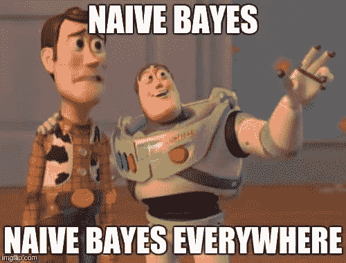
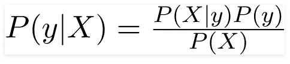
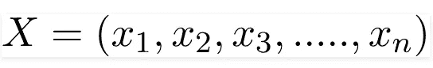
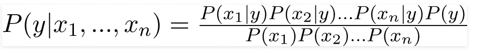
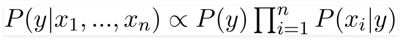
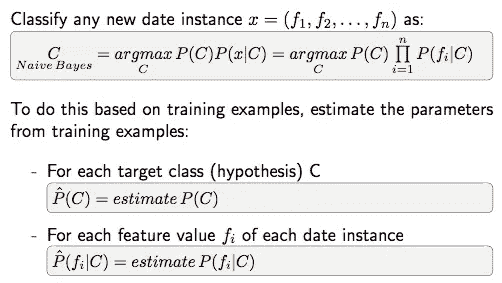
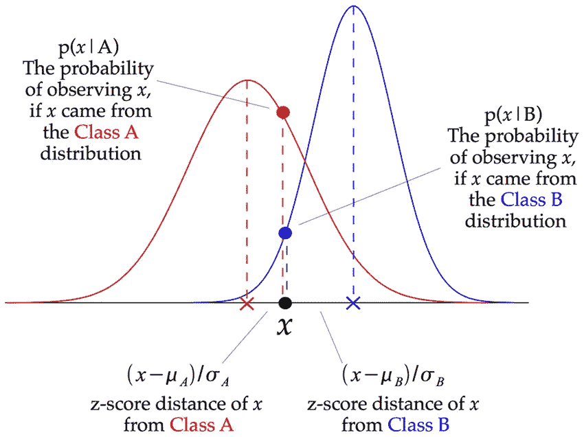
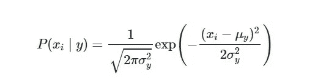

# 朴素贝叶斯分类器

> 原文：<https://medium.com/codex/na%C3%AFve-bayes-classifier-1513a1510e18?source=collection_archive---------5----------------------->

## [法典](http://medium.com/codex)

概率机器学习模型

朴素贝叶斯分类器属于用于分类任务的概率机器学习模型家族。这个分类器的基础是基于贝叶斯定理。

> 那么让我们看看什么是贝叶斯定理

# 贝叶斯定理

下面的公式描述了贝叶斯定理，其中我们发现一个给定的 B 发生的概率。

从贝叶斯定理到朴素贝叶斯

这是贝叶斯定理的公式，其中 X 是特征向量

现在我们在这里做一个假设，假设一个特征的出现完全独立于其他特征的出现。不会有一个对另一个的影响。所以才叫幼稚。这意味着如果我们有两个特征['好'，'棒极了']，我们看到了'好'的概率，你就不能说'棒极了'的概率。

这里的另一个假设是，所有的预测因子(特征)对结果有相同的影响。

现在扩展我们的 X，应用链式法则，我们得到

我们可以看到分母(归一化因子)是惰性的，所以我们可以去掉它，将等式改写为

预测将通过判断哪个类给我们最大的概率来进行-

## 朴素贝叶斯分类器的类型

*   **高斯朴素贝叶斯**:在高斯朴素贝叶斯中，假设与每个特征相关联的连续值按照高斯分布分布。它给我们钟形曲线。

求概率的公式-

*   多项式朴素贝叶斯:这主要用于文档分类问题，即文档是否属于体育、政治、技术等类别。分类器使用的特征/预测值是文档中出现的单词的频率。
*   多元伯努利朴素贝叶斯:这类似于多项式朴素贝叶斯，但预测因子是布尔变量。例如一个单词是否出现在文本中。

> 朴素贝叶斯定理速度很快，但由于它假设每个预测器都是独立的，所以它不太适合现实世界的问题。

完整的实现请参考下面的 GitHub 链接

 [## ads-22/ML-实践

### 在 GitHub 上创建一个帐户，为 ads-22/ML-Practice 开发做贡献。

github.com](https://github.com/ads-22/ML-Practice/blob/main/Task-13%20Naive%20Bayes/Mushroom%20Dataset.ipynb) 

数据集链接-[https://www.kaggle.com/uciml/mushroom-classification](https://www.kaggle.com/uciml/mushroom-classification)