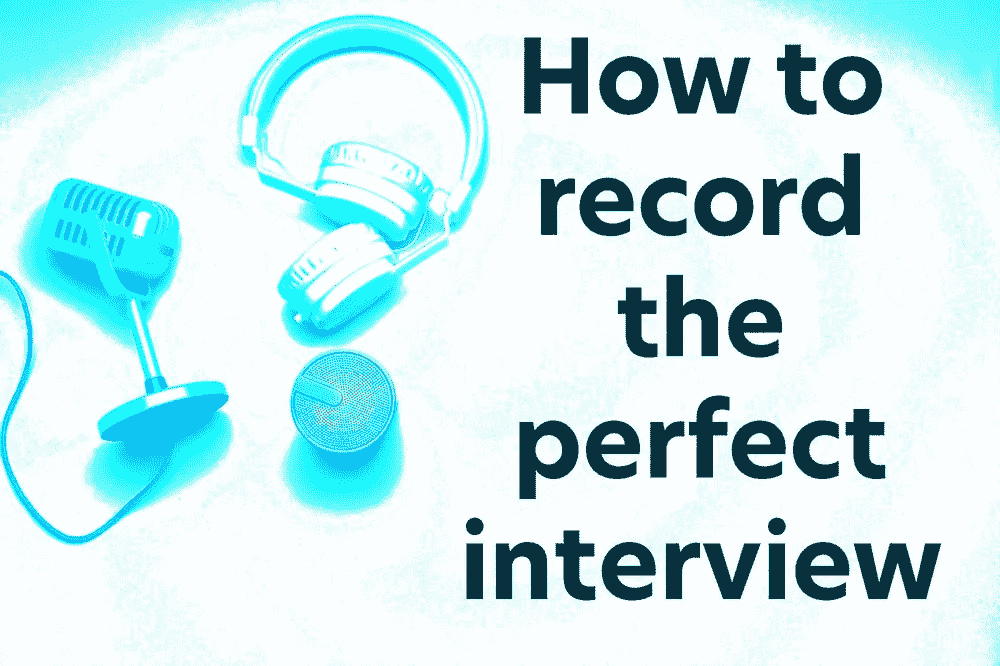
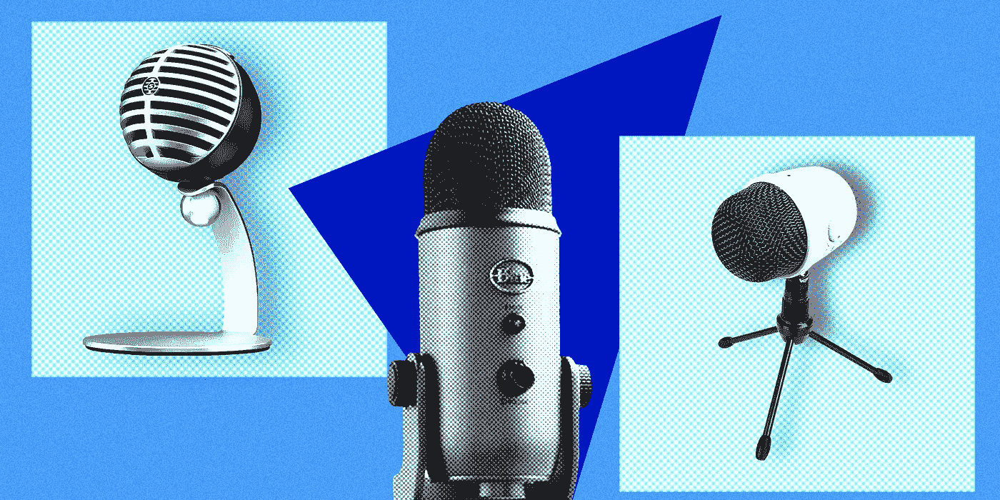
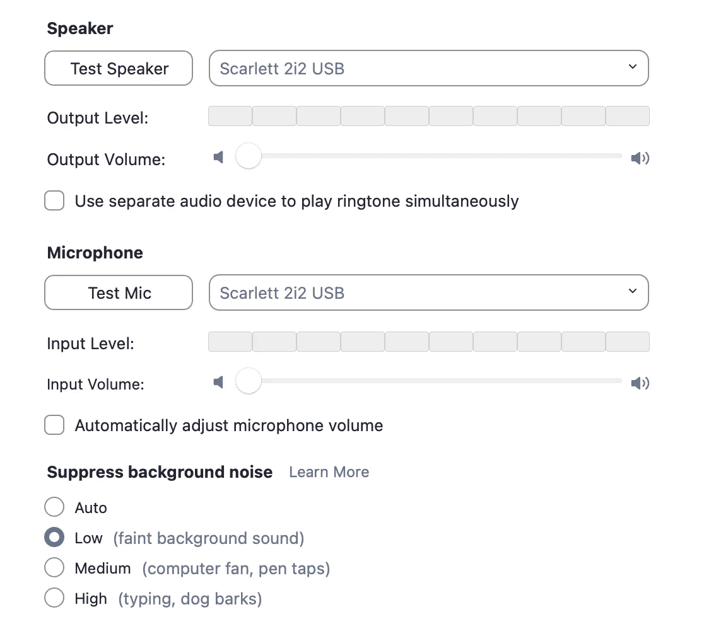
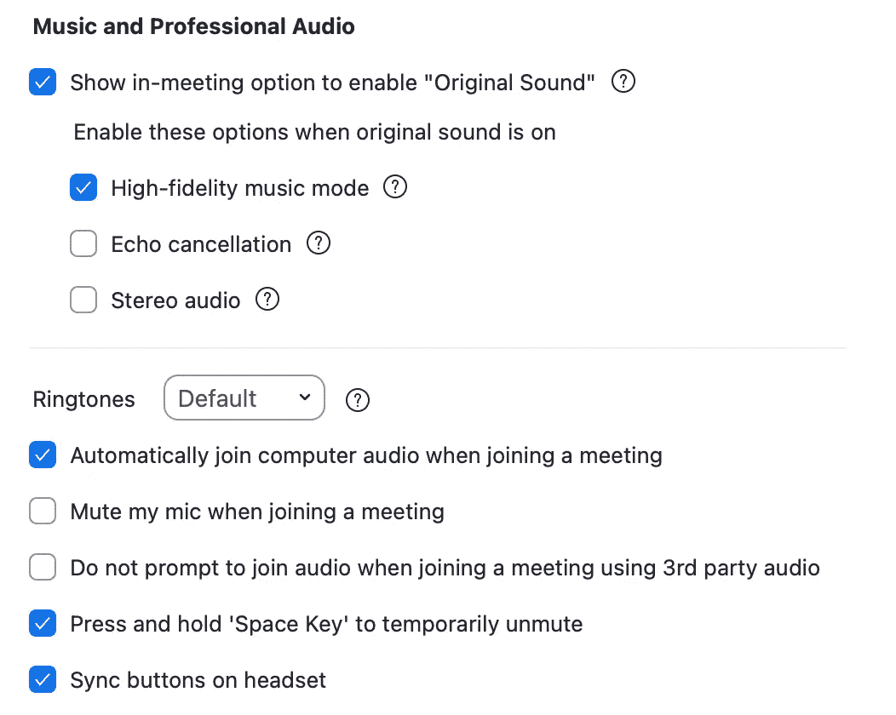
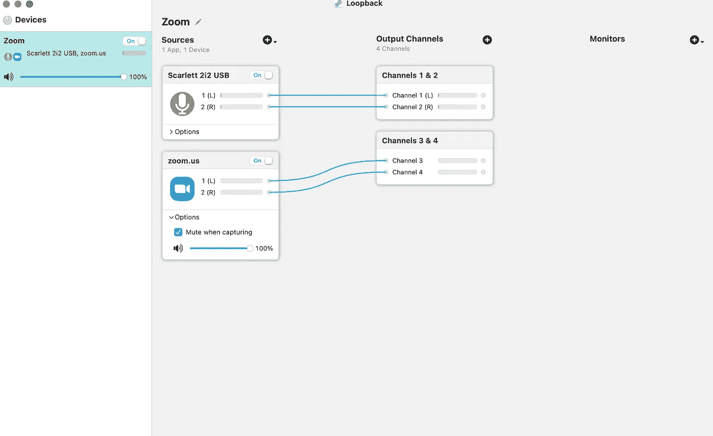
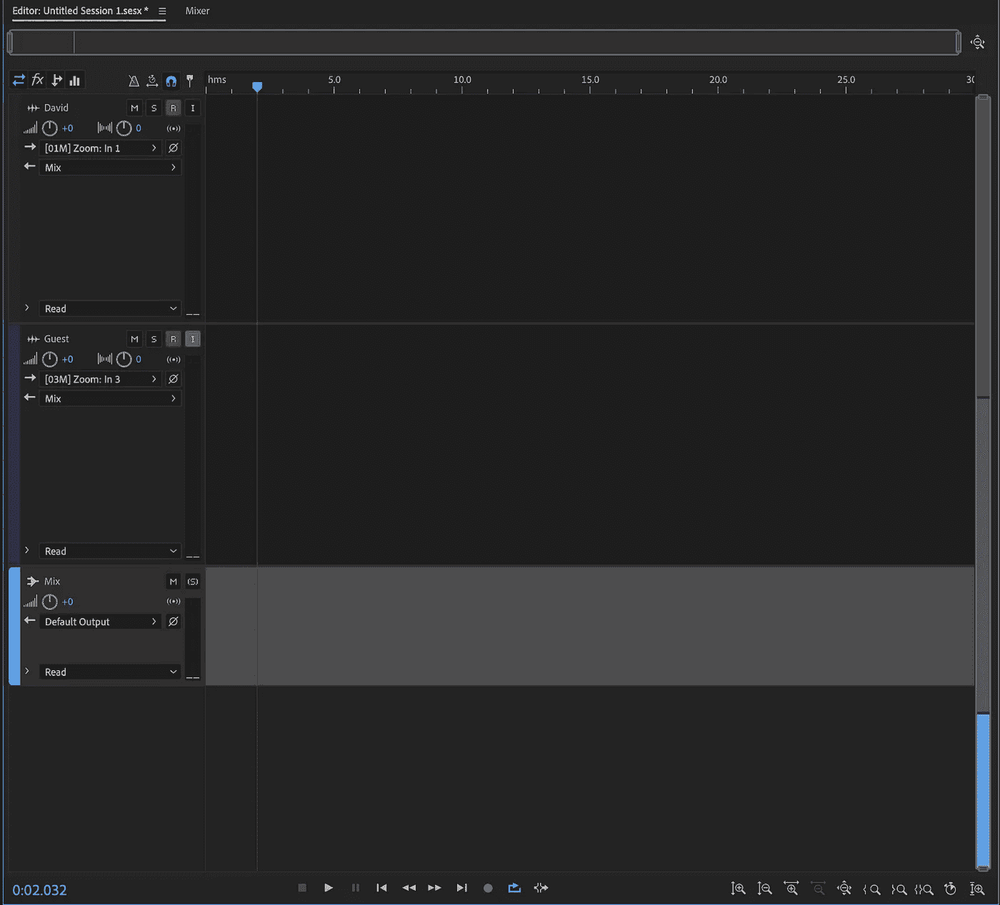

# 搞定面试

> 原文：<https://medium.com/codex/nailing-the-interview-f10efb41b36a?source=collection_archive---------19----------------------->

## 如何进行采访…并在苹果电脑上记录下来

最佳面试实践

***直到去年年底，我主持音乐广播节目。这三个每周一次的节目中有一个是围绕采访爵士乐界的主要和杰出的嘉宾。像*******这样的嘉宾，克莱尔·蒂尔，中国·摩西和李约翰只是和我一起非正式聊天的几位音乐家。许多人告诉我，他们感觉超级放松，享受上场比赛。作为主人，我想不出比这更好的赞美了。在这篇博客中，如果你带客人来你的播客，我会给你一些提示。****

## *让他们容易些*

**

*有一系列播客麦克风可供选择*

*这是关键。如果你想让客人着陆，那么你就要尽可能地多做些工作。如果可能的话，试着给他们发一封请求邮件。它更像是一种商业行为，更少侵扰。在 YouTube 上，你通常会在创作者的个人主页上找到电子邮件。对于其他艺术家或客人，看看他们的网站或 Twitter。保持你的请求简短、礼貌、犀利。让他们知道你所在的时区。这有助于他们考虑何时需要有空。告诉他们你需要和他们在一起多长时间，以及你会问什么样的问题。此外，非常重要的是，告诉他们你将如何主持面试，例如通过 FaceTime 或 Zoom。另一个提示是，如果有帮助的话，你可以录下你这边的音频。你真的希望他们有尽可能简单的体验。建议一些日子或日期，然后把它留在那里。礼貌地询问他们是否能在一个安静、友好的环境中录音总是值得的。如果我看到一个客人坐在他们的厨房里，我的心就会沉下去！我知道我在邮局的工作会很艰难。*

* [## 我的 Mac 奥德赛

### 从 PC 到 Mac 的旅程

medium.com](/codex/my-mac-odyssey-79c344139c11)* 

## *准备妥当*

*我怎么强调这一点都不为过。许多客人提到他们感到很轻松。如果你有一个放松的客人，感觉就像是朋友之间的谈话，你总是会得到更好的结果。这不是来自于运气，而是你在上线前投入的努力码。查看他们的网站，谷歌他们的名字，查看 YouTube 上以前的采访。利用一切你能想到的资源。我甚至会查看广播电台的采访服务，试图找到以前的采访。我获得的信息越多，我感觉越好，越放松。这也表示尊重。他们会知道你是否有备而来，相信我，这*会*很重要。我在 Mac 上使用了 Notes 应用程序，并在整个面试过程中一直打开着它。我会记下我也想让它运行的粗略顺序。它从来不是照本宣科的，而是一个清晰、简明的路线图，告诉我该如何进行面试。*

## ***可见***

**

*只需一次就能获得正确的缩放设置！*

*我以前只录音频，根本不用视频。我开始了解到虚拟的面对面真的很有帮助。它打破了一个障碍，会感觉更加个人化。但是…一定要提前警告他们。我通常会说*“我将只录制音频，但在采访中使用视频……你同意吗”？**

* [## 所以，我想我终于明白了！

### 那就是苹果电视，这也是我为什么要加入的原因

medium.com](/codex/so-i-think-ive-finally-got-it-616359b03673)* 

## *现在谈谈技术部分*

**

*缩放中的我的音频设置*

*好了，你已经安排好了你的客人，现在是你不想搞砸的时候了！捕捉采访。我是一个音频势利者，这对我很重要。有更简单的路线，但我会告诉你我如何去做，因为我认为它可能会有所帮助。首先，设置放大以优化其音频。我附上了一些我的音频设置截图。这只是为了更好的交谈质量，就这么简单。确保你的照明良好，背景清晰整洁。所有这些都有助于你被专业地描绘出来。这里聪明的一点是从 Zoom into your DAW 获取音频，在我的例子中是 Adobe Audition。*

## *虚拟界面*

**

*环回是一个很好的虚拟接口*

*你要做的就是创建一个虚拟音频接口。我发现最好的是[回环](https://rogueamoeba.com/loopback/)。同样，您可以从我的屏幕截图中看到，我所做的是将我的输入带到一个通道，然后选择 Zoom 作为另一个音频输入。Loopback 使用起来非常简单，一旦设置好，您就再也不需要考虑它了。*

*就这样，试镜结束了。通过环回虚拟接口录制的美妙之处在于，您现在可以将会话录制为多轨道。当然，这意味着您现在可以独立编辑和均衡您和客人的声音。特别是如果是男性/女性的情况，这将是非常宝贵的。下降和滚下基地等将变得简单。*

## *该会议*

**

*Adobe Audition 是我的选择*

*现在，在试听，你可以设置你的会议如图。你需要监听客人的声音，但不是你的声音。作为备份，如果您的客人愿意，他们可以在他们的工作室录制会议，然后将文件发送给您。确保在课程开始时，你们两个都用力鼓掌。如果你要走这条路线，音频水平的巨大峰值会给你一个标记来对齐两条轨道。你可以均衡，添加降噪和匹配后的两个轨道的音量。当会话结束时，我喜欢把它保存在至少两三个地方。我曾经失去了一次面试机会…不要犯同样的错误。*

*负十六播客*

## *良好实践*

*一旦我和我的主持人准备好播客，我总是会给客人或他们的管理人员发送链接，链接到最终节目可以找到的各个地方，如苹果，Spotify 和 Podbean。这是感谢他们的时间和投入的最好方式。也宣传一下。你已经做了所有的艰苦工作，所以要确保尽可能多的人知道这件事。*

## *结束的*

*如果你正准备开始为你的播客录制采访，希望你会发现这很有用。我有几个伟大的客人排队，所以一定要订阅[减十六](https://open.spotify.com/episode/2MMWqUlvGKOu2hiffxVYmh?si=36b73769e2f44ab2)。邀请嘉宾是我所知道的提升播客的最好方式。两个人的互动是无与伦比的。现在你知道怎么做了，去预定一些客人。*

* [## 维修权利成为现实，iOS 16 新闻&更多关于 iPhone 14

### 苹果视图回合-2022 年 4 月 25 日至 4 月 29 日

medium.com](/codex/right-to-repair-gets-real-ios-16-news-more-on-iphone-14-6fee2039d7bc)* 

****出发前****

*你订阅媒体了吗？*

*我只是高端博客网站 Medium 的众多作者之一。这是如此好的价值，你可以加入这里[https://medium.com/membership](https://medium.com/membership)*

*加入我的幕后邮件[列表](https://medium.com/membership)*

*最初发表于 2022 年 5 月 4 日 https://www.talkingtechandaudio.com/blog。*