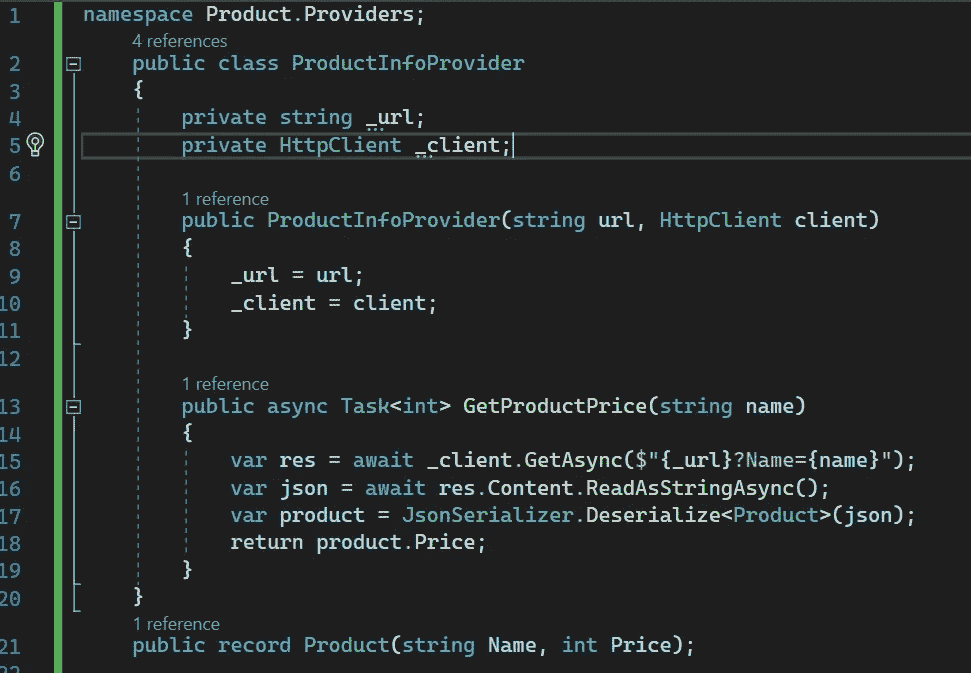
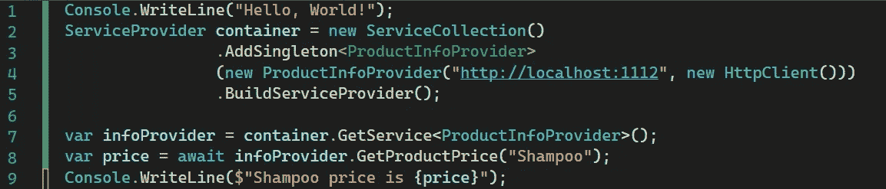
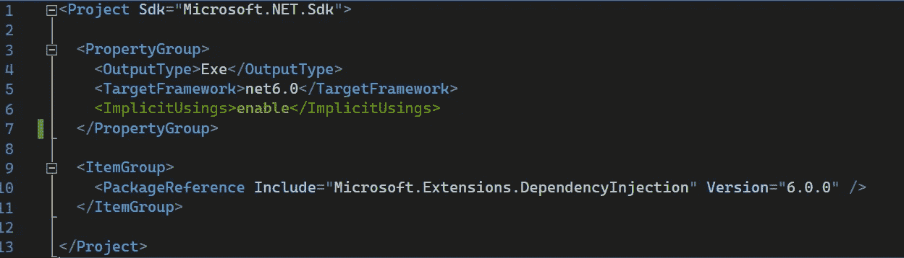

# C# 10 中的命名空间

> 原文：<https://medium.com/codex/namespace-in-c-10-6d26f337d931?source=collection_archive---------4----------------------->

C#中大量使用命名空间有两个原因:

*   。NET 使用命名空间来组织它的许多类。
*   在大型编程项目中控制类名和方法名的范围。

下面是一个声明名称空间并使用它和其他。带有关键字`using`的. Net 命名空间:

在 C# 10 中，我们介绍了一些关于名称空间和`using`实践的特性。他们在这里:

# 全局 using 语句

当我们的代码使用一个不同名称空间的类时，我们需要在文件的开头声明使用这个名称空间。这可能导致我们在项目的许多文件中反复声明同一个名称空间。`Global using`语句的主要好处是我们现在能够避免一遍又一遍地声明名称空间的混乱(比如`using System` 等等)。)在每个单独的文件中。相反，我们可以在`cs`文件中创建我们在项目中使用的所有名称空间(或其中一些),并防止它们在任何其他文件中声明。

下面是相同代码的外观:

包含我们使用的所有已声明名称空间的文件



# 文件范围的命名空间

> 这个想法是当源文件中只包含一个名称空间时，从源文件中删除一级缩进。目标是减少水平和垂直滚动，使代码更具可读性

如果您仔细观察原来的`ProductInfoProvider.cs`和更改后的，您会看到该功能的用途:

**原稿**

```
namespace Product.Providers
{
 public class ProductInfoProvider
 {

 }
}
```

**作用域名称空间**

```
namespace Product.Providers;
public class ProductInfoProvider
{}
```

# 隐式全局使用

这个特性创建一个隐藏的自动生成文件，声明`global using`语句。您可以在`obj`文件夹下看到该文件，文件名格式为<project name>. global using s . g . cs

通过将`<ImplicitUsings>enable</ImplicitUsings>`添加到`csproj`文件来打开该功能。



请注意，这个特性将根据项目类型为[特定的名称空间自动生成`global using`语句。](https://learn.microsoft.com/en-us/dotnet/core/tutorials/top-level-templates#implicit-using-directives)

**总之**，这些新特性并没有改变游戏规则，但是我们可以用它们来删除一些样板代码。