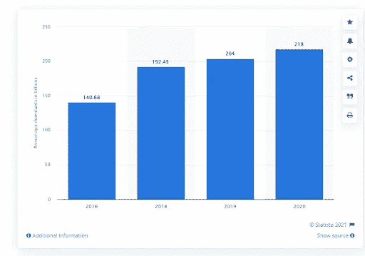
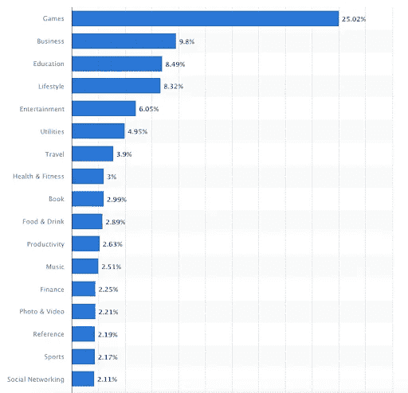
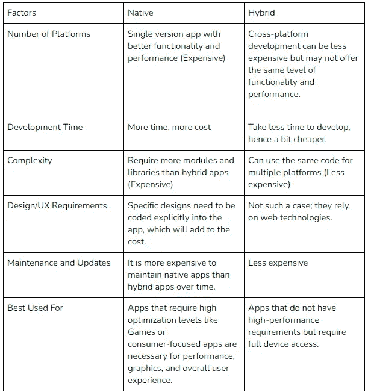

# 原生与混合移动应用程序开发成本因素分析！

> 原文：<https://medium.com/codex/native-vs-hybrid-mobile-app-development-cost-factors-a-breakdown-a97c196287c4?source=collection_archive---------4----------------------->

随着移动设备和可以在其上运行的应用的爆炸式增长，移动应用开发已经成为各种企业家的热门话题，从初创公司到财富 500 强的首席执行官。

虽然可以为 iOS 或 Android 设备编写原生和混合应用程序，但在决定采用哪种方法时有许多考虑因素。

本文分析了开发任何一种类型的应用程序所涉及的主要成本因素(本地与混合移动应用程序开发成本因素)。这也将帮助您决定是本地开发还是混合开发最适合您的需求和预算。

另外，你知道吗？自早年以来，移动应用程序下载的数量一直在稳步增长，预计到 2020 年**总下载量将超过 2180 亿次**。

图片来源:Statista

# **本地应用——它们是什么？**

图片来源:操作系统

当你听到人们谈论本地应用时，他们指的是为特定操作系统构建的软件应用程序:iOS、Android、Windows Phone 或 Blackberry(取决于你的受众)，并用该系统的相应语言编写——Objective-C、Swift 或 Java。

由于与底层操作系统及其功能紧密集成，原生应用通常被认为能提供更好的用户体验。

这意味着，与混合应用相比，原生应用可以访问更多的设备功能，如摄像头、联系人和位置数据。

原生应用开发成本: **$10 万-$ 30 万**

# **混合应用-它们是什么？**

图片来源:操作系统

当你听到人们谈论混合应用时，他们指的是使用 web 技术编写的应用，比如 HTML5、CSS 和 JavaScript。

混合应用通常是跨平台的，这意味着它们可以编写一次，在多个操作系统上运行。

这被认为是一个优势，因为你只需要开发一个版本的应用程序，减少了开发成本和时间。

然而，由于混合应用并不是为每一个特定的操作系统而构建的，它们通常不如原生应用可靠。

混合应用程序开发成本: **$50，000 — $150，000**

# 原生与混合应用开发成本因素

## **1。本地与混合:平台数量**

你的应用首先要考虑的应该是它应该在多少个平台上运行。

例如，如果你想要一个可以在 iOS、Android 和 Windows Phone 设备上运行的应用，你需要开发三个独立的版本，每个平台一个。

这将增加开发成本。然而，通过使用跨平台开发框架，你可以开发出一个可以在大多数设备上运行的单一版本的应用程序。

简而言之，原生应用程序的开发成本更高，但能在用户使用的设备上提供更好的体验。跨平台开发可能更便宜，但可能无法提供相同级别的功能和性能。

## **2。原生与混合:开发时间**

你花多少时间开发你的应用程序也会影响成本。

如果你想要一个具有高质量图形和自定义动画的应用程序，你的开发时间将需要比显示信息的简单实用程序更长。这种额外的开发时间意味着构建本地应用的成本更高。

iOS 应用程序可以比 Android 应用程序构建得更快。与 Android 相比，iOS 的开发速度大约比 T2 快 40%。原因又是分裂。因此，开发一个 iOS 应用程序的平均成本低于开发一个 Android 应用程序。

图片来源:网络解决方案

然而，由于混合应用程序是基于网络的，它们不需要太多的时间来开发，这使它们成为一个更便宜的选择。此外，请记住，开发一个应用程序的时间越长，它的成本就越高。

## **3。原生与混合:复杂性**

虽然为简单的应用程序使用模块可以大大减少开发时间，但是你的应用程序越复杂，你需要购买或自己编写的模块就越多。

由于原生应用是用特定于单一平台的编程语言编写的，因此它们比混合应用需要更多的模块和库。

这是因为 web 开发人员可以为多个平台使用相同的代码，而原生应用程序需要为每个操作系统专门编写代码。

但是你知道在应用商店里哪种类型的应用更有名吗？

据 Statista 称，以下是 App Store 上最受欢迎的应用。

图片来源:Statista

## **4。原生与混合:设计/UX 要求**

你的应用有什么设计和用户体验(UX)要求？

具有复杂设计和多种功能的应用程序，如聊天功能或 GPS 地图，需要更多的开发。这就增加了手机 app 开发成本。

如果你预算有限，考虑使用模板来源的线框或雇佣内部设计师，而不是雇佣收费更高的自由职业者或应用代理。如果你是代理人或自由职业者，考虑向你的客户提供固定价格的套餐。

此外，执行良好的设计是成功应用的关键。确保你的团队有必要的经验和技能来创建一个外观精美、功能流畅的应用程序。

例如，如果你想要一个使用自定义动画或具有非常特殊设计的应用程序，这些功能需要明确编码到应用程序中，这将增加成本。

另一方面，混合应用程序通常可以摆脱基本的设计和更简单的动画，因为它们依赖于网络技术。

## **5。本地与混合:第三方服务**

某些功能可以通过第三方服务添加到您的应用程序中，需要额外付费。

例如，如果你想在你的应用程序中添加推送通知、地理位置数据或应用内购买，除了开发费用之外，你还必须支付这些费用。

如果你只是在考虑一个混合应用程序，添加这些功能会便宜得多。

原生应用更好地与设备功能集成，并提供更好的用户体验。然而，它们的开发成本更高，需要更多的时间和精力。

混合应用程序的开发成本更低，可以在多个平台上使用，但它们的可用性和功能性往往较差。

## **6。原生与混合:维护和更新**

一旦你的应用完成，你需要为定期维护和更新做预算。

这些是必要的，以确保您的应用程序在所有平台上顺利运行，并跟上技术的最新变化。与混合应用程序相比，原生应用程序需要更多的时间和精力来维护，从长远来看，这使得它们更加昂贵。除此之外，你还可以 [**聘请 app 开发者**](https://www.pixelcrayons.com/hire-app-developers) 进行更好的 app 开发流程。

## **7。原生与混合:应用功能**

原生应用比混合应用能做的更多。

例如，原生应用通常允许用户利用相机和地理位置数据等设备功能，而混合应用则不允许。

它们还提供了更大的定制能力，允许开发者精确地构建客户对其应用程序的需求。

然而，由于需要为每个平台显式创建本机应用程序，因此代码无法重用。

这意味着它们只能在为其开发的设备上运行，这限制了它们的功能，使它们与混合应用相比处于劣势。

## **8。本地与混合:投资回报率**

你的投资回报率(ROI)是多少？

如果你正在寻找一个移动应用程序来帮助你发展业务，一个本地应用程序可能会有所帮助。

原生应用提供更好的分析，让开发者更深入地了解用户如何与他们的应用交互。这意味着他们可以相应地调整和改进应用程序，以满足用户的需求。

另一方面，混合应用可以提供良好的投资回报，但前提是它们用于正确的目的。它们非常适合快速开发和部署，非常适合需要应用程序但预算不多的小型企业或初创公司。

# 原生与混合移动应用程序开发:比较表

# 移动应用开发成本明细

既然我们已经了解了开发移动应用程序的成本，那么让我们来看看这些钱都花到哪里去了。正如我们前面提到的，大部分成本来自设计和开发工作。但是这实际上意味着什么呢？

这是你的标准移动应用开发成本明细:

*   **设计**—app 开发总成本的 30%
*   **开发**—app 开发总成本的 70%
*   **应用内购买** —应用开发总成本的 20-50%。

每个移动应用程序都是不同的，一个好的设计团队会找到一种方法，用你的品牌创造一些独特的东西，让你的应用程序与众不同。此外，下图显示了各地区的应用开发成本:

图片来源:GoodFirms

# 结果

底线是本地和混合应用程序都有优点和缺点，最终决定使用哪个取决于您项目的具体需求。如果你不确定哪个最适合你，和印度顶级的 [**移动应用开发公司**](https://www.pixelcrayons.com/mobile-app-development/) 谈谈，他们可以帮你做出正确的决定。