# 基于神经网络的北约符号识别

> 原文：<https://medium.com/codex/nato-symbol-recognition-with-neural-networks-5a4dfc32436d?source=collection_archive---------18----------------------->

埃里克·科伊弗、米赫克尔·莱普森、蜜桃红·苏拉格·里斯、卡尔-克里斯扬·科韦里克

*主管:阿迪·坦普*

Github 代码笔记本链接:【https://github.com/MihkelLepson/NATO_symbols 

# 介绍

一切都变得更快了。几十年前，随着数字时代和互联网的到来，越来越少的人通过在一杯咖啡后阅读报纸来获取每日新闻，或者通过在剧院看四个小时的戏剧来满足他们的娱乐需求。这种趋势并没有随着岁月的流逝而减缓；如今，随着科技世界的词汇逐渐融入口语，我们消费着零碎的信息。显而易见，我们希望越来越快地传递信息，然而我们的方法却跟不上。人类的语音以第一代调制解调器所显示的速率传递信息。事实上，无论语言说得多快或多慢，它们传递信息的速度都差不多:每秒 39 比特。随着普通数据速率达到千兆位范围，一个问题出现了:我们如何弥合这一差距？这个问题是由平民世界提出的，在军方也是一样，这个项目希望在军方迈出回答这个问题的第一步。

该项目是由爱沙尼亚国防学院间接委托的。这是基于北约联盟的军事和国防部队对在盟国部队之间和内部实现更快和更清晰的通信的永久需求。为此，已经建立了一套用于绘制战术计划的符号[2]。这些符号用于从一名军官向另一名军官准确传达有关部队将要进行的行动的信息，对于行动的成功和最大限度地减少伤亡至关重要。

目前，这些计划是用这组符号绘制在覆盖在地图上的塑料封面上的。传达这些计划通常发生在军官会议上，在会上，每个人都要靠在桌子上，看着一张通常光线昏暗的地图，以加快速度。然而，爱沙尼亚国防学院希望在这个机器智能时代改善这种情况。

这就是我们的工作开始的地方:我们要提供一个部分的机器“翻译”,用图像把这些计划的符号翻译成文字。最初的任务是能够识别每个图像中的一个符号，但随着项目的持续，也演变成在任何带有白色背景的透明塑料覆盖物上定位几个符号。可以使用这种方法，因为如果数据被截获，它不会危及任何计划，因为塑料覆盖层本身被编码为不容易与任何地图连接，但将大大有助于理解、数字化和清楚地传达有问题的计划。

# T 何数据

每个机器学习项目都需要一个好的数据集来提供一个可接受的结果，在许多方面，实现一个好的数据集是机器学习最困难的部分之一，因为一个好的数据集将为所用的神经网络提供最佳的学习材料，就像为学生提供一套好的讲座材料来准备考试一样。

在我们的例子中，这项任务涉及 15 种类型的符号，这些符号是从更广泛的北约符号阵列中为我们选择的，给了我们 15 个检测类别。在每堂课中，我们都拿到了 10 个来自 ENDC 的学员画的例子。由于我们最初的目标是对每个符号在其各自的图像中进行单独分类，因此创建了初始的 10*15=150 个符号数据集，每个符号作为一个单独的图像提供，以类作为标题。


图一。学员绘制的符号示例

你，读者，可能已经注意到了我们的第一个障碍:我们每节课只有 10 个例子可以学习。相比之下，MNIST 手写数字数据库(包含的数据本质上与我们的非常相似)有一个 60 000 个样本的训练集和一个 10 000 个样本的测试集[3]，数量级高于我们可用的数量级。

由于 ENDC 不能为我们提供额外的数据，我们的第一步是继续下去，在每一类中再画出 20 个例子，达到大约 450 个独特符号的数据集；不伟大，也不可怕。这是用黑色记号笔在白色打印纸上完成的，复制了由提供的数据集呈现给我们的条件。

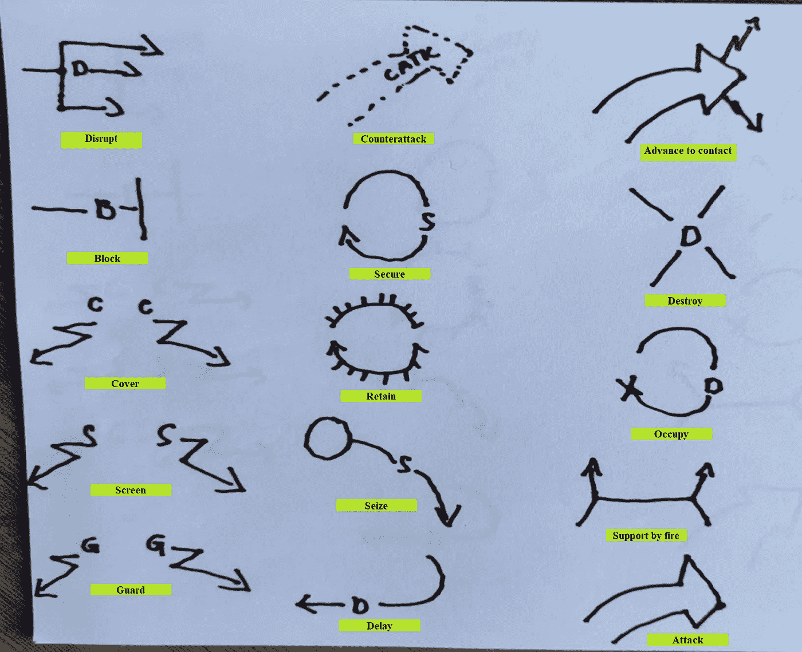

图二。每个类别中的一个示例符号；稍后添加的类名。

将这组符号放在一起看，我们注意到另一个可能的问题，即多个符号，即*盖、*屏、*卫*，仅通过一个字符相互区分，因此对于网络来说没有太多的借鉴点，可能导致三者经常混淆。

在进一步检查其他可能的负面兴趣点的数据后，我们确定图像亮度、符号旋转和因相机角度导致的失真是我们认为对结果影响最大的因素。

# 方法学

在创建了大约 450 个符号库数据集之后，我们的工作从明确问题开始，然后一个接一个地(或者事实证明，有时也是并行地)解决它们:

1.  我们如何进一步改善我们的数据集？
2.  我们能使用像 KNN 这样简单的数据模型来解决分类问题吗？(因为我们的数据看起来与手写数字数据集非常相似。)
3.  如果答案为 2。是‘否’，那么我们应该使用来自什么库/框架的什么神经网络？
4.  在这个项目范围内，我们的最终目标是什么？

## 数据集扩充

为了从我们有限的数据集中挤出更多的数据，并根据前面提到的参数(如旋转和扭曲)对其进行多样化/统一，创建了一个协作增强工具，对输入图像应用随机有限的大小调整、旋转、线条粗细变化和图像翻转。这使我们能够创建一个比简单地绘制更多符号更多样化、更大的数据集。

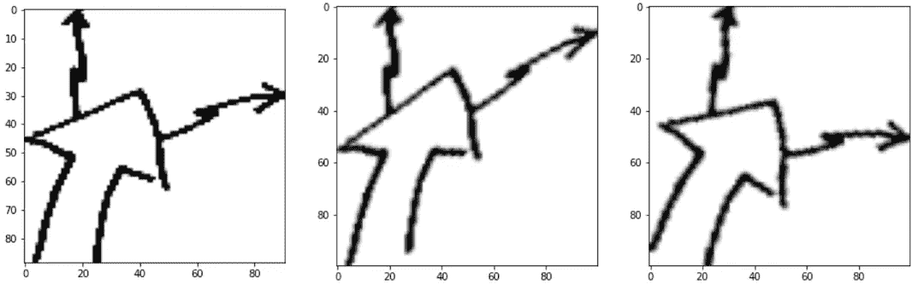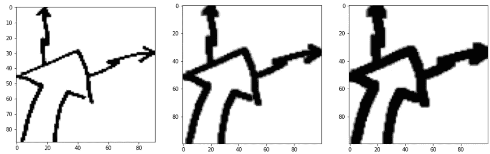

图 3。旋转符号和向符号添加线条粗细的示例

## k-最近邻

我们的第一组结果来自 KNN 算法的多次实现。这里，每个训练图像都被看作是空间中的一个点，空间的维数与像素的数目一样多，然后计算被分类的图像和训练图像之间的距离。因此，举例来说，一个全白的图像会“接近”一个非常明亮的图像，但“远离”一个全黑的图像。然后，检查该空间中每个最近邻的类，具有最接近实例的类就是预测类。

这种方法的最大优点是简单。达到的精确度很低，但比机会好。使用大量生成的训练样本大大提高了准确性，但鉴于我们拥有的真实数据样本如此之少，这可能是由于过度拟合。此外，应当注意，当生成数据和应用模型时，生成超过 100，00 0 个符号需要相当多的计算时间。

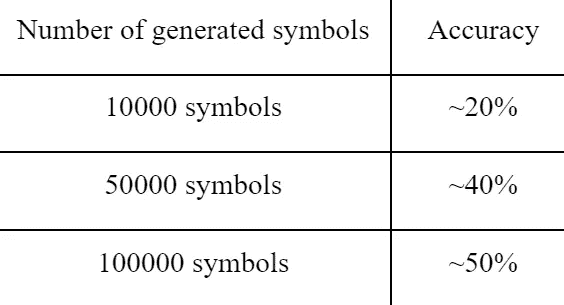

图 4。基于生成符号数量的 KNN 精度。

## C 关于选择性神经网络

从之前的结果来看，简单的 KNN 并不能解决我们所有的问题(😞)，最初采取的另一种方法是创建我们自己的分类 CNN。自 Alex net[4]于 2012 年首次亮相以来，它一直是用于图像识别和检测任务的最受欢迎的网络类型之一。简而言之，CNN 背后的主要思想是一大组“过滤器”，每个过滤器捕捉一种特定的图像模式，然后将它们组合在一起，以决定整个图像显示的是什么。

为了训练 CNN 模型，从现有符号生成训练数据集。对于所有的训练符号，应用旋转、翻转、倾斜以及改变符号的大胆度。此外，对于一些符号，随机像素被改变为相反的颜色。通过系统地和随机地使用这些扩充，我们生成了具有 361 640 个符号的数据集。为了训练模型，5%的数据用于验证。

在构建 CNN 架构之前，人们观察到符号主要由原始形状组成，如直线、曲线、圆和箭头。此外，符号将在一个清晰的背景，这将消除很多噪音。由于对象的简单性，我们决定研究具有三个隐藏层的架构。前两个是卷积层，最后一个隐藏层是全连接层。对于两个卷积层，滤波器的数量被选择为 50。给定的尺寸似乎工作得很好，并且在训练期间没有改变。层中的过滤器尺寸是 9x9 像素。与较小尺寸相比，9x9 尺寸的过滤器尺寸给出了更好的结果。使用 3×3 滤波器时，模型不如使用 9×9 滤波器精确，并且模型过度拟合。使用 3×3 过滤器的训练和验证准确度之间的差距为 3%。使用 9x9 过滤器时，没有间隙。

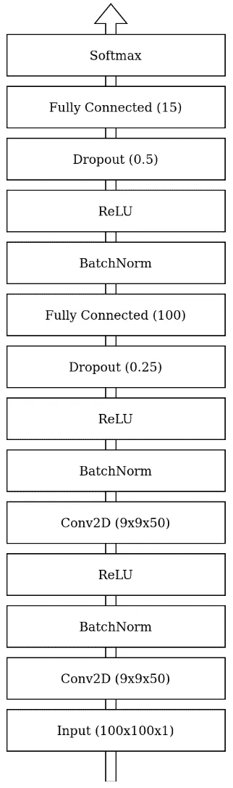

图 5。我们 CNN 模型的完整架构，从 100x100 灰度图像到分类。

用于训练的超参数有:

```
learning rate = 0.0005, batch size = 64, epochs = 10
```

从图 5 中模型的训练历史中，我们可以看到该模型相当快地达到了良好的准确性，然后逐渐保持改进。值得记住的是，训练和验证数据都来自相同的生成过程，因此模型的实际准确性可能会稍低一些。

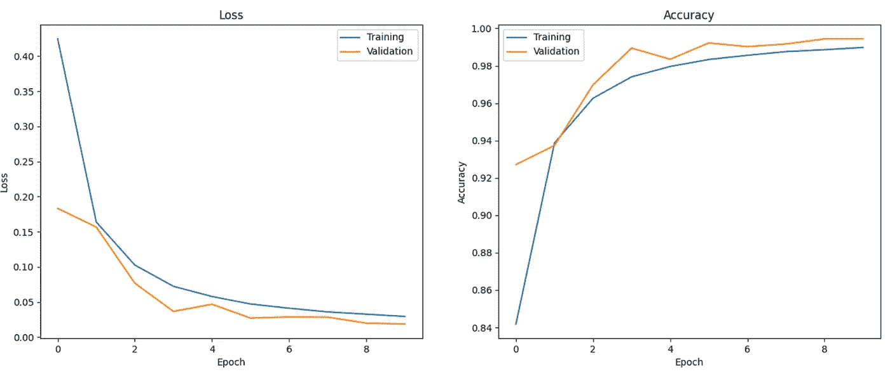

图 6。CNN 训练史。

此外，由于生成了非常大量的符号，过拟合也可能是非常高的精度的一个可能原因，但这没有经过测试。然而，为了了解 CNN 在新数据上的表现，它在 300 个以前从未见过的符号上进行了测试。同样在这种情况下，应该记住用于测试的 300 个符号与训练符号相似。在测试集的 300 个符号中，该模型能够对其中的 282 个进行分类，这给了我们 94%的准确率。

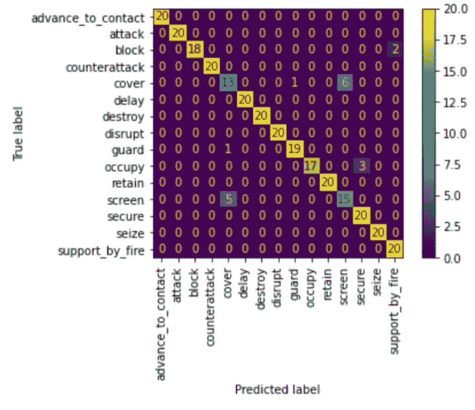

图 7。CNN 混乱矩阵。

混淆矩阵如图 6 所示。我们看到 18 个错误中有 11 个混淆了封面和屏幕。这些符号非常相似。唯一的区别是一个有字母 C，另一个有字母 S。

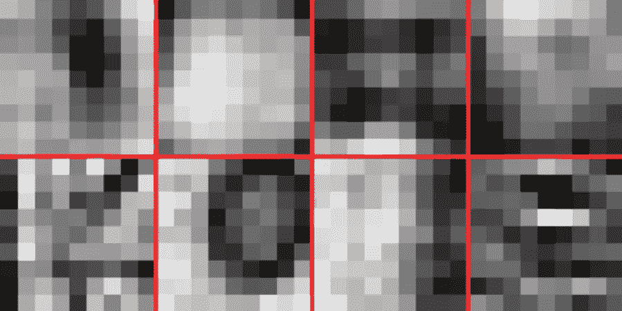

图 8。一些过滤器的例子摘自我们自己的 CNN。直观地说，你可以认为每个过滤器都在“寻找”它所学习的模式，当在图像中找到该模式时就激活。

## 下一站:终点站

到目前为止，我们已经花费了大部分的时间在这个项目上，并且已经确定，尽管我们的数据集太小(或者有一些其他未知的问题)而不能用作像 KNN 这样的东西的基础，但是我们可以可靠地构建一个 CNN 来对符号进行分类，因为它们是作为只有一个符号的单个图像呈现在网络上的。这与现实生活中的网络应用相差甚远，但仍能满足我们认为的项目最低可行结果。

然而，在与我们的主管开会期间，我们讨论了使用 YOLOv5 [5]对包含多个符号的图像上的符号进行定位和分类的可能性，这使我们更加接近现实生活中的用例。因此，在同一次会议上，我们决定这将是我们在项目的剩余时间里要做的事情，并设计了一个为 YOLO 创建数据集和训练网络的粗略计划。

## 创建数据集

创建数据集的另一种方法是必要的，因为 YOLO 不是像我们迄今为止那样使用单符号图像，而是使用具有多个符号的图像作为训练基础。对于这种数据集，一般的方法是获取一组包含检测类的图像，然后手动标记它们(非常麻烦)，或者使用 Roboflow [6]之类的工具(稍微简单一点)。

由于我们已经有了一个 450 个符号的数据集，我们希望利用它，这意味着以某种方式从这 450 个独特的图像组合中生成一个 YOLO 数据集。对于这一点，我们是幸运的！这些图像都有一个白色或灰色的背景，一个黑色的符号，让我们可以将它们拼接在一起，同时准确地知道这些符号将被放置在每张图像的哪个位置。

这正是 *YOLOtrainer* 笔记本的*生成 YOLOv5 数据集*部分要完成的工作:

1.  每个单个符号图像及其标签都是从指定的源文件夹加载的，该文件夹可以有多个子文件夹
2.  自适应阈值被应用于每幅图像，试图均衡亮度
3.  加载的图像被传递到生成器函数，该函数可配置最终图像的大小、每个图像上的符号数量等。
4.  在生成过程中，每个符号都添加了前面提到的增强功能:旋转、翻转、调整大小、加粗、扭曲。

5.返回最终镶嵌图和其上符号的相关数据。

6.图像和符号数据以 YOLO 格式保存。

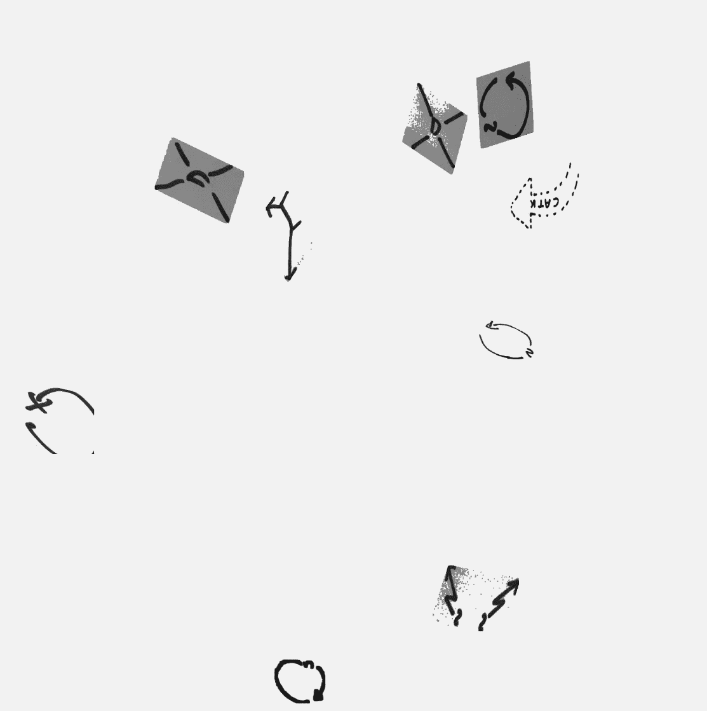

图 9。生成的多符号图像的早期迭代示例

通过图 10，我们可以说明符号镶嵌生成系统面临的主要挑战:阈值处理有些过于苛刻，难以获得精确的结果，因此它可以正确处理具有各种亮度的图像。最终我们得到了大部分正确的结果，如图 11 所示。

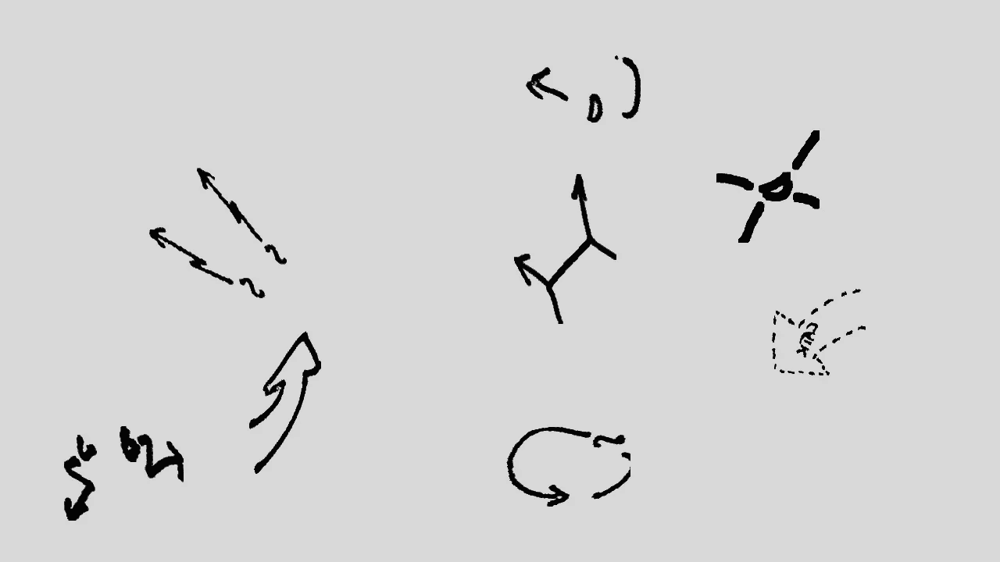

图 10。最终生成的数据集示例

## 什么是 YOLO？

YOLO 是首字母缩写，意思是你只看一次。它目前正处于积极开发的第五代，通常以其速度和准确性而闻名。可用的预训练权重在 COCO 数据集上进行训练，并具有很好的性能。

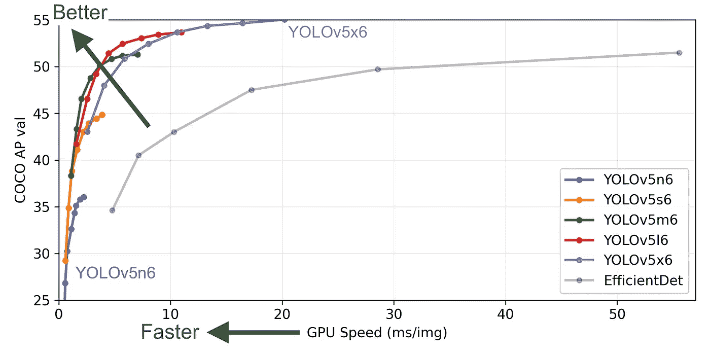

图 11。YOLOv5 在 COCO 数据集上的检测结果[5]

在 COCO 数据集上进行预训练是我们使用 YOLO 作为项目问题解决方案的另一个绿色信号，因为 COCO 数据集包括交通标志的类，就形状而言，这些标志有点类似于我们希望检测的符号。

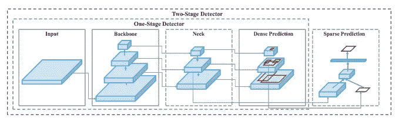

图 12。YOLO 物体探测过程[7]

YOLO 网络架构由三个主要部分组成:

1.  主干网-以不同粒度(不同细节层次)形成图像特征的卷积网络。
2.  颈部——混合和组合这些特征，将它们传递到头部。
3.  Head 基于获取的要素处理预测。

对于定制训练的 YOLO 模型，有多个指标来帮助评估它:

*   对象损失-显示运行检测的每个分段像元的损失
*   分类损失-如果检测到对象，则根据每个类别的概率计算该损失
*   框丢失-显示基础真实值和检测到的边界框之间的误差

在训练评估期间，这些都可以被不同地赋值:当您想要非常精确地检测边界框时，低框丢失是重要的，但是当主要焦点是检测特定类时，低框丢失就不那么重要了，在这种情况下，分类丢失是最重要的。物体损失是一个很难分类的度量，但是涉及到在每个检测单元中物体存在的检测。

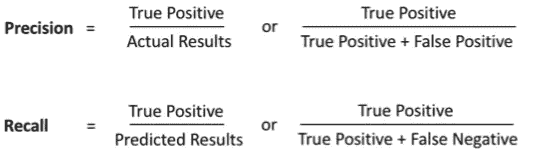

图 13。精确度和召回率的计算

此外，precision 和 recall 也可用于评估训练好的模型，precision 显示真实结果与实际结果的比率，recall 显示真实结果与预测结果的比率。

YOLO 数据集由每个影像的两个项目组成:影像本身，以及一个详细描述影像中对象位置、其边界框及其类别的文本文件。在运行时，YOLO 也可视化这些输入边界框，如图 15 所示。

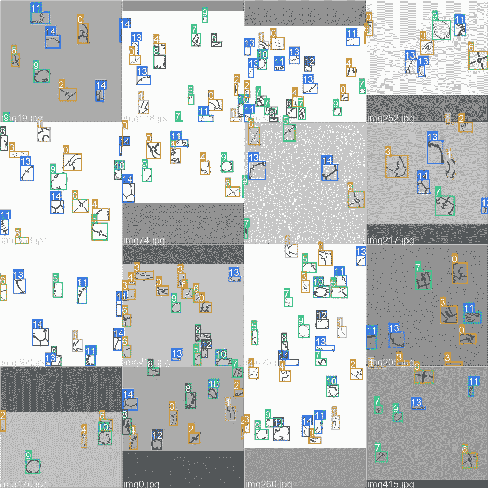

图 14。YOLO 包围盒地面真相调试图像

除了这两个文件，还有一个*。训练脚本检查 yaml* 配置文件以获取数据集的位置、类的名称和数量。

## 最终方法

运行了多个训练迭代。更成功的运行日志是由一个名为 [wandb.ai](http://wandb.ai) 的内置运行监控应用程序记录的。所有这些成功的运行可以进一步探讨[在这里。](https://wandb.ai/erkoiv/NATO-Symbols-Log?workspace=user-erkoiv)为了运行，使用了各种硬件:运行 RTX 2070、谷歌 Colab GPU 和塔尔图大学 HPC 的本地笔记本电脑。

使用的一般训练命令如下:

```
python3 {train_dir} --img 640 --batch 24 --epochs 300 --data NATO-Symbols.yaml --weights yolov5m.pt --project NATO-Symbols-Log --name {run_id} --cache
```

在这里，您可以看到运行时调用的多个变量和参数集。

*   *train_dir* 是一个指向 YOLOv5 训练脚本的变量
*   *img 640* 设置每个训练图像的尺寸，允许用户在数据集中拥有任何尺寸的图像
*   *批次 24* 给出批次大小
*   *时期*决定运行训练的迭代次数
*   *数据*将训练脚本指向自定义*。之前描述的 yaml* 文件
*   *重量*决定使用哪个起始重量，这可以是默认的 YOLO 预训练重量，也可以是自定义训练重量
*   *项目*决定保存运行日志的文件夹名称
*   *名称*决定了运行名称
*   *缓存*决定数据集是否缓存在 RAM 中，以便在训练期间更快地访问

YOLO 的另一个特点是，训练脚本包含一个标志，用于为 YOLO 框架的约 25 个超参数运行遗传算法(GA)超参数进化。这是一个时间和资源密集型过程，使用以下命令运行了 100 代 10 个时期:

```
python3 {train_dir} --epochs 10 --data NATO-Symbols.yaml --weights yolov5m.pt --project NATO-Symbols-Log --name {run_id} --cache --evolve
```

在跑步监测站点有更多的跑步可供探索，但是这里将进一步比较和分析使用不同硬件、不同基重尺寸和不同超参数的三次跑步。

这三次运行被称为“5m-300-colabGPU”、“5l-300-hpc”和“5m-300-local”。就项目生命周期而言，“colabGPU”运行最晚，“local”运行最早。从运行名称后缀可以明显看出所用的硬件。前缀“5m”或“5l”表示所用基重的尺寸，中型为 *m* ，大型为 *l* 。没有使用小的权重，因为它们意味着用于移动应用的训练网络。在 HPC 上运行时使用了更大的砝码，因为我们可以使用超过 15GB 的 VRAM，这是使用砝码以合理的批量(> 10)运行训练所必需的，因为需要的 VRAM 数量会随着砝码设置的增加而大幅增加。对于“5m-300-colabGPU ”,使用定制的进化超参数，其他运行使用默认超参数。所有运行都运行到完成 300 个周期。

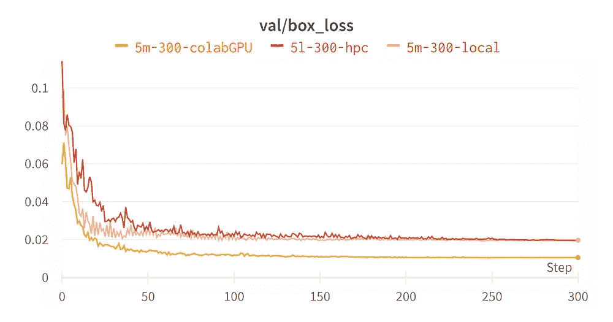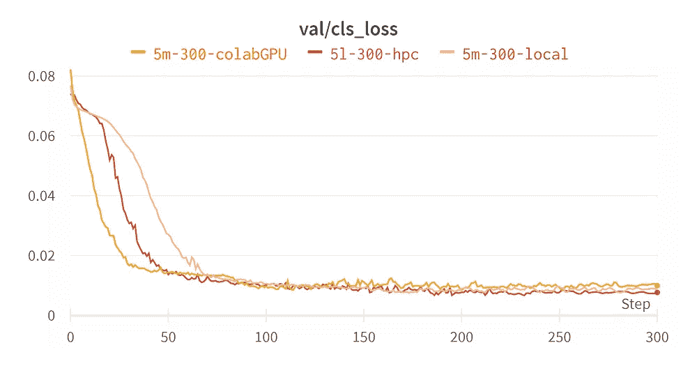

图 15。“5m-300-colabGPU”、“5l-300-hpc”和“5m-300-local”运行的箱型和类损失图

首先让我们看一下运行的类和盒损失图。在训练期间，监测的是损失是否随着时间的推移开始增加，这可能表明过度拟合。这种情况并没有发生，此外，我们可以看到，与其他运行相比，演进的超参数运行显示了更快的损耗降低和更低的盒损耗，尽管 HPC 运行是在更大的权重集上运行的。

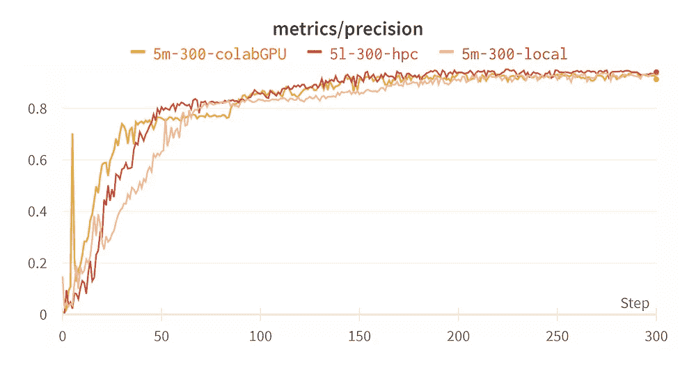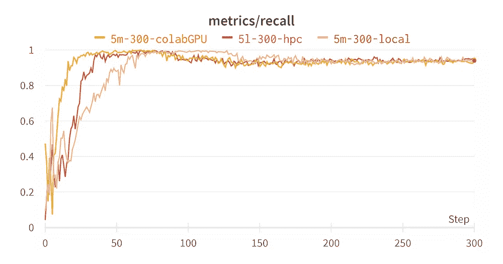

图 16。“5m-300-colabGPU”、“5l-300-hpc”和“5m-300-local”运行的精度和召回图

其次，训练过程中的精度和召回指标表明，虽然模型最终在这两个方面都达到了相同的水平，但超参数进化加快了训练过程，以便在更强大的硬件上与更大尺寸的权重相媲美。这凸显了超参数进化的重要性。

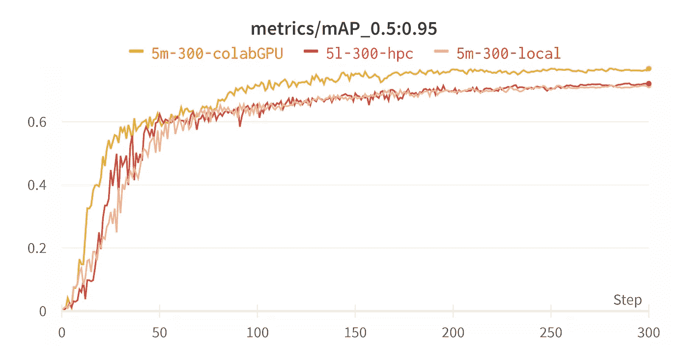

图 17。“5m-300-colabGPU”、“5l-300-hpc”和“5m-300-local”运行的平均精度指标

最后，添加另一个度量 mAP_0.5:0.95，它综合了所有类的精度和召回率，并总体显示了模型的整体性能，我们可以再次看到超参数进化的“colabGPU”运行比其他模型训练得更快，并达到了明显更高的结果。

对生成的图像运行时，在理想条件下的性能如图 19 所示。

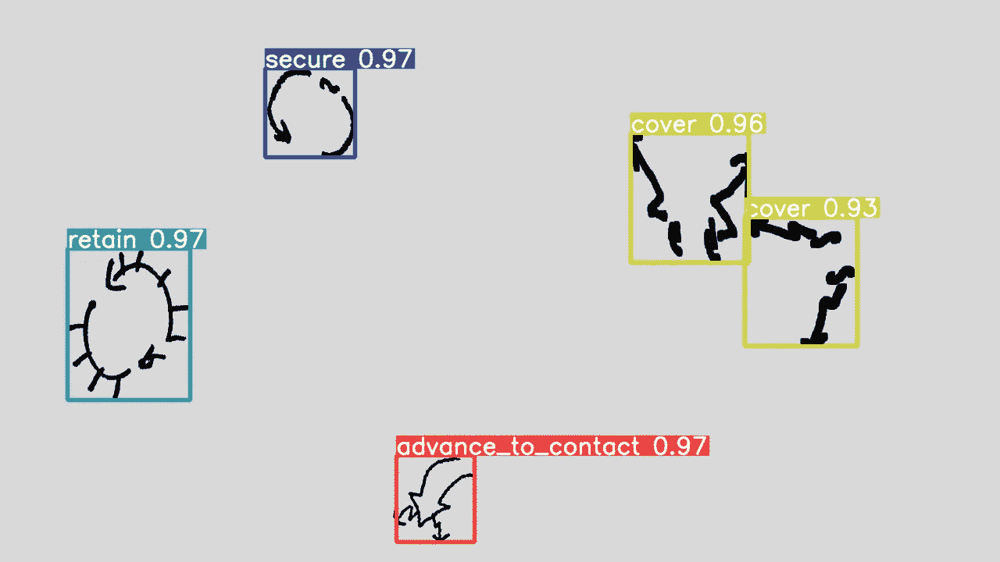

图 18。理想测试案例

正如所担心的，“屏幕”符号被误标为“封面”，但除此之外，一切都是正确和自信的。

现在，让我们看看这个模型是如何经受住一个真实的、非理想的、带有符号的图像的挑战的，而这些符号还没有被教给它。

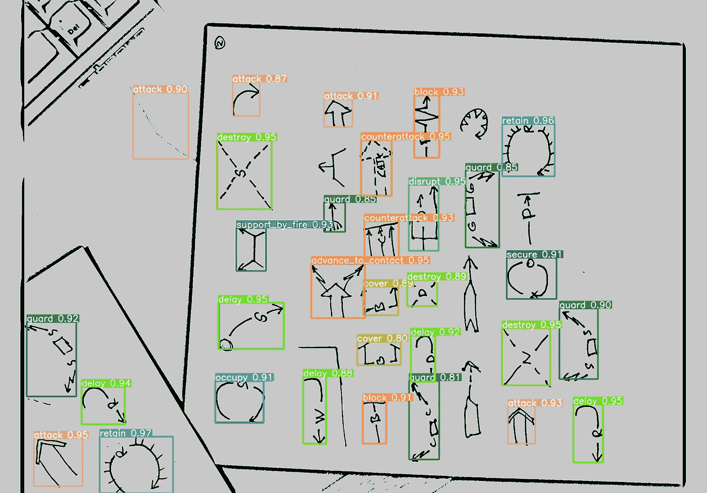

图 19。更现实的测试案例

可以清楚地看到，虽然已经正确地识别了几个符号，但是还存在几个没有检测到教授类别的符号的情况，以及几个更多的对非教授符号的错误检测。

在真实图像上的这种低性能很可能是由于训练数据集没有正确地表示真实情况而导致的。无论这是由于缺乏数据，还是数据质量，或者数据生成方法，都必须在未来进行检验。

在未来，可能的解决方案将是手动标记数百个真实图像上的数百个符号，并使用非生成的数据集，并在训练数据中包括非符号，以便模型也知道要检测什么**而不是**。一种完全不同的方法是将 YOLO 仅用作定位工具，教导一个模型检测任何符号，然后将裁剪后的符号传递给不同的网络进行检测。

# C 结束语

这个项目试图通过帮助人类更快地相互传达用符号表示的作战计划来改善军事通信。

通过创建脚本来扩充现有数据并人工生成更多数据，解决了数据匮乏的问题。

一开始，我们测试了许多不同的解决方案，作为一种初步的“尝试”。发现由于缺乏数据和可能的过拟合，简单的 KNN 不能解决这个问题。接下来测试了一个定制的 CNN，当应用于单符号图像时显示出了希望，尽管过度拟合可能是成功的原因。

为了在多符号图像上实现定位和分类，选择 YOLOv5 作为合适的框架，并在多个硬件和超参数设置上训练模型。通过度量，最佳性能模型的应用结果在理想情况下被证明是好的，但是在真实情况下严重缺乏。

对于未来的改进，我们建议创建一个更好的数据集，用于更准确地训练真实世界，甚至可以将 YOLOv5 与不同的模型结合使用，以利用不同网络的不同优势。

# 来源

[1] [人类语音可能有一个通用的传输速率:每秒 39 比特](https://www.science.org/content/article/human-speech-may-have-universal-transmission-rate-39-bits-second#:~:text=Indeed%2C%20no%20matter%20how%20fast,the%20speed%20of%20Morse%20code.)

[2] [北约联合军事符号](https://www.cimic-coe.org/resources/external-publications/app-6-c.pdf)

[3][MNIST 数据库](http://yann.lecun.com/exdb/mnist/)

[4] [AlexNet 论文](https://proceedings.neurips.cc/paper/2012/file/c399862d3b9d6b76c8436e924a68c45b-Paper.pdf)

【5】[yolov 5 GitHub](https://github.com/ultralytics/yolov5)

[6] [Roboflow](http://roboflow.com)

[7] [YOLOv4 纸](https://arxiv.org/pdf/2004.10934.pdf)