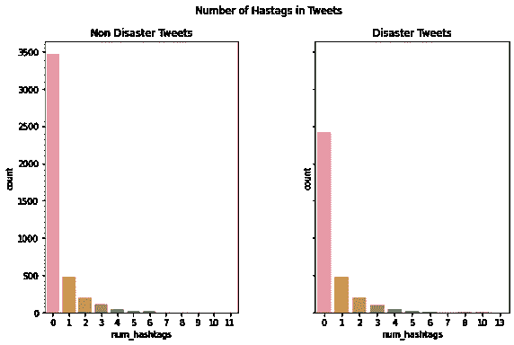

# 自然语言处理:清理推文

> 原文：<https://medium.com/codex/natural-language-processing-cleaning-up-tweets-2b71793e91b5?source=collection_archive---------2----------------------->

Twitter 最近一直是新闻的焦点，所以我想借此机会写一下我在自然语言处理项目上的第一次尝试。作为我的跳板数据科学训练营的一部分，我最后的顶点项目是建立一个分类模型，以区分灾难和非灾难相关的推文。当我开始从事我的顶点项目时，我已经花了几个小时在 Data Camp 和 LinkedIn 课程上学习了无数关于如何处理文本数据的策略。所以，就我个人而言，我想通过这个项目来真正检验我的数据处理技能。

# 数据

我使用了来自 Kaggle 的数据集[，该数据集包含 7613 条推文，其中 4342 条推文被标记为与任何灾难无关，3271 条被标记为与灾难有关。大约三分之二的推文标记了它们的位置，并且大多数推文(99%)在推文旁边有相关的关键词。在我深入研究这些推文之前，我看了一下丢失数据的分布情况:我想看看某个特定类别的数据是否丢失了特定的部分。例如，与灾难性推文相比，更多的非灾难性推文缺少位置标签吗？然而，这并没有产生有意义的结果:丢失的数据似乎是随机的。我总是发现可视化这些问题是最容易的，所以我创建了一个数据可用性的条形图(见下文),它说明了缺失数据的随机分布。同样令人欣慰的是，数据集中的每条推文都被贴上了标签，所以我不必进一步缩减数据集的大小。](https://www.kaggle.com/competitions/nlp-getting-started/overview)


# 关键词

7552 条推文在数据集中标记了关键词。有趣的是，在 7552 个关键词中，只有 221 个是唯一的！因此，对于数据争论过程的第一步，我专注于清理关键字，因为我想更详细地探索关键字。

如何清理文本数据？欢迎来到正则表达式的奇妙世界。

[正则表达式](https://www.dataquest.io/wp-content/uploads/2019/03/python-regular-expressions-cheat-sheet.pdf)是字符序列，可以是字母或标点符号，这有助于设计搜索模式。因此，我们可以使用正则表达式来搜索推文，看看它们是否包含类似的模式。Python 有一个名为 re 的内置包，在这里非常有用。我还推荐 unidecode，查看文档，因为这是一种在 Unicode 和 ASCII 之间转换的简单方法。

```
import re
import unidecode
```

我首先删除了不需要的标点符号，比如感叹号、重音符号、括号、逗号、分号等等。

这里有一个我用来清理关键词的正则表达式的例子，如果你想了解更多的细节，可以看看我的笔记本[](https://github.com/iban121/Springboard/blob/main/Capstone%203/notebooks/.ipynb_checkpoints/Data%20Wrangling%20and%20EDA-checkpoint.ipynb)**。**

```
def clean_keywords(keyword):
    cleaned = re.sub(r'%20', ' ', keyword)
    return cleaned
def remove_accents(keyword):
    cleaned = unidecode.unidecode(keyword)
    return cleaned
def remove_punctuation(keyword):
    cleaned = re.sub(r"[!\"#$%&()*+-./:;<=>?@[\]^_`{|}~\n -' ]"," ",keyword)
    return cleaned
```

**然后，我做了一个不同类使用的所有关键字的计数图(看看下面的计数图)。**

```
keywords['keyword'] = keywords.groupby('keyword')['target'].transform('mean')
fig = plt.figure(figsize=(8, 40), dpi=100)
sns.countplot(y=keywords.sort_values(by='keyword', ascending = False)['keyword'], 
              hue = keywords.sort_values(by='keyword', ascending =False)['target'])
plt.savefig('figures/keywords_distributions_before_stemming.png', bbox_inches = 'tight',facecolor='white', transparent =None)
plt.show()
```

**如果你仔细看看右边地块上的关键词，很快就会发现有一些重复，比如野火和野火。解决这个问题的一个可能的方法是阻止单词。词干化是指我们将单词简化为词干或词根。这样做的好处是相似的词可以组合成一个词，如自杀炸弹，自杀炸弹，自杀炸弹手都可以组合成自杀炸弹。**

**所以，我用 NLTK 的波特·斯特梅尔来做关键词。**

```
from nltk.stem import PorterStemmer
stemmer = PorterStemmer()
keywords['stems'] = keywords['keyword'].apply(lambda x: stemmer.stem(x))
```

******

左:词干提取之前的关键字。右图:词干后的关键字** 

**如果你看看词干化后的两个图，我们可以看到关键词的数量减少了，但我们仍然有一些不太固定的关键词，例如 wildfir 和 wild fir 仍然被分为两类。这里的解决方案是返回并删除单词之间的空格，或者手动合并这两组。由于我的关键词数量如此之少，我快速浏览了一下这些词，并决定继续前进，因为没有多少其他组可以组合。我决定现在看看两组中 100 个最常见关键词的视觉表现。一个有趣而简单的形象化方法是使用单词云！**

```
from collections import Counter
from wordcloud import WordCloud

def make_dict(tup, dictionary):
    for x, y in tup:
        dictionary.setdefault(x, []). append(y)
    return dictionary
count = Counter(list(keywords[keywords['target']==1]['keyword']))
top_words = {}
make_dict(count.most_common(100), top_words)
df = pd.DataFrame.from_dict(top_words, orient = 'index').reset_index()
df.columns=['word', 'count']
text = df['word'].values
wordcloud_keywords = WordCloud(background_color = 'white', width = 500, height = 300, collocations = True).generate(str(text))
plt.figure(figsize=(8, 8), dpi=100)
plt.imshow(wordcloud_keywords)
plt.axis('off')
plt.title('Disaster Keywords', fontsize = 22)
plt.savefig('figures/wordcloud_disaster_keywords.png', bbox_inches = 'tight',facecolor='white', transparent =None)
plt.show()
```

********

**这两个类别在关键词的选择上肯定有一些共同点，但我们也看到一些关键词在一个类别中比其他类别出现得更频繁:例如，裹尸袋作为非灾难推文的关键词出现得比灾难推文更频繁。几个词(碎片和残骸)只作为灾难推特的关键词出现，而余震只作为非灾难推特的关键词出现。最终，我认为关键字之间没有足够的差异来尝试使用它们开发一个分类模型，所以我在项目的其余部分删除了关键字列。我想在这里做的一个可能的改变是不删除这个列，而是将 keywords 列与 tweet 列合并。**

# **位置**

**大约三分之二的推文有位置标记，大约 34%的推文在两个类别中都没有。在 5080 个位置标签中，大约有 3341 个唯一条目。仔细查看这些位置可以发现，它们可以用国家、城市、缩写、日期来输入，甚至还有破折号、逗号和标签等标点符号。**

****

**同样，使用正则表达式和 lambda 函数，我删除了数字和空格。**

```
location['location'] = location['location'].apply(lambda x: remove_accents(x))
location['location'] = location['location'].apply(lambda x: remove_punctuation(x))
def remove_nums(location):
    cleaned = re.sub(r'\d+', '', location)
    return cleaned
location['location'] = location['location'].apply(lambda x: remove_nums(x))
def remove_extra_w_space(location):
    cleaned_text = re.sub(r"\s+"," ",location).strip()
    return cleaned_text
location['location'] = location['location'].apply(lambda x: remove_extra_w_space(x))
```

**这将 5080 个条目中唯一位置的数量从 3341 个减少到 3106 个。其中，只有 82 个位置是两个班级共有的。这可能只是因为 5080 并不是一个足够大的样本来代表 twitter 用户的人口统计数据。还有，使用两个班级之间的共同词的数量有一些明显的问题；如果我们有一个更大的样本量，常用词的数量会增加，但是不一定是因为有更多的相似性，而只是因为数据集中有更多的词。所以，我决定用余弦相似度来代替。**

**余弦相似度是什么？如果你喜欢向量的点积，可以把余弦相似度看作是计算两个向量之间夹角的余弦。考虑 y=cosx 的图表(如下)，我们可以看到，随着 x 值增加到π/2，或 90 度，y 值或 cos(x)从 1 减少到 0。这意味着如果两个向量之间的角度更接近于零，cos(x)将接近于 1，这意味着两个向量彼此相似。然而，如果 cos(x)的值更接近于 0，那么这两个向量几乎相互垂直，这意味着它们是不同的。**

****

**那么，向量中的相似性如何与位置条目相关联呢？查看[这篇文章](https://www.machinelearningplus.com/nlp/cosine-similarity/)，它对余弦相似性进行了非常深入的解释。想象一下，对于每个单词，我们都有一个“轴”。因此，我们可以画出每个类别中每个单词的使用频率——这被称为单词的矢量化。但是我们不是看线条的长度，或者矢量的大小，而是测量矢量之间的角度。**

****

**[自然语言处理中余弦相似度的一个例子](https://www.machinelearningplus.com/nlp/cosine-similarity/)**

**查看[我的笔记本](https://github.com/iban121/Springboard/blob/main/Capstone%203/notebooks/.ipynb_checkpoints/Data%20Wrangling%20and%20EDA-checkpoint.ipynb)了解更多细节，但这里是我用来矢量化位置信息和计算余弦相似性的代码片段:**

```
from sklearn.preprocessing import MultiLabelBinarizer
vectorizer= MultiLabelBinarizer()
mlb = vectorizer.fit(corpus)
df = pd.DataFrame(mlb.transform(corpus), columns=[mlb.classes_], index=['Disaster', 'Non Disaster'])
from sklearn.metrics.pairwise import cosine_similarity
cosine_similarity(df)
```

**这给了我们:**

****

**这是什么意思？0.2897 更接近于 0 而不是 1，这告诉我们两组词，灾难推文的位置和非灾难推文的位置并不是很相似。**

# **最后是推文！**

**所以，坦白地说，我本想在这里做更多的事情，但出于期限和全职工作的考虑，我决定暂时不去追求这些领域。希望有一天我能回到这里。**

**首先，我想说的是，推文中包含了大量的信息。因此，我们必须选择在一个近乎循环的过程中找到提取信息和清理数据的平衡点。例如，标签后面是文本。如果我们像对待位置和关键词那样去掉所有标点符号，我们就会失去' # '符号。**

# **#、@和😊！**

**我编写了函数，然后统计了推文中使用的提及次数、标签和表情符号，然后按类别分组，看看它们的使用是否有明显的模式。**

```
def hash_count(string):
    words = string.split()
    hashtags = [word for word in words if word.startswith('#')]
    return len(hashtags)
tweets['num_hashtags'] = tweets['text'].apply(hash_count)
tweets['hashtags'] = tweets['text'].apply(lambda x: [x for x in x.split(" ") if x.startswith("#")])
```

**对于表情符号，我使用了表情符号包:**

```
import emoji
def emoji_count(tweet):
    tweet = emoji.demojize(tweet, delimiters=('__','__'))
    pattern = r'_+[a-z_&]+_+'
    return len(re.findall(pattern, tweet))
tweets['emojis'] = tweets['text'].apply(emoji_count)
```

**一个快速的可视化(如下)显示，非灾难性的推文有更多的标签、提及和表情符号的使用。所有这三个都显示了两个类中标签和提及次数非常相似的分布。**

****

# **口语**

**然后，网络语言的挑战来了！我使用了他的缩写字典，这是一个救生工具，来扩展常见的缩写！看看这本字典，它相当完整，我强烈推荐它。此外，我使用了宫缩软件包，它有助于扩展常见的宫缩。**

```
import contractions
def expand_contractions(tweet):
    return contractions.fix(tweet)
tweets['text'] = tweets['text'].apply(lambda x: expand_contractions(x))
```

**然后，我用[这个](https://gist.github.com/slowkow/7a7f61f495e3dbb7e3d767f97bd7304b)来帮助删除推文中的表情符号、符号、象形文字、交通和地图图标以及旗帜。**

```
def demojize(tweet):
    emojis = re.compile("["
        u"\U0001F600-\U0001F64F"  # emoticons
        u"\U0001F300-\U0001F5FF"  # symbols & pictographs
        u"\U0001F680-\U0001F6FF"  # transport & map symbols
        u"\U0001F1E0-\U0001F1FF"  # flags (iOS)
        u"\U00002702-\U000027B0"
        u"\U000024C2-\U0001F251"
        "]+", flags = re.UNICODE)
    cleaned_text = emojis.sub(r'', tweet)
    return cleaned_text
tweets['text'] = tweets['text'].apply(lambda x: demojize(x))
```

**快到了！现在，所有的缩写和缩写都扩展了，我们可以预测的符号都被清理了，我们删除了所有的标点、重音、提及、标签、html 文本、URL、数字和额外的空格，其中一些是因为清理过程而留下的。最后我把推文都改成小写了。下一个合乎逻辑的步骤是对单词进行标记，但在此之前，我花了一些时间进行了另一轮探索性数据分析，以查看推文中经过清理的单词是否可以揭示两个类别之间不同的语言选择。**

**我查看了两个不同班级使用的单词数量、不同类型的名词以及单词长度，得出的结论是这两个班级之间仍然没有太大的差异。因此，我研究这两个特征不是为了帮助开发分类模型，而是为了帮助形成一个定制的[停用词列表。](https://kavita-ganesan.com/what-are-stop-words/#.Y4yccMtBzb0)停用词是在语言中使用的不太重要的词，例如“a”、“the”、“then”等等。我想创建一个自定义停用词的列表，因为这个数据集的大小(大约 7000 条推文)相当小。因此，通过创建一个自定义的停用词列表，我可以开发一个更小、更具体的不重要词列表。这个想法是识别停用词，从整个词汇、语料库中删除它们，以允许机器学习算法在开发分类模型时只关注重要的词。**

**我的 EDA 强调了两个或更少字符的单词似乎不会在两个类之间产生差异，所以我首先删除了两个或更少字符的单词以及它们删除后留下的任何空白。**

**然后，我使用计数矢量器，查看语料库上的文档。由于这是我第一次尝试 NLP，我决定也尝试使用 TFIDF 矢量器来了解更多关于它们的区别。我的目标是找出我们可以用来创建停用词列表的最常用的词。这花了一些时间，主要是因为我想看看这些矢量器的范围。查看[我的笔记本](https://github.com/iban121/Springboard/blob/main/Capstone%203/notebooks/.ipynb_checkpoints/Data%20Wrangling%20and%20EDA-checkpoint.ipynb)。从本质上说，清理过程的最后一步是删除已识别的停用词。稍后，我将更详细地介绍对推文进行符号化和词条化，以及我如何创建我的二元分类模型，但现在，我希望这能给你一些好主意，让你知道如何处理推文等社交媒体文本！**