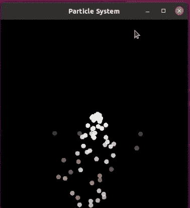

# 铁锈的性质——颗粒

> 原文：<https://medium.com/codex/nature-of-rust-particles-40cec0a8c25e?source=collection_archive---------9----------------------->

所以大约五年前，我正在完成我的博士学位，想要自学如何为了一点乐趣而编码。我不知道从哪里开始，发现很难做什么。直到我发现了编码列车 YouTube 频道。这个频道上展示的挑战很容易理解，也是学习新概念的有趣方式。

最近，也是几年前，该频道发布了一个名为《代码处理的本质》(Java)和 p5 JavaScript 的系列文章。看到这些视频让我有了尝试这些例子的想法，但是是在 Rust 中。

所以现在开始…

# **什么是粒子？**

对于此示例，粒子将被定义为具有以下属性的对象:

*   **初始位置** (x，y)
*   **初始速度** (Vx，Vy)
*   **初始尺寸**:例如圆的半径
*   **初始颜色**:如果粒子在其生命周期中发生变化，则需要该颜色
*   **初始形状**
*   **寿命**:粒子将在窗口中存在固定的寿命

除了这些属性，粒子还会受到力的影响，例如重力，粒子对象需要能够处理这种情况。牛顿第二定律可以用下面的等式来概括:

***力=质量 x 加速度***

为了简化示例，我假设所有粒子的质量都是 1，因此等式变为:

***力=加速度***

使用这个我可以改变粒子的速度并更新粒子在屏幕中的位置。

# 你如何用 Rust 创作一幅油画？

这是要克服的第一个挑战，对于这个问题，我们想画一个粒子，但是在哪里以及如何在铁锈中画任何东西。这个比较容易解决。Rust 中有两个名为 **piston** 和 **piston_window** 的库，使您能够创建画布并在画布上绘制形状。要使用它们，在 ***Cargo.toml*** 文件中，添加以下依赖项:

```
.....
[dependencies]
piston = "0.53.0"
piston_window = "0.120.0"
```

并在 ***main.rs*** 文件中添加以下内容:

```
extern crate piston_window;
use piston_window::*;fn main() {
    let mut window: PistonWindow = WindowSettings::new("Name",
                                    [400, 400])
                                   .exit_on_esc(true)
                                   .build()
                                   .unwrap();
    while let Some(e) = window.next() {
        window.draw_2d(&e, |c, g, _device| {
            clear([0.0, 0.0, 0.0, 1.0], g);
        });
    }}
```

运行时，这将创建一个名为“Name”的窗口，大小为 400 像素乘 400 像素。行 ***clear([0.0，0.0，0.0，1.0]，g)*** 正在设置窗口的颜色为黑色。四个数字的阵列以红、绿、蓝、阿尔法格式工作，通过在 0.0 和 1.0 之间改变数值，可以改变窗口的颜色。使用 piston 库时，这种数组格式用于设置放入窗口的所有对象的颜色。

# **创建粒子结构**

现在我们有了一个窗口，是时候考虑粒子结构和它需要什么属性了。上面的粒子定义已经定义了其中的一些属性，但是为了以后的完整性和方便性，还有一些额外的属性。

```
pub struct Particle {
    pub pos: Vec<f64>,
    pub vel: Vec<f64>,
    pub acc: Vec<f64>,
    lifetime: f64,
    size: f64,
    colour: [f64; 4],
    max_vel: f64,
    max_acc: f64,
    height: f64,
    width: f64,
}
```

# 实现粒子

既然已经定义了粒子，就需要实现它并创建相关的函数。第一个是 ***新的*** 功能，它将用于创建一个粒子并初始化它的属性。这个函数将设置粒子的初始位置，它的速度，加速度以及粒子在画布上的高度和宽度。

```
impl Particle {
    pub fn new(pos: Vec<f64>, vel: Vec<f64>, acc: Vec<f64>, 
           height: u32, width: u32) -> Particle {
        return Particle {
            pos: pos, vel: vel, acc: acc,
            lifetime: 1.0, size: 10.,
            colour: [1.0, 0.0, 0.0, 1.0],
            max_speed: 10.0, max_acc: 0.5,
            height: height as f64,
            width: width as f64,
        };
    }
}
```

# 显示粒子

现在粒子已经被初始化了，它需要被绘制到屏幕上。为此，粒子的位置和大小需要在一个数组中给定到活塞窗口函数 ***椭圆*** 。椭圆函数需要一个颜色数组、位置和大小数组以及绘制椭圆的窗口的细节。为了生成位置和大小数组，粒子实现可以有一个名为 ***show*** 的函数。

```
impl Particle { .... pub fn show(&self) -> [f64; 4] {
        return [self.pos[0], self.pos[1], self.size, self.size];
   }} 
```

在 **main.rs 文件**中，让我们在画布中间创建一个粒子(x = 200，y = 200)。它将以一个随机的速度初始化，并且会有一个小的向下的加速度作用在它上面。要设置粒子的颜色，将在活塞窗口中传递结构的寿命属性 ***color::alpha*** 函数来设置粒子在屏幕上的透明度。

```
extern crate piston_window;
use piston_window::*;
use rand::Rng;pub const WIDTH: u32 = 400;
pub const HEIGHT: u32 = 400;fn main() {
    let mut rng = rand::thread_rng(); let mut particle = Particle::new(Particle::new(
        vec![200., 200.],
        vec![rng.gen_range(-1.0..1.0), rng.gen_range(-1.0..1.0)],
        vec![0.0, 0.1],
        HEIGHT,
        WIDTH,
     ); let mut window: PistonWindow = WindowSettings::new("Name",
                                    [400, 400])
                                   .exit_on_esc(true)
                                   .build()
                                   .unwrap();
    while let Some(e) = window.next() {
        window.draw_2d(&e, |c, g, _device| {
            clear([0.0, 0.0, 0.0, 1.0], g); ellipse(color::alpha(particle.lifetime),
                    particle.show(), c.transform, g);
        });
    }}
```

# 更新粒子

运行上面的代码会在屏幕上生成一个静态粒子。要让它移动，粒子必须在帧之间更新，为此，另一个函数被添加到名为 **update** 的粒子实现中。

```
impl Particle {.... pub fn update(&mut self) {
        *self*.pos[0] = *self*.pos[0] + *self*.vel[0];
        s*elf*.pos[1] = *self*.pos[1] + *self*.vel[1];
        *self*.vel[0] = *self*.vel[0] + *self*.acc[0];
        *self*.vel[1] = *self*.vel[1] + *self*.acc[1];

        *self*.check_limits();
        *self*.edges(); *self*.lifetime = *self*.lifetime - 0.002;
    }}
```

在这个函数中，有两个其他函数与粒子相关联。这些是 ***边，*** 检查粒子是否在边上，如果在边上，将反转运动平面上的速度。这确保了粒子不会从屏幕上消失。第二个功能 ***check_limits*** 查看是否超过了最大速度或加速度。如果有，粒子的速度或加速度都被重置为最大允许值。

```
impl Particle {....fn check_limits(&mut *self*) {
        if *self*.vel[0] > *self*.max_vel {
            *self*.vel[0] = *self*.max_vel;
        }
        if *self*.vel[1] > *self*.max_vel {
            *self*.vel[1] = *self*.max_vel;
        }
        if *self*.acc[0] > *self*.max_acc {
            *self*.acc[0] = *self*.max_acc;
        }
        if *self*.acc[1] > *self*.max_acc {
            *self*.acc[1] = *self*.max_acc;
        }
    } fn edges(&mut *self*) {
       if *self*.pos[1] >= *self*.height || *self*.pos[1] <= 0.0 {
            *self*.vel[1] = *self*.vel[1] * -1.0;
        }
        if *self*.pos[0] >= *self*.width || *self*.pos[0] <= 0.0 {
            *self*.vel[0] = *self*.vel[0] * -1.0;
        }
    }}
```

关于 update 函数，最后要提到的是每次调用函数时 lifetime 属性减少的方式。如前所述，粒子需要有一个生命周期，通过减少每一帧的生命周期，粒子将变得更加透明，直到最后看不见为止。当在屏幕上看不到它时，这个粒子就到达了它的寿命终点。

现在在正在绘制画布的 while 循环内的 **main.rs 文件**中，可以添加行***particle . update()***。这将确保每次循环完成时，粒子属性都会更新，并在屏幕上移动。

# **粒子发射器**

现在我们有了一个粒子，可能会有一些乐趣。一种类型的粒子系统是**粒子发射器。** 这里粒子以随机的速度从一个固定点发射出来，在轻微的重力作用下产生级联效应。

为了创建发射器，粒子被存储在一个矢量中，并且画布的每个循环都被绘制和更新。由于 piston_window 的帧速率，每 10 帧创建一个新粒子，因此程序的性能不受影响。

最后要做的事情是从所有粒子的向量中移除已经到达其寿命终点的粒子。通过反向循环粒子向量并移除寿命属性等于或小于零的粒子。



要查看粒子发射器的代码，请参考我的项目 [github repo](https://github.com/Jack-Sim/rust_particle_emitter/tree/main/rust_particles/src)

# **总结**

我希望这是对粒子的一个有用的介绍，以及如何使用活塞和活塞窗箱在 Rust 中创建一个粒子模拟。这是一个简单的概述，除了我在这里创建的，粒子还有很多其他的用途。请随意对代码进行实验，并尝试提出其他示例，如果您真的这样做了，请在本文的评论中告诉我。

非常感谢您的阅读:)