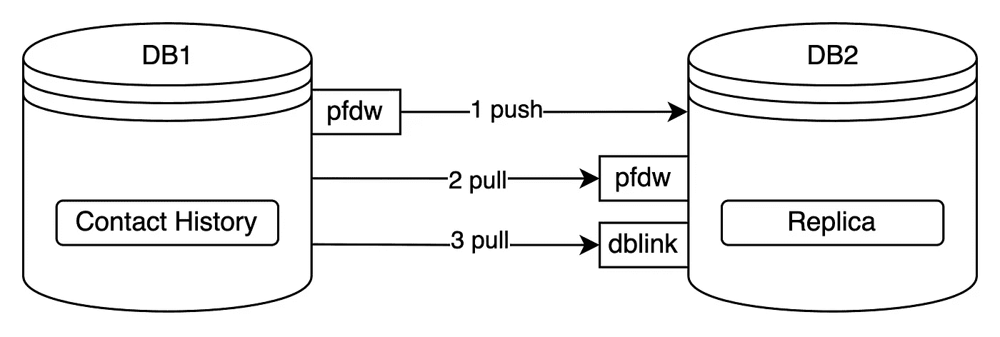
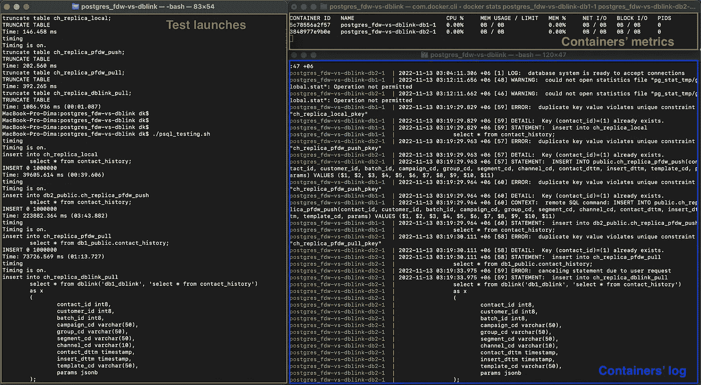
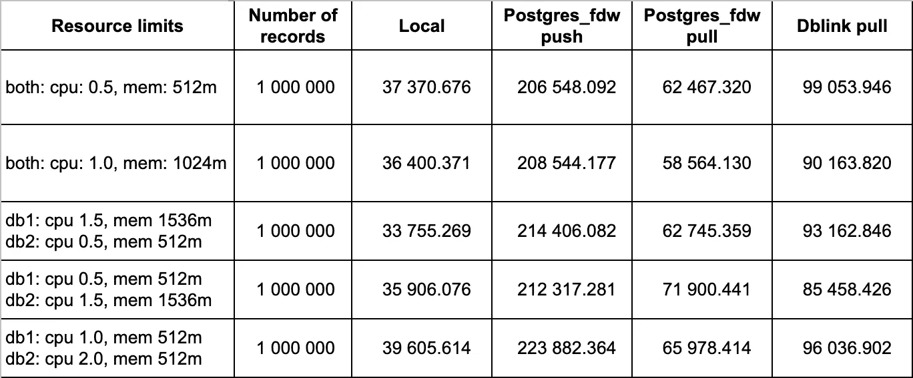

# 需要在 PostgreSQL 之间传输数据？不要急着用 dblink

> 原文：<https://medium.com/codex/need-to-transfer-data-between-postgresql-dont-be-in-a-rush-to-use-dblink-df44f676b184?source=collection_archive---------14----------------------->


米隆·奥利拉在 [Unsplash](https://unsplash.com?utm_source=medium&utm_medium=referral) 上的照片

## 营销技术

## 你应该知道的 PostgreSQL 特性

当谈到在不同的数据库之间传输数据时，您可能会首先想到 dblink。如果你的数据库都是 PostgreSQL 的，那么我有一个更好的选择给你。

> 本文涵盖了已经决定建立对等连接的情况。如果您有大量的数据流定期在不同的系统之间传输，那么应该将架构作为一个整体来考虑。注意在数据库之间使用对等连接(也称为 dblink)时面临的性能问题和整体系统稳定性。

PostgreSQL 实现了一种外部数据包装机制来集成任何外部数据源。它有许多扩展，可以连接几乎所有流行的数据存储:Oracle、MySQL、Redis、MongoDB、RocksDB 等。PostgreSQL 本身有一个: **postgres_fdw** ，字面意思是 PostgreSQL 外部数据包装器。我要说服你，这正是你应该使用的。

首先，官方文档[声称](https://www.postgresql.org/docs/current/postgres-fdw.html)这个扩展是比旧的 dblink 更好的选择:

> "此模块提供的功能与旧的 dblink 模块的功能基本重叠。但是 postgres_fdw 为访问远程表提供了更加透明和符合标准的语法，并且在许多情况下可以提供更好的性能。”

为了让它更有说服力，我测试了两个扩展，所以你可以在下面找到结果。

## 设置

测试环境如下:

*   PostgreSQL-2 数据库容器；
*   约有 100 万条记录的联系历史表。186MB
*   进行数据传输:将全部数据从一个表复制到另一个表；
*   资源限制 cpu 从 0.5 到 2.0 不等，内存从 512M 到 1536M 不等。

> 有一个大的讨论领域正在考虑数据库互连期间的各种性能问题，例如:
> 
> 将 where 子句推送到远程数据库；
> 
> 执行期间使用的远程索引；
> 
> 连接调优(超时、池化等)。
> 
> 本文并不打算考虑这个问题。本文回答的问题是:**如果我需要将大量数据从 PostgreSQL 1 转移到 PostgreSQL 2，假设结构(几乎)相同，不需要或很少需要转换，并且所有数据都应该被传递**，我该使用什么？

我会区分两种类型的数据库间数据传输:

1.  将数据从本地推送到远程数据库。事实上，只有 postgres_fdw 允许将数据推送到远程。
2.  从远程数据库提取数据到本地数据库。

为了说明设置，我把图像放在下面:



试验

除了这些测试之外，还应该执行本地拷贝。它将允许我们定义将数据拷贝到远程的成本。

因此，在每次迭代中要进行 4 次测试:

1.  本地复制；
2.  Postgres_fdw 将数据从 db1 推送到 db2
3.  Postgres_fdw 将数据从 db1 拉至 db2
4.  Dblink 将数据从 db1 提取到 db2。

如果你想自己测试，这里的是可以帮助你起步的设置。

## 测试过程

先决条件:

*   已安装 docker / docker 桌面；
*   已安装 psql。

首先，您需要复制存储库并导航到它被复制到的文件夹。至于 docker，我更喜欢用终端，但是你也可以用 docker 桌面。

确保*。该文件夹中的 sh 文件被授权执行。如果没有，让他们:

```
chmod +x *.sh
```

运行容器:

```
docker compose up
```

建立之后，运行测试准备:

```
./psql_prep.sh
```

它包括创建数据库之间的连接和生成测试数据。这一代人需要一段时间，所以不要着急。

现在，测试环境已经设置好，可以运行了。我鼓励您也监视容器指标——在单独的终端上运行以下命令:

```
docker stats postgres_fdw-vs-dblink-db1–1 postgres_fdw-vs-dblink-db2–1
```

你可能会有类似的东西:



让乐趣开始吧:

```
./psql_tesging.sh
```

每次测试后，脚本显示所用的时间。你可以把这些结果记录下来，以便以后比较。

如果你想在测试后检查数据，测试结果的清理被放在不同的脚本中。如果您不再需要这些数据，只需运行清理:

```
./psql_cleaning.sh
```

资源限制可在 **compose.yaml** 文件中找到，因此您可以根据自己的意愿进行调整。友情提示:如果撰写文件已经更改，您需要再次初始化容器。因此要执行以下命令:

```
docker compose down
docker compose up
```

## 结果

我对每个设置进行了几次测试(从 3 到 5)，得出了以下结果(数字是中值毫秒):



试验结果

要强调的一堆结论:

1.  Dblink 比 postgres_fdw 慢 20%到 60%(拉模式)。
2.  Postgres_fdw 推送模式非常糟糕，不应该考虑用于数据传输，假设您有足够的数据来考虑使用扩展，而不是复制粘贴/ csv 传输。
3.  远程拷贝仍然很贵:与本地拷贝相比，你要多花 60%到 100%的时间。
4.  两种数据库资源都很重要，似乎最好的选择是在两个服务器上拥有相同的特征。

之前用过 postgres_fdw 吗？如果是，请在评论中分享你的想法！