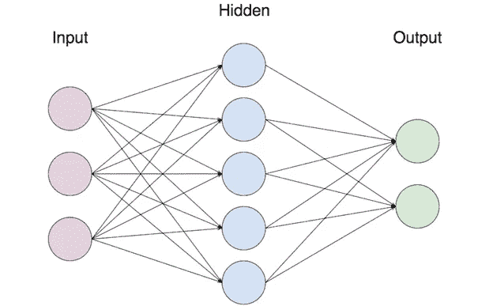
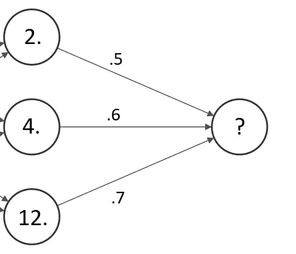
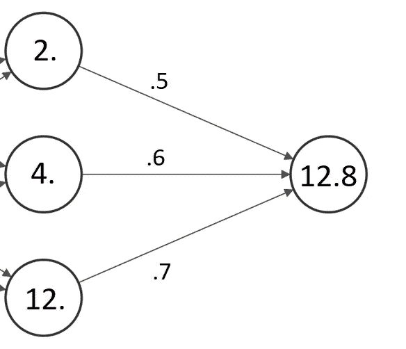

# 简而言之，神经网络

> 原文：<https://medium.com/codex/neural-networks-in-a-nutshell-2f0300b4fb00?source=collection_archive---------16----------------------->

在[系列](https://matthewtamerfarah.medium.com/ai-for-beginners-b8749064e23)的这篇文章中，我们将概述神经网络，它们如何工作，以及它们在机器学习中的应用。

在深入更高层次的概念之前，重要的是首先了解历史，或者更确切地说，神经网络背后的灵感，这将使我们更加直观地理解神经网络最初是如何以及为什么工作的。

也许并不奇怪这个名字，神经网络的灵感来自于我们大脑中神经元的工作方式。简而言之，我们可以认为神经元要么激活要么不激活，当我们有一系列相互连接的神经元时，一个给定的神经元是否激活几乎以蝴蝶效应的方式依赖于它之前的所有神经元。

然而，神经网络和神经病学开始出现分歧的地方是神经元到底要代表什么。人工智能领域中的神经元(又名节点)可以被认为包含或保存数据，如浮点，连接每个神经元的“突触”作为权重，指示对另一个神经元的激活强度。

为了帮助说明这个概念，让我们来看一个简单神经网络的描述。

简单神经网络的例子。(鸣谢:[https://towards data science . com/step-by-step-step-guide-to-building-your-own-neural-network-from scratch-df 64 B1 C5 ab 6 e](https://towardsdatascience.com/step-by-step-guide-to-building-your-own-neural-network-from-scratch-df64b1c5ab6e))

正如您所看到的，图像中的每个圆圈代表一个神经元，因此网络的第一个*层*包含 3 个神经元，第二个层(也称为隐藏层)包含 5 个神经元，最后一个层包含 2 个神经元，使得该网络中的神经元总数为 10。稍后将详细介绍图层。

连接神经元的线表示权重。权重本身是一个指定的数值，代表任意两个节点之间的连接强度，权重越大，两个神经元之间的连接或相关性越强。权重尤其重要，因为它们直接影响节点的输出。

权重在神经元的输出中起着至关重要的作用，这是因为任何给定神经元的输出都是与其相连的所有输入的加权和。

为了看到这一点，让我们看看给定一些输入和权重，神经元的输出会是什么。

因此，从图像中，我们试图找到其输出的神经元连接到前一层的三个神经元，每个神经元的输出分别为 2、4 和 12。这三个神经元通过权重连接到下一层的神经元，权重的强度依次为. 5、. 6 和. 7。为了找出这个神秘神经元的输出将是什么，我们必须将每个神经元包含的值乘以其权重的强度，然后计算其总和。因此，神秘神经元的输出将等于(2 x .5) + (4 x .6) + (12 x .7)即 12.8。

我们之前简单提到的层构成了神经网络的主干或结构。层可以被认为是神经元的列，通过权重连接到它之前和之后的层。此外，层在神经网络中的位置决定了它的名称和用途。

例如，神经网络中的第一层被称为*输入*层，其神经元代表神经网络将用来学习和预测的数据的每个组成部分。

说到预测，神经网络中的最后一层被称为*输出*层，如果神经网络正在对数据进行分类，那么对于输入数据的每个可能类别，输出层中都将有一个神经元。例如，假设我们正在训练一个模型来对汽车图像和卡车图像进行分类，我们在输出层需要两个神经元来表示我们的数据可能属于的两个类别。

位于输入层和输出层之间的其余层被称为*隐藏层*。隐藏层的数量以及每个隐藏层中神经元的数量是任意决定的，这意味着您，程序员，可以用不同的组合进行试验和调整，看看什么最适合您的模型。

隐藏层很有用，因为它们帮助模型从输入数据中提取重要的*特征*，这些特征对于帮助模型提取模式至关重要，因此可以对不同的输入进行分类。

在继续之前，重要的是要认识到有许多不同的*类型*的隐藏层，它们影响发生在层之间的不同操作，并且根据上下文，每一种都可能是有益的。最常用的层类型之一，称为*密集*层，它将一层中的所有神经元连接到下一层中的所有神经元，这正是我们在第一个示例中看到的层类型。遗憾的是，关于不同类型的层的全面讨论超出了本文的范围，但是请继续关注，如果您将来对此感兴趣，请告诉我。

这听起来很好，但是你可能会想:“一个如此混乱的系统怎么能够学习或产生任何可理解的东西！”奇妙的问题！神经网络实际上通过在训练过程中调整这些权重来学习，以便将输入映射到其预期的分类中。

神经网络是如何做到这一点的？大多数神经网络，也就是有监督的神经网络，都为它所训练的数据提供了标签，在每次通过网络的最后，模型都会计算出它的预测有多错误。模型有多不准确被称为模型的*损失*，可以用许多不同的方法计算。更多关于损失的信息将在以后的文章中发布。然后，模型使用*优化器*，如随机梯度下降，它采用为每个神经元创建的损失函数，并逐步调整权重，以找到该函数的最小值，这将减少模型的整体误差。

这可能听起来很混乱，所以让我们用一个类比来澄清一下。你可以这样想，神经网络本质上是在玩普林科(plinko)游戏，模型的工作是根据芯片的放置位置来调整钉子，以便芯片尽可能多地落入特定的插槽。

我相信你已经知道，神经网络已经迅速成为计算机科学中最热门的话题之一，很大程度上是因为它能够快速获取数据模式。这已经对世界上几乎每个行业产生了无数影响，并且没有停止的迹象，神经网络已经巩固了自己作为机器学习的基石，从图像分类器到自动编码器再到 GANS。

在结束这篇文章之前，我推荐任何想看详细介绍这些概念的动画视频的人去看一下 [3blue1brown 的](https://www.youtube.com/watch?v=aircAruvnKk)关于这个主题的精彩视频。

感谢大家阅读到目前为止，关注未来的帖子，并随时给我发电子邮件到**matthewtamerfarah@gmail.com！**