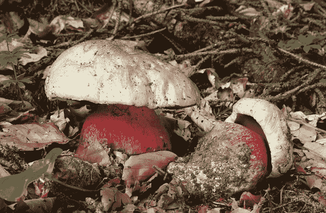
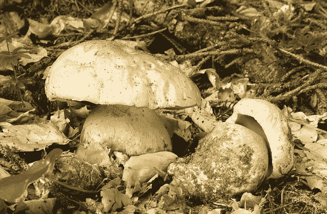
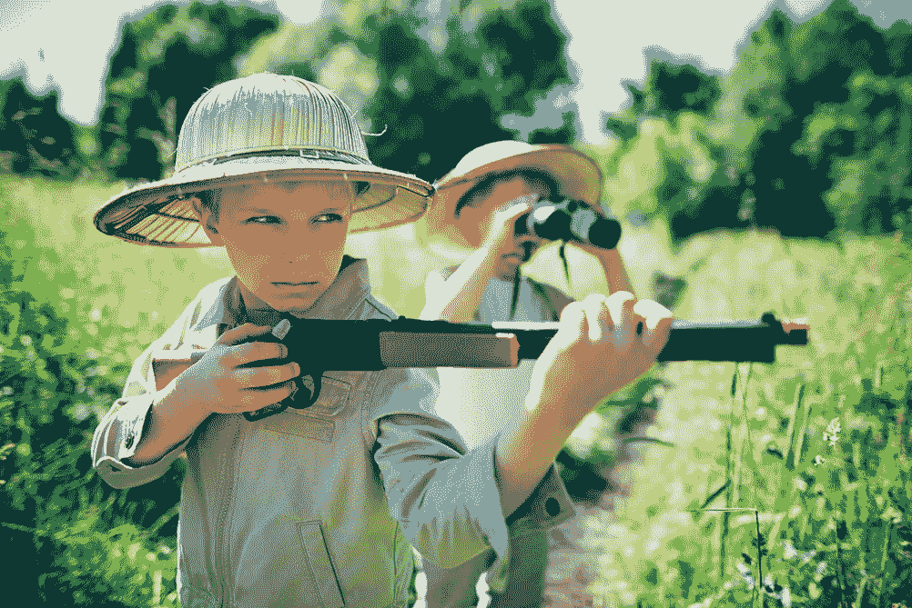
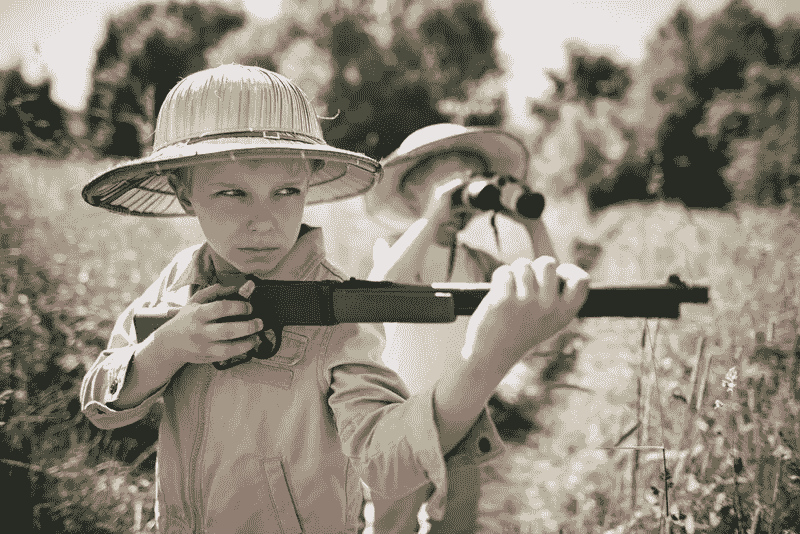

# 神经错乱的猜测

> 原文：<https://medium.com/codex/neural-wild-guesses-2ff00752dee9?source=collection_archive---------15----------------------->

## [法典](http://medium.com/codex)

*神经图像彩色化算法在灰度图片中产生幻觉色彩。然而，这项任务是不可能的。它们只能产生我们认为是合理的输出，但可能是对现实的胡乱猜测:“合理的感知不是现实”！*

考虑一张撒旦的伯乐图(左)。戴着白帽子的红色树干看起来又坏又危险。现在，取它的灰度版本(中间)，用你最喜欢的[着色 API](https://deepai.org/machine-learning-model/colorizer) ( *即*，一种神经网络算法)着色。我们最终得到了美味的牛肝菌(右图)。

(左)[撒旦的伯乐的原始形象](https://upload.wikimedia.org/wikipedia/commons/0/0d/Satans-R%C3%B6hrling_Boletus_satanas.jpg)。(中间)灰度原始图像。(右)使用[着色 GAN](https://arxiv.org/abs/1603.08511) 的彩色图像。

着色算法的输出看起来*在感知上似乎合理*，但是与原始的蘑菇形完全不同。着色算法不会出错；它只能在许多可能的着色解决方案中做出一种猜测。

为了评估各种彩色化算法，要求人们区分真实彩色图像和转换为灰度并重新彩色化的同一图像。好蘑菇和毒蘑菇哪个是原装的？

*愚弄率*衡量人类在识别地面真相方面的失败。有趣的是，在 2016 年一项关于神经网络着色的开创性工作中，愚弄率为 32%，而在 2021 年的一项最新工作中，愚弄率达到了 60%。因此，经过几年基于深度学习的彩色化开发，大多数生成的图像似乎比地面真实图像更真实*。*

*许多问题是神经网络算法所固有的，参见*例如*、[对立示例](https://arxiv.org/abs/1312.6199)、机器学习中的偏差或[虚假相关性](https://arxiv.org/abs/1902.10178)。这些问题催生了许多研究和解决方案。然而，这里的故事是不同的:着色算法执行得越好，愚弄率就越高，并且越难区分*似是而非的感知*和*现实。**

*但是为什么这种微妙的关系如此重要呢？因为这些图像将无处不在。并且不能区分*原始图像*和*部分生成的图像*可能会有不必要的副作用。*

*此外，着色任务只是我们推断输入图像中不存在的信息的许多任务之一。[超分辨率](https://arxiv.org/abs/1609.04802)让细节出现在粗糙的图像上；[修复](https://arxiv.org/abs/1604.07379)允许填充图像的整个区域；[图像转换](https://arxiv.org/abs/1611.07004)算法更一般地改变图像的格式，*例如*，通过将图画转换成真实图像或将红外图像转换成 RGB 图像等。*

*所有这些任务都有共同的特点，很快就会成为一种商品(如果还没有的话)*

*   *这是非常有用的。*
*   *它有许多用户引导的版本，*即*，你可以与算法进行交互。*
*   *已经集成到创意助手软件中。*
*   *当然，他们越来越成功，剩下的人造物慢慢地被处理了。*

*这一成功意味着互联网将会被这些算法的输出所覆盖。比如，试着用谷歌搜索“星夜”已经在图像结果的第一页上，有梵高杰作的风格转移版本。*

## *现在，有一个重要的现象需要把握:我们修改数字图像的能力增加可能会影响社会对信息的信任。*

*自从图像出现以来，我们已经能够修改它们。还记得约瑟夫·斯大林的那张著名的[照片](https://www.history.com/news/josef-stalin-great-purge-photo-retouching)吗？在照片中，他们设法除掉了与党“决裂”的尼古拉·叶佐夫……如今，我们进行这种改造的能力在自动化和质量方面都有了显著提高；参见*，例如*，GANs 可以实现的目标。
这明显加剧了恶意修改信息(图像、视频、声音)的威胁，即所谓的*深度伪造*。
当今世界，人们对信息系统的信任度下降，而“假新闻”等现象在公共辩论中占据了重要地位，因此证明信息的真实性已成为一个重要问题。*

*有了彩色化算法的输出或其他这样的算法来推断图像上不可恢复的信息，就没有恶意机构来制造赝品。然而，所有类型的图像将被混合，使得不可能区分这些*似是而非的输出*和*现实*。这可能最终会助长不信任感，并且*意外地*打击数字信息信任。*

*同样，我们要记住*相关性不是因果关系*；我们应该小心，看似合理的感知并不是现实。另一个简单的解决方案是确保这些图像被贴上标签(并被用户认为是)作为对现实的潜在的*大胆的*推断。*

*道路的最后一个例子。*

****

*(左)原图；(右图)在这张经过算法处理的彩色图像中，这个玩具现在可能被误认为是一把真正的步枪。
鲜艳色彩的欢乐气氛，变成了灰暗色调的焦虑气氛。*