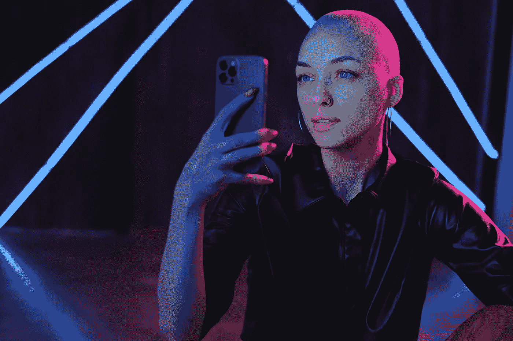

# Neuralink 将改变世界— 2022 年

> 原文：<https://medium.com/codex/neuralink-will-change-the-world-2022-982f406d4a14?source=collection_archive---------2----------------------->

## 未来科学

## 连接大脑和人工智能

照片由[从](https://www.pexels.com/@shvets-production?utm_content=attributionCopyText&utm_medium=referral&utm_source=pexels)[派克斯](https://www.pexels.com/photo/young-bald-woman-using-photos-on-smartphone-in-neon-studio-7194609/?utm_content=attributionCopyText&utm_medium=referral&utm_source=pexels)拍摄制作

euralink 几乎保证人类将在未来十年用机器智能来增强人类的能力。它将使人们能够建立一个全新版本的自己，它甚至建议那些不在前 1%的人可以加入这个新世界。