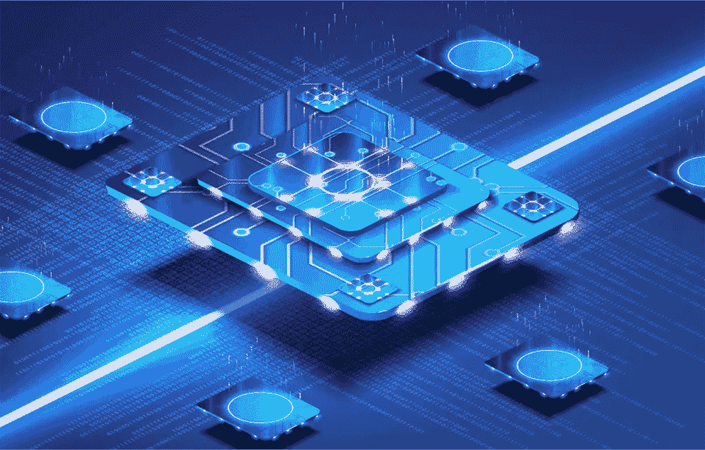
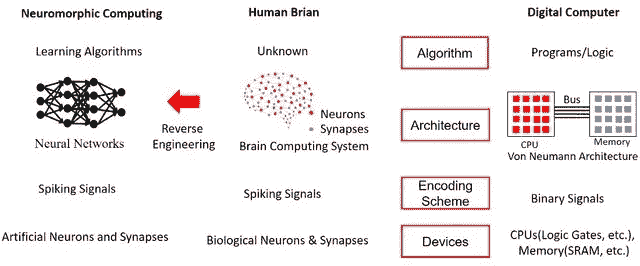

# 神经形态计算

> 原文：<https://medium.com/codex/neuromorphic-computing-2b5ecbd92b1f?source=collection_archive---------4----------------------->

来源:分析洞察

人工智能领域的人都知道什么是神经网络。大多数从业者都知道训练任何值得注意的神经网络都需要巨大的处理能力和能量消耗。也就是说，为了该领域的进一步发展，需要一种新型的硬件。

一些专家认为量子计算机就是硬件。尽管量子计算有着巨大的前景，但它是一项需要几十年才能发展起来的技术。物理理论还不够成熟，不足以开发出有用且经济的设备。

另一方面，神经形态计算将花费更少的时间和资源来开发，并且在设备开发成本和处理能力的能源成本方面都非常有用和经济高效。

## 神经形态计算或如何创造大脑:-

**神经形态计算并不是什么太新的东西，因为它在 1980 年首次被提出，它指的是模拟人脑的神经生物架构的模拟电路。**

如果你至少对深度学习的宣传有点兴趣，你就会知道它围绕着基于软件的算法和架构，这些算法和架构抽象地模仿大脑的神经回路。深度学习越来越多地传播到所有类型的行业，训练算法的成本是巨大的。
深度学习未能模仿的一件事是大脑的能效。神经形态硬件可以解决这个问题。

还有，你可以和著名的冯诺依曼瓶颈说**再见了。如果你不知道那是什么，它指的是数据从一个设备的内存到达处理单元所需的时间。这实际上使处理单元等待(浪费时间)获得它需要处理的数据。神经形态芯片没有瓶颈，因为所有计算都发生在内存中。**忆阻器是神经形态芯片的基础，可以同时用作记忆单元和计算单元，类似于大脑的工作方式。它们是第一批无机神经元。

资料来源:Researchgate.net

## 为什么神经形态硬件更适合神经网络？？

神经网络主要使用实数(例如 2.0231、0.242341 等)来表示神经网络架构内部的权重和其他值。然而，在目前的计算机体系结构中，这些值需要转换成二进制。这增加了在训练和部署中计算神经网络所需的操作数量。

神经形态硬件不使用二进制，但它可以使用真实值，如电流和电压等电气值的形式。这里，数字 0.242341 被表示为例如 0.242341 伏。这直接发生在电路内部，不存在二进制值。所有的计算都以电路的速度进行。

基于神经形态硬件，另一个大大提高神经网络的响应速度和训练速度的因素是计算的高度并行性**。关于我们的大脑，有一点是肯定的，那就是它是高度并行的，在我们生命的每一秒钟，数百万次计算同时发生。这就是神经形态芯片所能实现的。**

****所有这些优势都有一个好处:训练和部署神经网络算法的能耗低得多。****

> **"与计算机不同，大脑是完全互联的，每个神经元都与成千上万个其他神经元相连。"**