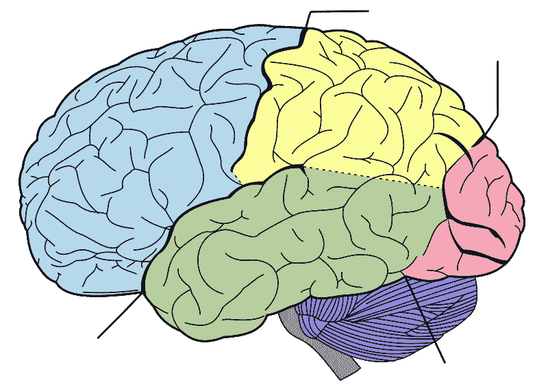

# 思想:预测处理的全脑模型

> 原文：<https://medium.com/codex/neuroscience-thought-basis-of-predictive-coding-theory-663dfbb6b89b?source=collection_archive---------8----------------------->

脑叶{FPOT}通过 [Mysid](https://en.wikipedia.org/wiki/User:Mysid)

已知事物是由大脑知道的，但如何知道呢？

怎么知道这是屏风，或者那是木头，鞋子，塑料之类的？事物如何超越被感知到被认识？为什么外界环境会影响感情？当一种反应跟随一种感觉时，如何知道这种反应正在发生？

大脑用什么现象来理解和联系世界，为什么它是强有力的？

神经科学称[预测编码](https://mind-foundation.org/predictive-coding/)——大脑不断猜测要做什么或接下来会发生什么。这类似于[的感知预测](https://pubmed.ncbi.nlm.nih.gov/31386853/)——对感知什么有一个预期。

然而，任何事情都是未知的就能预测吗？预测的过程似乎是自动的，但内容总是已知的。

云的变化可能意味着可能会下雨，因为过去云的变化会导致下雨。注射前预期疼痛是指知道注射是疼痛的，并“保持积极的思想”为注射做好准备。从童年开始，知识的获取就开始了，并随着调整而继续。是已知的事物和它们的串联决定了要预测或期待什么。

因此，大脑创造了一个世界模型，或者它有一个内部模型来猜测外部模型，然后更新的结论是不准确的。

科学中最大的问题之一是意识，这意味着[存在和认识](https://warwick.ac.uk/fac/cross_fac/iatl/study/ugmodules/humananimalstudies/lectures/32/nagel_bat.pdf)。

对哺乳动物来说，无论它意味着什么，存在和知道都是次要的，任何哺乳动物如何知道它所知道的。

知道就是记忆。当描述说大脑预测或期待时，它是已知事物的函数，是记忆的函数。

根据记忆，在任何情况下，任何不为人知的预测，无论准确与否，都超出了科学的范围。

然而，在什么样的统一组合中，记忆保存着不同类型的事物:时间、物体、人、距离、文字、图片、镜像、书籍、内在感觉——或[内部感受](https://www.psychologicalscience.org/observer/interoception-how-we-understand-our-bodys-inner-sensations)等等？因为记忆不会自己经历这些。

他们是在记忆中变得统一，还是在到达那里之前？

记忆在口语中用来表示回忆过去的事情，但记忆比所谓的记忆包含更多的东西。

然而，大脑是如何知道任何事情的呢？

在心理学中，认知行为疗法是标准。它基于所谓的[认知模型](https://hudsontherapygroup.com/blog/cognitive-triangle)。它的部分是思想、感觉和行为，跳过了记忆的角色。它说当一些事情发生时——一个人开始有所有这些想法。

作为治疗，目标是治疗，但是关于外部环境如何变成思想的未回答的问题可能是治疗失败的原因。

思想是怎么产生感情的？这些想法是如何被解释或了解的？感觉和想法之间的位置差异是什么，而不仅仅是模型的模糊位置？

思想是运动。感情是归宿。在任何感觉中——悲伤或快乐，都会有很多想法。感觉好或坏可能会减少其他可能有某种感觉的事情。悲伤会让最好的食物或财产变得毫无价值——这表明感情是有等级的。

还有两个关键问题，记忆是如何了解世界的？

思想和感情在大脑中遵循什么规律？

理论上，一切都转化为思想。这是[思想中的假设:其细胞的规则](https://www.reddit.com/r/consciousness/comments/r56afi/thoughts_rules_of_its_cells/)。

众所周知，所有的感觉都汇聚在一起，或者说存在[多感觉整合](https://www.ncbi.nlm.nih.gov/pmc/articles/PMC4215474/)，假设说这是基于思想的[预测](https://www.reddit.com/r/psychologyresearch/comments/rhxmvm/multisensory_integration_is_predicated_on_thoughts/)。

气味能带来过去的想法的原因是，当气味被感知时，当时的气味和周围的事物都转化成了想法。它们开始被储存起来——然后组合在一起——在内存中。

所以下一次闻到这种气味时，记忆会给出这种气味是什么的想法，以及在闻到这种气味时的其他事情——从以前开始。这就是为什么说气味会带来记忆。

这类似于味觉、触觉、视觉和听觉。可能会听到别人的名字，然后记忆会给另一个人这个名字和这个人是什么。名字或其他任何东西都变成了思想。这些想法在存储器中被存储和分组。

任何东西都有物理实在，衣服、椅子、桌子、笔等等。这种物质现实转化为思想现实。它是大脑用来理解和联系世界的事物的思想状态。杯子、桌子和椅子是对记忆的思念。或者说，记忆承载着那些东西的思想版本，决定着使用和谨慎。

语言是一种外部的或普遍的现实，它变成了思想，被记忆所知并用于交流。

理解为什么哺乳动物大多听不懂人类语言的一个方法是，因为那种交流对它们来说没有转化为思想，所以它没有成为它们的记忆可以利用的东西——也没有赋予感情，即使对它们说了最猥亵的话。

虽然他们能感觉到尖叫、信号和某些单词——如果他们以前听过，或者在他们的记忆中储存和分组，但一般来说，他们没有将人类语言转换成思想的端口。

痴呆症中所谓的记忆丧失可能不仅仅是杯子不再储存在记忆中，或者椅子没有以一种被称为座位的方式储存，而是一些感官输入没有被转换为思想——或者物理和思想现实之间存在断裂。

杯子没有被转换，所以它在物质现实中的样子对思想来说变得毫无意义，使它被忽视或误用。因此，虽然记忆丧失是一个问题，但记忆之前发生的事情也是痴呆症的一个问题。

很多时候，任何事情都是可以知道的，但除非提醒，否则记不住。所以没记住不代表没储存。但是要进入这个储存库，一个被转换的思想必须进入记忆，从它的储存库或群组中释放出来。在痴呆症患者中，茶杯或任何东西都可以被储存，但当看到它们时，它们不会转化为思想，也不会消失。

从理论上讲，记忆也知道消化、循环、呼吸等等，它们的各个部分都有存储，并根据相似性、共现性等等进行分组。

每当消化问题给[带来不好的感觉](https://www.reddit.com/r/consciousness/comments/r8ntyk/hunger_is_ghrelin_to_know_it_is_is_memory_to_eat/)，那是因为它被转化成了思想。这个有缺陷的想法进入了它在记忆中的储存，在进入一个坏情绪的地方之前，hit 和[扩展了储存](https://www.reddit.com/r/DopamineDetoxing/comments/rzdxjm/like_want_memory_dopamine_duopoly/)。肿胀的商店会影响周围的其他商店和团体，并可能导致心率加快、呼吸加快等。

当听到个人的坏消息时，它会变成一个想法，进入记忆库，并可能遵循类似的过程。这个[解释了](https://www.reddit.com/r/HeartDisease/comments/rs6v2v/thoughts_psychosomatic_section_of_heart_disease/)许多身心或心理的情况。从理论上讲，思想在[心理-神经-免疫-内分泌](https://pubmed.ncbi.nlm.nih.gov/29124696/)双向交流中是不变的。

通过思想，记忆是神经可塑性的[中心阶段](https://www.reddit.com/r/physiotherapy/comments/rveumk/memory_basis_of_neuroplasticity/)——大脑随功能变化的概念。

在假设中，神经可塑性主要是记忆储存的分组和重组过程。大脑——或者更恰当地说，记忆——的变化可以是某种东西的储存，在使用、调整、持续时间等方面与其他储存重新分组。

当人们说记忆储存在大脑的不同部位时，理论上，这可能意味着群体位置决定了存储的归属，因为群体通常是存储之前的访问点。

来自转换思想的感觉是慢性疼痛强度的原因，所以某些药物不仅仅是为了减轻糟糕的感觉，而是为了带来最好的感觉。

感情是由垂直方向决定的——最好的、最坏的、甜蜜的和有规律的。思想面对这些垂直决定兴奋、快乐、愤怒、悲伤等等。垂直方向有一个出口区域，决定反应，如微笑、皱眉等。

上瘾通常是因为一些记忆存储被访问、重组和感觉带来最好的，或者有时从悲伤或担忧的[积累点](https://www.reddit.com/r/Brain/comments/rc2aww/theoretically_addictions_becomes_thoughts_then/)改变。

睡眠是某些感官的[入口](https://www.reddit.com/r/Dreams/comments/rdsn41/theoretically_does_the_mind_generate_stories_as/)关闭，睡眠垂直呈现。缺乏睡眠或良好的休息可能是一个或两个不完整的结果。

有思想——思想现实:想象、梦想等等。因此，一些已知但未被外界体验到的东西，可能会在思维空间中挑战现实。钢笔可以用作洗衣机，袋子可以用作通风系统，或者类似的东西。

思想-思想现实可以带来好的感觉，也可以带来坏的感觉——如果对某事发生后可能发生的事情有预测的话。

有了思想-思想现实，什么都可以，但是有了[物理-思想现实](https://www.reddit.com/r/neurophilosophy/comments/r9syub/physical_reality_to_thought_reality_theoretical/)，或者思想现实的共性，有一种普遍的接受，即笔不是洗衣机等等。

每当普遍的现实被否认时，它会让人们感到羞愧或沮丧，这通常是不必要的。所以，当物质现实没有被他人从外部强加时，感觉——内在地——[会强加共同的现实](https://www.reddit.com/r/cogneuro/comments/rzdemj/misjudgment_presumption_and_optical_illusion/)。

在许多精神病学的情况下，受影响的人从这个物质到思想的现实是断开的，他们的感觉不会到达羞愧的地步。他们的感情变得支离破碎，混乱了快乐、悲伤、难闻的气味，然后是混乱的反应、笑声、眼泪、离开等等。他们的感觉目的地，应该主要加强共同的现实，失败了。

存储器具有存储器，并且这些存储器被分组。这与伊凡·巴甫洛夫在[联想学习](https://www.simplypsychology.org/classical-conditioning.html)中发现的相似，其中一个事物链接到另一个事物。

此外，BF Skinner 开发了[学习和奖励](https://www.simplypsychology.org/operant-conditioning.html)，这是这个假设描述的在某些情况下给予最佳垂直感觉。

理论上，我们如何知道我们所知道的是因为一切都被转化为思想。决定所有权、谨慎等等的是思想版本。无论预测的是什么，都是思想的形式。思想或它的形式是所有有机体存在的核心。

思想继续着预测——不管是不是自动的。思想或它们的种类是记忆所拥有的。如果有任何东西被思考，或者可以被思考，它首先[成为一个思想](https://www.reddit.com/r/RandomThoughts/comments/rgekso/youre_not_seeing_youre_thinking_theory/)。主动或被动的想法是神经元放电的主要活动。情绪是感情的一部分。思想是超越内在的声音，其他的声音，阅读的声音，思考等等。

思想大多是身心问题的[头脑的一半](https://www.reddit.com/r/psychologyresearch/comments/ru7s9w/thoughts_in_the_mind_body_problem/)。身体或外部活动会干扰思想的一个原因是，身体活动被[转化为](https://www.reddit.com/r/cognitivescience/comments/rdszhx/consciousness_reality_and_thoughts/)思想并变得活跃，与侵入的思想交替。

此外，感觉减弱的一个原因是感官变成了思想。任何被转换的思想都足以带来它自己的感觉，[摆脱主导的感觉。](https://www.reddit.com/r/Emotions/comments/ryivaj/thoughts_activity_of_feelings_dissipation/)

概括地说，任何感觉到的东西(听到的、看到的、闻到的、尝到的或触摸到的)，变成已知的，转化成思想并进入记忆。感官是[不够](https://www.reddit.com/r/precognition/comments/rxfgar/precognition_is_a_form_of_imagination_which_is_a/)。知、感、反应才是完成。

这个过程是迅速的，但却是有序的。一种不被理解的语言中的单词不会有伤害。这里说的是记忆先于感觉。所有记忆所知道的都统一地以思想的形式存在。

事物不转化为思想，要么转化为与思想交融的东西，要么转化为成为思想的东西，要么就是单纯地转化为思想。