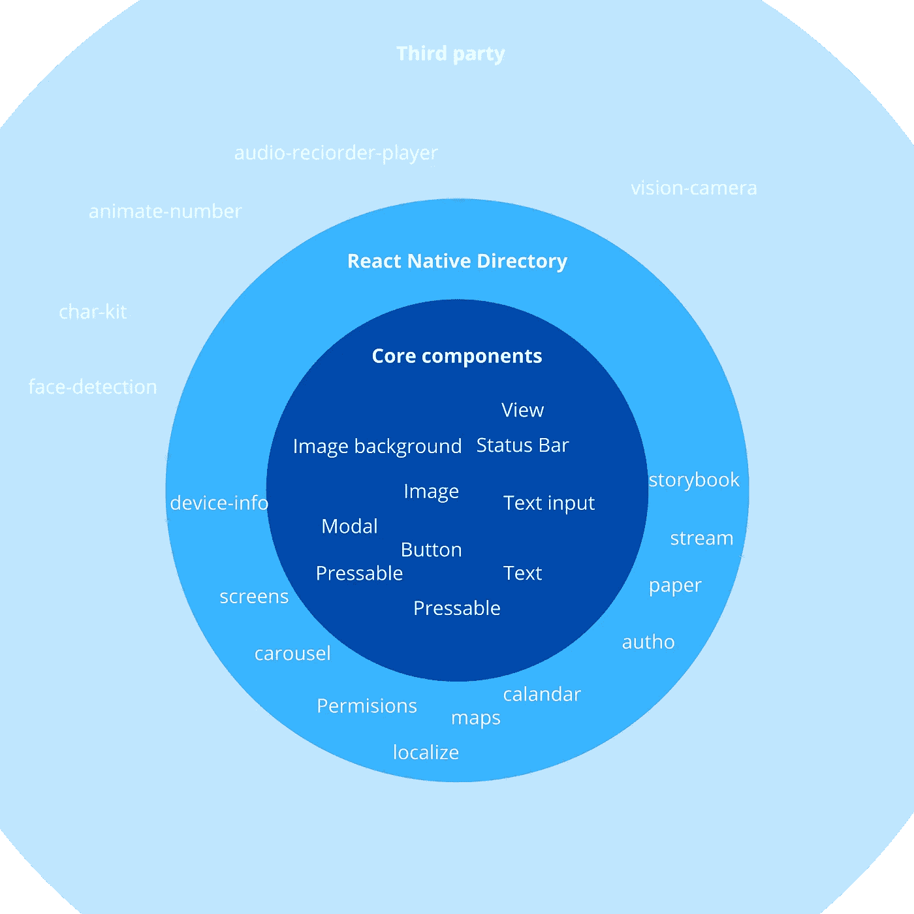

# 永远不要使用 React Native

> 原文：<https://medium.com/codex/never-ever-use-react-native-2d452826b176?source=collection_archive---------2----------------------->

**免责声明:**这篇文章是在我对 Expo 有足够了解，或者知道可以在 bare react native 项目上使用 Expo 包之前写的。简而言之，我和我有缺陷的研究是这里的小丑。那么，你为什么还要阅读 react native 这个理想案例呢？好吧，这样你就不会犯同样的错误。

在上述启示之后，一个更恰当的标题将是**永远不要在没有博览会的情况下使用 BARE REACT NATIVE。**

*** *请务必查看结论部分。**

在你的记忆中，你一直在开发网站，或者最近偶然发现了它们。无论如何，您很快意识到多页面的重复开发有多困难，尤其是当您涉及到大量 javascript 时，这通常是具有动态功能的多页面 web 应用程序的情况。因此，您探索了 javascript 框架，但其中一个是谈论最多的。它是轻量级的，有最简单的学习曲线，并且有所有的影响力，所以你跳上了船。你玩它，你喜欢它。

如此美丽、浪漫的故事！！不管你的是什么，现在你已经非常熟悉组件、钩子和所有的 react 细节，所以当你决定建立一个新的移动应用或者将你的 web 应用扩展到移动时，你的第一选择显然是 React Native，React but mobile。

如果那是你，停一下。**永远不要使用 REACT NATIVE。**

好吧，好吧，好吧，这有点夸张。React native 很牛逼，我也很喜欢，但它并不是万能的；如果您开始使用 react native 进行移动开发，我不想打击您的积极性，尤其是如果您有 react 或其他 javascript 经验的话。很有道理。而且你实际上可以用它做很多事情(事实上，两周前我开始 react native 的时候就是我。我很了解 react，并且用 java 做过一点 android 开发。)

**警告:前方索赔错误**

**这都是关于你正在努力做的事情**。例如，如果你正在修改你的移动网站，而你的网络应用不需要很多原生功能，如摄像头、蓝牙和其他系统功能，那么 hell React native 可能是你的最佳选择。

但另一方面，如果你正在制作一个更接近系统的应用程序，你需要很多功能，你，我的朋友，可能会有一些大麻烦。例如，您将意识到摄像头访问不是 react-native 的核心功能。如果你不知道 react native 的组织，你应该看看这个[页面](https://reactnative.dev/docs/components-and-apis)，但简而言之，下面的图片解释了它。

**免责声明**:此图片不包括 expo-*库

基本上，React Native 的每个版本都会更新核心组件。这些是大多数应用程序绝对需要的。还有社区维护的图书馆。这包括轮播、权限、日历、auth0 等等。其中一些可以说是核心组件的一部分。

正如我前面提到的，我在写这篇文章之前有一个误解，就是 expo 包不能用于 bare react native，但这是有缺陷的研究的结果。因此，在第二组组件中，在 React-native 社区提供的组件之上，有 expo-camera、expo-av(音频视频)、expo-background-fetch、expo-barcode-scanner、expo-crypto、expo-facebook、expo-in-app-purchases 等库。

最后，是自由的世界，狂野的西部。这是您拥有第三方库的地方。

## **接下来的说法非常正确。**

如果你的应用严重依赖于第三圈上的组件，结果就像一个 c 程序员说的那样，是没有定义的行为。

以下是这第三种情况下 react-native 烂的原因。

1.  它是分散的
2.  它是分散的
3.  它是分散的

不要误解我，我是去中心化和开源社区的超级粉丝。见鬼，我爱 Linux，开源项目的缩影。这种爱是我分享我的发现的部分原因。然而，在像第三个圈子这样的情况下，开源在目前的形式下是不够的。

简而言之，如果你有**不同的** **小的**组件，(注意这里的关键词)开源可能是低效的。Linux 有不同的组件(不同于 in，由多方构建)。Linux 也有小组件(按大小和价值)。但是，如果没有一个大的激励性中央实体来指引项目的方向，那么由这些不同的小组件组成的应用程序崩溃只是时间问题。那一天可能是下一个 React 安全补丁发布期间，也可能是你的应用发布的前一天。

**这就是为什么你应该尽可能地远离第三方组件，除非你是一家能够维护它们的大公司。我一开始就错过的一课。这个问题在某种程度上可以通过使用 Expo 来解决。例如，使用 expo-camera 比使用 react-vision-camera 更好。**

也就是说，这里是使用多个第三方库产生的实际问题。

1.  版本冲突:你从自由世界安装了 4 个不同的包，接下来你知道你必须转向黑暗面(NPM-force)。这不是一个特别自然的问题。如果你以前使用过 nodeJs，你就会知道 npm 依赖有多烦人，但是我发现它在 react native 中表现得最明显(不使用 expo 包)。
2.  不同的编码标准:这个是经典！！你可能知道栈顶流代码的迷因。

3.未维护的代码:你会对维护一些关键的第三方特性的人的数量感到惊讶(**只有当你出于某种原因没有使用 expo** 时才是这样)。例如，一个蓝牙库有 13 个贡献者，其中 3 个贡献了 99%。一个系统设置库有 14 个贡献者，其中 2 个人有 99%的贡献。最重要的是，相机库 react-native-vision-camera 由 33 个人维护，其中只有一个人做出了 99%的贡献。对这些做出贡献的伟大人士的赞誉，我们应该尽可能地支持，但询问任何网络工程师都会告诉你，单点故障是你最想避免的事情。关于最可能的失败点，请记住，一个人无法跟上由组织和多个个人支持的快节奏的 react 核心改进。

# **结论**

1.  在我开始下一个项目之前，我需要做好我的研究。我本可以阅读[这篇](https://adhithiravi.medium.com/building-react-native-apps-expo-or-not-d49770d1f5b8)由[阿迪西·拉维钱德兰](https://medium.com/u/d557f5db78e7?source=post_page-----2d452826b176--------------------------------)撰写的好文章，并了解到世博会支持系统特性。
2.  Expo 是 react native 之上的工具，它有许多支持良好的库，如 camera 和 audio。
3.  世博会维护的图书馆，如世博会相机可以使用，即使你退出博览会。另外，如果你是从一个裸项目开始的，Expo 可以在以后添加进来。
4.  尽可能避免第三方库。尽管它们对 React-native 来说并不像我最初想的那样是个大问题，但是由于上面讨论的原因，它们还是很烦人。
5.  写一篇批评 React-native 的文章，教会你一个被忽视的事实。

如果你不同意或有任何问题或评论，请让我们在下面的评论区讨论它们。如果你对即将发表的文章“react DAO”感兴趣，请关注我，敬请关注。