# 绝不丢任何一个！使用 Pyspark 提高用户流失预测挑战

> 原文：<https://medium.com/codex/never-lose-any-one-sparkify-user-churn-prediction-challenge-using-pyspark-7ab67ac080d4?source=collection_archive---------13----------------------->

Github 回购:[此处](https://github.com/BurgerWu/Sparkify-Project)


# 介绍

对于任何服务提供商来说，如果他们能够感觉到一些用户将要离开或取消他们的服务，这对于他们的生存是至关重要的。在这个项目中，我们提供了包含为每个用户-服务交互记录日志的数据集。我们将在后面的部分讨论数据集的细节。我们的任务是从我们拥有的数据集建立预测模型，并预测特定用户是否有流失的意图。

为了实现我们的目标，我们使用 Pyspark 作为我们项目的框架。Pyspark 是 Python 的 Spark API，特别是在处理大数据时，它的工作效率很高。在 Spark 的帮助下，我们能够构建高效且有用的应用程序。

# 关于数据集

在本文中，我们仅使用原始大型(12GB)数据集的一个子集(230MB)进行初步建模。下面列出了数据帧的模式。该数据集中有 448 个不同的用户。

```
 |-- artist: string (nullable = true)
 |-- auth: string (nullable = true)
 |-- firstName: string (nullable = true)
 |-- gender: string (nullable = true)
 |-- itemInSession: long (nullable = true)
 |-- lastName: string (nullable = true)
 |-- length: double (nullable = true)
 |-- level: string (nullable = true)
 |-- location: string (nullable = true)
 |-- method: string (nullable = true)
 |-- page: string (nullable = true)
 |-- registration: long (nullable = true)
 |-- sessionId: long (nullable = true)
 |-- song: string (nullable = true)
 |-- status: long (nullable = true)
 |-- ts: long (nullable = true)
 |-- userAgent: string (nullable = true)
 |-- userId: string (nullable = true)
```

# 探索性数据分析

在本节中，我们将对收到的日志数据执行探索性数据分析。我们将重点分析整个群体，而在第二部分，我们将深入分析用户群。

## 用户活动计数直方图

通过按 userId 分组，我们可以获得用户活动的计数。绘制出我们的结果后，这是一个右偏分布就不足为奇了，因为大多数用户对我们的服务反应并不那么极端

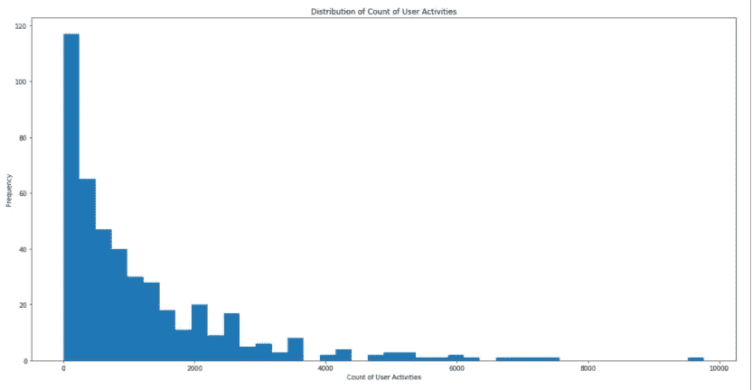

## 按页面类型列出的活动

我们通过统计不同页面上的活动数量来了解用户交互的总体情况。看起来访问量最大的页面是 NextSong，而第二和第三大页面是 thumbs up 和 home。

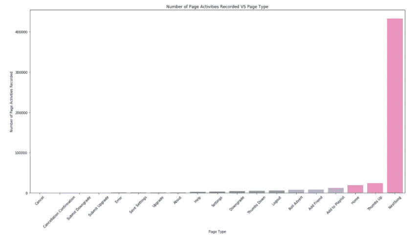

## 用户性别

我们很好奇总用户的性别分布。结果显示，使用我们服务的男性用户多于女性用户

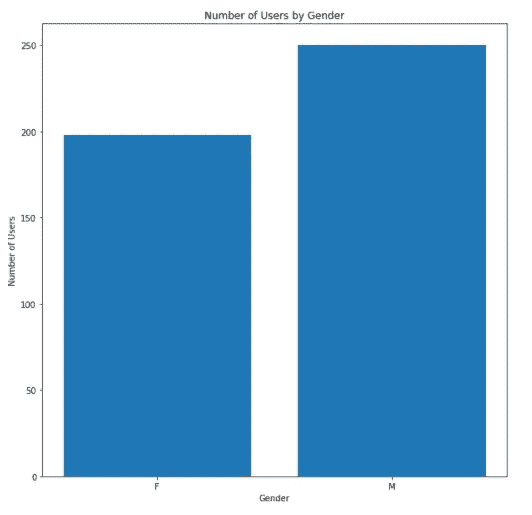

## 位置

下图显示了不同地区用户的分布情况。用户最多的前三个城市是纽约、洛杉矶和波士顿。

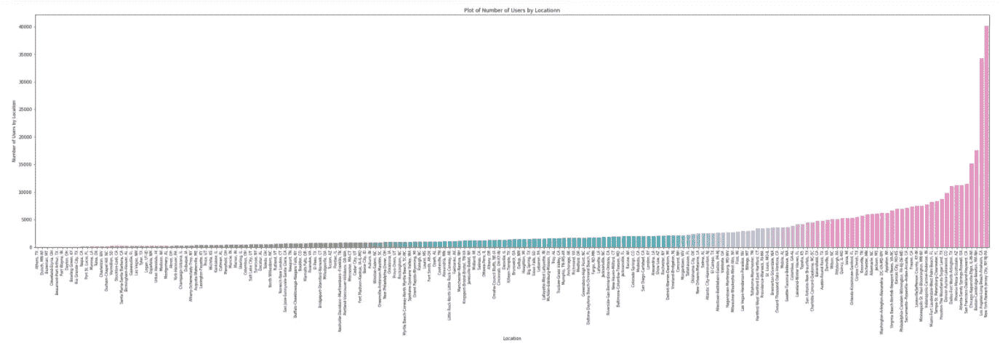

## 最受欢迎的艺术家

根据我们的统计分析，最受欢迎的两位歌手是《莱昂之王》和《酷玩乐队》。以下是最受欢迎的 20 位艺人。

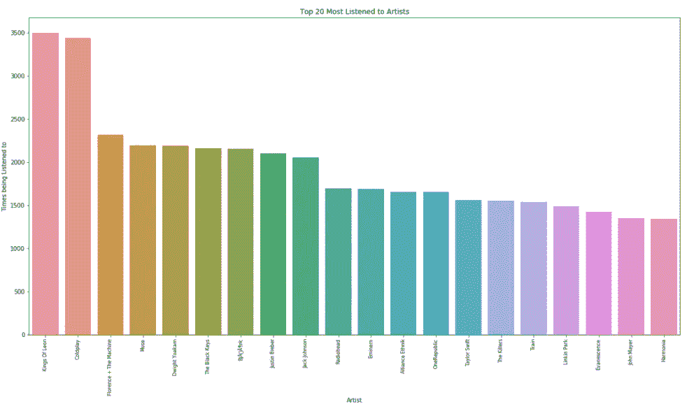

## 大多数人听歌

最热门的歌曲是《非诚勿扰》。下面是前 20 名的点击率。

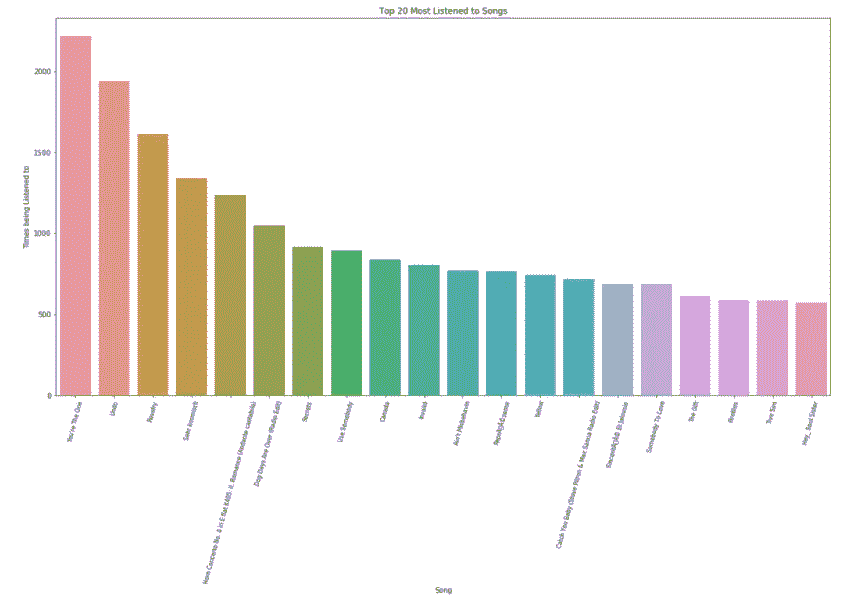

现在，我们将开始分析不同搅动组的数据，以查看搅动用户和非搅动用户之间是否存在显著差异。

## 降级次数

搅动用户和非搅动用户的降级行为除了在搅动用户群体中出现一些极值外，没有显著差异

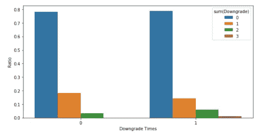

## 升级次数

搅动和非搅动用户之间升级次数的比率似乎没有显著差异。

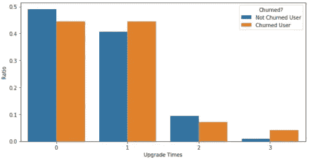

## 最终用户级别

我们检查了最终用户级别和流失之间的关系，发现付费用户比免费用户有更高的流失机会。

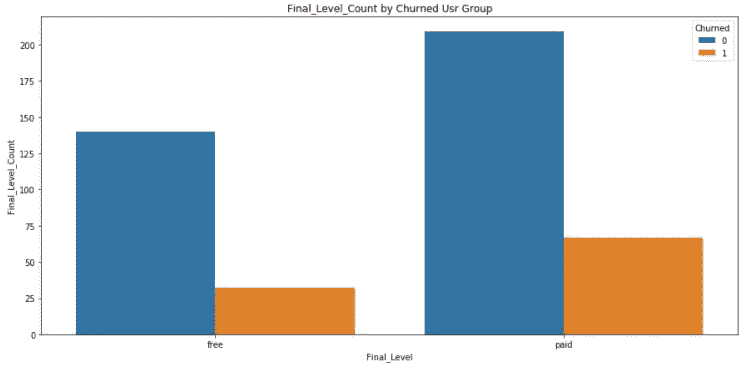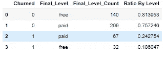

## 总花费时间

虽然总花费时间的平均值对于非频繁使用的用户来说有点高，但是从 kde 曲线来看，两组用户之间没有明显的区别。

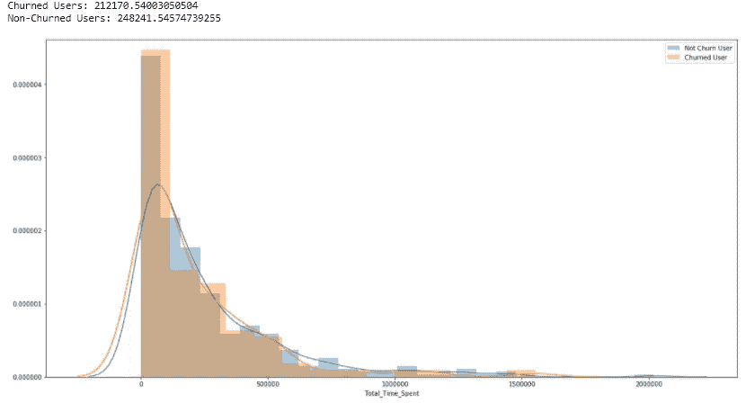

## 歌曲总数

与总花费时间相同，两组没有明显的区别。

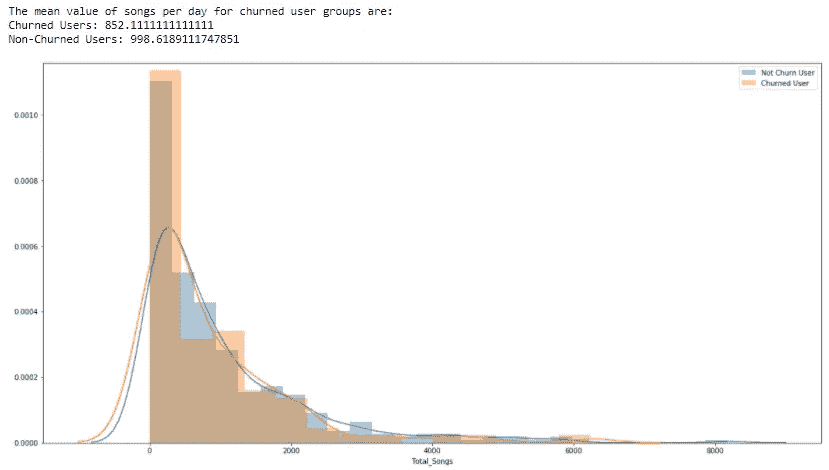

## 每月会话数

频繁使用的用户比不频繁使用的用户每月有更多的会话。

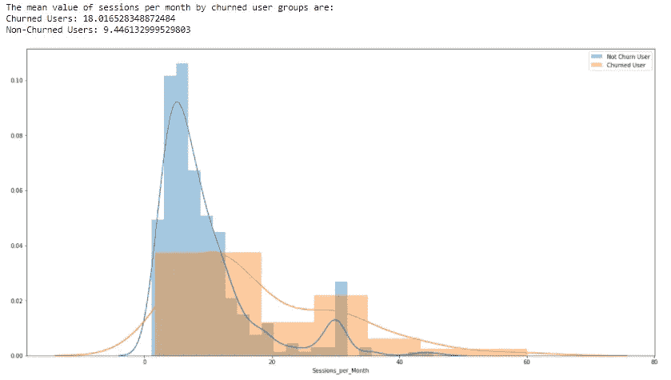

## 平均会话长度

尽管这种分布并不完全相同，但仍然没有证据表明这两个群体在这一特征上有不同的行为。

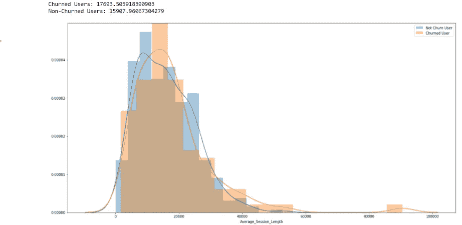

## 用户设备

用户设备的两大主流是 Windows 和 Macintosh，但它们都具有与数据集群体相似的流失率。至于其他少数民族，用户太少，不具有代表性。

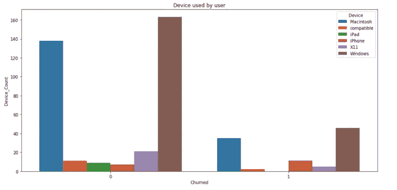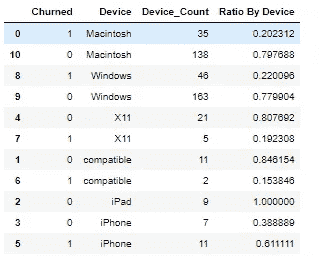

## 给予的总赞数

非易激动用户比易激动用户更倾向于竖起大拇指，但没有那么显著。

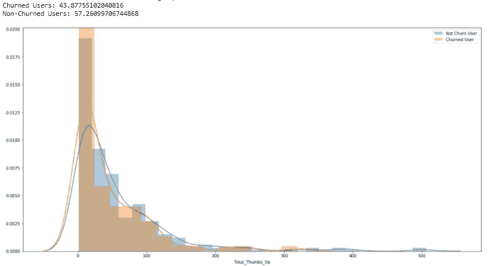

## 每天竖起大拇指

但是，如果我们分析每天竖起大拇指的情况，令我们惊讶的是，易怒的用户比不易怒的用户更倾向于竖起大拇指。

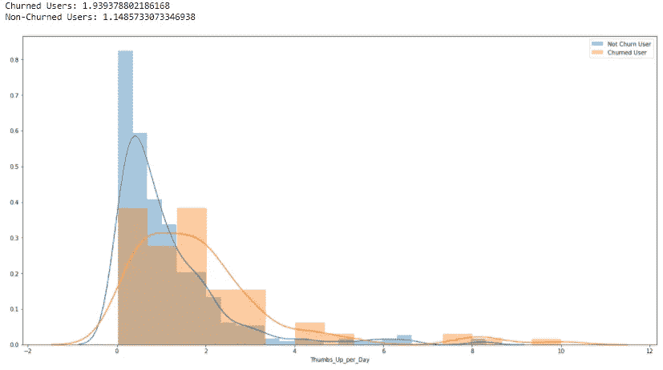

## 完全否定

两组用户给出的平均否定量是相似的。

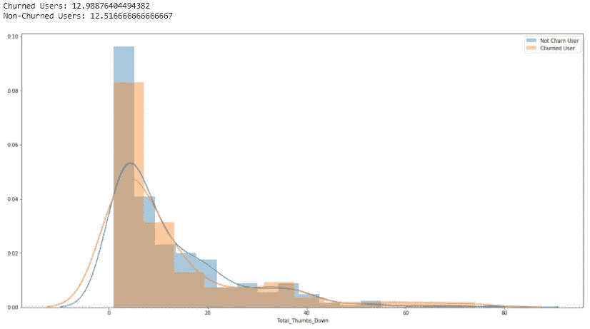

## 每天拇指向下

但是当我们每天分析拇指向下的时候，有一点变得很重要，那就是兴奋的用户比不兴奋的用户每天发出更多的拇指向下的声音。

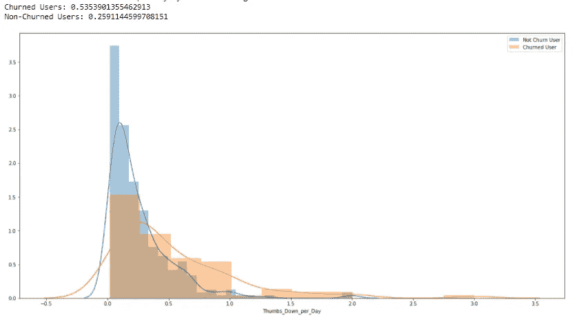

## 拇指向上比率

我们创建了一个名为“竖起大拇指比率”的新功能，来调查所有评级行为中竖起大拇指的比例。根据该图，有一个位于较低侧的峰值，反映了搅动的用户平均具有较低的竖起大拇指比率的事实。

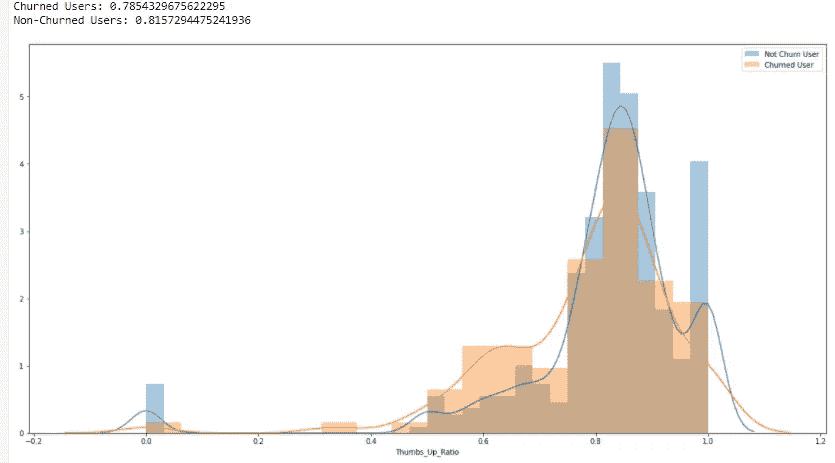

## 性别

男性和女性的流失率与数据集人群几乎完全相同

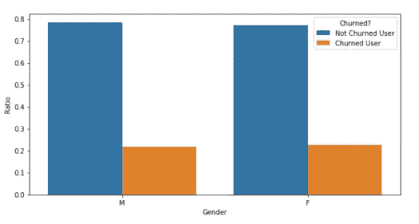

## 独特的歌曲

两组之间的独特歌曲没有显著差异

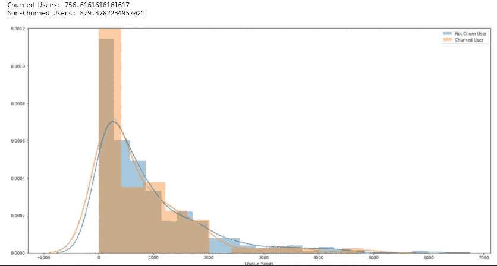

## 独特的艺术家

两组之间的独特艺术家没有显著差异

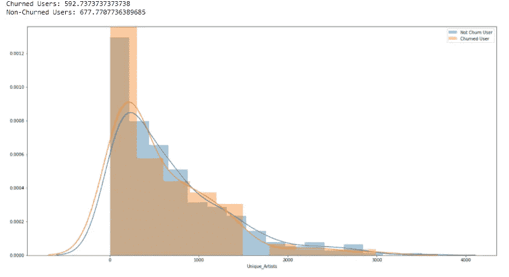

## 会话中的平均项目

搅动的用户平均会话中的项目稍多，但不显著。

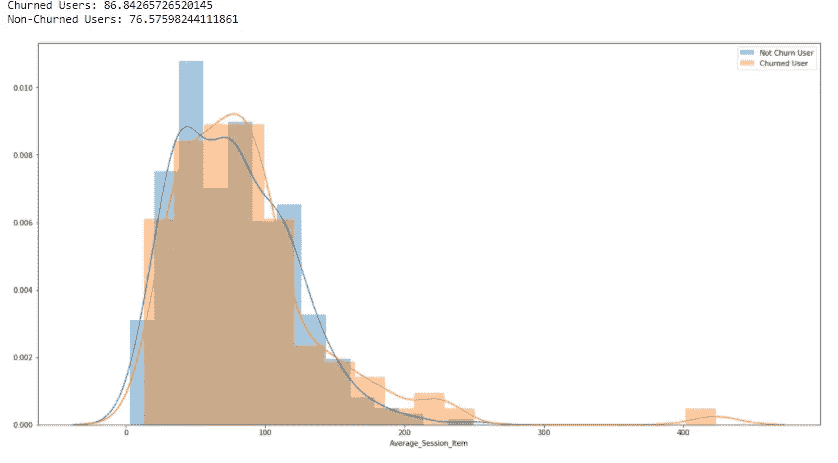

## 朋友总数

非狂热用户往往比狂热用户拥有更多的朋友。

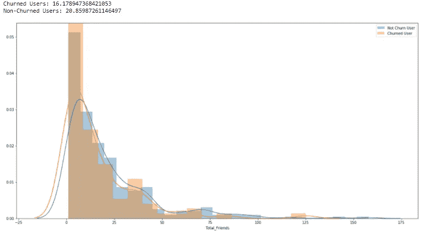

## 会员期限

成员资格持续时间是指注册和最后一次记录日志之间的时间长度。显然，非活跃用户比活跃用户更容易保持会员资格。

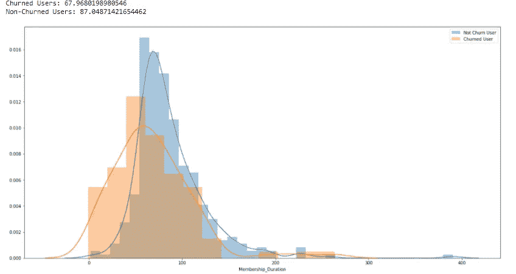

## 每天的错误

我们分析了用户每天面临的错误，因为这对服务提供商来说是一个严重的问题。正如我们预期的那样，被搅动的用户平均每天面临更多的错误。

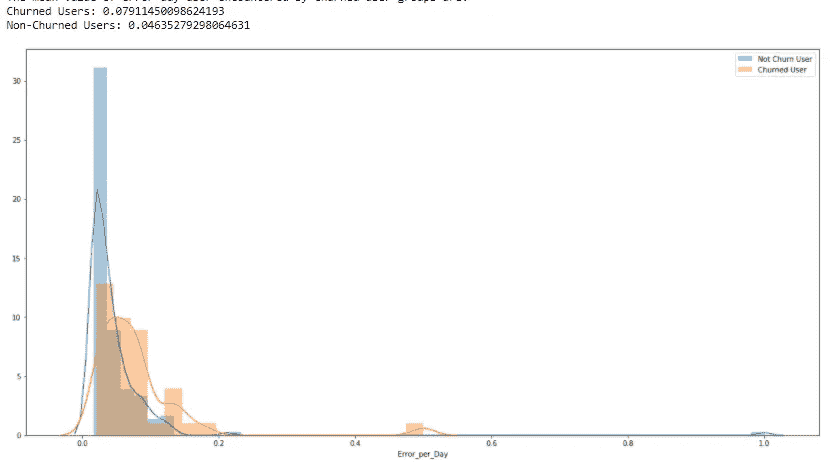

# 特征工程

为了评估我们的用户流失意图，我们需要将数据集转换或记录为有用的特征。基于上一节的探索性分析，我们选择了以下特性。在这里，我们将讨论我们为后面的机器学习过程创建的功能。

## 用户是否搅动

该列是我们的标签列，因为我们的目标是预测用户是否会流失。根据我们的分析，所有不愉快的用户最后一次访问我们的服务是在“取消确认”页面上，并且再也没有回来。因此，在这种情况下没有返回或重新加入的情况。

## 用户时间跨度

我们的一些功能应该每天进行分析，因此，我们计算每个用户的时间跨度，即记录的第一个和最后一个日志之间的长度。

## 最终水平

最终级别是指记录用户最后一次活动时的用户级别。有两类免费或付费用户。在使用此功能之前，我们需要执行虚拟转换。

## 每月会话数

我们按月统计用户的会话数。

## 每天竖起大拇指

从探索性分析来看，每日竖起大拇指似乎是一个显著特征。

## 每天拇指向下

从探索性分析来看，每日拇指向下似乎是一个显著特征。

## 拇指向上比率

此功能是关于所有评定行为中竖起大拇指的比例(竖起大拇指和放下大拇指)

## 会员期限

这一特征在某种程度上反映了我们服务的忠诚度

## 每天的错误

正如我在上一节中提到的，这对于服务提供商来说是一个严重的问题，从我们的分析来看，用户每天面临的错误对于两个用户组来说有很大的不同。

## 会话中的平均项目

我们也对用户每次会话中的平均项目感到好奇，这可能意味着用户会在一次会话中持续使用我们的服务多长时间。

# 建模和评估

在建模过程中，我们首先应用 vectorassemble 和 minMaxScaler 处理我们的数据集，然后用三种候选算法进行拟合，包括 Logistic 回归、支持向量机和 RandomForest。在与我们的训练数据拟合之后，我们然后用拟合的模型转换我们的测试集数据。最后，我们使用准确性和 f1_score 等指标来评估基于测试集性能的最佳模型。

## 预处理

在预处理阶段，我们使用了矢量汇编器和标准定标器

## 初步试验

因为原始数据集是不平衡的，并且只有数百个数据，所以我们进行了初步测试，以检查单个分类器是如何工作的，并决定适当的正标签与负标签的比例，以供稍后优化。

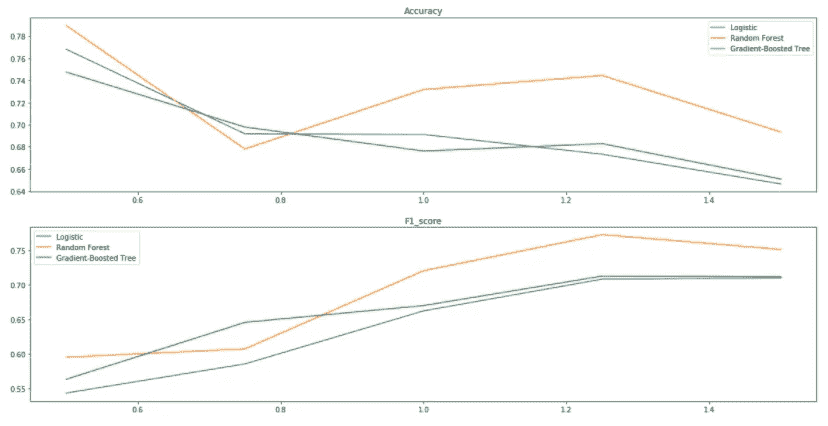

不同分类器的准确度和 F1_score 比较

从上面的结果图中，我们可以看到，在正负比率为 1.25 时，精确度和 f1_score 都得到了优化。因此，我们将在后期优化中使用 1.25 作为我们的比率。

## 使用 ParamGrid 和 CrossValidator 进行优化

最后，我们尝试使用 paramgrid 和交叉验证来优化我们的分类器。这里显示了所有三个分类器的 paramgrid 参数。我们在 crossvalidator 中使用 8 折 crossvalidation。

## 评估

下面是显示我们使用的所有三个分类器性能的线图。正如你所看到的，当我们在平衡测试集上测试时，我们可以达到 f1_score 和 0.7 以上的准确率。但是，当我们用整个数据集转换模型时，性能最高仅接近 0.6。对于 f1_score

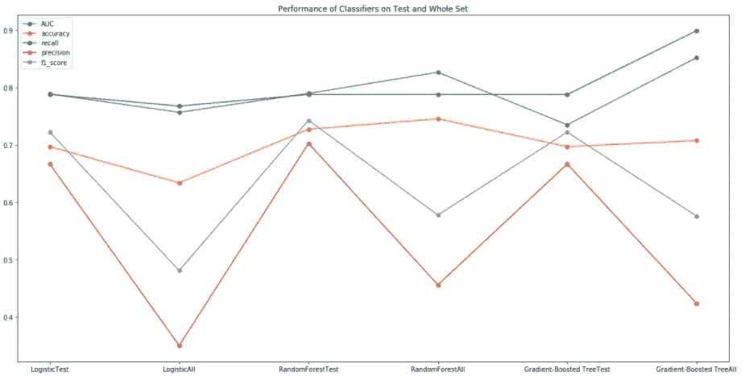

## 正当理由；辩解

因为梯度增强树很容易在这个小数据集中过度拟合，并且比随机森林更耗时。我们决定采用随机森林作为我们的最终模型。

总的来说，逻辑回归表现最差，可能是因为我们分析的是非线性的人类行为。

此外，梯度增强树如此容易过拟合的可能原因是算法是迭代的和贪婪的，因为我们只有少量的数据，很容易过拟合。

在我看来，导致整个数据集整体失败的主要问题是由于数据集的大小，因为数据量不足以代表人口，模型很容易出现偏差。

## 特征重要性

最后，我们尝试在 RandomForest 中使用 feature importance 方法来计算特征重要性。如您所见，每日错误数和每日竖起大拇指数在分类中扮演着重要角色

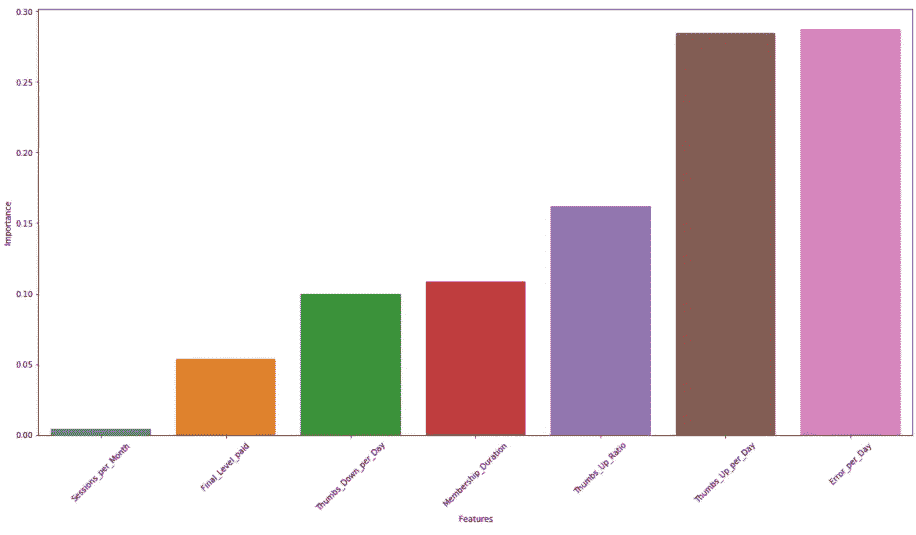

# 结论

## 关于项目

*   我们做了大量的探索性数据分析，发现实际上大多数分析并没有反映出搅动用户群和非搅动用户群之间的明显差异
*   通过适当的探索性分析，我们最终选择了一些看起来足够重要的特性来区分不愉快的用户和不愉快的用户。令人欣慰的是，这种方法很有效，但还不够好，可以进一步改进。
*   在机器处理的开始，我们首先进行初步测试以确定期望的正负标签比，以试图增强分类能力，因为如果我们不这样做，分类器可能不能正确地预测(或者甚至可能导致一类预测)
*   我们从三个候选者开始——逻辑回归、随机森林和梯度推进树。Logistic 回归的表现比另外两个略差。当使用平衡测试集进行测试时，我们可以获得接近 75%的准确率，f1 也接近 0.75。然而，在使用整个数据集进行测试后，性能下降了很多。
*   随机森林和梯度增强树的性能非常相似，但梯度增强树更有可能过拟合，而且更耗时。我们决定随机森林可能是这个项目中最终模型的更好选择。
*   似乎很难用这个小数据集来进一步改进模型，我们应该以后在真正解释一般用户行为的完整数据集上工作
*   从特征重要性分析，我们可以说，评级和错误是非常重要的服务提供商。对于服务提供商来说，确保他们服务稳定并让用户满意是至关重要的，因为他们愿意给出积极的评价而不是消极的评价。

## 改进

*   这个数据集只是只有 400 个用户数据的庞大数据集的一部分。数量不足以代表总体，很容易出现偏差。
*   过拟合问题非常严重，特别是对于梯度增强树，但是调整参数和减少特征量似乎没有帮助(只是降低了训练性能，而没有提高测试性能)。在我看来，当我们使用完整的数据集时，这个问题可以得到缓解。
*   这个数据集是不平衡的，负标签比正标签多得多，我们必须首先仔细处理数据集，否则它可能导致错误预测(都在一个类中)

这个项目的 Github Repo 可以在[这里](https://github.com/BurgerWu/Sparkify-Project)找到