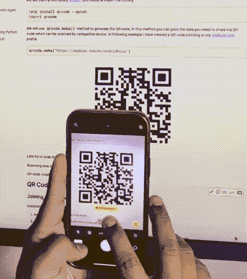
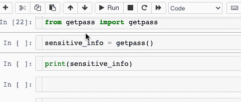
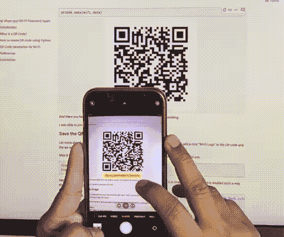
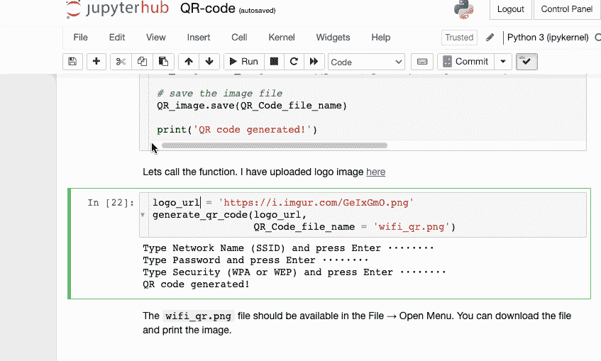

# 再也不要共享您的 Wi-Fi 密码

> 原文：<https://medium.com/codex/never-share-your-wi-fi-password-again-89c044e3a8e3?source=collection_archive---------4----------------------->

## 使用 Python 生成的二维码分享您的 Wi-Fi 详细信息的简单方法


*图片来源:*[](https://unsplash.com/photos/2HWkORIX3II/share)

# *介绍*

*这种情况在你身上发生过多少次了，当你的朋友上门询问 Wi-Fi 详情，而你不得不东奔西跑去找密码……让我来帮你简化这个过程。*

*在这篇文章中，我将向您展示如何使用 Python 将 Wi-Fi 的详细信息存储在二维码中，人们可以轻松地扫描二维码来获取详细信息。*

## *什么是二维码？*

*快速响应码是一种二维象形码，由于其快速可读性和相对较大的存储容量而被使用。该代码由白色背景上排列成正方形的黑色模块组成。编码的信息可以由任何种类的数据组成(例如，二进制、字母数字或符号)*

# *如何运行代码*

*您可以使用**“Google Colab”**或**“本地运行”**来执行代码*

*该代码可在 Github 上获得:[https://Github . com/vinodvidhole/wifi-QR-code/blob/main/wifi-QR-code . ipynb](https://github.com/vinodvidhole/wifi-qr-code/blob/main/wifi-qr-code.ipynb)*

## ***设置和工具***

***在 Colab 上运行**:您需要提供 Google 登录名才能在 Colab 上运行该笔记本。
**本地运行**:下载并安装 [Anaconda](https://www.anaconda.com/) 框架，我们将使用 Jupyter 笔记本来编写&执行代码。*

# *如何使用 Python 创建二维码*

*使用 Python 生成二维码相当简单，只需一行代码和二维码就可以了。*

*我们将使用 Python 库[二维码](https://pypi.org/project/qrcode/)，让我们安装&导入库。*

```
*!pip install qrcode --quiet
import qrcode*
```

*我们将使用`qrcode.make()`方法生成二维码。在这种方法中，您可以通过兼容设备可以扫描的二维码传递您需要共享的数据。在下面的例子中，我创建了一个指向我的 medium.com 个人资料的二维码。*

```
*qrcode.make('https://medium.com/@vinodvidhole')*
```

**

*我们试着扫描一下这个二维码，看看这个行不行。*

**

*扫描顺利完成，指向正确的 URL(https://medium . com/@ vinodvidhole)。*

*创建二维码就像走蛋糕，让我们继续下一步*

# *用于 Wi-Fi 的 QR 码生成*

## *加入 Wi-Fi 网络*

*一般来说，从最终用户的角度来看，连接任何 Wi-Fi 网络都需要两样东西*

1.  *当前连接的网络名称(SSID)。*
2.  *连接网络的密码。*

*用户可以选择可用的网络，然后手动输入密码来加入 Wi-Fi 网络。*

## *自动加入无线网络的二维码*

*我们需要在`qrcode.make`方法中以特定格式(如下所述)传递网络名称(SSID)、加密类型(WEP、WPA 或空白)和密码。移动设备用户可以快速扫描二维码并加入网络，而无需手动输入数据。*

```
*Common format: WIFI:S:<SSID>;T:<WEP|WPA|blank>;P:<PASSWORD>;H:<true|false|blank>;;
Sample: WIFI:S:MySSID;T:WPA;P:MyPassW0rd;;*
```

*让我们实现这一点。*

*首先，我们将按照上述要求的格式生成 Wi-Fi 详细信息。在 Python 中，有一种方法可以输入用户 id、密码等敏感信息。因此没有人会意外地在云中共享信息。*

*我将使用来自`getpass` Python 模块的`getpass()`*

```
*from getpass import getpasssensitive_info = getpass()········print(sensitive_info)test*
```

*请看下面这是如何工作的，我运行了代码`sensitive_info = getpass()`。然后系统提示我输入信息。出于演示的目的，我打印了我输入的值。*

**

*现在让我们输入网络名称(SSID)和密码信息*

```
*ssid =  getpass()········password = getpass()········security = 'WPA' # (one of WPA or WEP)*
```

*现在创建所需的 Wi-Fi 格式字符串*

```
*wifi_data = 'WIFI:S:{};T:{};P:{};;'.format(ssid, security, password)*
```

*现在可以生成如上图的二维码，通过`wifi_data`*

```
*qrcode.make(wifi_data)*
```

**

*好了，你的可扫描无线二维码已经准备好了。让我们检查它是否工作。*

**

*我可以使用二维码加入 Wi-Fi 网络！！！*

# *将二维码保存为图像*

*让我们继续前进，并尝试以每个人都可以使用的方式实现它。在这里，我试图在二维码中添加一个漂亮的“Wi-Fi 标志”，然后我们将二维码保存为图像文件。png)。*

*这个想法是，任何人都可以输入 Wi-Fi 细节，并生成一个图像文件，可以打印出来供实际使用。*

```
*from PIL import Image
from urllib.request import urlretrieve*
```

*在这里，我用一种稍微不同的方式创建了 QR 码，因为我们需要将它存储在一个图像中，还创建了一个功能，这样用户可以自定义 QR 码(如改变颜色，标志等。)*

```
*def generate_qr_code(logo_url, QR_Code_file_name = 'wifi_qr.png', QR_color = 'Black', QR_Back_color = 'white', pixels = 256):

    ssid =  getpass("Type Network Name (SSID) and press Enter ")
    password =  getpass("Type Password and press Enter ")
    security =  getpass("Type Security (WPA or WEP) and press Enter ")

    #generate wifi data string
    wifi_data = 'WIFI:S:{};T:{};P:{};;'.format(ssid, security, password)

    #download logo 
    urlretrieve(logo_url,'wifi_logo.png')
    wifi_logo = Image.open('wifi_logo.png')

    # taking base width
    basewidth = 100

    # adjust image size
    wpercent = (basewidth/float(wifi_logo.size[0]))
    hsize = int((float(wifi_logo.size[1])*float(wpercent)))
    wifi_logo = wifi_logo.resize((basewidth, hsize), Image.ANTIALIAS)
    #QRCode object 
    QR = qrcode.QRCode(version=1, #integer from 1 to 40 that controls the size of the QR Code (the smallest, version 1, is a 21x21 matrix)
                       error_correction=qrcode.constants.ERROR_CORRECT_H,
                       box_size=10
                      )

    # adding wifi data 
    QR.add_data(wifi_data)

    # generating QR code
    QR.make(fit=True)

    # adding color to QR code
    QR_image = QR.make_image(
        fill_color=QR_color,
        back_color=QR_Back_color
    ).convert('RGBA')

    # set size 
    pos = ((QR_image.size[0] - wifi_logo.size[0]) // 2,
        (QR_image.size[1] - wifi_logo.size[1]) // 2)

    QR_image.paste(wifi_logo, pos)

    QR_image = QR_image.resize((pixels, pixels), Image.NEAREST) 

    # save the image file 
    QR_image.save(QR_Code_file_name)

    print('QR code generated!')*
```

*让我们调用函数。我已经上传了标志图片[在这里](https://i.imgur.com/GeIxGmO.png)*

```
*logo_url = 'https://i.imgur.com/GeIxGmO.png'
generate_qr_code(logo_url, 
                 QR_Code_file_name = 'wifi_qr.png')Type Network Name (SSID) and press Enter ········
Type Password and press Enter ········
Type Security (WPA or WEP) and press Enter ········
QR code generated!*
```

*在文件→打开菜单中应该可以找到`wifi_qr.png`文件。您可以下载文件并打印图像。*

**

*本教程到此结束。*

# *参考*

*一些有用链接的参考。*

*   *[https://github.com/vinodvidhole/wifi-qr-code](https://github.com/vinodvidhole/wifi-qr-code)*
*   *[https://pypi.org/project/qrcode/](https://pypi.org/project/qrcode/)*
*   *[https://en . Wikipedia . org/wiki/QR _ code # Joining _ a _ Wi % E2 % 80% 91Fi _ network](https://en.wikipedia.org/wiki/QR_code#Joining_a_Wi%E2%80%91Fi_network)*

# *结论*

*所以下次有人询问 Wi-Fi 详情时，只要给他们看二维码就行了！！！二维码的可用性是无限的。你可以用这种方法分享联系方式、简历链接、网站链接等。希望你可以用这篇文章构建伟大的项目。*

*如果您有任何问题或反馈，请随时发表评论或通过 LinkedIn 联系我。感谢您的阅读，下次再见…编码快乐！！*