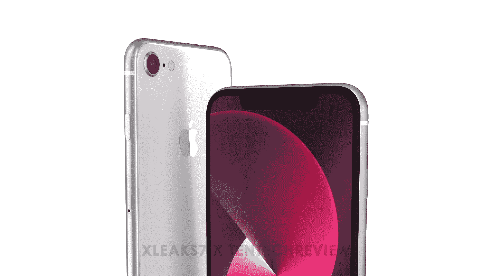
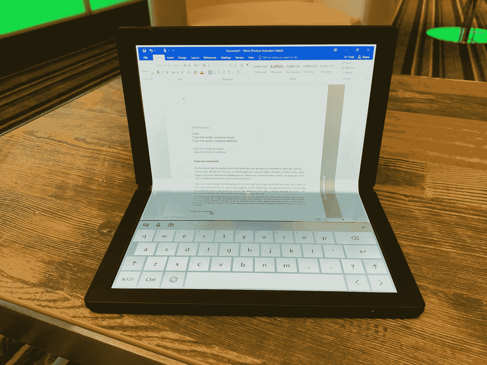
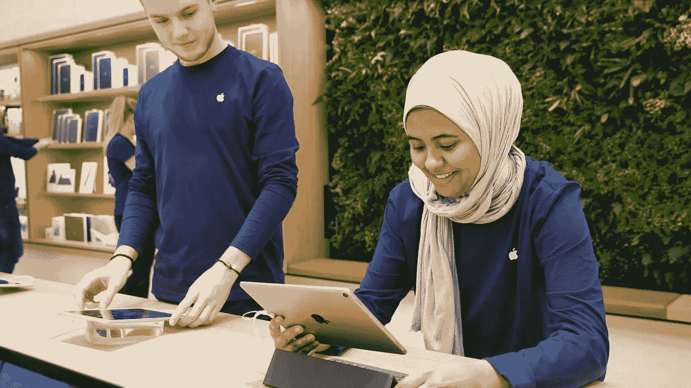
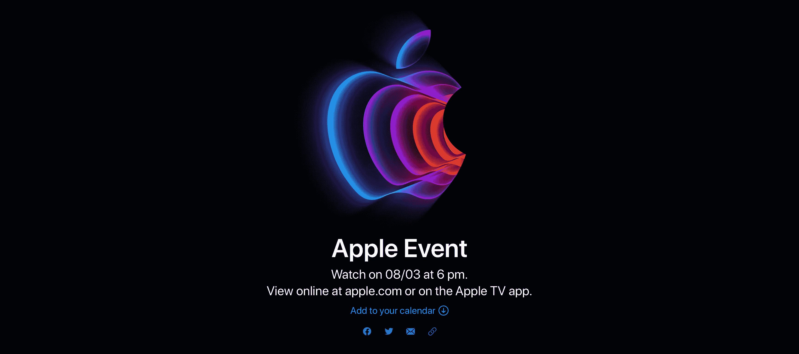
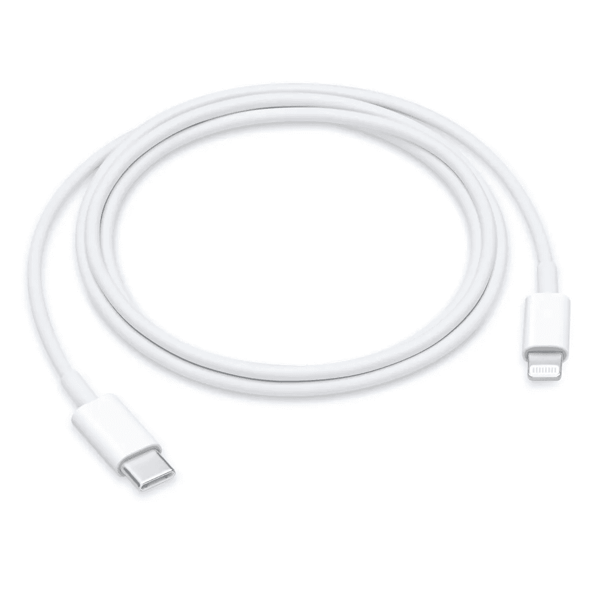
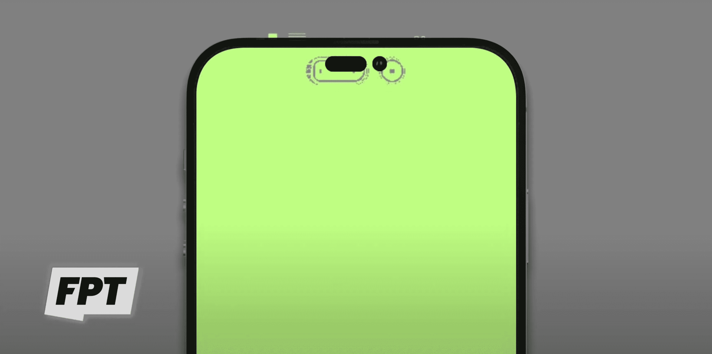
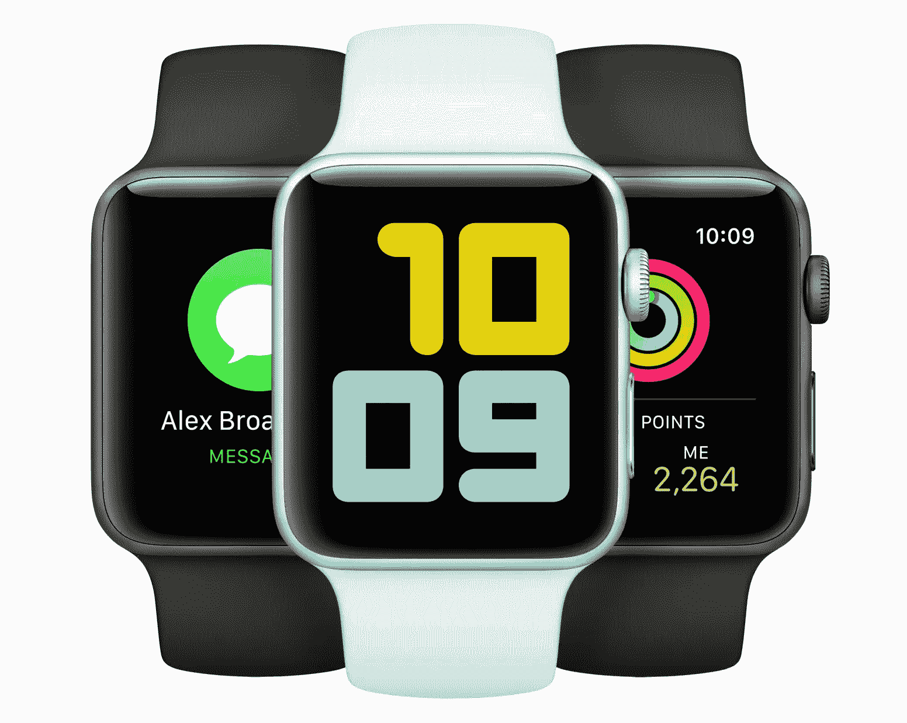
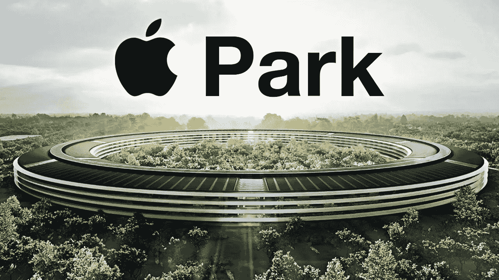

# 我永远不会折叠，事件和教训回来了

> 原文：<https://medium.com/codex/never-will-ifold-the-event-lessons-are-back-69555dae31ce?source=collection_archive---------6----------------------->

## 苹果观点——我对本周的看法

## 2022 年 2 月 28 日至 3 月 4 日

## 平价手机

A pple 是华丽产品的优质、高端供应商，对吗？但随着 5G SE iPhone 将在 Peek Performance 活动上发布的传言不断，苹果可能已经看到了市场的缺口，这也是他们可以填补的缺口。史蒂夫·乔布斯向苹果灌输了“T2”的精神，“不要运送垃圾”，多年来他们一直坚定地坚持这一使命。由于这款手机将基于现有 iPhone 的底盘，他们所有的研发成本，在这一点上，已经收回。**马克·古尔曼**在他的《时事通讯的力量》中建议，苹果可以积极一点，把它们卖到 199 美元。沿着这条路走下去，他们可以在南非&亚洲等国家的一些安卓市场有所斩获。显然，在赢得更多用户的过程中，它也将开始把他们与传说中的苹果生态系统联系起来。作为销售更便宜的 SE 手机的回报，他们可以从 App Store 获得销售，也可能从 AirPods 和苹果手表获得销售。 ***这完全有道理。看看苹果公司穿西装的人是怎么想的会很有趣。***

 [## 苹果和谷歌——最好的伙伴？

### 他们是两个最大的科技巨头，但奇怪的是，也是好朋友

medium.com](/codex/apple-google-best-buddies-97e8d35a7983) 

## 折叠我！

C 乌佩蒂诺就是不喜欢折叠的东西。我们已经到了 2022 年，但还没有任何可折叠的东西在他们的范围之内——到目前为止！折叠式 iPhone 再次被搁置，但上周，完全可靠的屏幕分析师罗斯·杨(Ross Young)发布了谣言。该公司似乎一直在开发一款可折叠的 20 英寸显示器，看起来像是 iPad 和 MacBook 的混合体。虽然发布时间定在 2026 年，正如我在最新的**减十六**播客中提到的那样([https://podcast . apple . com/us/podcast/the-Minus-sixth-podcast/id 1608899642](https://podcasts.apple.com/us/podcast/the-minus-sixteen-podcast/id1608899642))，但我就是看不到。在 iPad 屏幕上打字一直很笨重，他们从来没有想要过任何一款触摸屏 MacBook。我的看法是，苹果只是在展示他们的能力，但并不打算让它成为现实。

## 今晚教我

美国城市的 n-store 课程又要开始了，这些城市没有地方规定在公共场所戴口罩。商店里仍将为希望使用口罩的人提供口罩。不过，所有苹果员工*都将*穿着它们。苹果公司希望在本月晚些时候复课，以配合他们在现已确认的 Peek Performance 特别活动上发布的任何产品。 ***让我很高兴知道这些都回来了。我的 Mac Odyssey 就是从店内课程开始的！***

 [## 快到时间了

### 离苹果今年的第一次活动已经不远了…让我们看看我们可能会得到什么

medium.com](/codex/its-nearly-tim-time-3818a49056ee) 

## 事件在这里

苹果公司最终宣布，这个特别的活动真的会像传言的那样在下周的 3 月 8 日举行。Peek 表演将于太平洋标准时间上午 10 点(英国格林尼治标准时间下午 6 点)开始。邀请函上显示的是最初的六种颜色的苹果标志的 3D 变体。logo 又是一个 AR 动画。若要查看，请在 iPhone 上打开邀请并轻按徽标。尽管该公司一如既往地对活动中实际推出的内容守口如瓶，但邀请艺术和标语将推动人们猜测我们可以期待什么。苹果开始使用标签*# apple event*——所以从现在到事件发生之前，在你发布的任何推文中使用这个官方标签。活动结束后，我肯定会写博客，甚至可能会在 YouTube 上发布一段视频。最好订阅吧，嗯！

## Twitter 在做什么？

关于推特的话题…在他们的 Spaces 音频平台取得惊人的成功后，Twitter 似乎热衷于推出他们的播客平台。简·满春·王报道说，推特应用中已经隐藏了一个“播客”标签。标签目前透露的细节不多，但暗示 Twitter 肯定在考虑他们的播客地位。T21:播客平台越多越好，我相信 Twitter 会做得很好。

 [## 这是一个敏感的话题

### 去年，MacBooks 告别了 Touch Bar。你怀念吗？

medium.com](/codex/its-a-touchy-subject-3d0e920971c2) 

## 战友

本周，苹果公司公开宣布断绝与俄罗斯的一切联系，从而进入了政治舞台。在一份声明中，苹果宣布他们已经“暂停在俄罗斯的所有产品销售”。不仅如此，他们还将 RT News & Sputnik 从俄罗斯外的 App Store *下架。 ***这证明了有时候并不全是美元的问题。****

## 测试时间到了

pple WatchOS 8.5 现在发布了测试版，至少对所有开发者是这样。这个版本是在前一个测试版一周之后和该公司向所有用户提供 watchOS 8.4.2 几周后发布的。据我所知，唯一增加的是对新表情符号的支持，比如心手&咬嘴唇。 ***众人皆知，一个相当蹩脚的更新。***

## 它像一道闪电击中了我

你能相信吗？苹果公司向我们推出 lightning 线缆已经有十年了。现在处于半退休状态的菲尔·席勒是当时负责向我们出售这种电缆的人。它被称为*“未来十年的现代连接器”*。老实说，那从没发生过，不是吗？事实上，我们所有人都普遍希望这个该死的东西消失。它已经不受欢迎了。它于 2012 年在 iPhone 5 上推出，此后出现在每一款 iPhone 上。当时，它与我们已经习以为常的无处不在的 30 针连接器大相径庭。然而，现在，苹果的所有其他产品(除了 AirPods Max)，事实上，整个科技都已经转向 USB-C。我想知道，我们还需要多久才能拥有一部完全无端口的 iPhone？我敢肯定，我们永远不会在 iPhone 上看到 USB-C 连接器。

## 递给我热狗

苹果公司似乎是 NFL 周日门票 20 亿美元交易的领跑者。苹果公司&美国国家橄榄球联盟正在讨论周日门票游戏的流媒体。除了苹果，亚马逊&迪士尼也有兴趣达成交易。NFL 周日门票，对于那些不熟悉的人来说，是一个每周播放 NFL 常规赛的场外体育套餐。该套餐目前由 DirecTV 销售，每季套餐从 290 美元到 400 美元不等。苹果公司目前显然对体育直播市场虎视眈眈，因为据说他们已经就播放美国职业棒球大联盟的比赛进行了严肃的讨论。苹果在 Apple TV+上增加直播电视服务的计划尚不清楚。NFL 周日门票不太可能包含在每月 5 美元的 Apple TV+等级中。它很可能是一个价格较高的可选附件。苹果不会支付 20 亿美元购买 NFL 周日球票，现在就把它送人，是吧！苹果电视上的体育直播似乎不可避免，你同意吗？

## 它很大，很大胆，就在这里

如果来自*乔恩·普罗瑟*的示意图是可信的，那么看起来定于今年秋天发布的 iPhone 14 系列的缺口只是变得更糟了。第一张照片出现在韩国博客网站微博上。这些发现似乎得到了证实，表明它不仅是两部分的“孔&冲头”设计，而且还很大。非常大！然而，Ross Young 不同意，他说它将会比最初想象的*更小*并且位于中心，不像最近的示意图。我认为，整个缺口的事情被夸大了，对吗？难道只有我对此漠不关心吗？

## 更多便宜货

找便宜的 Apple Watch？那现在就去亚马逊看看吧。若要购物，请访问 Apple Watch 的*类别*页面，并寻找符合条件的型号的*奖金节省*消息。首选包括多种颜色的标准 41 毫米 GPS Apple Watch Series 7。Apple Watch Series 7 系列的 GPS 和 GPS +蜂窝模型目前都在亚马逊销售。 ***赶紧行动吧！在美国和某些其他国家也有售。***

## 任何人筹码

全球对芯片的需求仍处于关键阶段。许多世界领先的芯片供应商已经加快了他们的扩张项目。今年 4 月，TSMC 将在日本的一个新址开工建设。供应商正在努力获得足够的 28 纳米产能来完成他们已经拥有的订单。 ***典型，就在我们以为情况好转的时候！***

## 假期结束了

谷歌本周告诉员工，随着湾区新冠肺炎病例的减少，他们将不得不在 4 月 4 日回到自己的办公桌前。谷歌园区位于圣克拉拉县，苹果也在那里。现在很有可能苹果会效仿。

## 在你走之前

## 你订阅媒体了吗？

我只是高端博客网站 Medium 的众多作者之一。这是如此好的价值，你可以在这里加入 https://medium.com/membership

[**加入我的幕后邮件列表**](https://www.talkingtechandaudio.com)

**原载于 2022 年 3 月 4 日 https://www.talkingtechandaudio.com/blog******。****

*****在这里看我的最新视频***【https://youtu.be/ryUDI7m2QT4 **