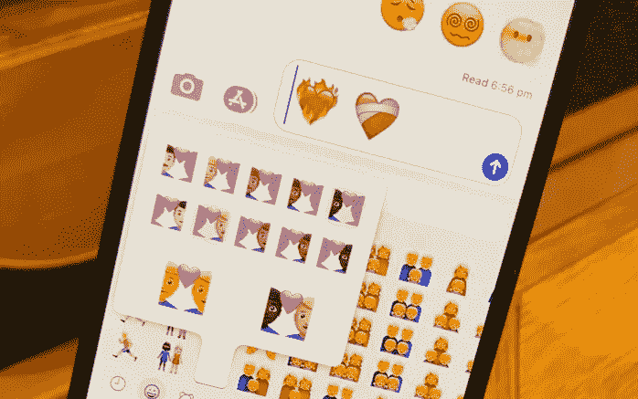

# iOS 14.5 将推出新的表情符号

> 原文：<https://medium.com/codex/new-emojis-are-coming-in-ios-14-5-7fde7b661496?source=collection_archive---------5----------------------->

## [法典](http://medium.com/codex)

## 更新可能会在下个月推出。

苹果上一次发布 iOS 14.4 是在 1 月底，但 iOS 14.5 很快就要发布了。该更新可能会在 2021 年 2 月底/3 月初发布到兼容设备上。

iOS 14.4 带来了一些很酷的新功能，比如 iPhone 摄像头可以识别更小的二维码…