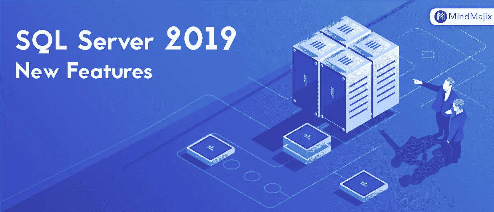
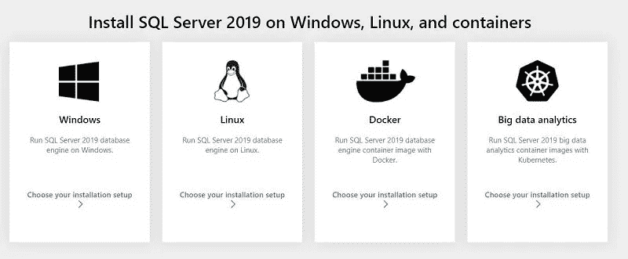
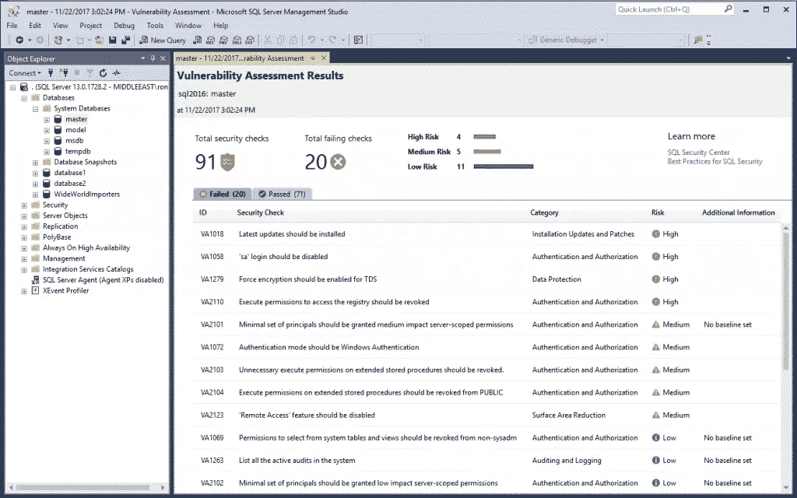
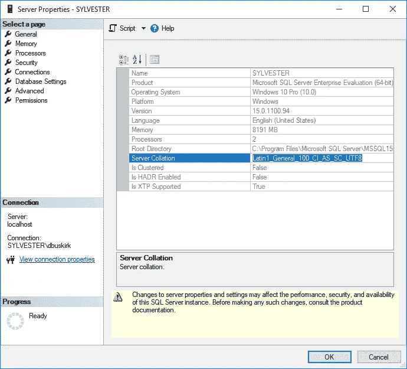

# MS SQL Server 2019 中的新功能

> 原文：<https://medium.com/codex/new-features-in-ms-sql-server-2019-3145681f4a63?source=collection_archive---------5----------------------->

## [法典](http://medium.com/codex)

SQL Server 2019 的新功能

在本文中，我们将介绍 SQL Server 2019 中的所有新功能。

SQL 2017 的上一版本支持 Linux (Redhat、Ubuntu、Linux Server)和 Docker engine，这是 SQL 团队迈出的一大步。

# SQL Server 2019

我们可以选择所需的操作系统版本来安装 SQL Server 2019，现在我们也可以使用 Kubernetes 映像在 Windows、Linux、Docker 和大数据分析容器上进行构建。

此版本的 SQL Server 主要是为了关注可扩展性、智能、性能、安全性而开发的，关键点是分布式文件系统(如 Hadoop、Apache spark)之间的数据交换，以及与大数据的连接。

# 错误消息

SQL 2019 引入了“VERBOSE_TRUNCATION_WARNINGS”属性，可以设置为 ON 和 OFF

如果我们为任何数据截断错误将它设置为 ON，消息将被覆盖，新的高级消息带有错误代码(2628)。下面是留言，

1.  字符串或二进制数据将在表“表名”列“列名”中被截断。
2.  截断的值:“值”。

这里将得到详细的错误消息，包括表名、列名和截断值

我们将属性标志设置为 OFF

常规错误消息:

*'字符串或二进制数据会被截断。*

# 脆弱性评估

我们可以使用此评估来跟踪 SQL Server 实例和 Azure SQL 数据库实例是否符合公认的安全最佳实践，并且我们还可以使用此工具共享的报告来实现。这提供了易于实现的安全合规性，如 GDPR。

# UTF-8 支持

它支持 UTF-8 字符编码。我们现在可以创建一个 char 或 varchar 列来存储 UTF-8 数据。这个特性提高了数据兼容性和性能。

假设我有一个排序规则为 LATIN1_GENERAL_100_CI_AS_SC 的表。这里的 AS 表示区分重音的数据可以存储在这个表中，上面的可以改为 LATIN1 _ GENERAL _ 100 _ CI _ AS _ SC _ UTF8

# SQL 图形中的增强

它提供了增强功能，包括对 T-SQL 合并和边缘约束的匹配支持。我们现在可以限制给定边类型可以连接的节点类型。这有助于用户对边缘表实施限制。它还维护图形数据库中的数据完整性。它还支持在单个语句中指定图关系的匹配谓词，而不是单独的 DML(数据操作语言)语句。这使得查询图形数据库变得容易。

# 联机索引创建操作

SQL Server 2019 允许用户在数据库或基础表忙于操作时创建、重建、更改或删除聚集索引，这意味着一个用户可以重建索引，同时另一个用户可以在同一数据库或数据库表上启动更新的查询。在 SQL Server 的早期版本中，我们需要在脱机模式下重建索引，此外，这将阻塞整个表，

句法

# 支持的功能

SQL 2019 将其同时复制副本的最大数量扩展到 5 个，在 SQL -2017 的早期版本中是 3 个，因此它也包含主复制副本和辅助复制副本。

无论连接字符串是什么，客户端应用程序都可以连接到主副本。

SQL Server 配置管理器中的证书管理功能:

在 SQL Server 2019 中，证书管理集成到了 SQL Server 配置管理器中。我们可以查看和验证 SQL Server 实例中使用的证书。我们可以查看和验证安装在 SQL Server 实例中的证书。这还提供了有关认证到期日期的详细信息。此功能有助于以更好的方式管理证书。我们还可以从主复制副本开始为 AG 实例部署证书。

# 大数据集群

*   数据虚拟化—组合来自多个来源的数据，无需移动数据。它提高了处理数据的安全性和性能。
*   托管 SQL Server、Spark 和数据湖—在数据湖中存储大量数据，并使用 SQL 或 Spark 轻松访问这些数据。使用管理服务、管理门户和集成安全性可以非常轻松地进行管理。
*   完整的人工智能平台—轻松提供集成数据并准备解决方案。该解决方案可以在一个系统中操作所有模型。

# 数据分类

这也是 SQL 2019 的一个很好的功能，其中我们可以根据业务部门或主题对数据进行分类，如医疗数据、健康数据、财务数据等。这将为根据不同的数据集应用不同的安全标准带来方便。简而言之，如果我们分别对数据进行识别和分类，那么就很容易根据数据的性质应用不同的安全策略。

希望这篇文章对你有所帮助，请为它鼓掌

…继续学习！！！！