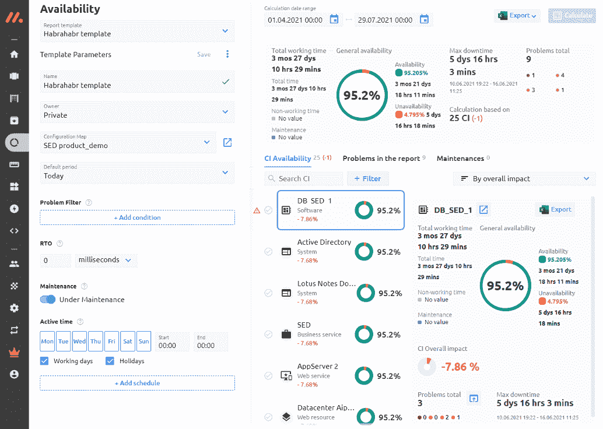

# 混合监控 AIOps 系统 Monq 的新特点

> 原文：<https://medium.com/codex/new-features-of-the-hybrid-monitoring-aiops-system-monq-e61b4a0edd39?source=collection_archive---------20----------------------->

## Monq 对其功能进行了重大更新，出现了一个免费版本，并且更新了许可政策。如果您公司中的监控系统开始失控，并且它们的数量超出了地平线，我们建议您看看 Monq 来控制监控。

在之前的一篇文章中，我已经写过 Monq 的混合监控系统。从那时起，差不多两年过去了。在此期间，Monq 对其功能进行了重大更新，出现了一个免费版本，并且更新了许可政策。如果您公司中的监控系统开始失控，并且它们的数量超出了地平线，我们建议您看看 Monq 来控制监控。欢迎来到播客。

## *许可变得更加灵活*

我将以好消息开始这篇评论——该解决方案的免费版本的出现。在新版本的许可政策中，以前单一的 Monq 被分成三个子产品，每个产品都有单独的许可证:

*   收集器—收集和分析日志，
*   AIOps —混合监控和事件管理，
*   test forge——信息系统和服务的功能测试。

Monq Collector 可以从供应商的网站上[免费下载](https://monqlab.com/monqcollector)。在本文的后面，您将了解如何使用它。AIOps 和 TestForge 在产品的扩展版本中提供，并分别根据配置单元的数量和每天运行测试脚本的数量进行许可。

## *简化安装*

自 2019 年发表上一篇文章以来，Monq 部署过程经历了许多变化。首先，部署的解决方案的架构现在不是由四台服务器组成，而是由一台服务器组成。其次，现在管理员不需要手动准备基础设施、安装 Kubernetes、运行行动手册等等。从现在开始，该产品将以虚拟机映像的形式交付，可以简单地导入到虚拟化环境中，连接到控制台并分配网络设置，以提供名称解析和互联网访问。所有其他操作都在图形界面中执行。

在虚拟机上设置 IP 地址后，转到 RUNDECK web 界面。

在[这段视频](https://youtu.be/ldtUOw_vQ6Y)中，详细展示了安装过程。管理员可以使用三种场景:

*   基础设施安装—这是第一步，脚本将安装所有必要的基础设施服务。
*   monq install —脚本在基础架构准备就绪后运行。因此，脚本将安装系统的所有微服务。
*   monq erase--脚本是可选运行的，当您需要删除应用软件时，在非标准情况下需要它。

安装的最后一点是发布登录和密码以进入平台。

*操作变得更加容易，新的可能性出现了*

更新的界面

像以前一样，登录到系统后，需要配置“工作组”和“用户”部分。您还需要配置邮件插件:指定邮件服务器、用户名和密码。如果没有此设置，新创建的用户将不会收到他们生成的密码。

工作组和用户的旧图形界面也发生了变化:UI 发生了变化，现在它基于 Angular。一些屏幕仍然在同一战线(VueJS)，但正如供应商所说，它们很快也会成为过去。

出于演示的目的，我在 monq 空间中创建了一个名为“habrahabr”的工作组和一个名为“Habr”的用户，以便进一步工作。

在工作组中，不仅有界面上的变化，还有功能上的变化。让我们试着弄清楚供应商增加了什么新特性。

管理面板中增加了管理工作组策略的部分。通常，这些策略对于用户空间是全局的，并为普通用户定义工作组管理功能。虽然管理员仍然可以访问任何更改，但对于普通用户来说，创建或删除组的能力由策略决定。

平台用户现在可以同时在同一个组中拥有几个不同的角色。它可以更灵活地配置用户对系统各种对象和功能的访问权限。

取代“公共组”类型，引入了以下类型的工作组隐私:

*   开放—对所有用户可见，用户可以自己加入组；
*   已关闭—对所有用户可见，用户不能自行加入组；
*   私有—组仅对这些组的成员可见。

由用户资料和平台用户管理页面组成的用户部分也被转移到 Angular，在保留所有先前功能的同时，也有一些改进。现已推出的新功能:

*   用户的批量添加；
*   创建时将用户添加到工作组；
*   通过电子邮件通知用户关于注册、封锁、解除封锁；
*   查看用户订阅的通知；
*   从用户页面管理工作组和角色。

该界面现在有两种语言版本:俄语和英语。

## 更新的资源服务模型(RSM)

RSM 配置被从头开始重新设计。但是，所有功能都已保存。

以下图片是新 RSM 面板界面的部分截图。

用于创建配置项目(CI)的面板，您可以在其中一次添加多个项目:

创建影响和依赖链接，以及删除和查看配置项上的基本数据都是从弹出菜单中执行的:

为了将触发器绑定到特定配置项，您需要打开具有相关触发器的面板，并选择必要的触发器:

新的小组提供了研究 CI 参数(如健康)的机会。该参数是一个复合参数，首先，它用于直观评估 RSM 的状态。用户可以根据负面影响系数的值，清楚地看到哪个配置项对有问题的配置项的运行状况有最严重的影响。以下是 CI 健康面板的一个示例:

## 集成设置的更新

在 monq 的第六个版本中，我在这里展示了其概述，对与外部系统集成的模块进行了重大修改。从撰写第一篇文章开始，集成模块的界面也像许多其他屏幕一样，转向了 Angular。

“集成类型”被转换为“配置模板”，集成本身被重新定义为数据流。

以下用于数据流配置的系统模板可从包装盒中获得:Zabbix、Scom、Prometheus、Ntopng、Nagios。

通过“AnyStream”配置模板可以实现与其他监控和日志记录系统的集成。从 6.0 版开始，您可以编写自己的处理程序，将原始流解析为 JSON，并用定制的标签丰富结果事件。

下面的屏幕截图显示了 Prometheus 传入事件的解析器，它转换日期格式:

## **用于分析日志的免费版本现已推出**

日志屏幕是分析日志的免费版本的主要工具。这个模块大约在一年前出现。在同一个版本中，用户可以使用插件子系统。插件允许你从各种来源收集数据。

初级事件屏幕的主要目标是为用户提供一个工具，用于可视化和集中搜索、分析和处理存储在 ClickHouse 数据库中的日志。

让我们试着弄清楚如何使用这个工具。

在屏幕的顶部有一个搜索栏，其中使用了本机 MQL 语法，从表面上看有点类似于 Lucene。

除了搜索查询之外，还有一个分析工具可以帮助确定任何字段的唯一值的数量以及它们在其余值中各自的百分比。主要事件中的所有值都是活动元素，您可以立即对其配置过滤。

**监控和警报设置中的新选项**

在 Monq 的最新版本中，可以创建自己的警报插件。插件子系统允许空间管理员创建并添加他们自己的通知插件到 Monq 系统。

让我们回想一下，Monq 有能力使用高级逻辑创建升级链。

## **实施可用性 SLA 报告**

可用性报告已经取代了 SLA 报告。这是一个全新的计算信息系统可用性的工具。

“可用性”部分允许您:

1.使用以下可用性信息:

*   配置项及其对信息系统可用性的影响，
*   由选定数量的配置项组成的信息系统，
*   复杂的 ISs，由许多子系统组成，能够确定每个子系统的影响值。

2.配置用于生成可用性报告的参数，并将它们保存为模板。新报告的模板接受了更广泛的设置:

*   使用 PCM 映射作为过滤器—要生成报告，不需要创建和更新 ke 列表，选择一个已经保存的 PCM 映射就足够了。
*   更多功能的警报过滤器。
*   恢复时间目标(RTO)指示器是配置项处于问题状态的最长时间。此参数允许您在计算中不考虑配置项的不稳定状态。
*   服务时间(工作时间)—不要与 CI 的服务模式混淆，它允许在计算中以适当的方式考虑非工作时间。

3.管理模板和多模板(复杂信息系统的报告模板):

*   创建个人和组模板，
*   编辑模板参数，
*   删除模板。

4.快速配置参数并使用它们生成报告，而无需保存模板。

有关可用性计算方法的更多详细信息，请参见 Habr 的本文中的[。](https://dev.to/nikolaygan/availability-of-it-services-and-how-to-calculate-sla-2ain)

## **更新了功能测试模块(Monq TestForge)**

文章的标题是关于 AIOps 的，但是我还想对复杂业务监控的另一个重要工具做一个简单的概述。

Monq TestForge 产品在单独的许可下提供，它的功能允许您放弃强制使用外部系统来配置和运行测试。它还使得从一个公共界面管理项目成为可能。

有两种类型的功能测试项目:托管的和独立的。独立项目从它们被启动的环境中被管理，而被管理的项目由 TestForge 直接管理。

项目屏幕分为几个视图:

项目管理小组。它用不同的标签和一个非常漂亮的界面列出了系统中所有可用的项目。

提供配置模板是为了方便快速创建和配置新的托管项目。模板包含一组项目环境变量和作业代码。您可以基于现有项目创建新模板。

运行测试的时间表管理看起来非常好。调度器基于以下因素开始执行任务代码:

*   总的时间表和前一次任务执行的结果，
*   用户操作:立即执行或在特定时间执行。

构建历史。对于托管项目，可以使用附加功能手动启动构建:

*   启动变量的设置；
*   查看测试执行日志；
*   实时查看测试执行的广播。

**代理和代理的协调人在 Monq** 中介绍

2021 年，该系统通过代理扩大了其存在。代理安装在运行 Linux 或 Windows 的系统上，可以:

*   获取有关系统的信息，并将其传输到数据流；
*   结束日志文件并将原始数据发送到数据流；
*   给日志文件加尾，解析后发送 JSON 给数据流；
*   运行 TestForge 脚本，并将执行结果发送给 TestForge 预处理器；
*   从 PostgreSQL 获取数据，而不永久建立连接，并将其发送到数据流；
*   将来自代理(RabbitMQ、Kafka)的消息转发到数据流；
*   连接到 Zabbix 数据库并检查触发器的变化。

在平台端，代理的工作由代理协调员管理和监控。代理处理来自协调器的一组任务，并生成输出和执行日志。

Monq 中有两种类型的代理:

*   静态—由系统监控的代理，
*   动态—状态不受系统监控的代理。

代理协调员负责识别系统中的代理，并配置对从代理接收的信息的访问。

通过管理协调员，您可以:

*   创建或删除协调员，
*   停止或启动协调器，
*   配置协调员的访问权限，
*   为连接代理重新颁发令牌，
*   添加或删除代理的标签，
*   配置协调器参数。

连接的代理列表显示以下信息:

*   代理类型(静态或动态)，
*   代理名称，
*   代理状态，
*   标签，
*   已安装代理的版本，
*   代理的任务执行日志，
*   上次处理作业的日期和时间，
*   代理的技术数据。

## **结论**

在本文中，我们讨论了 Monq 混合监控 AIOps 系统的新的和更新的特性。该产品正在不断开发中，在不久的将来，我们将获得许多新的改进。你可以在[供应商的网站](https://monqlab.com/)上跟踪更新，也可以订阅一个特殊的[电报频道](https://t.me/monq_dev)。

应该注意的是，Monq 并不局限于与 Zabbix、SCOM 女士、普罗米修斯、Ntopng 和 Nagios 的集成。如果有必要，可以开发自己的集成模块，并从其他地方获取数据或事件。